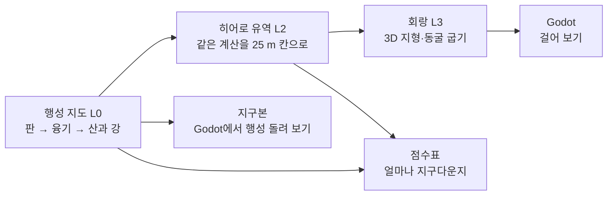

# B-PCG

B-PCG is a procedural generator for an Earth-sized planet, written in C# (.NET 10). It solves plate-driven uplift, rainfall and river incision as a steady state on a cube-sphere. It then derives the subsurface (strata, groundwater, caves) from the same rock and water. One river basin is baked into a walkable 3D corridor for Godot 4.7.2 .NET, which can also generate planets itself. The same metrics are run on real Earth data (ETOPO, RiverATLAS, OCTOPUS) to score how Earth-like the result is. This is a capstone project at Chung-Ang University (Fall 2026). Documentation is in Korean.

> 게임 속 지형은 보통 무작위 물결(노이즈)을 겹쳐 만듭니다. 보기에는 그럴듯하지만, 강이 바다까지 이어지지 않고 절벽이 왜 거기 있는지 설명할 수 없습니다. B-PCG는 지구 크기의 행성을 원인부터 만듭니다. 판이 땅을 밀어 올리고, 비가 강이 되어 산을 깎고, 그 산을 이룬 암석과 물이 그대로 땅속의 지층·지하수·동굴이 됩니다. 같은 잣대를 진짜 지구 자료에도 대어, 만든 행성이 얼마나 지구다운지 점수를 매깁니다.

처음 합류했다면 이 파일 → [용어집](docs/glossary.md) → [한 장 요약](docs/brief.md) 순서로 읽습니다.

---

## 직접 돌려 보기

### 1. 설치

맥·리눅스:

```bash
./scripts/setup.sh
```

윈도우(PowerShell):

```powershell
powershell -ExecutionPolicy Bypass -File scripts\setup.ps1
```

스크립트가 하는 일은 세 가지입니다.

- 파이썬 도구 uv, 파이썬 3.13, 패키지를 설치합니다. 파이썬은 스튜디오, 시험, 분석에 씁니다.
- **.NET 10 SDK** 가 있는지 확인합니다. 생성기와 엔진이 C#이라 꼭 있어야 합니다. 스크립트는 설치하지 않고, 없으면 설치 명령을 알려 줍니다(맥 `brew install --cask dotnet-sdk`, 윈도우 `winget install --id Microsoft.DotNet.SDK.10 -e`).
- 끝나면 환경을 점검합니다(2단계와 같음).

필요할 때만 붙이는 옵션입니다(윈도우는 `-Godot` 처럼 씁니다).

| 옵션 | 하는 일 |
|---|---|
| `--godot` | Godot 4.7.2 .NET 판을 `.tools/godot-net/`에 받습니다. 엔진을 맡은 사람은 필수입니다 |
| `--data` | 진짜 지구 자료(파일럿 자료) 약 4.5 GB를 받습니다. 학습·비교를 맡은 사람만 필요합니다 |
| `--analysis` / `--gpl` / `--notebook` | 분석용 도구를 더합니다 |
| `--check` | 설치하지 않고 점검만 합니다 |

### 2. 환경 점검

```bash
uv run python tools/doctor.py
```

- 맞게 깔렸으면: 마지막 줄이 `필수 실패 0개, 주의 N개` 입니다.
- `[주의] Godot .NET … 없음` 은 엔진을 맡지 않았다면 그대로 두어도 됩니다.
- 걸리는 시간: 약 10초.

### 3. 작은 행성 하나 만들기

```bash
uv run bpcg all --profile tiny
```

시험용으로 아주 작게 줄인 행성(tiny 프로필)을 처음부터 끝까지 만듭니다. 순서는 행성 → 강 유역 하나 → 걸어 다닐 띠 → 지구본입니다.

- 맞게 돌았으면: 마지막 줄이 `[전체] 끝: 2.4 s → …/out/earth` 처럼 나옵니다. `out/earth/` 아래에 `planet`, `hero`, `corridor`, `globe` 폴더가 생깁니다.
- 걸리는 시간: 약 6초(맥북 에어 M3). 처음에는 C# 빌드가 먼저 돌아 더 걸립니다.
- 노트북 기본 크기(laptop 프로필)는 약 2분이고 메모리를 7 GB 넘게 씁니다.

### 4. 결과 보기

```bash
uv run bpcg studio
```

- 브라우저에 스튜디오가 열립니다(http://127.0.0.1:8765). 왼쪽에서 매개변수를 바꿔 행성을 다시 만들고, 오른쪽에서 지도를 봅니다.
- 쓰는 법은 [docs/studio.md](docs/studio.md)에 있습니다.

### 5. 자주 쓰는 명령

```bash
uv run bpcg compare run           # 기존 지형 생성 방법과 같은 시드로 비교 (docs/compare.md)
dotnet build Bpcg.slnx            # C# 빌드 (생성기, 명령줄, 엔진, 시험)
dotnet test --solution Bpcg.slnx  # C# 시험 (Python 판과 비트까지 같은지 등)
uv run pytest -m "not slow"       # 파이썬 시험 (C# 결과 파일, 스튜디오)
uv run ruff format . && uv run ruff check .
.tools/godot-net/Godot_mono.app/Contents/MacOS/Godot --path engine -e   # 엔진 편집기 (맥)
```

---

## 무엇을 만드나

같은 땅을 세 가지 배율로 만듭니다. 앞 배율의 결과가 다음 배율의 출발점입니다.

| 배율 | 이름 | 크기 | 하는 일 |
|---|---|---|---|
| 거시 | 행성 지도 (L0) | 지구 전체, 칸 한 변 약 19.5 km(서울 남북 길이의 3분의 2), 칸 157만 개 | 판·지각·융기·기후를 정하고 큰 강과 산맥을 풉니다 |
| 중간 | 히어로 유역 (L2) | 강 유역 하나, 한 변 32 km(서울만 한 네모), 칸 25 m | 같은 계산을 촘촘한 칸으로 다시 풀어 골짜기, 지층, 지하수, 동굴 높이를 정합니다 |
| 미시 | 회랑 (L3) | 유역 안의 6 km × 1 km 띠(여의도의 약 2배), 2 m 간격 | 걸어 다닐 수 있는 3D 지형과 땅속을 Godot 파일로 굽습니다 |



말이 낯설면 [용어집](docs/glossary.md)을 봅니다. 계산의 자세한 순서와 공식은 [docs/pipeline.md](docs/pipeline.md)에 있습니다.

---

## 지원 환경

| 운영체제 | 지원 | 비고 |
|---|---|---|
| macOS 15 이상, Apple Silicon | 됨 | 개발 맥에서 시험함 |
| Windows 10/11 x64 | 됨 | CI에서 돌림. 팀원 컴퓨터에서 첫 시험이 필요함 |
| Linux x86_64(glibc 2.28 이상) | 됨 | CI에서 돌림 |
| Windows ARM64 | x64 파이썬을 에뮬레이션으로 씀 | 시험하지 않음 |
| Linux ARM64 | 기본 묶음만 | 분석용 `gpl` 묶음(fastscapelib, TopoToolbox)은 설치 불가 |
| Intel Mac, macOS 14 이하 | 안 됨 | 분석에 쓰는 numba·rasterio 파이썬 패키지의 설치 파일이 없음 |

파이썬은 3.13으로 고정합니다. 이유는 [docs/conventions.md](docs/conventions.md) 11절에 있습니다.

## 폴더

| 폴더 | 들어 있는 것 |
|---|---|
| `src/Bpcg/` | 생성기 본체(C#). 단계마다 폴더 하나: `Core/`(칸과 설정), `Planet/`(판·융기), `Hydro/`(물길), `Landscape/`(솔버) … `Runs.cs` 가 실행 순서 |
| `src/Bpcg.Cli/` | 명령줄 `bpcg planet·hero·bake·all·compare` (C#) |
| `src/bpcg_studio/` | 스튜디오(파이썬)와 `bpcg` 명령의 입구. `studio` 밖의 명령은 C# 명령줄로 넘깁니다 |
| `engine/` | Godot 4.7.2 .NET 프로젝트(C#). 처음 화면에서 행성을 만들고, 회랑을 걷고, 지구본을 돌립니다. [engine/README.md](engine/README.md) |
| `tests/` | 파이썬 시험, `tests/Bpcg.Tests/`(C# 시험), `tests/golden/`(Python 판 결과 자료) |
| `configs/` | 행성 값(`planets/`), 크기 묶음(`profiles/`), 자료로 맞춘 값(`learned/`), 방법 비교 설정(`compare/`). C#과 스튜디오가 같은 파일을 읽습니다 |
| `docs/` | 규칙, 설계도, 공식, 안내서 |
| `analysis/` | 한 번 돌리는 연구 스크립트(파이썬) |
| `tools/`, `scripts/` | 자료 받기·환경 점검, 설치 스크립트 |
| `data/`, `out/` | 받은 자료와 생성 결과. git에 올리지 않습니다. [data/README.md](data/README.md) |

맨 위의 `Bpcg.slnx`(C# 프로젝트 묶음), `Directory.Build.props`(C# 공통 설정), `global.json`(.NET SDK 판)은 C# 프로젝트 넷이 같이 씁니다.

## 문서

처음 합류했다면 위에서부터 읽습니다.

| 문서 | 무엇을 알 수 있나 |
|---|---|
| [용어집](docs/glossary.md) | 히어로, 회랑, 정상상태 같은 말의 뜻 |
| [한 장 요약](docs/brief.md) | 프로젝트 전체를 한 번에 |
| [스튜디오](docs/studio.md) | 매개변수를 바꿔 돌리고 지도·Godot로 보기 |
| [함께 일하는 방법](CONTRIBUTING.md) | 브랜치, PR, 리뷰 |
| [개발 규칙](docs/conventions.md) | 폴더, 코드 규칙, git |
| [생성 계산 명세](docs/pipeline.md) | 단계마다 공식과 함수의 약속 |
| [설계도](docs/design/blueprint.md) | 무엇을 왜 이렇게 만들기로 했나 (설계의 원본) |
| [개발 단계](docs/roadmap.md) | 할 일과 마감 |
| [방법 비교](docs/compare.md) | 기존 지형 생성 방법과 같은 시드로 견주기 |
| [엔진](engine/README.md) | Godot 조작키와 파일 형식 |
| [분석 스크립트](analysis/README.md) | 진짜 지구 자료로 하는 분석 |
| [글쓰기 안내서](docs/writing.md) | 문서와 화면 글을 쓰는 법 |
| [C# 포팅 기록](docs/csharp_port.md) | Python 생성기를 C#으로 옮긴 과정과 대조 결과 |
| [초기 설계 가이드](docs/guide/planet_guide.md) | 맨 처음 설계안 (설계도와 다르면 설계도를 따름) |

## 라이선스

코드 라이선스는 아직 정하지 않았습니다. 자료의 출처와 꼭 붙여야 하는 문구는 [data/README.md](data/README.md)에 있습니다.
