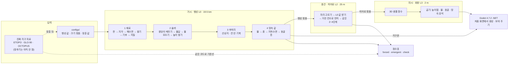

# B-PCG 한 장 요약

> 처음 합류한 팀원이나, 대화 창이 작은 AI 모델이 이 프로젝트를 한 번에 파악하려고 읽는 문서입니다(2026-10-08 기준). 무엇을 왜 만드는지, 어떻게 계산하는지, 코드가 어디 있는지, 지금 어디까지 됐는지를 한 장에 담았습니다. 자세한 내용은 맨 끝 '더 볼 곳'의 문서를 필요할 때만 엽니다. 처음 보는 말은 [용어집](glossary.md)에 있습니다.

## 직접 돌려 보기

[README](../README.md)의 '직접 돌려 보기' 1~4를 따릅니다. 가장 짧게는 이 두 줄입니다.

```bash
uv run bpcg all --profile tiny   # 작은 행성 하나를 끝까지 (약 6초, 마지막 줄 '[전체] 끝')
uv run bpcg studio               # 결과를 지도로 보기 (http://127.0.0.1:8765)
```

---

## 1. 왜 만드나

게임 속 지형은 보통 크기가 다른 무작위 물결(노이즈)을 겹쳐 만듭니다. 빠르고 그럴듯하지만 두 가지가 안 됩니다.

- **물이 말이 안 됩니다.** 강이 웅덩이에서 끊기거나 산을 거슬러 오릅니다.
- **땅을 읽을 수 없습니다.** 절벽이 왜 거기 있는지, 동굴이 왜 그 높이에 있는지 원인이 없습니다.

B-PCG는 원인부터 만듭니다. 판이 땅을 밀어 올리고, 비가 강이 되어 산을 깎고, 그 산을 이룬 바로 그 암석과 물이 땅속(지층·지하수·동굴)이 됩니다. 그래서 보이는 것(절벽, 강, 동굴 입구)에서 원인(암석, 융기, 지하수면)을 읽을 수 있습니다. 이것을 '읽히는 땅'이라 부르고, 이 프로젝트의 핵심 가치로 둡니다.

- **누가.** 중앙대 캡스톤디자인(1), 2026년 가을, 3인 팀. GitHub에 공개합니다([CAU-8/B-PCG](https://github.com/CAU-8/B-PCG)).
- **어떻게 검증하나.** 같은 잣대를 진짜 지구 자료에도 대어, 만든 행성이 얼마나 지구다운지 점수를 매깁니다(8장).
- **새로움은 어디에.** 부품(정상상태 풀이, 동굴 높이 규칙 등)마다 선행 연구가 있습니다. 내세우는 것은 부품을 한 줄로 엮는 방식과 그 결과를 재는 방식입니다.

## 2. 무엇을 만드나

같은 땅을 세 가지 배율로 만들고, 기능은 세 줄의 원인-결과 사슬로만 설명합니다.

| 배율 | 이름 | 크기 | 하는 일 |
|---|---|---|---|
| 거시 | 행성 지도 (L0) | 지구 전체. 칸 한 변 약 19.5 km(서울 남북 길이의 3분의 2), 칸 157만 개 | 판·지각·융기·기후를 정하고 큰 강과 산맥을 풉니다 |
| 중간 | 히어로 유역 (L2) | 강 유역 하나. 한 변 32 km(서울만 한 네모), 칸 25 m | 같은 계산을 촘촘한 칸으로 다시 풀어 골짜기, 드러난 지층, 지하수, 동굴 높이를 정합니다 |
| 미시 | 회랑 (L3) | 유역 안의 6 km × 1 km 띠(여의도의 약 2배), 2 m 간격 | 걸어 다닐 3D 지형과 땅속을 Godot 파일로 굽습니다 |

| 사슬 | 거시 L0 | 중간 L2 | 미시 L3 |
|---|---|---|---|
| 1 뼈대: 판 → 지각 → 해양저·융기 | 판, 지각 두께, 바다 밑 나이와 깊이, 해수면(물의 양을 지킴), 융기 | 융기와 출구 높이를 L0에서 받음 | (없음) |
| 2 조각: 암석 + 비 → 절벽·골짜기 | 큰 강과 골짜기 바닥, 지질 기둥 | 같은 규칙을 다시 풀어 산비탈·선상지·드러난 지층·흙 | 단면에 지층 절벽, 흙과 맨 암반 |
| 3 내부: 수위 → 지하수 → 동굴 | 큰 강·호수 수면 | 지하수면, 동굴 층 높이와 입구 | 동굴 통로, 물에 잠긴 아래층 |

앞 사슬의 결과가 다음 사슬의 원인입니다. 예를 들어 사슬 1이 정한 융기가 사슬 2에서 산의 높이가 되고, 사슬 2가 정한 강 수면이 사슬 3에서 지하수면의 기준이 됩니다.



## 3. 어떻게 계산하나

### 3.1 네 단계

행성 하나는 이 순서로 만듭니다. 새 지구과학 기능은 이 네 칸 가운데 하나에만 들어갑니다.

1. **재료.** 판, 지각, 해수면, 융기, 기후, 지질을 식 하나씩으로 바로 계산합니다(반복 없음).
2. **솔버.** 산과 강의 모양을 풉니다(3.2).
3. **후처리.** 선상지(산 앞에 강이 흙을 부채꼴로 쌓은 땅)처럼 솔버 규칙 밖의 모양을 덧붙입니다. 덧붙인 칸에는 '정상상태 아님' 표시를 남깁니다.
4. **땅속 값.** 물(호수·강), 흙, 지하수면, 동굴 층을 정합니다(3.3).

### 3.2 정상상태 솔버

진짜 산은 수백만 년에서 수천만 년에 걸쳐 자랍니다. 이것을 1년씩 계산하면 행성 하나에 몇 시간이 걸립니다. 그런데 오래 자란 산은 어느 때부터 모양이 거의 바뀌지 않습니다. 땅이 솟는 만큼 강이 깎아 내기 때문입니다.

그럼 처음부터 그 '다 자란 모양'만 바로 구할 수는 없을까요? 있습니다. 바다에서 출발해 상류로 한 칸씩 올라가며, 솟는 속도와 깎이는 속도가 같아지는 경사로 높이를 쌓습니다. 이렇게 더 바뀌지 않는 상태를 정상상태라고 부릅니다. 예를 들어 땅이 1년에 1 mm 솟는 곳이면, 그 칸의 강은 1년에 정확히 1 mm를 깎는 경사가 됩니다.

- **경사 규칙.** 강은 상류에서 가파르고 바다로 갈수록 완만해집니다. 물이 많이 모일수록 경사가 작아도 같은 양을 깎기 때문입니다. 식으로는 강 경사 = k_s · Q^(−θ) 입니다. Q는 1년에 지나가는 물의 양(m³/yr), θ(오목도)는 0.45로 고정입니다. 물의 양이 10배 늘면 경사는 10^(−0.45) ≈ 0.35배, 약 3분의 1이 됩니다.
- **산비탈.** 강이 없는 비탈은 흙이 천천히 흘러내리는 규칙(사면 확산)으로 경사를 정합니다. 강 경사와 비탈 경사를 섞은 뒤, 암석마다 정해진 가장 가파른 경사(임계 경사 S_crit, 예: 0.6 ≈ 31°)를 넘지 않게 자릅니다.
- **지층을 넘으면 경사가 바뀝니다.** 높이를 쌓다가 단단한 층에 들어가면 그 층의 경사로 바꿔 이어 쌓습니다. 그래서 단단한 층에 절벽이 생깁니다.
- **반복은 하나뿐.** 높이를 쌓으면 물이 흐르는 방향이 바뀌고, 방향이 바뀌면 높이도 다시 쌓아야 합니다. 그래서 물길 방향이 더 바뀌지 않고 높이 변화가 0.1 m 미만이 될 때까지 되풀이합니다. 행성 지도는 약 50번, 히어로 유역은 약 169번입니다.
- **뒤집히는 칸 묶기.** 두 이웃의 경사가 거의 같은 칸은 반복마다 방향이 이쪽저쪽 뒤집힙니다. 그래서 새 방향이 2% 넘게 더 가파를 때만 바꾸고(히스테리시스), 16번 뒤집힌 칸은 옛 방향에 묶습니다(고정 칸).

### 3.3 땅속은 반복 밖에서 한 번

흙, 지하수, 동굴은 땅 위 모양을 읽기만 하고 바꾸지 않습니다. 그래서 솔버가 끝난 뒤 4단계에서 한 번 만듭니다. 원인은 늘 '땅 위 → 땅속' 한쪽으로만 갑니다.

- **동굴 층 높이.** 동굴은 녹는 암석(석회암·대리암) 안에서, 지하수면 높이에 수평으로 생깁니다. 땅이 솟으면 옛 지하수면에 생긴 동굴은 말라서 위에 남습니다. 식으로는 k번째 층 높이 = 지하수면 + k × f_k × 골짜기 깊이 입니다. 이 관찰은 Audra & Palmer 2011에서 왔고, 비율 f_k는 우리가 정한 값입니다.

### 3.4 같은 코드로 공과 평면

칸마다 위치, 이웃 8개, 이웃까지 거리, 넓이를 담은 표(`CellGraph`) 하나로 공 모양 행성과 평면 유역을 같은 코드로 계산합니다. 공은 정육면체 여섯 면을 바둑판으로 나눠 부풀린 격자(큐브스피어)이고, 칸 번호는 `c = 면 번호·n² + 줄·n + 칸` 입니다.

## 4. 크기와 시간 (laptop 프로필)

| 배율 | 칸 | 하는 일 | 걸린 시간 |
|---|---|---|---|
| 거친 격자 | 면당 128 × 128, 칸 약 78 km(제주도 동서 길이보다 조금 김) | 판·지각만 먼저 만들어 L0로 옮김 | (행성에 포함) |
| 행성 지도 L0 | 면당 512 × 512, 모두 157만 칸, 칸 약 19.5 km | 1~4단계 전부 | 31.1 s (솔버 4.7 s) |
| 히어로 유역 L2 | 1280 × 1280, 164만 칸, 칸 25 m, 한 변 32 km | 2~4단계를 같은 코드로 | 43.6 s (솔버 38.1 s, 169번) |
| 회랑 L3 | 6 km × 1 km, 높이맵 2 m(501 × 3001), 땅속 암석 4 × 4 × 2 m | 3D 샘플 함수에 물어 엔진 파일로 굽기 | 31.1 s (동굴 메시 21.4 s) |
| 지구본 | 면당 256 × 256 | L0 값을 엔진 지구본용으로 다시 담기 | 4.0 s |

- 전체 `bpcg all --profile laptop --seed 0`: 117.8 s, 메모리 최대 7.3 GB(맥북 에어 M3 8코어 16 GB, C# 판, 2026-10-08 한 번 잰 값).
- Python 판 시간(75 s, 2026-10-02의 옛 코드)은 동굴·굽기 코드가 달라 바로 견주지 않습니다.
- 설계도는 L3를 1 m 상자(복셀)라고 적었지만, 지금 굽기는 2 m 높이맵과 4 × 4 × 2 m 땅속 암석 상자입니다.
- 행성 반지름은 지구와 같은 6,371 km입니다(서울–부산 직선거리의 약 20배). 소행성 크기(5~20 km)안은 버렸습니다. 대기, 판, 진짜 지구와의 비교가 안 되기 때문입니다.

## 5. 코드 지도

생성기는 C#(`src/Bpcg/`)입니다. 폴더 사이 참조는 한 방향입니다(거꾸로 금지).

```text
Core, IO, Numerics → Planet, Geology, Hydro → Landscape → Subsurface → Hero, Volume → Bake → Runs, Compare
```

계산 함수는 파일을 읽거나 쓰지 않습니다. 파일 쓰기는 `Bake/`·`Runs.cs` 에서만 합니다.

| 위치 | 하는 일 | 입구 |
|---|---|---|
| `src/Bpcg.Cli/` | 명령줄 `bpcg planet / hero / bake / all / compare` | `Program.Main` |
| `Runs.cs`, `Pipeline.cs` | 실행 순서(명령줄과 엔진이 같이 씀), 행성·유역 만들기, 2~4단계 공통 | `Runs.All`, `Pipeline.GeneratePlanet`, `GenerateHero` |
| `Core/` | 큐브스피어, `CellGraph`, 정수 해시(SplitMix64), 노이즈, 설정 읽기(`Config.LoadConfig`, `--set` 검사), 필드 목록, 경로 | |
| `IO/`, `Numerics/` | npy·npz·JSON·TOML 파일, scipy 대신 직접 짠 수치 함수(KD-tree, 필터, FFT, numpy와 같은 덧셈 순서) | |
| `Planet/` | 사슬 1과 기후: 판, 지각, 해수면, 융기, 기후, 재료 | |
| `Geology/` | 암석 표, 지질 기둥(쌓인 순서 3종, 변성) | `GenerateGeology`, `BuildColumns` |
| `Hydro/` | 웅덩이 메우기, 물길 방향(D8), 하류부터 순서, 물 모으기, 유역·강 구간 | `Routing.D8Receivers`, `AccumulateModule.Accumulate` |
| `Landscape/` | 정상상태 솔버, 선상지, 칸 안 기복, 거친 칸으로 먼저 풀기 | `Solver.SolveSteadyState` |
| `Subsurface/` | 사슬 3: 물(호수·강), 흙, 지하수면, 동굴 층 | |
| `Hero/` | 유역 자리 고르기, 크기, L0 값 받기, 평면 히어로 | `Finder.FindHero`, `Refine.RefineHero`, `Flat.FlatHero` |
| `Volume/` | 아무 3D 점에 "무엇이 있나"(암석, 물, 지표까지 거리, 동굴까지 거리) | `HeroVolume` |
| `Bake/` | 묶음 읽기·쓰기, 회랑 굽기, 동굴 메시, 프랙탈 디테일, 지구본 | `BakeCorridor`, `BakeGlobe` |
| `Metrics/` | 점수표, 물길·높이 분포 지표 | `Scorecard.Build` |
| `Compare/` | 기존 지형 생성 방법과 같은 시드로 견주기 | `uv run bpcg compare run` |
| `src/bpcg_studio/` (파이썬) | 웹 도구. C# 명령줄을 빌드해 돌리고 결과 파일을 읽음. `bpcg` 명령의 입구 | `uv run bpcg studio` |

- **묶음.** 단계 사이에는 폴더 하나를 넘깁니다: 목차(`manifest.json`, 설정 전체·시드·커밋·시간), 칸 정보(`graph.npz`), 지도마다 파일 하나(`<그룹>/<필드>.npy`). 파일 꼴은 Python 판과 바이트까지 같습니다.
- **같은 시드면 같은 행성.** 지형에 들어가는 무작위 값은 정수 해시로만 만듭니다. 병렬 계산은 칸마다 자기 자리에만 씁니다. 그래서 코어 수가 달라도 결과가 비트까지 같습니다.
- **정밀도.** 솔버의 높이와 웅덩이 메우기는 double(소수 약 16자리), 엔진 파일은 float32(약 7자리)입니다.
- **Python 판과의 관계.** 생성기는 Python(numba)에서 C#으로 옮겼습니다(PR #2·#3, 병렬은 PR #4). Python 판이 만든 자료와 비트까지 같은지 시험이 봅니다. Python 생성기 코드는 지웠고 git 기록(커밋 3b5bbf6까지)에 있습니다.
- **시험.** C#은 `dotnet test --solution Bpcg.slnx`(`tests/Bpcg.Tests/`), 파이썬은 `uv run pytest -m "not slow"`(`tests/test_*.py`, C# 결과 파일·스튜디오·엔진 검사)입니다.

## 6. 엔진 (`engine/`, Godot 4.7.2 .NET)

- 엔진의 C# 코드(`engine/Scripts/*.cs`)가 생성기(`src/Bpcg`)를 그대로 씁니다. 처음 화면(`start.tscn`)에서 행성을 만들 수 있고, 구운 파일을 3D로 보여 줍니다. Godot 표준판으로는 열리지 않습니다.
- 좌표는 X = 동, Y = 위, Z = 남입니다.
- 장면은 처음 화면, 회랑(`main.tscn`), 지구본(`globe.tscn`) 셋입니다. M 키로 회랑 ↔ 지구본, N 키로 처음 화면.
- 레이어(숫자 키로 켜고 끔): 1 회랑 지형, 2 주변 25 m 지형, 3 수면, 4 지하수면, 5 동굴, 6 지층 단면, 7 동굴 입구 구멍, 8 프랙탈 디테일.
- 주요 키: V 날기 ↔ 걷기, X 단면 칼(눈앞에 세로 면을 세워 땅속을 보여 줌), T 동굴 입구로 옮겨 가기, G 지질도, F 손전등, `-`/`=` 글자·패널 크기.
- 땅을 파는 대신 단면 칼을 씁니다. 실행 중에 땅을 바꾸는 복셀(godot_voxel)은 10/21 관문을 통과할 때만 넣습니다.

## 7. 자료와 학습

- **받아 둔 자료**(`data/pilot/`, 약 4.5 GB): 세계 높이(ETOPO 2022), 강수(CHELSA), 건조도(Aridity v3.1), 강 목록(RiverATLAS), 침식률(OCTOPUS, 유역 5,673개), 시험 유역 40개와 30 m 높이 타일(GLO-90) 55개. 받기는 `tools/download_pilot.py`.
- **'학습'의 뜻.** 딥러닝이 아닙니다. 진짜 지구 자료로 규칙 속 숫자를 맞추는 일입니다.
    - θ(강이 완만해지는 정도): 강의 높이와 상류 면적 관계로 잼(χQ 분석)
    - k_s(강 가파름): OCTOPUS 침식률과의 관계로 잼
    - S_crit(임계 경사): 빨리 깎이는 산지의 경사로 잼
    - 마지막으로 솔버를 돌려 결과가 맞도록 거꾸로 맞춥니다.
    - 맞춘 값은 `configs/learned/` 에 넣고, 코드는 바꾸지 않습니다.
- **지금은 맞추기 전입니다.** 모든 값이 논문 값과 손으로 고친 값입니다.
- **주의.** 레이더로 잰 높이 자료는 숲 지붕 높이까지 잽니다. 가봉의 AfriSAR 자료로 θ를 재려다 0.07~0.13이라는 엉뚱한 값이 나와 실패했습니다. 신경망·확산 모델은 쓰지 않습니다.

## 8. 무엇이 새롭고 어떻게 검증하나

| 기존의 빈틈 | B-PCG | 합격선 |
|---|---|---|
| 다 자란 모양을 바로 푸는 방법은 모두 평면에서만, 공 위의 침식 모델은 모두 시간 순서 계산 | 공 모양 행성 전체에서 다 자란 모양을 바로 풂 | 강 100%가 바다·호수에 닿음, 거꾸로 흐르는 강 0, 면 경계와 안쪽의 격자 정렬 지수가 같음(1.3 미만), 행성을 돌려도 같음 |
| 3D 지층·동굴 연구는 지하수면을 사람이 넣고, 게임 동굴은 노이즈 | 한 지질 모델이 산의 모양과 화면을 함께 정하고, 지하수·동굴을 물길에서 계산 | 경사를 만든 암석 = 보이는 암석 100%, 동굴 ⊂ 녹는 암석 100%, 물 규칙 위반 0 |
| 진짜 지구를 같은 코드에 넣은 기준선이 없음 | ETOPO를 같은 칸에 담은 '격자 위 지구' 기준선, 노이즈·요소 끄기 대조군 | emergent 지표만 근거로 씀 |
| 유역마다 다른 θ·k_s를 생성기 입력으로 쓴 사례가 없음 | GLO-90·OCTOPUS로 재서 입력 지도로 씀 | 맞춤 설명력(R²), 상류 면적 오차 10% 이하 |
| 걸어 다니는 크기는 노이즈로 채움 | 히어로 유역을 같은 규칙으로 25 m에서 다시 풂 | 진짜 30 m 지형과 분포 차이(KS) 0.15 미만 |

- **지표 세 종류.**
    - forced: 입력으로 정한 값이 그대로 나오는 지표(예: θ). 맞아도 '지구답다'는 근거가 아니라, 코드가 망가지지 않았는지 보는 데만 씁니다.
    - emergent: 입력에 없던 성질이 결과로 나온 지표(예: 바다 비율, Hack 지수). '지구답다'는 근거로 쓰는 것은 이것뿐입니다.
    - check: 꼭 지켜야 하는 규칙(예: 거꾸로 흐르는 강 0). 어기면 불합격입니다.
- **가장 가까운 경쟁작.**
    - Wildforge: 행성 물길·지하수·지층이 있지만 동굴은 노이즈.
    - triangulum: 구조가 우리와 같음.
    - PlanetCreator: 시간 순서 계산, 복셀 없음.
    - World Orogen, Cortial 2019, goSPL, fastscapelib.
    - 솔버 자체는 Steer 2021, Tzathas 2024, MuddPILE과 사실상 같습니다.

<details><summary>확인한 인용</summary>

- Cortial 2019: 24명에게 그림 6쌍을 보여 준 144표 가운데 판 행성 97표, 노이즈 47표. 사실감만 물었고 행성 전체 그림입니다. 논문에 적힌 χ² 8.3은 다시 계산한 값 17.4와 다릅니다.
- Galin 2019: *Computer Graphics Forum* 38(2):553–577, doi 10.1111/cgf.13657.
- Zechmann & Hlavacs 2025: GAME-ON 2025 pp.15–19, arXiv 2510.24764, 참가자 15명. "비교 대상도 전부 노이즈"는 우리 해석입니다.

</details>

## 9. 지금 상태 (2026-10-08)

- **브랜치.** `main` 에 C# 판 생성기(PR #2·#3)와 병렬화(PR #4)가 들어갔습니다. 방법 비교와 HUD 크기는 Python 판에서 만든 것을 `feat/compare-csharp` 에서 C#으로 옮겼습니다(PR 전).
- **되는 것.** 행성 → 히어로 유역 → 회랑 → 지구본이 끝까지 돕니다. Godot 처음 화면·회랑·지구본, 스튜디오, `--set` 으로 값 바꾸기, 기존 방법과 견주기(`bpcg compare`)도 됩니다.
- **점수표 (earth_v2, laptop).** Python 판에서 잰 값입니다. C# 판 laptop 실행(시드 0, 2026-10-08)도 바다 비율 0.625, 히어로 고정 칸 30%, 불합격 없음으로 같습니다.
    - check: 모두 통과. 강이 바다·호수에 닿는 비율 100%, 거꾸로 흐름 0, 물·흙 수지 오차 약 1e-16, 암석 일치 100%, 동굴 ⊂ 녹는 암석 100%. 격자 정렬 지수는 L0 0.91(면 경계)·0.90(안쪽), 히어로 1.12.
    - 바다 비율 0.625(지구 0.708). 열 칸 가운데 여섯 칸이 바다입니다(지구는 일곱 칸).
    - Hack 지수 0.587(L0), 0.517(히어로). 지구 강의 범위(0.49~0.6) 안입니다.
    - 지하수가 지표에 닿는 땅 0.91~0.96(지구 0.22~0.32). 열 칸 가운데 아홉 칸이 젖은 땅이라, 지구(두세 칸)보다 훨씬 많습니다. 가장 큰 결함입니다.
- **알려진 빈칸.**
    - 히어로 유역 칸의 30%가 물길이 계속 뒤집혀 방향을 묶은 칸입니다.
    - 동굴 입구가 너무 많습니다. 회랑 지표의 6.6%가 동굴 구멍입니다.
    - 동굴 메시가 큽니다: C# laptop 실행(시드 0)은 `caves.glb` 309 MB(삼각형 1,175만 개).
    - 선상지 판정 기준이 경사 지수 n = 1일 때 기준이라, 지금(n = 2)의 평면 히어로에는 선상지가 생기지 않습니다.
    - '가파르면 맨 암반' 규칙이 거의 걸리지 않습니다.
    - 강이 시작되는 지점의 식을 Kargère 2025로 바꿔야 합니다.
    - 대륙붕 퇴적, 판이 휘는 효과, 산이 비를 막는 효과가 없습니다.
- **다음 기술**([future_tech.md](future_tech.md)): 자료로 θ·k_s·S_crit 맞추기, 솔버 빠르게 하기(멀티그리드 + 앤더슨 가속), 2D 지하수 방정식, 동굴 위치 규칙, 동굴 메시 나누기와 거리별 단순화(LOD).

## 10. 일정과 역할

- **역할.** A = 행성 바탕(격자, 판, 지질, 기후, 기준선, 점수표). B = 물·지형·땅속(물길, 솔버, 히어로, 흙, 지하수, 동굴). C = 엔진·데모.
- **날짜.**
    - 10/14 다시 계획
    - 10/21 발표 그림 동결 + 런타임 복셀 관문
    - 10/23 중간 발표(성적 30%)
    - 11/4 히어로 v1
    - 11/11 꼭 할 기능 동결
    - 11/18 데모 동결
    - 12/4·12/11 최종 데모(성적 60%, 수강생 투표 포함)
    - 12/18 보고서·사용 설명서·공개
- **일이 시간보다 많습니다.** 사슬 셋과 기준선에 12.5~14인주(한 사람이 한 주 일하는 양)가 드는데, 쓸 수 있는 시간은 6~8인주입니다. 모자라면 쓸 대체안이 정해져 있습니다.
    - 히어로 25 m 다시 풀기 → 칸 안 기복에 노이즈
    - 2층 동굴 → 노이즈 1층
    - 지하수 식 → 가까운 수면 높이로 어림
    - 지층마다 경사 바꾸기 → 색칠만
- **멘토 피드백에 대한 대응(제안, 설계도에 아직 안 넣음).** 왜 필요한지와 핵심 가치('읽히는 땅'), 몰입을 재는 지표(두 그림 가운데 고르기, '물이 어디로 흐를지·동굴이 어디 있을지' 맞히기), 기존 게임과 나란히 보이기(노이즈 / B-PCG / 진짜 GLO-90 세 칸)가 필요합니다.

## 11. 지킬 것

글과 작업 규칙은 [CLAUDE.md](../CLAUDE.md)에 있습니다. 발표와 보고서에서는 하나를 더 지킵니다.

- **말하면 안 되는 것.** '최초', '새 솔버', '새 동굴 기법'. 지하수 식을 '물리 모델'이라 부르지 않습니다(어림식입니다). forced 지표를 '지구답다'는 근거로 쓰지 않습니다.

## 12. 더 볼 곳

| 알고 싶은 것 | 파일 |
|---|---|
| 말의 뜻 | [glossary.md](glossary.md) |
| 확정 설계(사슬, 배율, 일정, 선행 연구) | [design/blueprint.md](design/blueprint.md) (필요한 장만) |
| 단계마다 공식과 함수의 약속, 알려진 빈칸 | [pipeline.md](pipeline.md) (14장이 빈칸) |
| C# 포팅 기록, 대조 결과, 남은 일 | [csharp_port.md](csharp_port.md) (0장부터) |
| 규칙 전체 | [conventions.md](conventions.md), [CONTRIBUTING.md](../CONTRIBUTING.md) |
| 단계별 할 일과 증거 | [roadmap.md](roadmap.md) |
| 다음에 넣을 기술 | [future_tech.md](future_tech.md) |
| 엔진 조작과 파일 형식 | [engine/README.md](../engine/README.md), [engine/GLOBE.md](../engine/GLOBE.md) |
| 스튜디오 | [studio.md](studio.md) |
| 기존 방법과 견주기 | [compare.md](compare.md) |
