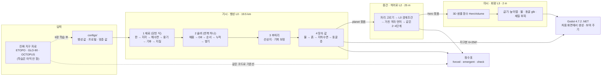

# B-PCG 압축 안내서 (보조 모델용)

컨텍스트가 작은 모델이 이 프로젝트를 도울 때 먼저 읽는 한 장입니다. 2026-10-08 기준입니다(생성기 C# 판). 자세한 내용은 맨 끝 '더 볼 곳'의 문서를 필요할 때만 엽니다.

## 0. 먼저 지킬 것

| 규칙 | 내용 |
|---|---|
| 무엇이 맞나 | 사용자 말 > Claude 문서 설계도 탭(원본) > `docs/design/blueprint.md`(사본) > `docs/pipeline.md` > `docs/guide/planet_guide.md` |
| 낡은 곳 | 설계도 10장 '지금 상태'는 낡았습니다(git 없음, main.py뿐이라고 적힘). 실제 상태는 이 문서 9절과 `docs/csharp_port.md` 0장 |
| C# 작업 전 | 지시 원문 `docs/csharp_port_prompt.md` 와 진행 기록 `docs/csharp_port.md` 를 먼저 읽음 |
| git | 커밋은 사용자가 시킬 때만. 기능 브랜치 → PR → 리뷰 1명 → squash. main 직접 푸시는 사용자가 명시할 때만. 작성자 `HongCM <hongcheolmin004@gmail.com>` |
| 공개 저장소 | `data/`, `out/`, `engine/baked/`, `.tools/`(Godot 실행 파일)은 절대 커밋하지 않음. 커밋하는 바이너리는 1 MB 이하 |
| Godot 실행 | 스크립트·에이전트에서 Godot는 `--headless` + 임시 HOME으로만. 2026-10-02에 HOME을 안 바꿔 사용자 편집기 설정을 덮어쓴 사고가 있었음 |
| 언어 | 식별자는 영어. 주석·문서·커밋·PR은 쉬운 한국어 합니다체 |
| 환경 (C#) | .NET 10 SDK. 경고는 오류, `dotnet format Bpcg.slnx --verify-no-changes`. 기본형·배열에 `var` 금지, 중괄호 늘 씀, private 필드 `_camelCase` |
| 환경 (파이썬) | 스튜디오·시험·분석만. uv만 씀(pip 금지), 파이썬 3.13 고정, `ruff format` + `ruff check`(100자) |
| 병렬 | 칸마다 독립인 일만 `Parallelism.For` 로 나눔. 더하는 순서가 바뀌는 병렬은 금지(결정성) |
| 말하면 안 되는 것 | '최초', '새 솔버', '새 동굴 기법'. 지하수 식을 '물리 모델'이라 부르지 않음. 입력으로 정해지는 지표(forced)를 지구다움의 근거로 쓰지 않음 |

## 1. 한 줄 정의와 핵심 가치

- **무엇:** 지구 크기 행성 하나를 통째로 만들고, 그중 한 유역을 걸어 다니는 3D 세계(Godot)로 보여 주는 생성기입니다. 중앙대 캡스톤디자인(1), 2026 가을, 3인 팀, GitHub 공개(CAU-8/B-PCG).
- **한 문장:** 판·비·강이 산을 만들고, 그 산을 만든 바로 그 암석과 물이 땅속이 됩니다. 같은 코드에 진짜 지구를 넣어 얼마나 지구다운지 점수를 매깁니다.
- **핵심 가치:** '읽히는 땅'. 보이는 것(절벽, 강, 동굴 입구)에서 원인(암석, 융기, 지하수면)을 읽을 수 있습니다. 노이즈 지형은 이게 안 됩니다.
- **새로움의 위치:** 부품마다 선행 연구가 있습니다. 내세우는 것은 부품을 엮는 방식과 그 결과를 재는 방식입니다(8절).

## 2. 프레임워크 그림

**사슬 3개 × 스케일 3개.** 모든 지구과학 기능은 아래 아홉 칸 중 하나에 들어갑니다. 위 사슬의 결과가 아래 사슬의 원인입니다.

| 사슬 | 거시 L0 (19.5 km) | 중간 L2 (25 m) | 미시 L3 (2 m) |
|---|---|---|---|
| 1 뼈대: 판 → 지각 → 해양저·융기 | 판, 지각평형, 해양저 나이-수심, 해수면(물 부피 보존), 융기 U | U와 출구 높이를 경계로 받음 | (없음) |
| 2 조각: 암석 + 비 → 절벽·골짜기 | 솔버가 큰 강과 골짜기 바닥, 지질 기둥 | 같은 법칙을 다시 풀어 사면·선상지·드러난 지층·흙 | 단면에 지층 절벽, 흙과 맨 암반 |
| 3 내부: 수위 → 지하수 → 동굴 | 큰 강·호수 수면 | 지하수면, 동굴 층 높이와 입구 | 동굴 통로, 잠긴 아래층 |

## 3. 스케일과 크기 (laptop 프로필)

| 스케일 | 격자 | 하는 일 | C# 판 시간 |
|---|---|---|---|
| 거친 격자 | 6×128² = 98,304칸, 약 78 km | 판·지각만 만들고 L0로 옮김 | (행성에 포함) |
| 거시 L0 | 큐브스피어 6×512² = 1,572,864칸, 약 19.5 km | 1~4단계 전부 | 31.1 s (솔버 4.7 s) |
| 중간 L2 히어로 | 평면 1280² = 1,638,400칸, 25 m, 한 변 32 km | 2~4단계를 같은 코드로 | 43.6 s (솔버 38.1 s, 169회) |
| 미시 L3 회랑 | 6 km × 1 km, 높이맵 2 m(501×3001), 재질 부피 4×4×2 m | 3D 함수를 물어 엔진 파일로 굽기 | 31.1 s (동굴 메시 21.4 s) |
| 지구본 | 6×256² | L0 값을 다시 담아 엔진 지구본으로 | 4.0 s |

- 전체 `bpcg all --profile laptop --seed 0`: 117.8 s, 최대 메모리 7.3 GB(맥북 에어 M3 8코어 16 GB, C# 판, 2026-10-08 한 번 잰 값). 묶음 쓰기 시간이 단계 시간 밖에 따로 듭니다.
- Python 판 시간(75 s, 2026-10-02 의 옛 코드)은 동굴·굽기 코드가 달라 직접 비교하지 않습니다.
- 설계도는 L3를 1 m 복셀이라고 적었지만, 지금 굽기는 2 m 높이맵 + 4×4×2 m 재질 부피입니다.
- 지구 반지름 6,371 km로 정했습니다. 소행성 크기(5~20 km)안은 버렸습니다(대기·판·지구 비교가 안 됨).

## 4. 계산 구조

- **4단계.** 1 재료(닫힌 식) → 2 솔버 → 3 후처리('정상상태 아님' 표시) → 4 땅속 값. 새 지구과학 요소는 이 네 틀 중 하나로만 들어옵니다.
- **정상상태.** 수천만 년을 시간 순서로 돌리지 않습니다. '솟는 속도 = 깎이는 속도'인 다 자란 지형을 고정점 반복으로 바로 풉니다. 바다에서 상류로 칸마다 `z = z_r + d·S`를 쌓습니다.
- **경사 S.** 하천 경사 `k_s·Q^-θ`와 사면 경사의 조화 평균을 암석별 `S_crit`로 자릅니다. θ = 0.45 고정. S_crit는 암석별 표(문헌값 약 0.6에서 손 보정), 경사 지수 n = 2(손 보정).
- **반복은 하나.** 솔버 안의 '물길 방향 맞추기'뿐입니다. 멈춤 조건은 방향 변화 0 그리고 고도 변화 0.1 m 미만입니다. 히스테리시스를 쓰고, 16번 바뀐 칸은 옛 방향에 묶습니다. 반복 수는 L0 약 50회, 히어로 약 169회입니다.
- **땅속은 반복 밖.** 동굴·지하수·흙은 지형을 읽기만 하므로 4단계에서 한 번 만듭니다. 방향은 '땅 위 → 땅속' 한쪽입니다.
- **동굴 층 높이.** `z_k = 지하수면 + k·f_k·골짜기 깊이`. 관찰은 Audra & Palmer 2011에서, 비율 f_k는 우리 가정입니다.
- **같은 코드로 두 스케일.** `CellGraph`(pos, nbr 8개, dist, area) 하나로 구면과 평면을 다룹니다. 셀 번호는 `c = f·n² + j·n + i`입니다.

## 5. 코드 지도 (`src/Bpcg/`, C#)

의존 방향: `Core, IO, Numerics → Planet, Geology, Hydro → Landscape → Subsurface → Hero, Volume → Bake → Runs, Compare`. 거꾸로 참조 금지. 계산 함수는 파일을 읽거나 쓰지 않습니다(쓰기는 `Bake/`·`Runs.cs`).

| 위치 | 하는 일 | 입구 |
|---|---|---|
| `src/Bpcg.Cli/` | 콘솔 `bpcg planet / hero / bake / all / compare` | `Program.Main` |
| `Runs.cs`, `Pipeline.cs` | 실행 단위(콘솔·엔진 공용), 행성·히어로 순서, 2~4단계 공통 | `Runs.All`, `Pipeline.GeneratePlanet`, `GenerateHero` |
| `Core/` | 큐브스피어, `CellGraph`, 해시(SplitMix64), 노이즈, 설정(`Config.LoadConfig`, `--set` 검사), 필드 목록, 경로 | |
| `IO/`, `Numerics/` | npy·npz·JSON(Python 과 같은 글자)·TOML, scipy 대신 직접 짠 KD-tree·ndimage·FFT·numpy pairwise 합 | |
| `Planet/` | 사슬 1 + 기후: Plates, Crust, Ocean, Uplift, Climate, Materials | |
| `Geology/` | 암석 표, 3D 지질 기둥(템플릿 3종, 변성 정도) | `GenerateGeology`, `BuildColumns` |
| `Hydro/` | 웅덩이 채우기, D8, 순서, 유량 누적, 유역·강 구간 | `Routing.D8Receivers`, `AccumulateModule.Accumulate` |
| `Landscape/` | 정상상태 솔버, 선상지, 기복 보정, 거친 격자 먼저 풀기 | `Solver.SolveSteadyState` |
| `Subsurface/` | 사슬 3: 물(호수·강), 흙, 지하수면, 동굴 층 | |
| `Hero/` | 히어로 자리 고르기, 크기, L0 경계조건, 평면 히어로 | `Finder.FindHero`, `Refine.RefineHero`, `Flat.FlatHero` |
| `Volume/` | 아무 3D 점에 "무엇이 있나"(재질, 물, 지표 거리, 동굴 거리) | `HeroVolume` |
| `Bake/` | 묶음 읽기·쓰기, 회랑 굽기, 동굴 메시, 프랙탈 디테일, 지구본 | `BakeCorridor`, `BakeGlobe` |
| `Metrics/` | 점수표, 물길·고도 분포 지표 | `Scorecard.Build` |
| `Compare/` | 기존 지형 생성 방법론(Galin 2019)과 같은 시드로 비교, 연산 과정 기록 | `uv run bpcg compare run` |
| `src/bpcg_studio/` (파이썬) | 127.0.0.1 웹 도구. C# 콘솔을 빌드해 하위 프로세스로 돌리고 결과 파일을 읽음. `bpcg` 명령의 입구 | `uv run bpcg studio` |

- **묶음.** 단계 사이 넘김은 `manifest.json`(설정 전체·해시·시드·커밋·시간) + `graph.npz` + `<그룹>/<필드>.npy`입니다. 파일 꼴은 Python 판과 바이트까지 같습니다.
- **결정성.** 지형에 들어가는 무작위는 정수 해시로만 만듭니다(`System.Random` 금지). 병렬 커널은 칸마다 자기 자리에만 씁니다. 그래서 스레드 수가 달라도 비트까지 같습니다.
- **정밀도.** 솔버 고도와 웅덩이 채움은 double, 엔진 파일은 float32입니다.
- **Python 판과의 관계.** 생성기는 Python(numba)에서 C# 으로 옮겼습니다(PR #2·#3, 병렬은 PR #4). golden 대조 시험이 Python 판과 비트 단위로 같은지 봅니다. Python 생성기 코드는 지웠고 git 기록(커밋 3b5bbf6 까지)에 있습니다.
- **시험.**
  - C#: `tests/Bpcg.Tests/`(xunit, golden 대조). `dotnet test --solution Bpcg.slnx`.
  - 파이썬: `tests/test_*.py` 가 C# 콘솔이 쓴 결과 파일·스튜디오·엔진을 검사. `uv run pytest -m "not slow"`. 표시는 `slow`, `data`, `godot`입니다.

## 6. 엔진 (`engine/`, Godot 4.7.2 .NET)

- C# 게임 어셈블리(`engine/Scripts/*.cs`)가 `src/Bpcg` 를 참조합니다. 처음 화면(`start.tscn`)에서 행성을 만들 수 있고, 구운 파일(`engine/baked/` 또는 `user://runs/`)을 메시·셰이더로 보여 줍니다. Godot 표준판으로는 열리지 않습니다. 좌표는 X = 동, Y = 위, Z = 남입니다.
- 장면은 `start.tscn`(처음 화면), `main.tscn`(회랑), `globe.tscn`(지구본)입니다. M 키로 회랑 ↔ 지구본, N 키로 처음 화면.
- 레이어는 1 회랑 지형, 2 주변 25 m, 3 수면, 4 지하수면, 5 동굴, 6 지층 단면, 7 동굴 입구 구멍, 8 프랙탈 디테일입니다.
- 주요 키:
  - V: 날기 ↔ 걷기
  - X: 단면 칼
  - T: 동굴 입구로 이동
  - G: 지질도
  - F: 손전등
  - `-` / `=`: 글자·패널(HUD) 크기(`UiScale.cs`, 화면 배율에 맞춰 시작하고 `user://settings.cfg`에 저장)
- 검사: `engine/Tests/`(연기 검사 `smoke.tscn`·`globe_smoke.tscn`, 화면 `screenshots.tscn`), `uv run pytest -m godot tests/test_engine.py`.
- 파기 대신 단면 칼을 씁니다. 런타임 복셀(godot_voxel)은 10/21 관문을 통과할 때만 합니다.

## 7. 자료와 학습

- **받아 둔 파일럿(`data/pilot/`, 약 4.5 GB):** ETOPO 2022, CHELSA 강수, Aridity v3.1, RiverATLAS, OCTOPUS(유역 5,673개), 파일럿 유역 40개 + GLO-90 타일 55개. 받기는 `tools/download_pilot.py`.
- **학습의 뜻:** 딥러닝이 아닙니다. 진짜 지구 자료로 규칙의 숫자를 맞춥니다.
  - θ: χQ 분석
  - k_s: OCTOPUS 침식률 회귀
  - S_crit: 빨리 깎이는 산지
  - 마지막으로 솔버를 돌려 거꾸로 맞춥니다.
  - 결과는 `configs/learned/`에 넣고, 코드는 바꾸지 않습니다.
- **지금은 학습 전입니다.** 모든 값이 문헌값과 손 보정값입니다.
- **주의:** 레이더 DEM은 숲 지붕을 잽니다. AfriSAR(가봉)로 θ를 재려다 실패했습니다(0.07~0.13). 신경망·확산 모델은 쓰지 않습니다.

## 8. 차별점과 검증

| 기존의 빈틈 | B-PCG | 합격선 |
|---|---|---|
| 정상상태 해법은 모두 평면, 구 위 침식 모델은 모두 시간 적분 | 큐브스피어 전체에서 정상상태 | 강 100%가 바다·호수에 닿음, 역류 0, 면 경계와 안쪽의 격자 정렬 지수가 같음(< 1.3), 회전 시험 |
| 3D 지층·동굴 연구는 지하수면을 사람이 넣고, 게임 동굴은 노이즈 | 한 지질 모델이 솔버와 화면을 함께 정하고, 지하수·동굴을 물길에서 계산 | 경사를 만든 암석 = 보이는 암석 100%, 동굴 ⊂ 녹는 암석 100%, 물 규칙 위반 0 |
| 진짜 지구를 같은 코드에 넣은 기준선이 없음 | ETOPO '격자 위 지구' 기준선 + 노이즈·요소 끄기 대조군 | emergent 지표만 근거로 씀 |
| 유역별 θ·k_s를 생성기 입력에 연결한 사례가 없음 | GLO-90·OCTOPUS로 재서 입력 지도에 연결 | R², 상류 면적 오차 ≤ 10% |
| 걷는 크기는 노이즈로 채움 | 히어로 유역을 같은 법칙으로 25 m에서 다시 풂 | 실제 30 m 지형과 KS < 0.15 |

- **지표 세 등급.** forced(입력이라 당연히 맞음)는 회귀 테스트로만 씁니다. emergent(결과로 나옴)만 지구다움의 근거입니다. check는 불변식입니다.
- **가장 가까운 경쟁작.**
  - Wildforge: 행성 물길·지하수·지층이 있지만 동굴은 노이즈.
  - triangulum: 구조가 우리와 같음.
  - PlanetCreator: 시간 적분, 복셀 없음.
  - World Orogen, Cortial 2019, goSPL, fastscapelib.
  - 솔버 자체는 Steer 2021, Tzathas 2024, MuddPILE과 사실상 같습니다.
- **확인한 인용.**
  - Cortial 2019: 24명 × 그림 6쌍 = 144표 중 판 행성 97 대 노이즈 47. 사실감만 물었고 행성 전체 그림입니다. 보고된 χ² 8.3은 재계산 값 17.4와 다릅니다.
  - Galin 2019: *CGF* 38(2):553–577, doi 10.1111/cgf.13657.
  - Zechmann & Hlavacs 2025: GAME-ON 2025 pp.15–19, arXiv 2510.24764, 15명. "비교 대상도 전부 노이즈"는 우리 해석입니다.

## 9. 지금 상태 (2026-10-08)

- **브랜치.** main 에 C# 판 생성기(PR #2·#3)와 병렬화(PR #4)가 들어갔습니다. 방법 비교와 HUD 크기는 Python 판에서 만든 것을 `feat/compare-csharp` 에서 C# 으로 옮겼습니다(PR 전).
- **됨.** 행성 → 히어로 → 회랑 → 지구본 전체가 돕니다. Godot 처음 화면·회랑·지구본 장면, 스튜디오, `--set`으로 매개변수 바꾸기, 기존 방법과 비교(`bpcg compare`)도 됩니다.
- **earth_v2 점수표(laptop).** Python 판에서 잰 값입니다. C# 판 laptop 실행(시드 0, 2026-10-08)도 바다 비율 0.625, 히어로 고정 칸 30%, 점수표 불합격 없음으로 같습니다.
  - check: 모두 통과. 강 도달 100%, 역류 0, 수지 ~1e-16, 암석 일치 100%, 동굴 ⊂ 녹는 암석 100%. 격자 정렬 지수는 L0 0.91(면 경계)·0.90(안쪽), 히어로 1.12.
  - 바다 비율 0.625(지구 0.708).
  - Hack 지수 0.587(L0), 0.517(히어로).
  - 지하수가 지표에 닿는 비율 0.91~0.96(지구 0.22~0.32). 가장 큰 결함입니다.
- **알려진 빈칸.**
  - 히어로 칸의 30%가 물길 진동으로 고정됨.
  - 동굴 입구가 너무 많고, 회랑 지표의 6.6%가 동굴 구멍.
  - 동굴 메시가 큼: C# laptop 실행(시드 0, 2026-10-08)은 `caves.glb` 309 MB(삼각형 1,175만 개).
  - 선상지 판정이 n = 1 기준.
  - '가파르면 맨 암반' 규칙이 거의 안 걸림.
  - 하천 시작점 식을 Kargère 2025로 바꿔야 함.
  - 대륙붕 퇴적·굽힘 지각평형·지형성 강수 없음.
- **다음 기술(`docs/future_tech.md`).**
  - 필수: 데이터로 θ·k_s·S_crit 맞추기, 솔버 가속(멀티그리드 + 앤더슨 가속), 2D 지하수 방정식, 동굴 위치 규칙, 동굴 메시 나누기·LOD.

## 10. 일정과 역할

- **역할.** A = 행성 핵심(격자, 판, 지질, 기후, 기준선, 점수표). B = 물·지형·땅속(물길, 솔버, 히어로, 흙, 지하수, 동굴). C = 엔진·데모.
- **날짜.**
  - 10/14 재계획
  - 10/21 피치 그림 동결 + 런타임 복셀 관문
  - 10/23 중간 피치(30%)
  - 11/4 히어로 v1
  - 11/11 꼭 할 일 기능 동결
  - 11/18 데모 동결
  - 12/4·12/11 최종 데모(60%, 동료 투표 포함)
  - 12/18 보고서·매뉴얼·공개
- **예산 초과.** 사슬 + 기준선이 12.5~14인주인데 쓸 수 있는 시간은 6~8인주입니다. 대체안이 정해져 있습니다.
  - 히어로 25 m → 기복 보정 노이즈
  - 2층 동굴 → 노이즈 1층
  - 지하수 식 → 가까운 수면 근사
  - 층 적분 → 색칠만
- **받은 피드백 대응(제안, 설계도 미반영).** 왜 필요한지와 핵심 가치('읽히는 땅'), 몰입 지표(2AFC 비교, '물이 어디로 흐를지·동굴이 어디 있을지' 맞히기), 기존 게임과의 시각 비교(노이즈 / B-PCG / 실제 GLO-90 세 칸)가 필요합니다.

## 11. 문서 쓰는 법 (사용자의 다섯 원칙)

1. 확정본을 앞에, 과정·비평·버린 안은 부록이나 결정 기록 탭으로.
2. 용어는 화면에 보이는 현상 → 이름 → 기호 순으로.
3. 설명은 한 스케일(거시 / 중간 / 미시) 안에서.
4. 기능은 사슬 3개로만 설명하고, 나머지는 '사슬 밖'에.
5. 차별점은 '빈틈 → 해결 → 검증 지표' 표로만.

## 12. 더 볼 곳

| 알고 싶은 것 | 파일 |
|---|---|
| 확정 설계(사슬, 스케일, 일정, 선행 연구) | `docs/design/blueprint.md` (657줄, 필요한 장만) |
| 공식과 함수 계약, 알려진 빈칸 | `docs/pipeline.md` (14장이 빈칸) |
| C# 포팅 기록, 대조 결과, 남은 일 | `docs/csharp_port.md` (0장부터) |
| 규칙 전체 | `docs/conventions.md`, `CONTRIBUTING.md` |
| 단계별 할 일과 증거 | `docs/roadmap.md` |
| 다음에 넣을 기술 | `docs/future_tech.md` |
| 엔진 조작·파일 형식 | `engine/README.md`, `engine/GLOBE.md` |
| 스튜디오 | `docs/studio.md` |
| 기존 방법과 비교 | `docs/compare.md` |
