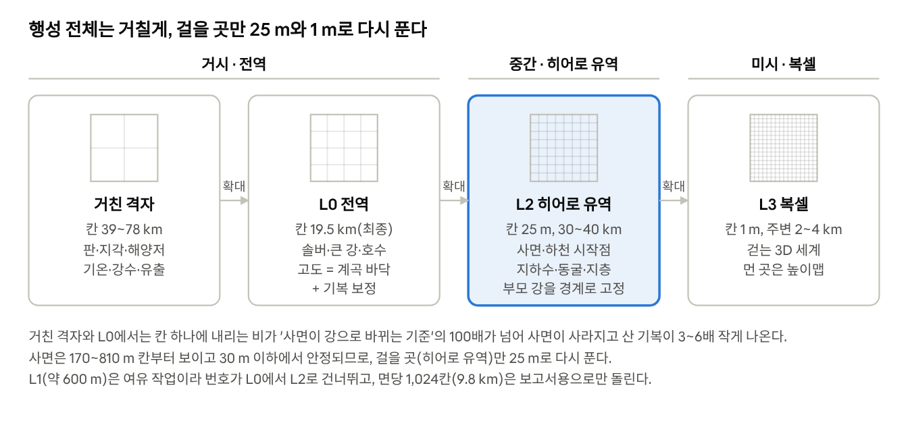
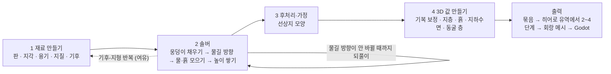
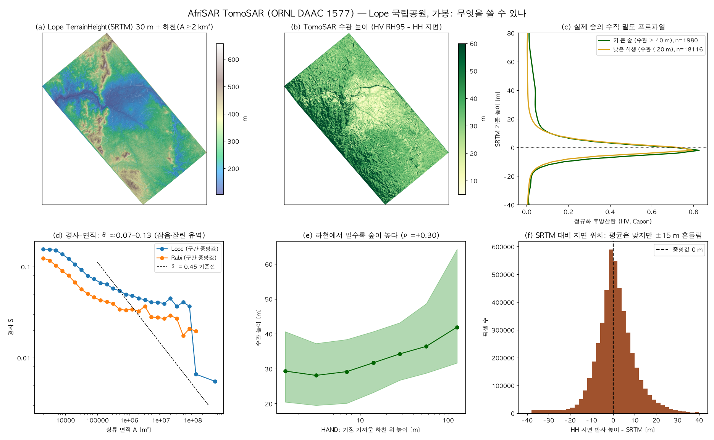

> 2026-10-08부터 저장소의 이 파일이 설계도의 원본입니다. Claude 문서의 설계도 탭은 2026-10-08까지의 보관본이고(2026-10-02에 이 파일로 처음 내보냄), 더 고치지 않습니다.

# B-PCG 설계도: 지구 크기 행성 생성기

Oct 2, 2026 · @millstone

> 이 문서는 B-PCG를 무엇으로, 왜 이렇게 만들기로 했는지 적은 확정 설계입니다. 판이 땅을 밀어 올리고 비가 강이 되어 산을 깎으면, 그 산을 이룬 암석과 물이 그대로 땅속이 됩니다. 같은 계산에 진짜 지구 자료를 넣어, 만든 행성이 얼마나 지구다운지 점수를 매깁니다. 할 일이 쓸 수 있는 시간의 두 배 가까이 되어, 점검 날짜마다 안 되면 쓸 대체안을 정해 두었습니다.

**이 문서 읽는 법.**

- 이 문서에는 지금 확정된 설계만 있습니다. 결정이 바뀌어 온 과정(질문 순서, 비평, 버린 안)은 [결정 기록](decision_log.md)에 대화 순서대로 있습니다. 두 문서가 다르면 이 문서가 맞습니다.
- 시행착오의 요점은 부록 A에 모았습니다.
- '가이드 N장'은 맨 처음 설계 문서 [planet_guide.md](../guide/planet_guide.md)(약 1,100줄)의 장입니다. 그냥 'N장'은 이 문서의 장입니다.
- 가이드는 8장입니다: 1 큐브스피어 격자, 2 물길 계산, 3 실제 지형에서 규칙 배우기, 4 정상상태 솔버, 5 행성 재료(판·융기·비·바다·노이즈), 6 파생 지도(호수, 강 폭과 깊이, 지하수면, 지층 기준면, 퇴적물), 7 3D 샘플 함수(지층·동굴·물 규칙), 8 Godot 엔진.
- 일은 네 등급으로 나눕니다. **꼭 할 일**은 일정 안에 반드시 끝낼 일입니다. **여유 작업**은 정해진 점검(대개 11/11)을 통과했을 때만 하는 일입니다. **나중에**는 지금 일정에 넣지 않고 미룬 일입니다. **뺌**은 하지 않기로 한 일입니다.
- 처음 보는 말은 2장 표와 부록 B에 있습니다. 프로젝트 전체의 말은 [용어집](../glossary.md)에 있습니다.

## 1. 한 장 청사진

**한 문장.** 판·비·강이 산을 만들고, 그 산을 만든 바로 그 암석과 물이 땅속이 된다. 그리고 같은 코드에 진짜 지구를 넣어 얼마나 지구다운지 점수를 매긴다.

중간 피치에서 이 문장을 씁니다(9장). 아래 표는 확정한 것을 항목마다 한 줄로 모읍니다.

| 항목 | 확정한 것 | 자세히 |
| --- | --- | --- |
| 무엇을 만드나 | 지구 크기 행성 하나를 통째로 만들고, 그 가운데 강 유역 하나를 걸어 다니는 3D 세계로 보여 주는 생성기입니다. GitHub에 오픈소스로 공개합니다 | 3장 |
| 행성 크기 | 지구 반지름 6,371 km(서울–부산 직선거리의 약 20배), 지구 밀도와 자전. 중력은 반지름과 밀도에서 계산합니다 | 3장 |
| 세 스케일 | 같은 땅을 세 가지 배율로 풉니다. 거시는 행성 전체입니다. 판·기후를 빨리 푸는 계산용 거친 격자(칸 39\~78 km)와 행성 기본 지도(L0, 칸 19.5 km)가 있습니다. 중간은 걸어 다닐 강 유역 하나를 25 m 칸으로 다시 푼 땅(히어로 유역 L2)입니다. 미시는 발밑의 3D 블록 세계(복셀 L3)로, 칸이 1 m입니다 | 3장 |
| 핵심 과학 | 원인과 결과가 이어진 줄 세 개(인과 사슬)로만 설명합니다. 사슬 1 뼈대: 판 → 지각 → 해양저·융기. 사슬 2 조각: 암석·빗물 → 절벽·골짜기. 사슬 3 내부: 물길·수위 → 지하수 → 동굴. 해양저는 바다 밑바닥, 융기는 땅이 솟는 것입니다 | 4장 |
| 계산 방식 | 수천만 년을 시간 순서로 돌리지 않습니다. 솟는 만큼 깎여 더 바뀌지 않는 '다 자란 지형'(정상상태)을 바로 풉니다. 꼭 할 일 버전에서 되풀이하는 계산은 정상상태를 푸는 계산(솔버) 안의 '물길 방향 맞추기' 하나입니다 | 5장 |
| 데이터 | 진짜 지구의 지형·하천·침식률 자료로 규칙 속 숫자 두 개를 맞춥니다. 같은 물의 양에서 강이 얼마나 가파른지('강의 가파름' k\_s)와, 산비탈이 버티는 가장 가파른 경사(S\_crit)입니다. 강이 하류로 갈수록 완만해지는 정도(θ)는 유역마다 재서 분포로 보고하고, 생성기는 0.45로 고정합니다. 결과는 진짜 지구의 육지·해저 높이 지도(ETOPO)로 잽니다. 딥러닝은 쓰지 않습니다 | 6장 |
| 내세우는 것 | 부품을 엮는 방식과 그 결과를 재는 방식입니다. 구 위의 정상상태, 땅 위와 땅속의 일관성, 진짜 지구와 같은 잣대, 칸마다 높이를 적은 실제 지도(DEM)로 잰 규칙, 걷는 크기까지 같은 법칙 | 7장 |
| 만드는 방식 | 히어로 유역을 평면에서 먼저 만듭니다. 3D는 미리 구워 Godot은 보여 주기만 합니다. 굽는다는 것은 엔진이 읽을 파일을 미리 만들어 두는 일입니다. (2026-10-03부터 생성기는 C#이고, 엔진 처음 화면도 같은 C# 생성기를 불러 행성을 만들고 굽습니다. [conventions.md](../conventions.md) 12절, [csharp_port.md](../csharp_port.md) 0장) 땅을 파는 기능 대신, 땅을 칼로 자른 듯 단면을 보여 주는 단면 칼을 씁니다 | 8장 |
| 큰 날짜 | 10/3 멘토 미팅 · 10/14 재계획 · 10/23 중간 피치(중간 발표) · 11/11 꼭 할 일 기능 동결 · 11/18 데모 동결 · 12/4·12/11 최종 데모 · 12/18 보고서·매뉴얼·GitHub 공개. 동결은 그 범위에 새 기능을 더 넣지 않는다는 뜻입니다(예외는 8장) | 8장 |

*그림 '청사진 · 사슬 3개 × 스케일 3개'는 Claude 문서 보관본에 있습니다.*

이 그림은 사슬 3개를 세로로, 스케일 3개를 가로로 놓은 아홉 칸입니다. 위에서 아래로 읽으면 원인에서 결과로(사슬), 왼쪽에서 오른쪽으로 읽으면 행성 전체에서 발밑으로(스케일) 갑니다. 칸마다 들어가는 내용은 4장 사슬별 표의 '스케일' 줄에 있습니다.

- 이 문서의 모든 지구과학 기능은 아홉 칸 가운데 하나에 들어갑니다. 들어가지 않는 지구과학 기능은 4장 끝의 '사슬 밖'에 따로 둡니다.
- 격자·물길·엔진 같은 공통 뼈대는 어느 한 칸에 넣지 않습니다.
- 엔진과 연출은 세 사슬의 결과를 보여 주는 창이라 8·9장에 둡니다. 단면 칼, 궤도에서 발밑까지 세 번에 나눠 내려가는 연출(3단 연출 하강), 절벽을 누르면 그 절벽이 왜 거기 있는지 알려 주는 '왜 여기?' 렌즈가 여기에 듭니다.
- 진짜 지구 자료를 같은 계산에 넣은 잣대(지구 기준선), 비교용 가짜 행성(대조군), 결과를 재는 항목 표(점수표)는 세 사슬을 재는 도구라 7장에 둡니다.

## 2. 현상으로 먼저 이해하기

이 문서의 용어는 먼저 '화면에서 무엇이 보이나'로 설명하고, 이름과 기호는 그 뒤에 붙입니다. 여기 없는 말은 부록 B에 있습니다.

**가장 중요한 생각: 다 자란 지형을 바로 푼다.**

실제 산맥은 수천만 년 동안 솟고 깎이며 자랍니다. 이 시간을 한 걸음씩 계산하면 느립니다(7장 '빈틈의 증거').

그런데 오래 자란 산맥은 어느 때부터 모양이 더 바뀌지 않습니다. 땅이 솟는 만큼 강과 비탈이 깎아 내기 때문입니다.

그럼 그 시간을 다 돌려야 할까요? 아닙니다. 처음부터 '다 자란 산맥'의 모양만 구합니다. 바다에서 출발해 상류로 한 칸씩 올라가며, 솟는 속도와 깎이는 속도가 같아지는 경사로 높이를 쌓습니다.

이렇게 더 바뀌지 않는 상태를 정상상태라고 부르고, 그것을 구하는 계산을 정상상태 솔버라고 부릅니다(5장). 예를 들어 땅이 1년에 1 mm 솟는 곳이면, 그 칸의 강은 1년에 정확히 1 mm를 깎는 경사가 됩니다.

높이를 쌓는 식은 아래 표 첫 줄에 있습니다. 숫자를 넣어 보면, 아래쪽 이웃 칸이 해발 100 m, 두 칸 사이 거리가 25 m, 경사가 0.04일 때 이 칸의 높이는 100 + 25 × 0.04 = 101 m입니다.

| 화면에서 보이는 것 | 우리가 부르는 이름 | 기호·스펙 |
| --- | --- | --- |
| 수천만 년 동안 솟고 깎이다가 더는 모양이 변하지 않게 된 산맥. 이 '다 자란 산맥'을 시간을 돌리지 않고 수십\~백수십 번의 되풀이 계산으로 바로 구합니다(5장) | 정상상태 솔버 | 솟는 속도 = 깎이는 속도가 되는 고정점(되풀이해도 더 바뀌지 않는 답). 바다에서 상류로 칸마다 z = z\_r + d·S로 높이를 쌓습니다. z는 이 칸의 높이(m), z\_r은 물이 흘러 내려가는 아래쪽 이웃 칸의 높이(m), d는 두 칸 사이 거리(m), S는 그 사이 경사입니다. S는 하천 경사(k\_s·Q^−θ, Q는 이 칸을 1년에 지나는 물의 양, m³/yr)와 사면(산비탈) 경사를 조화 평균한 뒤, 암석별 S\_crit로 자른 값입니다. 조화 평균은 두 값 가운데 작은 쪽에 가깝게 섞는 평균입니다. 퇴적·암석 강도도 이 경사에 들어갑니다. 가이드 4장의 원래 식 S = min(k\_s·Q^−θ, S\_crit)을 이렇게 바꿉니다 |
| 강이 산 위에서는 가파르고 바다로 갈수록 완만해지는 휘어진 곡선 | 오목도 | θ. 지구에서 보통 0.3\~0.7, 생성기 기본값 0.45. 물의 양이 10배 늘면 하천 경사는 10^(−0.45) ≈ 0.35배, 약 3분의 1이 됩니다 |
| 같은 크기의 강이라도 빨리 솟는 땅에서는 더 가파릅니다 | 강 가파름 | k\_s. 유역끼리 비교할 때는 θ를 0.45로 고정해 잰 k\_sn을 씁니다. 모든 유역을 같은 θ로 재므로 바로 견줄 수 있습니다 |
| 흙과 돌이 무너지지 않고 버티는 가장 가파른 산비탈(사면) | 임계 경사 | S\_crit ≈ 0.6(약 30도). 10 m 가는 동안 6 m 오르는 비탈입니다 |
| 단단한 암석은 절벽과 평평한 꼭대기(메사·케스타)로, 무른 암석은 완만한 비탈로 남습니다 | 암석 강도와 층 경계별 적분 | 암석별 침식 계수 K(클수록 잘 깎임). 솔버가 높이를 쌓다가 지층 경계를 넘으면, 그 층 암석의 경사로 바꿔 이어 쌓습니다(층 경계에서 나눠 계산) |
| 산에서 나온 강이 평지에 닿으면 실어 오던 흙을 내려놓아, 강을 따라 경사가 완만한 띠(산 앞 평야, 범람원)가 생깁니다 | 퇴적(G-법칙) | 운반하던 흙의 일부를 내려놓는 규칙(Yuan 2019). 부채꼴 선상지 모양은 D8(물을 가장 가파른 이웃 한 칸으로만 보내는 규칙)로는 생기지 않아, 솔버가 끝난 뒤 덧붙입니다(후처리) |
| 두꺼운 대륙은 높이 뜨고, 얇은 바다 바닥은 낮게 가라앉습니다 | 지각평형 | Airy 지각평형. 물에 뜬 얼음처럼 두꺼운 지각이 더 높이 뜬다는 원리입니다. 대륙에서 바다로 넘어가는 띠(대륙-해양 전이)에만 씁니다 |
| 대양 한가운데는 비교적 얕고(판이 갈라지며 새 바닥이 생기는 해저 산맥, 해령), 거기서 멀어질수록 바다가 깊어집니다 | 해양저 나이-수심 | Parsons & Sclater 1977, 해령 꼭대기 약 −2.5 km |
| 깎여 나간 만큼 더 깊은 곳에서 생긴 암석이 땅 위로 드러납니다 | 깎인 두께(노출 깊이) | 누적 융기(그동안 솟은 높이의 합). 25\~35 km에서 자릅니다 |
| 산맥 한가운데와 깊은 협곡 벽 아래쪽에서, 깊이 묻혔다가 드러난 변성암(편암·편마암·대리암)이 보입니다 | 변성 정도 | 깎인 두께와 지온 경사(땅속으로 들어갈수록 오르는 온도, 기본 30 °C/km)로 최고 온도를 정합니다. 그 온도에서 원래 암석을 바꾸는 표를 찾아봅니다(셰일 → 점판암 → 편암 → 편마암, 석회암 → 대리암, 사암 → 규암). 되풀이 없이 한 번에 답이 나오는 공식(닫힌 식)입니다. 예: 25 km 깊이에 묻혔던 암석은 지표보다 25 × 30 = 750 °C 더 뜨거웠던 것으로 봅니다 |
| 우물을 파면 물이 차오르는 높이. 강·호수 가까이에서는 수면과 같아지고, 그보다 낮은 동굴은 물에 잠깁니다 | 지하수면 | 비, 암석에 물이 스미는 정도(투수성), 강 높이로 정하는 닫힌 식 |
| 골짜기 벽에 같은 높이로 줄지어 난 동굴 입구들. 아래층은 물에 잠기고 위층은 말라 있습니다 | 동굴 층 | 옛 강 높이 = 지금 강 수면 + 하각 비율 f\_k × 골짜기 깊이. 하각 비율은 강이 파 내려간 골짜기 깊이 가운데 옛 강이 머문 높이의 몫(0과 1 사이)입니다. 동굴 층이 옛 강 높이에 생긴다는 관찰은 Audra & Palmer 2011이고, f\_k로 높이를 정하는 것은 우리 가정입니다 |
| 궤도에서 보는 L0 지도(칸 19.5 km)의 높이는 골짜기 바닥이고, 능선 높이는 계산으로 더합니다 | 골짜기 바닥 높이 + 기복 보정 | L0 칸 하나 안에 숨은 능선과 골짜기의 높이 차(아격자 기복)를 하천·산비탈 경사 법칙의 공식으로 계산해 더합니다 |
| 강 모래 속에 우주에서 온 입자가 만든 원소의 양으로 잰 '이 유역은 천 년에 몇 mm 깎이나'. 정상상태에서는 깎이는 속도 = 솟는 속도라서, 이 값으로 행성의 융기를 실제 단위(m/Myr)로 맞춥니다 | 침식률(10Be) | E = K·k\_sn^n. E는 침식률(m/Myr), K는 암석별 침식 계수, n은 경사 지수(아래 '숫자와 이름 읽는 법')입니다 |
| 경사를 칸마다 재지 않고 강을 따라 쌓아서 비교하는 방법. 높이 잡음에 강합니다 | χ 분석 | 면적 대신 물의 양으로 바꾼 χQ를 씁니다(6장) |

**숫자와 이름 읽는 법.**

- 경사는 '높이 차 ÷ 수평 거리'입니다. 0.04는 100 m 갈 때 4 m 내려간다는 뜻입니다. 30도는 약 0.58, 0.39는 약 21도입니다.
- n은 두 가지 뜻으로 씁니다. 격자에서는 큐브스피어(정육면체 여섯 면을 바둑판으로 나눠 공처럼 부풀린 격자) 한 면의 한 변 칸 수입니다. 본문에서는 '면당 512칸'처럼 풀어 쓰고, 코드 표기를 옮긴 부록 A-6에서만 n을 그대로 씁니다.
- 침식 법칙 E = K·k\_sn^n의 n은 '침식 속도가 가파름의 몇 제곱에 비례하나'를 나타내는 경사 지수입니다(보통 1\~2.3).
- m/Myr는 백만 년에 몇 m라는 뜻입니다. 2 m/Myr는 천 년에 2 mm입니다. mm/yr는 1년에 몇 mm이고, 1 mm/yr = 1,000 m/Myr입니다.
- 그래서 데모 예시의 융기 0.8 mm/yr는 800 m/Myr입니다. 크라톤(수억 년 동안 거의 솟지도 깎이지도 않은 대륙 한가운데의 땅)의 기본 깎임 2\~10 m/Myr는 0.002\~0.01 mm/yr입니다.
- 1e-3은 천분의 일, 1e-6은 백만분의 일입니다.
- 인주는 한 사람이 한 주에 하는 일의 양이고, 이 프로젝트에서는 20시간입니다.
- '단계'는 5장의 계산 흐름(1\~4단계)에만 씁니다. 해상도는 '스케일'과 L 번호(L0·L2·L3)로, 4장의 인과 사슬은 '사슬 1·2·3'으로 부릅니다. 동그라미 번호(①\~⑦)는 6장 그림의 칸 번호입니다.

## 3. 세 스케일: 거시 → 중간 → 미시

행성 전체를 1 m로 풀 수는 없습니다. 면당 4,096칸만 돼도 작업 메모리가 8\~12 GB로 노트북 한계를 넘습니다(부록 A-4). 그래서 넓은 곳은 거칠게 풀고, 걸을 곳만 같은 법칙으로 다시 자세히 풉니다. 이 문서의 모든 기능은 아래 세 스케일 가운데 한 곳에 속합니다.



| 스케일 | 크기 | 계산하는 것 | 플레이어가 보는 것 |
| --- | --- | --- | --- |
| 거시(전역) | 거친 격자: 면당 128\~256칸, 칸 39\~78 km(78 km는 제주도 동서 길이 73 km보다 조금 김). L0: 면당 512칸, 칸 19.5 km(서울 남북 길이 30 km의 3분의 2), 157만 칸 | 거친 격자에서 판·지각·해양저 나이·기온·강수·유출(비 가운데 강으로 흘러가는 몫). L0에서 물길, 정상상태 솔버, 큰 강과 호수, 골짜기 바닥 높이 + 기복 보정 | 궤도에서 본 대륙과 해령, 사막 띠, 큰 강 |
| 중간(히어로 유역) | L2: 30\~40 km 유역 하나(서울 남북·동서 길이 30\~37 km 안팎), 칸 25 m(25 m 수영장 레인 하나), 150\~250만 칸 | L0의 강 높이·들어오는 물·융기를 경계로 고정하고 같은 법칙을 다시 풉니다. 거칠게 푼 결과를 경계로 삼아 작은 칸으로 다시 푸는 이 일을 정밀화라고 부릅니다. 사면, 하천 시작점(흩어져 흐르던 빗물이 처음으로 뚜렷한 물길이 되는 자리), 퇴적, 드러난 지층, 흙, 지하수면, 동굴 층 | 착륙 직전의 골짜기, 범람원, 선상지, 협곡 |
| 미시(복셀) | L3: 칸 1 m. 꼭 할 일 버전은 파이썬에서 미리 구운 데모 회랑(걸어 다닐 띠 모양 땅, 폭 1 km × 길이 6\~8 km, 여의도 넓이의 약 2\~2.8배)뿐입니다. 플레이어 주변 2\~4 km를 즉석에서 만드는 런타임 복셀은 10/21 시험을 통과할 때만 하는 여유 작업입니다 | 파이썬 3D 함수가 지층·동굴·물을 메시(3D 모양 파일)로 굽고, 먼 곳은 25 m 높이맵(칸마다 높이를 적은 격자)으로 채웁니다. 여유 작업인 식생이 들어가면 숲 복셀도 함께 굽습니다 | 걸어 다니는 3D 세계, 단면 칼로 자른 지층·동굴·지하수면 |

- 거친 격자는 판과 기후를 빨리 풀기 위한 계산용 격자라서 L 번호를 붙이지 않습니다.
- L1(약 600 m, 대륙 크기 줌)은 여유 작업이라 번호가 L0에서 L2로 건너뜁니다.
- 면당 1,024칸(9.8 km, 629만 칸)은 실습실 PC에서 보고서용으로만 돌립니다.
- 판·기후 무늬는 대부분 30\~500 km로 커서 거친 격자에서 풀어도 됩니다. 다만 해구처럼 좁은 단면은 39\~78 km 칸에서 뭉개집니다. 그래서 거친 격자에서는 '경계까지 거리'와 '나이' 같은 매끄러운 값만 만들고, 좁은 단면 모양은 L0에서 계산합니다.
- 히어로 유역의 가벼운 버전은 출구 높이와 들어오는 물만 고정합니다. 부모 격자와 만나는 이음매 띠는 안개로 가립니다.

**왜 지구 크기인가.**

- 대기 순환, 판 구조, 기후 띠가 지구처럼 작동하려면 지구 크기가 필요합니다. 더 작은 행성을 버린 이유는 부록 A-1에 있습니다.
- 지구 크기여야 진짜 지구 데이터(ETOPO, 기후, 하천)를 같은 코드에 넣어 비교할 수 있습니다. 이것이 모든 검증의 뼈대입니다.

**왜 중간 스케일이 꼭 필요한가.**

행성 지도의 칸은 산비탈을 담기에 너무 큽니다. 칸이 크면 칸 하나에 내리는 빗물만으로 이미 강이 됩니다.

면당 1,024칸(칸 9.8 km)에서도 칸 하나에 내리는 비는 8.1×10⁷ m³/년입니다. 산비탈이 강으로 바뀌는 기준은 2.8×10⁴\~6.6×10⁵ m³/년입니다. 칸 하나의 비가 이미 기준의 약 120\~2,900배입니다. 그래서 모든 칸이 처음부터 강이고, 산비탈 한계(S\_crit)가 작동하지 않습니다.

산의 높낮이도 작게 나옵니다. 강 원류는 하류보다 150\~630 m 높을 뿐인데, 같은 칸 안의 능선과 골짜기 높이 차(기복)를 식으로 계산하면 0.92\~2.81 km입니다. 산 기복이 3\~6배 작게 나오는 것입니다. L0인 면당 512칸에서는 160\~670 m 대 1.08\~3.46 km입니다.

그럼 칸이 얼마나 작아야 산비탈이 보일까요? 사면은 칸 170\~810 m부터 보이고, 사면 길이와 기복은 30 m에서도 잴 수 있습니다(Grieve 2016). 다만 비탈이 휜 정도(곡률) 지표는 이 해상도에서 왜곡되므로, 25 m 능선 곡률은 내부 테스트로만 씁니다.

그래서 걸을 곳만 25 m로 다시 풉니다. 같은 이유로 L0(칸 19.5 km)의 높이는 평균 지표가 아니라 '골짜기 바닥'으로 읽고, 능선은 기복 보정으로 더합니다.

**비용.** 정밀화 비용은 세 가지 단순화로 마련합니다(버린 안은 부록 A-1).

- 물길은 D8 + 노드 흔들기로 계산합니다(약 1인주 절약). 노드 흔들기는 칸 중심을 조금씩 옮겨 강이 격자 방향으로 줄 서지 않게 하는 요령입니다.
- 복셀은 히어로 유역에만 만듭니다(약 2인주 절약).
- L0 칸 안의 작은 기복은 직접 그리지 않고 공식으로 보정합니다.

## 4. 인과 사슬 3개

이 문서의 모든 지구과학 기능은 아래 세 사슬 가운데 하나에 속합니다. 위 사슬의 결과가 아래 사슬의 원인이 됩니다. 어느 사슬에도 들지 않는 지구과학 기능은 이 장 끝의 '사슬 밖'에 따로 둡니다.

세 사슬은 모두 꼭 할 일입니다. 하나씩 끝까지(보이는 것과 확인 방법까지) 완성합니다.

```
[사슬 1: 뼈대] 판이 벌어지고 부딪히고 밑으로 들어감
               → 지각 두께 · 바다 깊이 · 땅이 솟는 속도(융기 U)        거시
                        ↓ 융기 U, 깎인 두께
[사슬 2: 조각] 솟은 땅 + 암석 강도 + 빗물
               → 단단한 층은 절벽, 무른 층은 완만한 골짜기, 흙은 평지에   거시 → 중간
                        ↓ 물길 · 수위 · 드러난 암석
[사슬 3: 내부] 강·호수 수면 + 비 + 암석의 물 빠짐
               → 지하수면 → 녹는 암석 안의 층층 동굴                 중간 → 미시
```

**표 읽는 법.**

- '자동 테스트'는 코드가 규칙을 어기지 않았는지 보는 검사입니다.
- '지구다움 근거'는 입력에 없던 성질이 결과로 나온 지표(창발, emergent)입니다. 지구와 견줘 '지구답다'고 말할 근거는 이것뿐입니다.
- 입력으로 정한 값이 그대로 나오는 지표(강제, forced)는 근거로 세지 않습니다. 코드가 망가지지 않았는지만 보는 검사(회귀 테스트)로 씁니다.
- '반쯤 입력'은 입력으로 거의 정해지는 지표입니다. 이것도 근거로 세지 않습니다.
- '일정을 막는 검사'는 통과해야 일정이 진행되는 검사입니다. 나머지 지표는 보고만 합니다(7장 '평가 체계').
- '계획 비용(보정 전)'은 학부 팀 보정 1.5\~1.8배를 곱하기 전의 인주입니다(8장 '예산 규칙').

### 사슬 1: 뼈대 (판 → 지각 → 해양저·융기)

| 항목 | 내용 |
| --- | --- |
| 원인 → 결과 | 판이 벌어지고 부딪히고 밑으로 들어갑니다 → 지각 두께, 바다 깊이, 땅이 솟는 속도(융기 U)가 정해집니다 |
| 넣는 지구과학 | 지각 종류·두께와 지각평형(대륙-해양 전이에만). 해양저 나이 → 수심(Parsons & Sclater). 바다 판이 다른 판 밑으로 들어가는 것(섭입)의 방향과 비대칭 단면(해구·화산호 위치). 해구는 판이 들어가는 자리의 깊고 좁은 바다 골짜기이고, 화산호는 그 뒤에 활 모양으로 줄지은 화산 띠입니다. 실제 속도 단위로 정한 융기·침강(예: 0.8 mm/yr). 크라톤에는 기본 깎임 2\~10 m/Myr를 주고, 누적 융기는 25\~35 km에서 자릅니다 |
| 스케일 | 거시: 거친 격자에서 판·나이·경계까지 거리, L0에서 해구 단면. 중간: 히어로 유역이 융기 U와 출구 높이를 경계로 받음 |
| 보이는 것 | 대륙붕 띠(대륙 가장자리의 얕은 바다), 대양 한가운데 해령, 안데스형 해안 산맥과 해구, 반대편의 넓고 조용한 대륙붕 |
| 자동 테스트 | 바다 물 부피 보존. 고도 분포의 두 봉우리(대륙·해양)를 ETOPO와 비교합니다. 이 검사는 일정을 막는 검사지만 '반쯤 입력'이라 지구다움 근거로는 세지 않습니다. 해령 꼭대기 −2.5 km는 식에 넣은 상수가 그대로 나오는 값이라 회귀 테스트로만 씁니다 |
| 지구다움 근거(결과로 나온 것) | 물 부피 보존으로 정한 해수면에서 나오는 바다 비율과 대륙붕 넓이. 판 요소만 끈 행성에서 이 모양이 사라지는지(요소 끄기). 단, 바다로 나간 퇴적물이 대륙붕에 쌓이는 과정이 없습니다. 그래서 대륙붕 넓이와 수심(100\~250 m)은 지각평형 경사로 흉내 낸 값이라는 단서를 답니다 |
| 계획 비용(보정 전) | 지각·지각평형·해양저 나이 1.25인주, 섭입 방향·물리 단위 융기 1.25인주 |

### 사슬 2: 조각 (암석·빗물 → 절벽·골짜기)

| 항목 | 내용 |
| --- | --- |
| 원인 → 결과 | 솟은 땅을 빗물이 깎는데, 암석마다 깎이는 속도가 다릅니다 → 단단한 층은 절벽, 무른 층은 완만한 비탈로 남고, 깎인 흙은 평지에 쌓입니다 |
| 넣는 지구과학 | 하나의 3D 지질 모델. 지층이 쌓인 순서는 템플릿 3종입니다: 탄산염(석회암) 탁상지(지층이 거의 수평으로 깔린 땅), 탄산염 층을 넣은 습곡충상대(지층이 구겨지고 겹쳐 밀려 올라간 산지, 자그로스·쥐라·캐나다 로키형), 기반암 + 화산호. 깎인 두께로 정한 변성 정도(표 조회), 솔버의 층 경계별 적분, 퇴적 G-법칙, 흙 두께(상한 있음). 입력 기후는 가벼운 버전입니다: 위도 띠로 정한 강수, Budyko 유출(건조할수록 비 가운데 강으로 가는 몫이 줄어드는 관계), 위도·고도로 정한 기온 |
| 스케일 | 거시: L0 솔버가 큰 강과 골짜기 바닥을 만듦. 중간: 같은 법칙을 25 m로 다시 풀어 사면·하천 시작점·범람원이 생기고, 선상지 모양은 후처리로 얹음(정상상태 아님). 미시: 단면 칼에 지층 절벽, 흙과 맨 암반이 보임 |
| 보이는 것 | 협곡 벽의 단단한 절벽과 무른 사면 계단, 메사, 범람원, 선상지, 흙과 맨 암반, 산맥 한가운데의 변성암 |
| 자동 테스트 | '경사를 만든 암석 = 보이는 암석' 100%. 손으로 푼 정확한 답(2층 해석해)과의 오차 1e-3. 퇴적물·물 수지(들어오고 나간 양의 차) 1e-6. 만든 지형에서 χ로 되찾은 θ가 입력(0.45)으로 다시 나오는지(회귀 테스트) |
| 지구다움 근거 | Hack 법칙(강 길이가 유역 넓이의 약 0.5제곱에 비례), 평탄지 비율. 드러난 암석 비율은 세계 암석 지도(GLiM)와 ±10%p 안인지 봅니다. 다만 지질 템플릿 면적으로 거의 정해지므로 '반쯤 입력'이라고 표시합니다 |
| 계획 비용(보정 전) | 3D 지질 모델 1.5, 퇴적 G-법칙 1.0, 흙 두께 0.25, L0 높이를 골짜기 바닥으로 읽기와 기복 보정 0.75, 히어로 유역 정밀화 2.0인주. 기후 가벼운 버전(바람 이동 없음)은 10/14 재계획 때 비용을 다시 잡음 |

### 사슬 3: 내부 (물길·수위 → 지하수 → 동굴)

| 항목 | 내용 |
| --- | --- |
| 원인 → 결과 | 강·호수의 수면, 비, 암석의 물 빠짐 → 지하수면 높이가 정해집니다 → 강이 파 내려갈 때마다 그 높이에 머문 지하수가 녹는 암석을 녹여 층층이 동굴을 남깁니다 |
| 넣는 지구과학 | 암석별 투수성(Gleeson 2011)을 쓰는 지하수면 닫힌 식. 지하수를 품은 땅속 층(대수층)의 두께는 Fan 2013을 씁니다. 이 식은 Fan 2013·Haitjema 2005를 줄인 어림식이라 발표에서 '물리 모델'이라 부르지 않습니다. 하각 비율로 정한 2층 동굴. 동굴은 녹는 암석(주로 석회암 같은 탄산염 암석) 안에만 둡니다. 지하수면이 땅이나 골짜기 벽과 만나는 곳에는 동굴 입구를 반드시 둡니다(노이즈 동굴이 이어진다는 보장이 없는 약점을 메움) |
| 스케일 | 거시: 큰 강·호수 수면. 바다로 못 나가는 내륙 분지는 여유 작업인 호수 물수지(호수에 들고 나는 물의 양 맞추기)가 들어간 경우에만. 중간: 25 m 지하수면과 동굴 층 높이. 미시: 동굴 통로와 동굴 안 수면 |
| 보이는 것 | 하천 단구(강이 더 깊이 파 내려가며 골짜기 벽에 계단처럼 남은 옛 강바닥)와 같은 높이에 줄지은 동굴 입구, 물에 잠긴 아래층, 마른 위층 |
| 자동 테스트 | 동굴 ⊂ 녹는 암석 100%(동굴 칸이 모두 녹는 암석 안). 물 규칙 위반(지하수면 아래 빈 공기 등) 0건. 잠긴 동굴의 수면 = 그 자리 지하수면. 물 수지 오차 1e-3 |
| 지구다움 근거 | 지하수가 땅 겉이나 뿌리층에 닿는 땅의 비율이 지구(22\~32%, Fan 2013)와 같은 자릿수인지. 여유가 되면 드러난 탄산염 비율을 세계 카르스트 지도 WOKAM(15.2%)과 비교 |
| 첫 버전과 대안 | 첫 버전은 '녹는 암석 마스크 × 노이즈 동굴 1층'으로 먼저 끝내 엔진이 기다리지 않게 합니다. 지하수·하천 지도가 나오면 층 함수만 바꿉니다. 지하수 닫힌 식을 못 하면 '지하수면 = 가까운 강·호수 수면'으로 근사합니다(데모 회랑 안에서만, 보고서에 근사라고 적음) |
| 계획 비용(보정 전) | 지하수면 0.5, 다층 동굴 0.5인주 |

### 사슬 밖: 부가 효과

어느 사슬에도 들지 않거나 사슬을 꾸미기만 하는 지구과학 기능입니다. 세 사슬이 끝나기 전에는 시작하지 않습니다.

**여유 있으면(11/11 점검을 통과한 뒤, 이 순서로):**

1. 바람 따라 수분을 옮기는 지형성 강수와 비그늘(산이 비를 막아 반대편이 마르는 것), 정해진 바람 띠(1° 위경도 격자에서 계산해 큐브스피어로 옮김)
2. 화산호 화산 원뿔
3. 'Real or B-PCG?' 블라인드 투표
4. 설선(그보다 높으면 눈이 1년 내내 녹지 않는 높이)·빙하 마스크(반복 없음)
5. 구면조화 스펙트럼(구 위 지형을 큰 무늬부터 작은 무늬까지 나눠 본 세기)·경사 분포
6. 샘·습지·부정합(지층 사이에 깎여 나간 시간이 끼어 있는 면)
7. 중간 해상도 L1(약 600 m)과 미니 행성 검증
8. 기후별 지표 재질

그 밖에 아래 것도 여유 작업입니다.

- 닫힌 호수 물수지(바다로 못 나가는 내륙 분지, 사막의 소금 호수)
- 기후-지형 반복(최대 6회)
- 식생: 강에서 얼마나 높은지·경사·강수에 따라 숲과 사바나, 나무 높이, 숲의 층 구조 5유형이 바뀝니다. 초기값은 가봉 AfriSAR에서 잡되 라이다로 다시 맞추기 전에는 확정하지 않습니다(부록 A-2).
- 자전 주기만 바꾼 행성 2\~3개(궤도 텍스처 교체)
- 런타임 복셀·파기(10/21 시험을 통과할 때만)

**나중에:**

- 열점 화산 사슬(판이 땅속 뜨거운 곳 위를 지나가며 줄지어 생긴 화산, 하와이형)
- 빙하 침식(반복 필요)
- 열곡(대륙이 갈라지며 꺼진 골짜기)·크라톤 나이
- 사금·반암동 광상(금·구리가 모인 광물 자원)
- 카르스트와 지하수 고급판(사라지는 강, 지하수와 강의 물 교환)
- 내륙 분지를 따로 가라앉히는 후처리
- 굽힘 지각평형: 산맥·화산섬 무게에 판이 휘어 생기는 산 앞 평야(전륙분지)와 해구 바깥 융기
- 퇴적층 순서·해안·계절

**뺌:**

- 시간에 따라 움직이는 판
- 변환단층(판이 엇갈려 미끄러지는 경계) 어긋남
- 피오르·U자곡·권곡(빙하가 판 골짜기 지형)
- 삼각주
- 적응형 MFD 솔버(물을 낮은 이웃 여럿에 나눠 보내는 방식)
- 행성 전체 복셀
- 중간 크기·소행성 데모
- 신경망 업샘플러(공개 가중치 확산 모델로 디테일 붙이기 포함)
- 사구, 해류, 몬순
- 생성기의 지역별 θ
- 파이썬-엔진 0.1 mm 일치 테스트

## 5. 구조: 모듈이 맞물리는 방식

계산은 네 단계로 흐르고, 각 단계의 결과가 다음 단계의 입력이 됩니다. 무거운 계산은 모두 생성기가 미리 하고, 엔진은 구운 결과를 불러와 보여 주기만 합니다. 2026-10-03부터 생성기는 C#(`src/Bpcg/`)이고, 엔진 처음 화면이 이 생성기를 직접 불러 행성을 만들 수도 있습니다(이전 규칙 '엔진은 계산하지 않음'을 바꿈, [conventions.md](../conventions.md) 12절).

*그림 '구현 구조 · 4단계 + 출력, 꼭 할 일 버전의 반복은 1개(점선은 여유 작업)'는 Claude 문서 보관본에 있습니다. 같은 흐름을 아래에 줄여 그립니다.*



| 단계 | 하는 일 | 어느 스케일 |
| --- | --- | --- |
| 1. 재료 만들기 | 반복 없이 공식 한 번으로 나오는 값: 판, 지각, 해양저 나이, 섭입 방향과 융기 U, 3D 지질 모델, 기온, 위도 띠 강수, Budyko 유출 | 거시(거친 격자) |
| 2. 솔버 | 웅덩이 채우기(물이 갇히는 우묵한 곳을 메움) → 물 흐를 방향(D8 + 노드 흔들기) → 유량 Q(1년에 지나는 물의 양)·퇴적물 Qs(1년에 지나는 흙의 양) → 정상상태 솔버. 경사는 하천 경사와 사면 경사를 조화 평균하고 암석별 S\_crit로 자른 값입니다. 퇴적·암석 강도·사면 확산(흙이 아주 천천히 흘러내려 능선을 둥글게 만드는 과정)은 이 경사 법칙의 항목으로 끼웁니다 | 거시(L0), 중간(L2에서 다시) |
| 3. 후처리·가정 | 솔버 뒤에 지형을 고치는 것(선상지 모양). 여유 작업인 닫힌 호수 물수지와 화산 원뿔도 여기에 듭니다. 고친 곳에는 '정상상태 아님' 표시를 달고 물길만 다시 계산합니다 | 거시(L0), 중간(L2에서 다시: 선상지 모양) |
| 4. 3D 값 만들기 | 기복 보정, 깎인 두께와 드러나는 지층·변성 정도, 흙 두께, 지하수면, 동굴 층, 물 규칙(바다·호수·강·동굴) | 거시(L0), 중간(L2에서 다시) |
| 출력 | 지도 묶음(목차 manifest + 지도마다 필드 파일) → 히어로 유역에서 2\~4단계(솔버, 후처리, 3D 값)를 25 m로 다시 → 파이썬 3D 함수로 회랑 메시(glTF, 3D 모양 파일 형식) 굽기 → Godot | 중간 → 미시 |

**새 요소를 끼우는 틀은 네 가지뿐입니다.** 새 지구과학 요소는 넷 가운데 하나로만 들어옵니다: 1단계 재료(닫힌 식), 2단계 경사 법칙의 항목(솔버 안), 3단계 후처리, 4단계 3D용 값.

- 모든 지도는 하나의 묶음에 들어가고, 판·지질·기후·지표·물·땅속 그룹으로 나뉩니다.
- 물길·솔버·호수·지하수 코드는 '점과 이웃 목록'(일반 그래프) 위에 짭니다. 그래서 큐브스피어와 평면 히어로가 같은 코드를 씁니다.

**반복은 하나입니다.** 꼭 할 일 버전에서 실제로 도는 반복은 솔버 안의 '물길 방향 맞추기' 하나입니다.

솔버가 지형을 바꾸면 물이 흐르는 방향이 바뀔 수 있습니다. 그래서 방향이 더 바뀌지 않을 때까지 물길과 솔버를 번갈아 돌립니다.

- **멈추는 조건.** '방향 변화 0 그리고 고도 변화 0.1 m 미만'입니다. 상한 횟수는 설정값으로 둡니다.
- **반복 수는 해상도에 따라 늘어납니다.** Tzathas 2024에서 512²에 43회, 1,024²에 82회, 2,048²에 156회였습니다. 가이드의 50회는 L0에는 맞지만, 한 변이 1,200\~1,600칸인 히어로 유역에는 모자랄 수 있습니다. 거친 격자에서 먼저 풀고 고운 격자로 내려가는 방법(멀티그리드)은 쓰지 않으므로, 실제 반복 수와 시간을 재서 기록합니다.
- **진동 막기.** 두 이웃의 경사가 거의 같은 칸은 반복마다 방향이 이쪽저쪽 뒤집힐 수 있습니다. 그래서 '확실히 더 가파를 때만 방향을 바꾼다'(히스테리시스)를 둡니다. 지금 설정(`hysteresis_eta = 0.02`)에서는 새 이웃이 2% 넘게 더 가파를 때만 바꿉니다. 지금 이웃의 경사가 0.100이면 새 이웃은 0.102를 넘어야 합니다.
- **거리.** 8방향 격자 거리 대신 구 위의 실제 거리(대원 거리)로 잽니다. 격자 거리로 재면 같은 거리의 점들이 원이 아니라 팔각형을 이루고(등거리선이 팔각형), 그 모양이 면 경계에서 이음새 흔적을 다시 만듭니다.
- **정밀도.** 웅덩이를 채운 높이는 float64로 둡니다. float32면 0.001 m 기울기가 사라져 가짜 웅덩이가 생깁니다.
- **기후-지형 바깥 반복.** 최대 6회, 강수를 절반씩 섞는 반복입니다. 여유 작업이라 11/11 점검을 통과한 뒤에만 켭니다. 그전에는 지형에서 비로 한 방향만 갑니다.

**동굴·지하수·흙이 반복 밖에 있는 이유.**

- 반복 고리에는 '지표 모양이 바뀌면 다시 계산해야 하는 것'만 넣습니다. 동굴·지하수·흙은 지형을 읽기만 하고 바꾸지 않습니다. 그래서 반복이 끝난 지형을 보고 4단계(3D 값 만들기)에서 한 번에 만들어도 답이 같습니다.
- 반복 안에서 쓰는 땅속 정보는 지질 모델 하나뿐입니다. 지층 높이는 최종 지형이 아니라 누적 융기로 정해지므로, 1단계(재료 만들기)에서 미리 만들어 둡니다. 솔버는 '단단한 층은 가파르게'로 읽기만 합니다.
- 실제 지구에서는 땅속이 땅 위를 바꾸기도 합니다. 석회암 지대에서는 강물이 땅속으로 사라져 지표가 덜 깎이고, 지하수와 강이 물을 주고받습니다. 이 되먹임을 넣으려면 동굴·지하수를 반복 안에 넣어야 합니다. 그래서 '나중에'(카르스트와 지하수 고급판, 2.5\~3.5인주)로 미뤘습니다. 발표에서는 '땅 위에서 땅속으로, 한 방향으로 맞춘다'고 정확히 말합니다.

**동굴 층 높이는 가정으로 정합니다.**

동굴 층 높이는 정상상태에서 바로 나오지 않습니다. 정상상태 지형에는 '강이 언제 얼마나 파 내려갔나'라는 역사가 없기 때문입니다.

그래서 이렇게 가정합니다. 지금 강 수면에서 '골짜기 깊이 × 하각 비율 f\_k'만큼 올라간 높이에 옛 강이 머물렀습니다. 골짜기 깊이는 골짜기 양쪽 가장자리의 높이에서 강 수면을 뺀 값입니다. 옛 지하수면도 지금 지하수면에서 같은 만큼 위에 있었다고 봅니다.

예를 들어 f\_k가 0.35이고(지금 설정 `incision_fraction`) 골짜기 깊이가 100 m면, 위층 동굴은 지금 지하수면보다 35 m 위에 생깁니다. 맨 아래층만 지금 지하수면에 잠기고, 위층은 마릅니다.

동굴 층이 옛 강 높이에 맞춰 생긴다는 관찰은 Audra & Palmer 2011에서 왔고, 비율 f\_k는 우리가 정하는 값입니다. 이 가정 때문에 동굴 층과 하천 단구는 '정상상태 아님(물려받은 지형)'으로 표시합니다. 지표를 고치는 후처리라는 뜻은 아닙니다.

**어디까지 정상상태인가(발표용).** 아래 표는 각 기능을 계산 방식에 따라 나눕니다.

| 구분 | 들어가는 것 |
| --- | --- |
| 닫힌 식, 반복 없음 | 해양저 나이와 수심, 지각평형, 섭입 단면과 화산호 위치, 깎인 두께, 변성 정도, 기온, 위도 띠 강수, 유출, 흙 두께, 지하수면 |
| 솔버 안 | 퇴적, 암석(층 경계별 적분), 사면 확산 |
| 반복 필요 | 물길 방향(꼭 할 일). 기후-지형은 여유 작업, 빙하 침식은 나중에 |
| 후처리·가정(정상상태 아님) | 선상지 모양, 동굴 층과 하천 단구, 닫힌 호수와 내륙 분지(여유), 화산 원뿔(여유), 열점 사슬·해안단구(나중에), 빙하가 남긴 지형(물려받은 지형) |
| 불가능해서 뺌 | 피오르처럼 거꾸로 깊게 판 곳, 변환단층의 누적 어긋남, 판이 움직이며 쌓이는 굴곡(시간에 따라 변함), 일시적 봉우리 상승 |

층층이 쌓인 암석(층상 암석)에는 엄밀한 정상상태가 없습니다. 그래서 지형이 지금 드러난 암석에 곧바로 맞춰진다고 보는 근사(순간 조정 근사, Perne 2017)를 씁니다. 내륙 분지는 퇴적물이 빠져나가지 못해 정상 지형이 없다는 단서도 함께 적습니다.

**구현 전에 고정할 공식(명세).**

1. 침식에 쓰는 물의 양(유출)에 바닥값을 둡니다. 사막 유출은 강수의 0.3%라, 그대로 쓰면 같은 융기에서 경사가 약 36배 가팔라지고 산이 수십 km로 솟습니다. 예를 들어 바닥값을 강수의 10%로 두면(지금 설정 `runoff_floor_fraction = 0.1`), 사막 칸의 물의 양은 0.3%일 때의 약 33배가 됩니다.
2. 크라톤에 기본 깎임 2\~10 m/Myr를 줍니다. 지각평형은 대륙-해양 전이에만 씁니다(육지 고도는 솔버가 정함). 흙 두께에는 상한을 둡니다. 융기가 0이어도 흙 두께가 무한대가 되지 않게 하려는 것입니다.
3. 해수면은 바다 물 부피 보존으로 정합니다. 정해 둔 물의 양을 낮은 곳부터 채워 해수면 높이를 찾는다는 뜻입니다. 그래서 바다 비율은 결과로 나옵니다.
4. 퇴적물은 부호를 포함해 더하고 0에서 자릅니다. 닫힌 호수 물수지는 3단계(후처리·가정)에서 풉니다. 그 아래쪽 강 칸에는 '옛 출구, 정상상태 아님' 표시를 달아 솔버 자기일관성 테스트에서 뺍니다. 바깥 반복을 켤 때만 물수지를 반복 안으로 옮깁니다.
5. 선상지는 D8로 부채꼴이 안 생기므로, 산지 앞에 꼭짓점을 두는 후처리 모양으로 만듭니다.
6. 기호·단위 표를 지금 고정합니다. 지금은 P0, κ, G, R, chi가 각각 두 뜻으로 쓰입니다. 경사 지수 n은 설정으로 열어 두고 n=1.5\~2도 돌려 봅니다.
7. 섭입 단면(나중에 넣을 굽힘 지각평형 포함)에서 변위(움직인 거리, m)와 속도(m/yr)를 더하지 않습니다. 좁은 해구 단면은 L0에서 계산합니다.
8. 누적 융기(깎인 두께)는 25\~35 km에서 자릅니다. 자르지 않으면 5 mm/yr × 2,000만 년 = 100 km로 지각보다 두꺼워져, 산 한가운데가 맨틀 암석이 됩니다.
9. 하천 시작점 공식은 Kargère 2025 원문 식으로 고칩니다. 지금 식은 물길이 시작되는 데 필요한 상류 면적(시작 면적)을 3.83배 크게 잡아, 히어로 유역에 실개천이 너무 적게 생깁니다.
10. 지하수 식의 길이 L을 하나로 정의합니다(지금은 식마다 4배 차이). 분수령(이웃 유역과 나뉘는 능선) 검증은 강수비가 아니라 유출비로 합니다.
11. 점수표의 지표마다 '입력이라 당연히 맞는 것(강제, forced)'인지 '결과로 나온 것(창발, emergent)'인지 표시합니다.
12. 규칙을 맞출 때 빙하 흔적이 있는 지역(유라시아·북미의 마지막 빙하기 범위)은 뺍니다.
13. 지형성 강수를 켤 때(여유)는 육지 증발산(땅과 식물에서 다시 하늘로 올라가는 물)이 다시 비로 돌아오는 몫(육지 강수의 약 40%)을 넣습니다. 강수 모델(LFPM) 식은 원문대로 씁니다.
14. 흙 두께의 '융기가 흙 생산 속도보다 빠르면 맨 암반' 규칙은 과합니다. 이대로면 활성 산맥 전체가 맨 암반이 됩니다(남알프스에서는 연 2.5 mm까지 흙이 생긴다는 관측이 있음, Larsen 2014). 습하고 따뜻한 활성 산지에서는 흙 생산 상한을 연 mm 수준까지 허용합니다. 맨 암반은 주로 '흙이 버티는 경사보다 가파른 비탈'로 정합니다.
15. 가이드의 Hack 계수 1.78에 단위를 적습니다. 문헌값은 km와 km² 단위에서 L = 2.02·A^0.49입니다(Montgomery & Dietrich 1992). L은 본류 길이(km), A는 유역 넓이(km²)입니다. 예를 들어 유역 넓이가 100 km²면 본류 길이는 2.02 × 100^0.49 ≈ 19.3 km입니다.
16. 화산호 위치는 섭입판을 두 구간으로 나눠 정합니다. 해구에서 깊이 30\~50 km까지는 10\~20도, 그 아래는 깊은 경사를 씁니다. 깊은 경사 하나만 쓰면 해구-화산호 간격이 61\~225 km로, 지구 전형값(약 150\~300 km)보다 짧게 나옵니다.
17. 해양저 나이는 해령에서 해구까지의 흐름선 거리로 잘리게 하고, 상한값은 안전장치로만 둡니다. 상한에서 자르면 그 나이에 면적이 몰려, '오래된 바닥일수록 면적이 줄어드는' 지구 분포가 깨집니다. 해양판마다 벌어지는 경계를 하나 이상 둡니다.
18. 아직 넣지 않은 과정은 알려진 빈칸으로 적어 둡니다. 바다로 나간 퇴적물이 대륙붕에 쌓이는 과정, 유출 변동과 침식 문턱, 수동 대륙주변부의 대단애, 산 앞 평야의 휘어짐, 빙하가 남긴 지형입니다. 빙하가 남긴 지형은 '물려받은 지형'으로 정상상태 표에 넣습니다.

## 6. 데이터: 무엇으로 무엇을 정하나

진짜 지구 데이터는 두 곳에 씁니다.

- **규칙을 배우는 곳.** 강의 오목도 θ, 가파름 k\_s, 산비탈 한계 S\_crit, 그리고 여유 작업인 식생입니다.
- **결과를 재는 곳.** 점수표입니다.

땅속(지층·지하수·동굴)은 데이터에서 규칙을 배우지 않습니다. 생성기가 만든 결과를 자동 테스트와 지구 통계로 점검만 합니다.

*그림 '데이터에서 데모까지 · 7단계, 검증에서 돌아가는 점선 2개(땅 위 → ①, 땅속 → ③)'는 Claude 문서 보관본에 있습니다.*

그림의 위 네 칸이 쓸 데이터입니다. ①②에서 규칙을 뽑아 ③ 행성 생성기에 넣고, ④⑤⑥은 걸을 곳을 만드는 길입니다. ⑦에서 땅 위가 틀리면 그림의 ①로, 땅속이 틀리면 그림 ③(행성 생성기) 안의 땅속 규칙으로 돌아가 고칩니다. ①\~⑦은 그림의 칸 번호이고 4장의 사슬 번호와는 다릅니다.

**숲이 왜 문제인가.**

위성 레이더로 만든 높이 지도(DEM: SRTM, Copernicus)는 숲에서 땅이 아니라 나무 중간쯤을 잽니다. 가봉에서는 이런 전 지구 DEM들이 땅을 평균 17\~24 m 높게 잡았습니다(Okolie 2024, 부록 A-2).

그럼 무엇이 곤란할까요? 강 경사는 높이 차를 거리로 나눈 값이라, 높이가 숲 때문에 흔들리면 경사가 틀립니다. 가봉 분석에서는 높이가 칸마다 1\~2 m만 흔들려도 경사가 약 0.04로 나와, 큰 강의 기대 경사보다 3\~15배 컸습니다(부록 A-2).

그래서 숲이 적고 가파른 유역부터 학습합니다. 숲 유역은 나무를 걷어낸 땅 높이(맨땅 DEM, GEDTM30)나, 레이저로 나뭇잎 사이 땅까지 잰 자료(라이다)로 교차 확인합니다.

*그림 '개념도 · 수치는 Okolie 2024와 로페 분석'은 Claude 문서 보관본에 있습니다.*

### 데이터 카드

'특성' 칸의 표면은 나무·건물 꼭대기까지 잰 높이이고, 맨땅은 그것을 걷어낸 땅 높이입니다. 라이선스 이름의 뜻(CC0, CC BY, NC, SA)은 부록 B에 있습니다.

| 데이터 | 무엇인가 | 특성 | 크기·조건 | 무엇을 정하나 |
| --- | --- | --- | --- | --- |
| Copernicus GLO-90 | 전 세계 육지 높이 | 90 m, 표면(숲 포함) | 타일 26,475개, 71.1 GB, 로그인 없음, 출처·면책 문구 의무 | 표본 유역의 θ·k\_s |
| Copernicus GLO-30 | 전 세계 육지 높이 | 30 m, 표면 | 589.1 GB, 필요한 유역만 창으로 읽기 | 산지 유역 재계산, S\_crit 교차 확인 |
| GEDTM30 v1.2 | 전 세계 맨땅 추정 | 30 m, 위성 라이다로 학습해 숲을 걷어냄 | 파일 하나 432.4 GB, 부분 읽기, CC BY | 숲 유역 교차 확인 |
| FABDEM V1-2 | 전 세계 맨땅 추정 | 30 m, 숲·건물 제거 | 약 300 GB, CC BY-NC-SA(비상업·동일조건) | 민감도 분석만 |
| 미국 3DEP·OpenTopography 라이다 | 맨땅 고해상도 | 1\~10 m, 지역 한정 | 공개 | S\_crit 해상도 보정, 숲 편향 없는 기준 |
| ETOPO 2022 | 지구 전체 육지 + 해저 | 60″(약 2 km) | 478 MB, CC0 | 격자 위 지구(기준선), 고도 분포 |
| HydroBASINS·RiverATLAS | 유역 경계, 하천 850만 구간 | 구간마다 경사·유량·건조도·강수·암석 | RiverATLAS 약 2.5 GB(zip), CC BY(일부 열 ODbL) | 유역 고르기, 가파름 계산 |
| MERIT Hydro·Hydrography90m·GRIT | 미리 계산한 물길과 상류 면적 | 30\~90 m | 비상업, 일부 등록 | 큰 강의 진짜 상류 면적 |
| OCTOPUS v2 | 10Be로 잰 유역 침식률 | 유역 5,673개(이번에 받은 수) | CC BY-NC-SA | 침식률-가파름 관계, 조건부 k\_s |
| CHELSA v2.1 · Global Aridity v3.1 | 강수, 건조도 | 1 km | CC0 / CC BY | 물의 양 환산(χQ), 기후 검증 |
| GLiM · PB2002 | 암석 지도, 판 경계 | 전 세계 벡터 | 공개 | 암석·지각 활동별로 나눠 분석, 드러난 암석 비율 비교 |
| Gleeson 2011 투수성 | 암석 종류별로 물이 스며드는 정도 | 투수율 k(단위 m²)의 로그값: 결정질(화강암·편마암처럼 광물 결정이 맞물린 단단한 암석) −14.1, 탄산염(석회암) −11.8, 굵은 미고결(굳지 않은 모래·자갈) −10.9, 고운 미고결(굳지 않은 진흙) −14.0. 1 크면 10배 잘 스며듦. 강 가파름 k\_s와는 다른 기호 | 확인 필요(원문을 열지 못해 값 미확인) | 지하수면 식의 상수 |
| Fan 2013 | 전 세계 지하수 깊이와 대수층 두께 식 | 얕은 지하수가 육지의 22\~32%에 영향 | 확인 필요 | 대수층 두께, 지하수 점검 |
| WOKAM | 세계 카르스트(녹는 탄산염) 지도 | 얼음 없는 땅의 15.2% | 확인 필요 | 카르스트 점검(여유) |
| Seton 2020 | 전 세계 해양저 나이 | 평균 6,420만 년 | 확인 필요 | 해양저 나이 점검 |
| CRUST1.0 | 전 세계 지각 두께 | 대륙 지각 두께와 높이의 관계 | 확인 필요 | 지각평형 점검 |
| HydroLAKES | 전 세계 호수 | 763 MB | CC BY 4.0 | 호수 비율 점검 |
| AfriSAR TomoSAR(보유) | 가봉 숲 두 곳을 항공 레이더로 3D 촬영 | 22 × 60 km 띠 2개. 땅 위 칸 약 15 m, 높이 칸은 2 m·8 m지만 실제로 구분되는 높이 차는 13\~30 m. 땅 높이는 SRTM(표면) | 15 GB, NASA 자료(사실상 CC0, 인용 권고) | 물길 코드 시험 자료(로페), 호수 검증(라비, 가짜 웅덩이 비율), 여유 작업인 식생 규칙과 복셀 숲 예제(부록 A-2) |
| LVIS 라이다 격자(ORNL 1775) | 가봉의 맨땅과 나무 높이 | 25 m | 지역당 10 MB 안팎, NASA Earthdata 계정 | 가봉 자료 보정 |

*크기는 공개 저장소 목록·파일 머리에서 직접 확인했습니다(2026-10-01). FABDEM은 배포처 기재값, RiverATLAS는 받은 zip 크기입니다.*

**카드 밖의 주의.**

- AWS판 GLO-30(2021)에는 아르메니아·아제르바이잔 쪽 타일 25개가 없습니다. 이 지역은 OpenTopography판(776.9 GB)에서 받습니다.
- GEDTM30 v1.2는 Zenodo에 아직 '테스트용' 단서가 붙어 있습니다. 그래서 쓸 때 판과 날짜를 기록합니다.
- Hydrography90m 전체는 2 TB라 필요한 유역만 받습니다. HydroBASINS는 상업 이용도 허용합니다.
- 전지구 χ 지도(Giachetta & Willett 2018)는 CC0이지만, θ를 0.45로 고정해 만들어 θ 학습에는 못 씁니다. 오목도 검증에는 Gailleton 2021 모음과 GDBM을 씁니다.
- 기후는 WorldClim이 재배포 금지라 CHELSA로 바꿨습니다. 해저는 GEBCO 2026(퍼블릭 도메인)이 대안입니다. SRTM·ASTER(잡음·숲 편향), TanDEM-X 90 m(과학용 한정), FathomDEM(접근 제한)은 쓰지 않습니다.

### 여기서 '학습'의 뜻: 파라미터 맞추기

딥러닝이 아닙니다. 진짜 지구 데이터에서 규칙 속 숫자(θ, k\_s, S\_crit)를 맞추는 일입니다.

**어느 스케일에 쓰나.** 데이터는 30\~90 m에서 재지만, 생성기는 L0(19.5 km)와 L2(25 m)에서 씁니다.

- θ는 두 스케일에 같은 값(0.45)을 씁니다.
- k\_s는 L2에 그대로 씁니다. L0에서는 D8 경로가 칸 안의 굽이를 건너뛰어 강이 실제보다 짧게 계산됩니다. 그래서 강이 구불구불한 정도(굴곡도)만큼 보정합니다.
- S\_crit는 L2에서만 작동합니다. L0에서는 모든 칸이 처음부터 강이라 산비탈 한계가 걸리지 않기 때문입니다(3장).

1. **θ(오목도):** 유역마다 χ 분석으로 구해 분포로 봅니다. 솔버가 강의 물을 '비 × 면적'으로 계산하므로, 면적만 쓴 χ가 아니라 유출(비 − 증발)로 바꾼 χQ로 잽니다. 면적만 쓰면 0.25\~0.3으로 낮게 나오기 쉽고, 건조한 곳일수록 차이가 큽니다. 생성기는 θ 하나(0.45)를 쓰고, 평가에서 유역별 분포를 보고합니다.
2. **k\_s 범위:** 가파름 하위 10%와 상위 10%를 ks\_lo, ks\_hi로 둡니다. 생성기 솔버와 같은 기준 θ로 다시 계산하고, 생성기용 k\_s와 비교용 k\_sn을 함께 저장합니다. 가봉의 열대림 지역 로페(오고웨 유역 침식률 약 15 m/Myr)는 맨땅 DEM으로 다시 재면 ks\_lo의 닻(기준점)으로 쓸 수 있습니다. 이때 '정상상태라고 쳤을 때의 값'으로 표시합니다.
3. **S\_crit:** 빨리 깎이는 산지(침식률 약 300 m/Myr 이상, 예: 샌가브리엘 산맥, 대만, 히말라야)에서 비탈이 더 가팔라지지 않는 값으로 정합니다. 30 m에서 잰 값은 라이다로 보정한 뒤 L2 칸 크기(25 m)에 맞게 환산합니다. 90 m 값은 그대로 쓰지 않습니다.
4. **조건부 규칙:** OCTOPUS 침식률과 k\_sn을 짝지어 E = K·k\_sn^n을 맞춥니다(n > 1 허용). 그다음 log k\_s = a0 + (1/n)(log U − log K\_암석)으로 '융기·비·암석 → k\_s' 지도를 만듭니다. 암석 항의 계수는 −1/n입니다. 이것이 가이드 5장의 로그 보간 식을 대신합니다.
    - 이 식은 융기가 빠를수록 k\_s가 커지고, 잘 깎이는 암석일수록 작아진다는 뜻입니다.
    - 예를 들어 n = 2라면, 융기가 4배 빠른 곳의 k\_s는 4^(1/2) = 2배입니다.
5. **솔버로 거꾸로 맞추기:** 실제 지구 입력을 B-PCG에 넣고, 경사 분포·가파름 분포·Hack 법칙·고도 분포가 지구와 맞도록 k\_s·S\_crit를 최종 조정합니다. 칸 크기와 물길 방식의 차이가 여기서 흡수됩니다.
6. **뺀 것:** 생성형 인공지능(확산 모델). 처음부터 학습하려면 24 GB 이상 GPU가 필요합니다. 공개 가중치(Terrain Diffusion, 약 1.14 GB)로 거친 높이맵에 디테일을 붙이는 것도 4장 '뺌'의 신경망 업샘플러와 같은 일이라 하지 않습니다.

**주의할 점.**

- 기반암 하천은 육지의 약 0.5%뿐입니다(Martin & Lamb 2026). 그래서 850만 구간을 통째로 회귀 분석에 넣지 않고 산지·기반암 구간만 고릅니다. 호수, 빙하, 북위 60도 위, 빙하 흔적 지역은 뺍니다.
- θ는 학계에서 논쟁 중입니다. 기후가 정한다는 쪽(Chen 2019)과 지각 활동이 정한다는 쪽(Seybold 2021)이 있습니다. 물의 양으로 보정해도 0.45\~0.5와 0.25\~0.3 두 봉우리로 나뉘기도 합니다(Leonard 2023).
- 계산량: 10⁴ km² 유역을 30 m로 돌리면 약 1,100만 칸이라 16 GB 맥으로 충분합니다. 아마존 같은 대륙 규모는 30 m로 못 돌리므로(메모리 약 380 GB) 미리 계산된 상류 면적을 씁니다.

**라이선스.**

- 저장소에는 코드, 유역 ID, 파라미터 표만 올립니다.
- Copernicus 파생물에는 정해진 출처·면책 문구를 넣습니다.
- FABDEM·MERIT·Hydrography90m·OCTOPUS의 원자료는 넣지 않습니다.
- OCTOPUS로 맞춘 표와 회귀 모델은 'CC BY-NC-SA, OCTOPUS 유래'로 따로 표시하고 코드 라이선스와 분리합니다.
- GPL 도구(pysheds, TopoToolbox, richdem)는 분석 스크립트로 분리합니다. 핵심에는 MIT인 pyflwdir과 직접 짠 numba 코드를 씁니다.
- Tzathas 2024 코드는 Inria 연구·평가 전용(비상업) 라이선스라 가져다 쓰지 않습니다. 논문을 인용해 다시 구현하고, 그 코드는 결과 비교용으로만 돌립니다.

<details><summary>도구 환경과 받는 법</summary>

**도구 환경.** 개발 맥의 venv는 파이썬 3.14입니다. landlab(MIT, χ와 가파름을 재는 도구 포함), pysheds, whitebox는 바로 설치됩니다. pytopotoolbox는 3.14용 배포판이 없어 3.13 환경을 따로 두어야 합니다. richdem(PyPI판)과 lsdtopytools는 사실상 쓸 수 없습니다. 그래서 TopoToolbox와 견주는 검사(흐름 방향 비교, θ 교차 확인)는 3.13 환경에서만 돌립니다.

**받는 법.** AWS(로그인 없이), Microsoft Planetary Computer(익명 토큰), OpenTopography 공개 저장소는 계정이 필요 없습니다. Google Earth Engine은 2026년 4월 27일부터 무료 등급이 한 달 150 EECU-시간으로 줄어, 가벼운 통계에만 씁니다. 원본은 저장소에 넣지 않고 다운로드 스크립트만 둡니다.

</details>

### 단계별 계획

| 언제 | 무엇을 | 규모 |
| --- | --- | --- |
| 중간 피치 전 | RiverATLAS + OCTOPUS + CHELSA + 건조도로 침식률-가파름 관계와 조건부 k\_s 맞추기. GLO-90으로 파일럿 40개 유역의 χQ θ. 숲이 적은 산지 유역에서 θ가 0.3\~0.7로 돌아오는지 보는 그림(숲 유역은 따로 표시)을 '실제 데이터 → 배운 규칙 → 행성' 슬라이드로. 범위는 10/14 재계획에서 확정 | 맥, 받은 데이터 4.5 GB |
| 그다음(실습실 PC) | Hydrography90m·GRIT·GLO-30으로 산지 유역 다시 계산, S\_crit를 Geomorpho90m·라이다로 교차 확인 | 수십\~수백 GB |
| 최종 데모 전 | 200\~500개 유역, OCTOPUS로 융기-k\_s 보정, 맨땅 DEM 민감도, 우리 솔버로 다시 맞추기, 만든 행성의 θ·가파름·경사·고도 분포를 실제 지구 통계와 같은 축에 겹쳐 보이기 | 실습실 PC |
| 시기 미정 | 가봉 보정: GEDTM30 창과 GLO-30 타일 6개(계정 없이)로 띠보다 넓게 유량을 다시 계산하고, LVIS(ORNL 1775, Earthdata 계정 필요)로 높이 기준을 맞춘 뒤 'SRTM − 라이다 땅'을 회귀, χ로 θ(순서는 부록 A-2) | 약 300 MB |

### 파일럿 데이터(2026-10-02 받음)

`tools/download_pilot.py`로 공개 데이터만 로그인 없이 받았습니다. 모두 `data/pilot/` 아래에 있고(파일 크기 합 약 4.5 GB), 저장소에는 넣지 않습니다.

| 무엇 | 크기 | 내용 |
| --- | --- | --- |
| ETOPO 2022 60″ | 478 MB | 육지 + 해저 고도 |
| CHELSA 연강수(1981\~2010) | 349 MB | 1 km 강수 |
| Global Aridity v3.1 | 646 MB(zip) | 건조도 |
| RiverATLAS v1.0 | 2.51 GB(zip) | 하천 구간과 속성 |
| OCTOPUS 침식률 | GeoJSON 282 MB(국제 228 + 호주 54) | 유역 5,673개(국제 5,376 + 호주 297)의 10Be 침식률과 유역 경계 |
| 파일럿 유역 40개 + GLO-90 타일 55개 | 246 MB | 빙하 없는 10\~1,000 km² 유역을 침식률 5구간 × 서로 다른 지역으로 골랐습니다. 19개 나라, 침식률 4\~1,263 m/Myr(중앙 77). 숲 덮임과 기반암 여부로는 아직 거르지 않았습니다. 그래서 θ를 재기 전에 숲이 많은 유역과 기복이 낮은 유역을 표시해 따로 보고하고, 숲 유역은 GEDTM30 창으로 다시 잽니다. 목록은 data/pilot/octopus/pilot\_basins.csv |

## 7. 차별점과 검증 기준

각 부품에는 선행 연구가 있습니다(부록 C). B-PCG가 내세우는 것은 부품을 엮는 방식과 그 결과를 재는 방식이고, 아래 표의 다섯 줄로 정리됩니다.

표의 세 칸은 왼쪽부터 기존 연구의 빈틈, 그 빈틈을 메우는 B-PCG의 접근, 메웠다고 말할 합격선입니다.

| 기존 연구의 빈틈(결핍) | B-PCG의 접근(제안) | 합격선(검증 지표) |
| --- | --- | --- |
| **구 위의 정상상태.** 정상상태를 바로 푸는 방법(Steer 2021, Tzathas 2024, MuddPILE)은 모두 평면입니다. 구 위의 침식 모델(fastscapelib HEALPix, goSPL, World Orogen, web\_planet)은 모두 시간을 한 걸음씩 돌립니다. 큐브스피어 생성기는 면 모서리에서 산과 강이 늘어나는 흔적이 남습니다(Undiscovered Worlds 저자) | 큐브스피어 전체에서 '다 자란 지형'(정상상태)을 되풀이 계산으로 바로 풀고, 면 경계를 같은 그래프 코드로 이어 붙입니다 | 하천 100%가 바다나 호수에 닿고 역류 구간 0개. 면 경계 띠와 면 안쪽의 격자 정렬 지수(강이 격자 방향을 얼마나 따르는지. 1이면 따르지 않음)가 같음(목표 1.3 미만, D8만 쓰면 약 2.9). 입력을 구 위에서 돌려 다시 만들어도 통계가 같음(회전 테스트). 같은 입력에서 fastscapelib과 평균 고도·고도 분포 차이 5% 미만이고, fastscapelib이 정상상태에 닿는 시간보다 빠름. 몇 배인지는 재서 보고합니다. 참고로 Tzathas 2024에서 고정점 반복은 시간 적분보다 7\~9배 빨랐고, 10배를 넘은 것은 멀티그리드뿐이었습니다 |
| **땅 위와 땅속의 일관성.** 3D 지층·동굴 연구(Paris 2019·2021, KarstNSim 2024)는 지하수면(수위)과 입구·출구를 사람이 직접 넣습니다. 게임의 동굴은 노이즈입니다. 가장 가까운 Wildforge(2026)도 행성 전체 물길에서 지하수·샘과 지층까지 만들지만, 동굴은 노이즈이고 지하수로 동굴 위치를 제한하는 기능은 아직 계획입니다. 암석이 지형을 만드는 연구(MuddPILE LithoCube, Cordonnier 2018)는 평면의 좁은 지역뿐입니다 | 하나의 3D 지질 모델이 솔버의 깎이는 정도와 화면에 보이는 암석을 함께 정합니다. 지하수면과 동굴 층은 지표의 물길과 비에서 계산합니다 | '경사를 만든 암석 = 보이는 암석' 100%. 동굴 ⊂ 녹는 암석 100%. 물 규칙 위반 0건, 물 수지 오차 1e-3 이하. 골짜기 벽 단면 1,000개 이상에서 지층 순서 100% 일치. 동굴이 입구와 이어지는 비율을 잼(샘은 여유 작업이 들어간 경우에만) |
| **진짜 지구와 같은 잣대.** 대부분의 생성기는 눈으로 판단하거나 지구 통계에 맞춰 보정합니다(PlanetCreator). 실측 DEM에서 합격 범위를 미리 정해 두고 채점하는 사례는 있습니다(WorldForge: GLO-30에서 뽑은 지형 지표 13개, 평면 26 km 타일, 시간 적분). 하지만 구 전체에서 진짜 지구를 같은 격자·같은 코드로 통과시킨 기준선과, 노이즈·요소 끄기 대조군을 함께 둔 사례는 찾지 못했습니다 | ETOPO를 같은 격자·같은 코드에 넣은 '격자 위 지구'를 기준으로 삼습니다. 노이즈 행성, 요소 끄기, 위상을 섞은 ETOPO(지형의 크기별 세기는 두고 위치만 섞은 가짜 지구)를 대조군으로 둡니다 | 결과로 나온 지표만 근거로 씀: 물 부피 보존으로 나온 바다 비율과 대륙붕 넓이(대륙붕은 퇴적물 행선지가 없어 단서를 붙임), Hack 법칙, 평탄지 비율, 지하수가 지표에 닿는 땅 비율. 고도 분포의 두 봉우리(대륙·해양)는 ETOPO와 맞아야 하는 '일정을 막는 검사'로 둡니다. 다만 지각 비율·지각평형·해양저 나이-수심 식으로 거의 정해지는 '반쯤 입력'이라 지구다움의 근거로는 세지 않습니다. 해령 −2.5 km와 되찾은 θ는 입력이라 회귀 테스트로만 씁니다. 합격선은 지구 지역끼리의 차이로 정합니다 |
| **실제 DEM으로 잰 규칙.** 그래픽스 생성기는 문헌값을 고정해 쓰거나(Tzathas), 실측 자료를 합격 기준(WorldForge)이나 통계 보정·신경망 업샘플러 학습(PlanetCreator)에 씁니다. 지형학의 전 지구 맞추기(Ruetenik 2023)는 생성기에 연결되지 않습니다. 유역마다 잰 θ·k\_s를 생성기의 입력 규칙으로 연결한 사례는 찾지 못했습니다 | GLO-90과 OCTOPUS로 유역마다 θ·k\_s를 재고, '융기·비·암석 → k\_s' 규칙을 생성기의 입력 지도에 연결합니다 | k\_s 회귀의 설명력(R²)과 지역별 차이를 보고. 숲이 적은 산지 유역의 θ 분포를 보고. 진짜 지구를 넣었을 때 큰 강의 상류 면적 오차 10% 이하 |
| **걷는 크기까지 같은 법칙.** 전역 격자는 칸이 수\~수십 km라 산비탈과 작은 강이 없어, 걷는 크기의 지형은 노이즈로 채웁니다. 2026년 오픈소스 demiurge는 칸이 약 3 km라 폭 100 m 강을 표현하지 못해 강 기능을 지웠습니다 | L0 높이를 골짜기 바닥으로 읽고 능선 기복을 공식으로 더합니다. 그 뒤 히어로 유역 하나를 L0의 강 높이·들어오는 물·융기를 경계로 고정해, 같은 법칙으로 25 m에서 다시 풉니다 | 같은 가파름(k\_sn) 등급의 실제 30 m 지형(SRTM)과 경사·고도 분포 차이(KS 통계, 두 누적 분포가 가장 크게 벌어진 차이) 0.15 미만. 칸을 30 m에서 15 m로 줄여도 하천 시작 면적의 중앙값 변화 20% 미만. 출구 유량 차 2% 미만. L0와 L2의 경사-면적 겹침은 같은 법칙이라 당연히 맞으므로 회귀 테스트로만 |

**조사 범위.** 표의 '빈틈'은 2026년 10월 1일까지 찾은 범위입니다. 그래서 '없다'가 아니라 '찾지 못했다'는 뜻입니다. 부품별 선행 연구와 가장 가까운 오픈소스는 부록 C에 모두 인용합니다. 이음새를 회전 테스트와 격자 정렬 지수로 재는 방법에도 선례가 있습니다(Hyväluoma 2017, Putman & Lin 2007). 그래서 '큐브스피어 물길에 적용한 사례를 찾지 못했다'까지만 말합니다.

<details><summary>빈틈의 증거: 게임·도구·논문에서 찾은 사례</summary>

- Veloren 개발자: 청크(세계를 나눈 조각)마다 따로 만드는 방식으로는 바다까지 내리막으로 이어지는 긴 강을 만들 수 없고, 전체 지도를 미리 계산해야 한다고 적었습니다(표 첫째·다섯째 줄).
- 게임들의 강과 물(표 첫째·둘째 줄):
    - Vintage Story 1.22(2026년 4월)는 강 생성이 약 300시간을 연구하고도 '시간 안에 못 들어갔다'고 밝혔습니다. 사용자가 만든 강 모드 두 개(Algernon's Watersheds, Rivers)는 각각 약 18.8만 번, 44.5만 번 다운로드됐습니다.
    - Space Engineers 2의 물·강 단계는 2027년으로 밀렸습니다.
    - No Man's Sky에는 흐르는 강이 없고 해수면 높이의 물길만 가끔 생깁니다(플레이어 설명, 공식 발표는 없음).
    - 마인크래프트의 강은 노이즈로 자리가 정해지는 해수면 높이의 고인 물이고, 지하수 수위는 칸마다 무작위입니다.
- TerraFirmaCraft 개발자는 청크 단위 생성으로는 강이 왜 어려운지 글로 정리했습니다. Hytale은 이어진 강을 다음 세계 생성 버전의 과제로 남겼습니다. Star Citizen은 새 행성 기술(Planet Tech v5)의 첫 배포에서 강이 빠진다는 보도가 있으나, 공식 발언은 찾지 못했습니다(표 첫째 줄).
- 지형 생성 총설(Galin 2019)은 '큰 규모 지형'과 '3D 지형'을 남은 숙제로 꼽았습니다. Cortial 2019 실험(24명)에서 사람들은 렌더링이 같으면 지질적으로 그럴듯한 행성을 97 대 47로 골랐습니다(Galin은 첫째·둘째 줄, Cortial은 셋째 줄).
- 시뮬레이션은 느립니다. Tzathas 2024에서 2,048² 격자는 시간 적분 4,799초, 고정점 반복 538.71초, 멀티그리드 33.65초가 걸렸습니다(표 첫째 줄).

</details>

### 평가 체계

- **지표 세 등급.** 입력이라 당연히 맞는 것(강제, forced)은 회귀 테스트로만 봅니다. 결과로 나온 것(창발, emergent)만 지구다움의 근거로 씁니다. 사람이 느끼는 것은 블라인드 투표(여유, 참여 장치)로 봅니다. 노이즈 행성과 지구를 구분하지 못하는 지표는 점수에서 뺍니다.
- **일정을 막는 검사는 6개.**
    1. 일관성 불변식(재질 = 솔버 암석, 동굴 ⊂ 녹는 암석, 수지)
    2. 고도 분포(반쯤 입력)
    3. 해령 수심·해양저 나이(입력이라 회귀 테스트로만)
    4. 수계 법칙(Hack 등)
    5. 평탄지 비율
    6. 유출·내륙 배수 비율(호수 물수지가 들어간 경우에만)

    나머지 약 80개 지표는 보고만 합니다.
- **커밋마다 자동 테스트(CI, 코드를 올릴 때마다 자동으로 도는 검사).**
    - 격자: 면적 합, 이웃 대칭, 고스트 셀 2차 수렴, 회전
    - 솔버: fastscapelib과 평균 고도·고도 분포 차이 5% 미만, 법칙 자기일관성
    - 해석해 대조
    - 수지: 퇴적물·물 1e-6, 호수 1e-3
    - 일관성 불변식
    - 3D 함수의 연속성
    - 실제 지형 시험 자료(로페 512 × 512 조각, 30 m, 0.87 MB)로 물길 코드를 pysheds·TopoToolbox 결과와 비교합니다(흐름 방향 99% 이상 일치, 하천 겹침 0.95 이상, 유역 면적 ±1%). GPL 도구의 결과는 미리 계산해 저장해 두고 비교만 합니다.
- **지구 재현 검사.** 진짜 지구를 넣었을 때 큰 강 상류 면적 오차 10% 이하, 기온·강수가 실측과 비슷한지, 내륙 배수 지도가 맞는지 봅니다.
- **보정과 평가 지역을 나눕니다.** 빙하 흔적이 있는 곳은 뺍니다. 대륙이 아니라 기후·지각 활동으로 나눈 묶음을 남겨 검사합니다. 칸이 수백만 개라 p값(결과가 우연일 가능성)은 의미가 없으므로, 합격선은 지구 지역끼리의 차이로 정합니다.
- **사람 평가.** 동료 학생에게 노이즈 행성과 나란히 보여 주는 블라인드 비교(여유)와, '물이 어디로 흐를지, 동굴이 어디 있을지' 맞히기 과제입니다. 투표자 30\~60명이면 오차가 ±0.13\~0.18이라, 증거가 아니라 참여 장치로 소개합니다.
- **파이썬과 엔진의 값 비교.** 엔진은 float32라 0.1 mm(1e-4 m) 일치 테스트는 원리적으로 불가능합니다. 허용 오차는 엔진 정밀도에 맞춰 정합니다.

## 8. 만드는 순서와 일정

**수업 조건(강의계획서 기준).** 중앙대 소프트웨어학부 캡스톤디자인(1), 3인 팀입니다. 실제 문제를 찾고, 새로운 아이디어나 틀을 제안하고, 직접 만들어 시연해야 합니다. 결과물은 GitHub에 오픈소스로 공개합니다.

| 평가 | 비중 | 보는 것 |
| --- | --- | --- |
| 중간 피치(10/23 무렵) | 30% | 문제 정의, 기술 깊이, 계획의 실현 가능성, 발표 |
| 최종 데모(12/4, 12/11) | 60% | 문제 정의, 기술 깊이, 데모 품질, 발표. 교수·조교·동료 학생이 평가 |
| 과제 | 5% | 제안서, 멘토링 보고서 4개, 최종 보고서 |
| 출석 | 5% | 4번 결석하면 F(외부 특강 포함) |

최종 보고서·SW 매뉴얼·GitHub 공개 마감은 12/18 무렵이고, 멘토 미팅은 10/3입니다.

**만드는 원칙.**

- **히어로 유역을 평면에서 먼저.** make\_figures.py의 평면 솔버에 가짜 경계조건(출구 높이, 들어오는 물, 섭입 단면에서 나온 융기)을 주고 사슬 2·3부터 꽂습니다. 1\~2주차에 평면 결과로 가짜 묶음을 만들어 엔진 담당에게 넘깁니다. 전역 행성은 나중에 경계조건만 바꿉니다.
- **히어로 유역은 도구로 고릅니다.** 융기·석회암·지하수·건조 분지가 한 유역에 모인다는 보장이 없습니다. 그래서 L0 유역마다 점수(산지 앞쪽의 융기 기울기, 드러난 탄산염, 200 km 안의 닫힌 분지)를 매기는 '히어로 후보 찾기' 도구(약 0.25인주)를 만듭니다. 6주차까지 시드(같은 행성을 다시 만드는 출발 번호)와 히어로 유역을 고정하고, 고른 절차는 공개 문서로 남깁니다.
- **3D 함수는 파이썬에만.** 데모 회랑(선상지 → 협곡 → 동굴, 폭 1 km × 길이 6\~8 km)을 메시로 구워 엔진에 불러오고, 밖은 25 m 높이맵으로 채웁니다. 엔진은 불러오기·셰이더(화면에 그리는 작은 프로그램)·조작만 합니다.
- **파기 대신 단면 칼.** 자르는 면 셰이더로 지층·동굴·지하수면을 한 화면에 보여 줍니다. 런타임 복셀과 파기는 10월 21일 시험을 통과할 때만 여유 작업으로 둡니다.
- **3단 연출 하강.** 구체(6면 텍스처, 레이어 교체) → 히어로 주변 200 km 지역 타일 → 회랑 메시 순서로 내려가고, 사이는 구름·안개로 넘깁니다(약 1.5인주).
- **화면 예산 1.5\~2인주를 따로.** 무료 텍스처(ambientCG, Poly Haven), 암석 번호로 고르는 셰이더 하나, Godot 내장 하늘·안개를 씁니다.
- **데이터는 MVP(꼭 필요한 최소 구성) 4종부터.** ETOPO 2022, 기후(CHELSA), Copernicus GLO-90 일부, HydroBASINS입니다. 규칙 배우기용으로 RiverATLAS·OCTOPUS를 더합니다(6장, 이미 받음).
- **저장소는 첫날에.** git 저장소, .gitignore(venv, data, 묶음), LICENSE(코드와 데이터 분리), 폴더 구조, 묶음 형식 초안, 작은 행성(면당 64칸) 통과 테스트, 리뷰 규칙을 둡니다. 매주 금요일은 통합일이고, 과학 모듈은 데모 빌드에 들어가야 완료로 칩니다.

**역할.** A = 행성 핵심(격자, 판, 지질, 기후, 지구 기준선과 점수표). B = 물·지형·땅속(물길, 솔버, 히어로 유역, 흙, 지하수, 동굴). C = 엔진·데모(1주차부터 엔진만). 솔버와 지질 모델은 두 사람이 함께 소유합니다. B에 일이 몰리므로 10월 14일 재계획 때 다시 나눕니다.

*그림 '만드는 순서 · 3명 × 6구간, 점검점 5개(날짜 비율은 맞추지 않음)'는 Claude 문서 보관본에 있습니다.*

| 주차 | 할 일 |
| --- | --- |
| 1주차(10/1\~10/7) | 전원: 묶음 형식과 모듈 틀, 기호·단위 표 합의, 저장소 만들기, 기억에 기대는 수치의 원문 확인 나눠 맡기. A: 격자 완성(이웃·고스트 셀·회전 테스트), 행성 상수 모듈, ETOPO 읽기. B: 물길(웅덩이 채우기, D8 + 노드 흔들기). C: Godot 시험(평면 지형 걷기) |
| 2주차(10/8\~10/14) | A: 판·지각·해양저 나이, 격자 위 지구(지구 기준선)와 노이즈 대조군. B: 평면 히어로 유역에 퇴적(G-법칙)과 2층 암석. C: 가짜 묶음을 엔진에 올리기, 단면 칼 셰이더. 10/14 실제 속도로 재계획 |
| 3\~4주차(10/15\~10/28, 3주차는 중간고사라 70% 부하) | A: 섭입 방향·비대칭·융기 단위, 가벼운 기후(위도 띠 강수·유출·기온), 가이드 3장 θ 파일럿(받은 데이터 사용). B: 평면 히어로에 흙 두께, 지하수면, 2층 동굴(지하수면 다음에). C: 15초 걷기 영상, 회랑 굽기 v1. 10/21 피치 그림 동결과 런타임 시험, 10/23 중간 피치 |
| 5\~6주차(10/29\~11/11) | A: 3D 지질 모델(템플릿, 변성 정도), 기복 보정 구면 적용과 SRTM 검증. B: 솔버를 구면(L0)으로(5주차), 층 경계 적분, 구면 L0 결과로 6주차까지 히어로 유역과 시드 고정(히어로 후보 찾기 도구), 히어로 25 m 시작. C: 묶음 불러오기, 로컬 좌표, 중력, 원경. 11/4 히어로 v1, 11/11 전체 파이프라인 1회 완주(히어로 25 m 제외) + 꼭 할 일 기능 동결(데모 기기에서 실행 확인) |
| 7주차(11/12\~11/18) | 꼭 할 일은 새 기능 없음(예외: 히어로 25 m 풀이와 이음매, 11/18 포기). 11/11 점검을 통과했을 때만 여유 작업(A: 화산 원뿔, B: 호수 물수지). 그 밖에 A: 점수표를 보며 조정. B: 히어로 25 m, 버그와 조정. C: 엔진 통합, 재질·하늘. 11/18 데모 동결 |
| 8\~9주차(11/19\~12/2) | 요소별 전후 비교 그림, 데모 경로 다듬기, (여유) 블라인드 투표 준비, 버그 수정, 리허설 3회, 대체 영상, README·LICENSE·데이터 다운로드 스크립트·재현 명령 한 줄 |
| 12/4, 12/11 | 최종 데모. 이후 12/18까지 보고서·매뉴얼·GitHub 공개 |

**동결의 뜻.**

- '기능 동결'은 꼭 할 일 기능의 동결입니다(히어로 25 m만 11/18까지 예외).
- 11/11 점검을 통과했을 때만 11/12\~11/18에 여유 작업을 합니다. 데모에 넣을지는 11/18 데모 동결 때 정합니다.
- 11/18 뒤에는 생성기에 새 기능을 넣지 않고 버그와 화면만 고칩니다. 블라인드 투표 웹 페이지는 생성기 밖이라 예외입니다.

**점검과 포기 날짜.** 날짜마다 무엇을 보고, 안 되면 무엇으로 대체할지 미리 정해 둡니다.

| 날짜 | 점검 | 안 되면 |
| --- | --- | --- |
| 10/14 | 실제 속도로 재계획: 보정 후 예산표, 사슬 안 대체안 고르기, B 업무 재분배, θ 파일럿 범위 | 재계획 결과로 자를 순서를 정함 |
| 10/21 | 피치 그림 동결, 런타임 복셀·파기 시험 | 미리 구운 회랑 메시와 단면 칼로 갑니다 |
| 11/4 | 히어로 v1, 층 경계 적분 | 지층을 색으로만 칠합니다(경사에는 반영하지 않음) |
| 11/11 | 전체 파이프라인 1회 완주(히어로 25 m 제외), 꼭 할 일 기능 동결 | 여유 작업은 시작하지 않습니다 |
| 11/18 | 데모 동결, 히어로 25 m(L0 경계조건으로 다시 푼 것) | 히어로 25 m가 안 되면 기복 보정으로 맞춘 노이즈로 대체합니다. 데모가 안 되면 미리 구운 경로와 녹화 영상으로 같은 순서를 보여 줍니다 |

**예산 규칙.**

- 1인주는 20시간입니다.
- 추정치에는 학부 팀 보정 1.5\~1.8배를 곱합니다. 예를 들어 1.0인주로 잡은 일은 1.5\~1.8인주, 즉 30\~36시간으로 읽습니다.
- 계획은 가용량의 70%만 채웁니다.
- 이 기준으로 엔진·물길·지질 모델·히어로 정밀화의 비용을 다시 재면, 지구과학 핵심(사슬 3개)에 쓸 수 있는 시간은 6\~8인주입니다.

**아직 예산 안에 들어오지 않습니다.**

4장의 사슬별 비용은 보정 전인데도 합이 9.0인주입니다(사슬 1 2.5, 사슬 2 5.5, 사슬 3 1.0, 기후 제외). 여기에 세 사슬을 함께 재는 격자 위 지구·노이즈 대조군(1.0)과 점수표(0.5)를 더하면 10.5인주입니다.

3D 지질 모델과 히어로 정밀화를 현실 비용(2.5\~3, 3\~4인주)으로 바꾸면 12.5\~14인주가 됩니다. 계산은 10.5 + (2.5\~3 − 1.5) + (3\~4 − 2.0) = 12.5\~14입니다. 쓸 수 있는 시간(6\~8인주)의 두 배 가까이 됩니다.

그래서 10/14 재계획에서는 사슬 안에서도 무엇을 대체안으로 돌릴지 정합니다. 후보는 이미 정해 둔 대체안입니다.

- 히어로 25 m → 기복 보정으로 맞춘 노이즈
- 2층 동굴 → 노이즈 동굴 1층
- 지하수 닫힌 식 → '가까운 강·호수 수면' 근사
- 층 경계 적분 → 색으로만 칠하기

보정 후 예산표, 자를 순서, 개인별 가용 시간표(다른 과목·시험 포함)는 10/14 재계획에서 만듭니다. 출발점이 되는 처음 예산 항목은 부록 A-1에 있습니다.

## 9. 발표와 데모

### 중간 피치(10/23)

- **문제 정의:** "행성 생성기는 이미 있다. 그런데 땅 위와 땅속이 따로 만들어진다." 규모 문제를 숫자로 보여 줍니다(칸 하나에 내리는 비가 기준의 100배 이상, 산 기복 3\~6배 과소, 걸을 크기는 노이즈). 자세한 문장은 "행성 하나를 걸어 다니는 복셀 게임에서, 강이 실제로 바다까지 흐르고 지층·지하수·동굴이 그 강과 같은 논리로 맞물리는 세계를, 침식 시뮬레이션 없이 빠르고 다시 만들 수 있게 만드는 오픈소스 도구가 없다"입니다.
- **한 문장(1장)과 선행 연구 비교:** Cortial, World Orogen, Wildforge, goSPL, Tzathas와 비교해 '왜 그것이 아니라 우리인가'를 보여 줍니다. 7장 표와 부록 C의 '가장 가까운 작업과 우리 차이' 표를 씁니다. 판은 입력이고 반복으로 푸는 것은 침식뿐이라는 점을 정확히 말합니다.
- **핵심 그림 3개:**
    1. 지구·노이즈·B-PCG의 고도 분포와 해양저 나이(판 요소 켜기/끄기를 나란히)
    2. 평면 시제품 '암석이 지형을 만든다'(케스타·범람원·단면)
    3. Godot에서 걷는 15초 영상

    여기에 '실제 데이터 → 배운 규칙 → 행성' 슬라이드(6장의 θ 파일럿)를 더합니다.
- **실현 가능성:** 꼭 할 일·여유·나중 구분과 포기 날짜(8장 표)를 보여 줍니다. 정상상태 분류표, 선행 연구 표, 행성 크기 근거표는 백업 슬라이드(질문이 나오면 꺼내는 예비 슬라이드)로 보냅니다. '첫 행성 점수표'는 약속하지 않습니다.

### 예상 질문과 답

| 예상 질문 | 답 | 근거 |
| --- | --- | --- |
| 플레이어는 차이를 못 알아차린다 | 노이즈 행성도 사실감 약 4.1/5를 받았지만, 비교 대상도 전부 노이즈였습니다. 렌더링을 같게 하면 사람들은 지질적으로 그럴듯한 행성을 고릅니다 | Zechmann & Hlavacs 2025(15명), Cortial 2019(24명, 97 대 47) |
| 대부분 게임은 행성 전체가 필요 없고 Gaea·World Machine으로 충분하다 | 그 도구들은 평면 높이맵만 다룹니다. 우리 문제는 행성 하나를 걸어 다니는 게임에서 바다까지 흐르는 강과, 그 강에 맞물린 땅속입니다 | 7장 빈틈의 증거 |
| 행성에 강을 만드는 건 이미 있다 | 맞습니다. '최초의 행성 물길'이라고 하지 않고, 7장 표의 다섯 줄을 내세웁니다 | Derzapf, Cortial, goSPL, World Orogen, Veloren |
| 땅속은 연구가 더 앞서 있다 | 그 연구들은 동굴이 입구에서 샘까지 이어지게 만듭니다. 우리 노이즈 동굴은 이어진다는 보장이 없어 이 점에서는 더 약합니다. 그래서 지하수면이 땅이나 골짜기 벽과 만나는 곳에 동굴 입구를 반드시 두고, 이어진 비율을 잽니다. 내세울 차이는 지하수면입니다. 그 연구들은 사람이 직접 넣지만, 우리는 물길과 비에서 계산해 장소마다 달라집니다 | Paris 2021, KarstNSim 2024 |
| 이음새 문제는 큐브스피어를 골라서 생긴 것이다 | 아이코스피어나 피보나치 격자에는 면 경계가 없습니다. 큐브스피어를 고른 이유는 복셀 샘플링, LOD(먼 곳은 거칠게 그리는 방식), 빠른 역사상(구 위의 점이 몇 번 칸인지 찾기)입니다. 큐브스피어 생성기를 만든 사람도 모서리 흔적을 직접 겪었습니다 | Undiscovered Worlds 저자 |
| 9주 안에 못 끝낸다 | 가장 현실적인 반론입니다. 꼭 할 일·여유·나중 구분과 포기 날짜로 답합니다 | 8장 점검과 포기 날짜 |

### 최종 데모(약 8분 + 부스)

원칙은 '모든 장면에 지구 비교 한 줄'과 쉬운 자막입니다. 가운데 열만으로 데모가 성립해야 하고, 오른쪽 열은 여유 작업이 끝났을 때만 더합니다. 각 장면이 기대는 항목은 11/11 점검 때 다시 확인합니다.

| 장면 | 꼭 할 일만 끝났을 때 | 여유 작업이 들어가면 더하는 것 |
| --- | --- | --- |
| 오프닝(30초) | 같은 색으로 칠한 두 행성을 띄우고 "어느 쪽이 진짜 지구일까요?" | 없음 |
| 궤도(1분) | 해양저 나이 레이어(실제 지구 지도와 나란히), 고도 분포 미니 그래프, 위도 띠 강수와 건조한 위도 띠 | 바람과 비그늘, 자전 주기를 바꾼 행성 |
| 대륙 가장자리로 하강(1분) | 해구, 해안 산맥, 산 앞 평야, 같은 대륙 반대편의 넓은 대륙붕 | 화산호의 화산 원뿔 |
| 건조 분지(40초) | 없음. 꼭 할 일만으로는 모든 웅덩이가 넘쳐 바다로 이어지므로(내륙 배수 0) 이 장면은 빼고, 궤도 장면의 건조한 위도 띠로 대신합니다 | 바다로 못 나가는 내륙 분지, 흰 소금 평원과 닫힌 호수. 습한 기후로 바꾸면 호수가 넘쳐 바다로 이어짐 |
| 히어로 유역 착륙(1분) | 같은 강을 따라 내려가며 "20 km에서 25 m까지 같은 법칙"(스케일별 경사-면적이 한 곡선에 겹치는 그림). 같은 법칙이라 당연히 겹치므로 증거가 아니라 설명으로 씁니다 | 없음 |
| 도보(2분) | 선상지에서 협곡으로. "왜 여기?" 렌즈로 절벽을 누르면 "사암, 이 절벽을 만든 바로 그 암석, 깎인 두께 2.1 km, 융기 0.8 mm/yr" 같은 설명(문구는 예시). 흙과 맨 암반, 하천 단구와 같은 높이의 동굴 입구, 마른 위층과 잠긴 아래층을 단면 칼로 | 샘과 습지, 숲 |
| 점수표(40초) | 사슬 1·2·3에서 결과로 나온 지표를 요소 끄기 전후로(예: 판 요소를 끄면 바다 비율·대륙붕 넓이가 어떻게 바뀌는지) | 내륙 배수 0 → 약 0.2(호수 물수지) |
| 부스 | 미리 구운 경로와 녹화 영상으로 같은 순서를 반복 | 'Real or B-PCG?' 블라인드 투표(태블릿 웹 페이지) |

## 10. 지금 상태와 다음 할 일

*이 장은 2026-10-02 기준입니다. 그 뒤의 진행은 [한 장 요약](../brief.md) 9장과 [개발 단계](../roadmap.md)에 있습니다.*

**코드.**

- main.py: 가이드 1장의 일부(칸 위치와 면적)만 있습니다. 버그 6개를 고쳤고 검사를 모두 통과했습니다(부록 A-6). 이웃 표, 역사상(cell\_of), 테스트 폴더는 아직 없습니다.
- make\_figures.py(1,126줄): 평면 96×96에서 돌아가는 물길·솔버 시제품이 있습니다. 순수 파이썬 반복문이라 면당 256칸 이상에서는 너무 느려 Numba로 다시 짜야 합니다.
- tools/download\_pilot.py: 파일럿 데이터를 받는 스크립트입니다(6장). 유역을 ID 해시 순서로 섞어 고르고, 이미 받은 파일은 건너뜁니다.
- 프로젝트 폴더는 아직 git 저장소가 아닙니다. 15 GB AfriSAR zip과 venv(파이썬 3.14, h5py 3.16.0, scipy 1.18.1, numba 0.68.0 설치)가 같이 들어 있습니다. 가봉 분석 스크립트와 그림은 임시 폴더에만 있습니다. (2026-10-02 덧붙임: 지금은 저장소의 analysis/ 에 옮겨 두었습니다. 스크립트 목록은 analysis/README.md, 그림은 docs/figures/ 에 있습니다.)

**알려진 버그(가이드와 make\_figures.py).**

- make\_figures.py 586행: 지하수면을 '지표보다 낮게' 자른 뒤 물가에서 수면으로 덮어써서, 호수·강 안에서 규칙이 깨집니다. 규칙을 'z\_gw ≤ max(지표, 수면)'으로 바꾸면 해결됩니다.
- 가이드 8장: 표면 중력 9.8 m/s²를 먼저 정하고 GM을 거꾸로 구했습니다. 그래서 반지름·밀도에서 중력을 구하는 행성 상수 모듈과 맞지 않습니다.
- g.n: 가이드 테스트 코드는 '전체 칸 수', 가이드 1장과 main.py는 '면당 한 변 칸 수'로 씁니다.
- 가이드 문서: 인용 0개, 그림 링크 22개가 GitHub에서 깨짐(볼트 경로 16개, 파일명만 6개), η·λ·κ·σ·n 같은 기호가 여러 뜻으로 겹침, 행성 반지름·복셀 간격·묶음 형식이 정해지지 않음, 숫자 근거가 모두 96×96 평면 실험에서 나옴. 실행 환경 설정(uv/pyproject)도 없습니다.

**할 일.**

- [ ] 멘토 미팅(10/3) 준비: 선행 연구 표, 한 문장, 사슬 3개, 지구 반지름 결정
- [ ] 가이드 고치기: 그림 링크 22개를 figures/파일명 형식으로, 지하수 규칙, 기호·단위 표, 행성 반지름·복셀 간격·묶음 형식, g.n의 뜻 하나로, 선행 연구 인용, 8장 중력식을 행성 상수 모듈에 맞게, 물길 반복의 멈춤 조건을 '방향 변화 0 그리고 고도 변화 0.1 m 미만'으로
- [x] 파일럿 데이터 받기(약 4.5 GB, 6장)
- [ ] NASA Earthdata 계정 만들기(LVIS 라이다용, 직접)와 계정이 필요한 다른 데이터의 신청 기간 확인(MERIT 등록)
- [ ] git 저장소와 .gitignore(venv, data, 묶음) 만들기, 라이선스 정하기(코드와 데이터 분리, GPL 도구 사용 여부)
- [ ] pytopotoolbox용 파이썬 3.13 환경을 따로 만들기
- [x] 임시 폴더에 있는 가봉 분석 스크립트와 그림을 프로젝트로 옮기기 (2026-10-02 덧붙임: analysis/afrisar, analysis/veg, docs/figures 로 옮겼습니다.)
- [ ] 도구 설치 계획: Godot 확장 경로(.NET·dotnet SDK 또는 godot-cpp·scons) 고르기, godot\_voxel이 Godot 4.7과 맞는지 확인, 데모 기기에서 내보내기 시험
- [ ] 팀원 역할(A/B/C)과 개인별 가용 시간표, 누가 C++·셰이더·Numba를 할 수 있는지
- [ ] 기억에 기대는 수치의 원문 확인(내륙 배수 18\~20%, 대륙 지각 40%, 해양 비율 0.708, GLiM 비율, Gleeson 2011 투수성, 데이터 카드의 '확인 필요' 칸)
- [ ] 10/14 재계획: 보정 후 예산표, 사슬 안 대체안 고르기, B 업무 재분배, θ 파일럿 범위(χ 분석까지 할지, RiverATLAS·OCTOPUS 표만 할지)
- [ ] 최종 보고서·포스터·오픈소스 문서를 쓸 시간을 예산에 넣기(발표 1.0인주에 들어 있지 않음)
- [ ] 데모 당일 운영 계획: 부스 인원, 기기 수, 오프라인 실행, 투표용 기기
- [ ] 이 문서를 팀원·멘토와 공유할지, 어디까지 공유할지 정하기

## 부록 A. 선행 시행착오와 제약조건

본문의 결정이 왜 그렇게 되었는지에 대한 맥락입니다. 대화 순서대로의 전체 기록은 [결정 기록](decision_log.md)에 있습니다.

### A-1. 뒤집힌 결정

| 처음 안 | 지금 | 왜 바꿨나 |
| --- | --- | --- |
| 반지름 5\~20 km 소행성(첫 검증의 권고) | 지구 반지름 + 세 스케일 | 반지름 10\~20 km는 탈출 속도가 약 35 m/s라 대기를 붙잡지 못합니다. 약 375 km보다 작으면 어떤 자전 속도로도 지구형 대기 순환이 생기지 않고, 판 구조도 그럴듯하지 않습니다. 중간 크기(예: 반지름 2,500 km)도 면당 1,024칸에서 칸이 3.8 km라 정밀화가 필요하고, 중력을 9.8 m/s²에 맞추면 밀도가 이상해집니다. 진짜 지구와 같은 코드로 비교할 수도 없습니다. 사면이 사라지는 규모 문제는 세 스케일로 풉니다 |
| 가이드 3장 DEM 학습은 '자를 1순위'(문헌값 θ≈0.45, S\_crit≈0.6으로 대신) | 6장의 파라미터 맞추기로 되살림 | 지구 전체 DEM을 로그인 없이 받을 수 있고, 유역을 골라 쓰면 노트북으로 충분하다는 것을 확인했습니다 |
| 동굴·지하수면·습곡·단층·퇴적 두께는 8주차 여유 목표 | 동굴과 지하수면은 사슬 3(꼭 할 일) | 필요성 조사는 '지층·동굴 단면 하나는 꼭'이라 했고, 땅 위·땅속 일관성이 차별점의 중심이라서 |
| 지구과학 핵심 15개 | 인과 사슬 3개 | 현실 비용으로 다시 재니 핵심에 쓸 시간이 6\~8인주로 계획의 절반(표 아래) |
| 기후-지형 반복(최대 6회)이 핵심 | 한 방향(지형 → 비), 반복은 여유 | 분수령이 몇 칸 움직이는 정도라 궤도에서 잘 안 보여 비용 대비 효과가 낮음 |
| 호수 물수지·지하수 닫힌 식 모두 여유 | 지하수 닫힌 식은 꼭 할 일, 호수 물수지는 여유 | 동굴 층이 지하수면을 읽으므로 지하수를 자르면 사슬 3이 끊김 |
| 내륙 분지 침강 후처리 | 나중에 | 실현 가능성 비평이 여유 작업에서도 호수 물수지만 하고 침강 후처리는 빼라고 함 |
| 지층을 '산꼭대기를 이은 기준면'에서 잰 깊이로 칠함 | 하나의 3D 지질 모델 + 융기로 깎인 두께 | 정상상태에서는 산꼭대기도 깎여 그 면이 '깎이기 전 땅'이 아닙니다. 침식이 끝난 뒤에 칠하면 단단한 암석이 지형을 만들지 못합니다(이 면은 원래 침식량을 재는 도구, Small & Anderson 1998) |
| 적응형 MFD, 행성 전체 복셀, 면당 1,024칸 | D8 + 노드 흔들기, 히어로 유역만 복셀, 1,024칸은 보고용 | 정밀화 비용을 마련하려고 |
| 런타임 복셀과 파기 | 파이썬에서 구운 회랑 메시 + 단면 칼 | SDF(공간의 점이 표면에서 얼마나 먼지 답하는 함수)를 파이썬과 엔진에 두 번 만드는 구조는 9주에 안 끝남 |

**예산을 다시 잰 경위.**

처음 예산 27인주(기본 9.0 + 핵심 13.5 + 발표 1.0 + 예비 2.0 + 여유 1.5)는 3명이 9주 내내 이 일만 하는 양이었고, 중간고사 주를 빼지 않았습니다.

비평이 다시 잰 현실 비용은 이렇습니다(화살표 왼쪽이 처음 계획, 오른쪽이 비평의 재추정).

- Godot 작업 3.0인주 → 6\~8인주
- 가이드 2장 물길 1.0인주 → 2인주
- 3D 지질 모델 1.5인주 → 2.5\~3인주
- 히어로 정밀화 2.0인주 → 3\~4인주

그러면 핵심에 쓸 수 있는 시간이 처음 계획한 13.5인주의 절반인 6\~8인주입니다. 그래서 핵심 15개를 사슬 3개로 줄였습니다.

**처음 예산의 항목(보정 전, 10/14 재계획의 출발점).** 아래 숫자는 모두 보정 전이므로 1.5\~1.8배를 곱해 읽습니다.

| 등급 | 항목(인주) |
| --- | --- |
| 기본(합 9.0) | 문서·버그 명세 정리 0.25, 가이드 1장 격자 완성 0.75, 행성 상수 모듈 0.25, 가이드 2장 물길 v2 1.0, 가이드 3장 χ 기반 학습 1.0, 가이드 4장 솔버 핵심 1.0, 가이드 6장(파생 지도) 축소판 0.5, 가이드 7장 파이썬 3D 샘플 함수 1.25, Godot 3.0 |
| 처음 핵심 13.5 중 사슬 표에 비용이 없는 것(합 4.5) | 지구 기준선과 대조군 1.0, 점수표 0.5(이 둘은 지금도 꼭 할 일), 바람·기온 0.5, 지형성 강수·유출 1.25, 기후-지형 반복 0.25, 닫힌 호수·내륙 분지·소금 평원 1.0(기후 항목은 일부가 사슬 2의 가벼운 기후로, 나머지와 호수·반복은 여유로 옮겨짐) |
| 여유(순서대로) | 화산호 화산 0.5, 'Real or B-PCG?' 투표 0.5, 설선·빙하 0.5, 스펙트럼·경사 분포 0.3, 샘·습지·부정합 0.75, L1과 미니 행성 검증 0.75, 기후별 지표 재질 0.25 |
| 나중에 | 열점 화산 사슬 1\~1.5, 빙하 침식 1.5\~2, 열곡·크라톤 1.75\~2.5, 사금·반암동 광상 2.0, 카르스트와 지하수 고급판 2.5\~3.5, 그 밖(퇴적층 순서·해안·휘어짐·계절 등) 10 이상 |

처음 담당별 합은 A 8.25, B 7.5, C 7.75인주였습니다.

### A-2. 가봉 DEM(AfriSAR)으로 경사 규칙을 배우려다 실패한 이야기

data 폴더의 15 GB zip은 일반 DEM이 아닙니다. NASA ORNL DAAC 1577 "AfriSAR: Polarimetric Height Profiles by TomoSAR, Lope and Rabi Forests, Gabon, 2016"(Hawkins 외 2018)입니다. 가봉 열대림 두 곳(로페, 라비)을 항공 레이더로 여러 번 찍어 숲의 높이 방향 구조를 복원한 자료이고, 땅 높이(TerrainHeight)는 SRTM에서 왔습니다.

**결과.** 30 m 격자로 옮겨 물길 계산과 경사-면적 분석을 돌리니 θ가 0.07\~0.13으로 나왔습니다(지구 보통값 0.3\~0.7). χ 분석도 구분력이 없었습니다.

**원인 세 가지.**

1. 레이더 DEM이 숲 지붕을 찍습니다. 가봉에서 전 지구 DEM들은 땅을 평균 17\~24 m 높게 잡았습니다(Okolie 2024).
2. 22 km 띠가 유역을 자릅니다. 그래서 오고웨 강처럼 밖에서 들어오는 강의 상류 면적이 작게 잡힙니다.
3. 30 m 칸 하나씩 잰 경사는 잡음이 너무 큽니다. 높이가 칸마다 1\~2 m만 흔들려도 경사가 약 0.04로 나옵니다. 큰 강의 기대 경사는 유역 10 km²에서 0.007\~0.014, 100 km²에서 0.0025\~0.005라, 측정값이 3\~15배 큽니다.

단층 자료로 땅 높이를 보정해도 θ가 0.07\~0.08 그대로였습니다. 그래서 셋째가 가장 유력한 원인입니다.

**정정.** 처음에 'SRTM이 평균적으로 땅과 거의 맞는다'고 했는데 틀렸습니다. 단층 자료의 높이는 보정 과정에서 DEM에 묶여 있어, 전체가 일정하게 어긋난 것은 보지 못합니다(Fatoyinbo 2021도 레이더가 잡은 땅이 라이다보다 대체로 높다고 적음).

**그래도 쓸 수 있는 곳.**

- **(1) 식생 규칙.** 하천 위 높이·경사·강수 → 숲이냐 사바나냐, 수관(나무 꼭대기 층) 높이, 수직 구조 유형.
    - 로페에서 사바나 후보는 하천 위 6 m 안쪽에서 43\~48%, 80 m 위에서 12%였습니다. 하지만 북부는 비가 적고(약 1,500 mm vs 남부 2,500 mm) 1993년부터 불을 관리해 와서, '물길 때문'이라고 단정하지 않습니다.
    - 수관 높이와 하천 위 높이의 관계는 절반가량이 레이더 촬영 방식 때문에 생긴 가짜입니다(비행 경로에서 가까운 쪽 44 m, 먼 쪽 26\~30 m).
    - 생성기에는 '잠재 높이(강수·건기·고도) × 하천 위 높이 항 × 경사 항'으로 넣습니다. 비가 1,000\~2,500 mm인 곳에서는 불 규칙으로 숲과 사바나를 정합니다.
    - 초기값은 '하천 위 5\~10 m에서 바뀌고 계곡 쪽은 75% 높이'로 시작합니다. 라이다로 다시 맞추기 전에는 확정하지 않습니다.
- **(2) 복셀 숲 예제.** 땅 기준으로 줄 세운 수직 프로파일이 5가지 유형으로 나뉩니다.
- **(3) 경고 사례 그림.** 아래 그림이 로페 분석을 한 장에 모은 것입니다.

    
- **(4) 로페는 '거의 안 솟는 지역'의 끝값(ks\_lo)의 닻이 될 수 있습니다**(오고웨 유역 침식률 약 15 m/Myr).
    - 다만 높은 평탄면과 175 m 단구가 있고 남북 침식률이 2배 달라, '정상상태라고 쳤을 때의 값'이라는 단서를 붙입니다.
    - S\_crit는 가봉에서 정하지 않습니다(15 m/Myr는 기준 300 m/Myr의 20분의 1).
    - 가봉의 k\_sn·θ 발표값은 찾지 못했습니다. 그래서 맨땅 DEM으로 다시 재면 이 프로젝트의 새 측정이 됩니다.
- **(5) 라비**는 해안 퇴적 분지라 호수·습지 검증용입니다.
- **(6) 로페의 빈칸 없는 512 × 512 조각(0.87 MB)을 물길 코드 시험 자료로 씁니다**(7장 자동 테스트).
    - 같은 조각의 경사 상위 5%(0.373)와 고도 적분(0.29)은 가이드 4장 지형 비교의 기준값이 됩니다. 하지만 숲 편향이 섞인 값이라 상한으로 봅니다. [확인 필요: 이 두 값이 조각이 아니라 로페 띠 전체 값이라는 지적이 [analysis/README.md](../../analysis/README.md) '알려진 문제'에 있습니다.]
    - 파생 파일은 다 합쳐 약 25 MB라 공개 저장소에 올릴 수 있습니다.
- **(7) 엔진 테스트용 실제 3D 볼륨.** 땅 위 약 15 m 간격의 진짜 숲 스캔입니다.
    - 실제로 구분되는 높이는 13\~30 m라, 8 m보다 낮은 풀과 관목은 안 보입니다(수관 높이 하위 5%가 13.7 m에서 막힘).
    - 숲 꼭대기 반사는 옆으로 수십 m 밀려 찍힙니다. 그래서 모양을 보는 데만 쓰고 절대 높이로 믿지 않습니다.

**제대로 쓰려면.**

1. 계정 없이 GEDTM30 창(수십 MB)과 GLO-30 타일 6개(약 250 MB)로 띠보다 넓게 유량을 다시 계산합니다.
2. 높이 기준을 먼저 맞춥니다. 가봉 TerrainHeight는 타원체, LVIS는 해발, Copernicus는 EGM2008 기준이라, 수 m 차이가 '숲 편향'으로 잘못 읽힙니다. 나무 없는 사바나 칸에서 차이를 먼저 뺍니다.
3. 그다음 'SRTM − 라이다 땅'을 라이다 중간 높이(RH50)에 대해 회귀합니다(기대 기울기 SRTM 계열 약 0.87, Copernicus 약 1.10; Simard 2024).
4. 웅덩이는 채우지 말고 파내고, χ로 θ를 잽니다.

LVIS 라이다 격자(ORNL 1775)는 NASA Earthdata 계정이 필요합니다. SRTM, 단층 보정, 라이다 세 가지로 θ가 0.45 쪽으로 돌아오는지 보여 주면, 그 자체로 좋은 보고서 재료입니다.

**용량.** 풀어 둔 것은 로페 Capon HH·HV와 두 지역 Fourier HV 4개, 약 3.55 GB(임시 폴더)입니다. 두 지역 전부는 약 6.4 GB가 필요합니다. 분석 스크립트와 그림도 임시 폴더에만 있고 프로젝트에는 없습니다. (2026-10-02 덧붙임: 지금은 저장소의 analysis/afrisar, analysis/veg 와 docs/figures 에 있습니다. 풀어 둔 h5 는 data/cache/afrisar 에 둡니다.)

### A-3. 처음 검증의 결론

| 채점 항목 | 당시 상태 | 이유 |
| --- | --- | --- |
| 문제 정의 | 약함 | 설계 문서에 '누가 왜 필요한가'가 없었음. 7장의 빈틈 증거로 보강 |
| 기술 깊이 | 강함 | 회전 테스트, 수렴 분석, 파이썬-엔진 비교는 학부 수준을 넘음 |
| 계획 실현 가능성 | 약함 | 가이드의 모든 장을 구현하는 데 약 30\~43인주가 드는데 쓸 수 있는 건 약 27인주 |
| 데모 품질 | 위험 | 가장 마지막인 엔진의 명세가 가장 빈약했음 |

처음 검증은 '최초의 행성 물길', '새 정상상태 솔버', '새 동굴 기법', '새 적응형 MFD'처럼 '최초'·'새'를 내세우는 말을 빼라고 권했습니다. 모두 선행 연구가 있어 심사에서 바로 반박되기 때문입니다.

종합안의 한 문장에 있던 '정상상태 고정점', '반증 가능'은 학생 청중에게 안 읽힌다는 비평이 있었습니다. 그래서 1장의 한 문장으로 바꿨습니다.

### A-4. 엔진과 정밀도의 제약

- Godot 복셀 모듈(godot\_voxel) 문서는 GDScript로 짠 생성기가 '확장되지 않는다'고 합니다. GDExtension판은 테스트가 덜 됐고, 최신 v1.7은 Godot 4.7.2 기준입니다. double 정밀도 빌드는 내보내기 템플릿이 없고, 맥용 double 에디터도 없습니다. 만든 사람의 행성 데모도 반지름 1\~2 km입니다.
- 그래프 방식 생성기는 float32이고, 구면 높이맵 노드는 위도를 근사해 최대 약 9.6도 오차가 납니다. SDF는 기본 16비트로 저장됩니다. 그래서 파이썬-엔진 0.1 mm 테스트는 불가능합니다.
- 개발 맥에는 .NET Godot도, dotnet·scons·cmake도 없습니다(대책은 10장 할 일의 도구 설치 계획). NVIDIA Warp는 맥에서 CPU로만 돌아 뺍니다.
- 면당 4,096칸이면 작업 메모리 8\~12 GB, 지도 묶음 5\~6 GB로 노트북과 GitHub 한계를 넘습니다.

### A-5. 반박 검증에서 바로잡은 것

- Tzathas 2024의 주된 기여는 시간에 따라 변하는 해석해이고, 정상상태는 그 극한입니다. Steer 2021은 경사 지수 n=1과 D8에 한정됩니다.
- Paris 2019는 SDF가 아니라 다른 방식의 암시적 함수를 썼고, SDF 버전은 2023 박사논문에 있습니다.
- 'MFD는 정상상태에 못 간다'(Pelletier 2004)는 한 모델의 결과일 뿐입니다. Anand 2020은 다중 흐름으로 정상상태를 얻었습니다.
- Space Engineers 2의 물 단계 연기는 처음 알려진 '2025년 12월'이 아니라 2026년 6월 공지의 2027년입니다.
- 조건부 k\_s 식의 암석 항 계수는 처음에 −1로 적었다가 −1/n으로 바로잡았습니다.
- 가이드의 지하수 식은 Fan 2013·Haitjema 2005를 아주 단순하게 줄인 어림식이라 '물리 모델'이라고 부르지 않습니다.

### A-6. main.py 버그 수정 기록

이 절은 코드 표기를 그대로 씁니다. n은 면당 한 변 칸 수, f는 면 번호(0\~5), i·j는 면 안의 가로·세로 칸 번호, u·v는 면 위의 가로·세로 방향 벡터입니다.

| 무엇이 틀렸나 | 왜 문제인가 | 어떻게 고쳤나 |
| --- | --- | --- |
| −X, −Y, −Z 면의 가로 방향 벡터(u)가 반대 부호 | 세 면의 방향이 거울처럼 뒤집힘. 이웃 표와 고스트 셀이 어긋나고, 엔진 메시에서 겉과 속이 뒤집혀 보임 | 가이드 표대로 u를 바꿔 u×v가 면의 바깥쪽 방향(법선)을 가리키게 함(오른손 좌표계) |
| 셀 중심을 linspace(−1, 1, n)으로 만듦 | 칸 가운데가 아니라 면 가장자리 점을 찍음. n=16에서 1,536점 중 184점이 겹침 | aᵢ = −1 + (2i+1)/n |
| 셀 번호 순서가 i·n+j | 가이드 규칙 c = f·n² + j·n + i와 가로세로가 뒤바뀜 | 배열 방향을 바꿔 가이드 순서로 |
| 면적을 여섯 면 전체로 저장 | 가이드는 면 하나분만 저장하고 c % n²로 조회 | 면 하나분만 저장, 전체는 area\_full() |
| neighbor\_distance가 배열 입력에서 조용히 틀림 | 이웃 거리 표를 한 번에 계산할 수 없음 | 마지막 축 기준으로 쌍마다 계산 |
| 디버그 출력, '\[cite: 1\]', 주석의 "u\*v=n" | 호출마다 출력, 외적을 곱으로 잘못 씀 | 지우고 주석 수정, matplotlib import는 실행 부분으로 |

검사 결과(직접 실행):

- 여섯 면 모두 오른손 좌표계입니다.
- n = 1, 2, 5, 16, 64에서 셀 번호 왕복이 맞습니다.
- 중복 점이 없습니다.
- 면적 합이 4πR²와 1e-12 안에서 같습니다.
- 최대/최소 칸 면적 비는 1.397(n=64)·1.412(n=512)로 √2 극한에 다가갑니다.
- 면 경계를 사이에 둔 이웃 거리 비율은 0.95입니다.

그 밖의 스크립트: tools/download\_pilot.py는 첫 실행에서 지역을 이름순으로 골라 A·B로 시작하는 지역만 뽑혔습니다. ID 해시 순서로 섞도록 고쳐 다시 받았습니다.

## 부록 B. 용어 풀이

2장 표에 없는 말을 모았습니다. 오른쪽은 화면이나 현상으로 풀어 쓴 뜻입니다. 프로젝트 전체의 말은 [용어집](../glossary.md)에 있습니다.

| 용어 | 뜻 |
| --- | --- |
| DEM | 땅을 바둑판처럼 칸으로 나누고 칸마다 높이를 적은 지도. 해상도 30 m는 한 칸이 30 × 30 m라는 뜻 |
| 표면 DEM / 맨땅 DEM | 위에서 본 가장 높은 면(나무·건물 포함) / 나무와 건물을 걷어낸 땅 높이. SRTM·Copernicus는 표면, GEDTM30·FABDEM은 맨땅 추정 |
| 라이다 | 비행기나 위성에서 레이저를 쏘아 나뭇잎 사이로 땅까지 재는 방법. 맨땅을 가장 정확히 재지만 덮는 넓이가 좁음 |
| 유역 / 분수령 | 빗물이 모여 한 출구로 빠져나가는 땅 전체 / 이웃 유역과 나뉘는 능선 |
| 상류 면적 | 한 지점으로 빗물이 모여드는 땅의 넓이. 큰 강일수록 크고, 유역이 자료 범위 밖으로 잘리면 작게 잡힘 |
| CC0 / CC BY / NC / SA | 마음대로 써도 됨 / 출처만 밝히면 됨 / 비상업만 / 같은 조건으로 공개해야 함. 저장소가 공개라서 NC·SA 원자료는 넣지 않음 |
| 큐브스피어 | 정육면체 여섯 면에 모눈종이를 붙여 공처럼 부풀린 격자 |
| D8 / MFD | 물을 가장 가파른 이웃 하나로 보내기 / 낮은 이웃 여럿에 나눠 보내기 |
| 노드 흔들기 | 칸의 대표 점을 조금씩 옮겨 강이 격자 방향으로 줄 서지 않게 하는 요령 |
| 웅덩이 채우기(priority-flood) | 바다에서부터 물을 채워 올라가며 웅덩이를 넘침 높이까지 메우는 방법 |
| 고정점 반복 | 답이 더 안 바뀔 때까지 같은 계산을 되풀이하는 것 |
| 닫힌 식 | 되풀이 계산 없이 값을 넣으면 답이 한 번에 나오는 공식 |
| 후처리 | 솔버가 끝난 뒤 지형을 손보는 단계. '정상상태 아님' 표시를 답니다 |
| 순간 조정 근사 | 층이 쌓인 암석에서는 엄밀한 정상상태가 없으므로, 지형이 지금 드러난 암석에 곧바로 맞춰진다고 보는 근사(Perne 2017) |
| 멀티그리드 | 거친 격자에서 먼저 풀고 점점 고운 격자로 내려가 빨리 푸는 방법 |
| 정밀화 | 넓은 곳을 거친 칸으로 푼 결과를 경계로 삼아, 걸을 곳만 더 작은 칸으로 다시 푸는 것 |
| 고스트 셀 | 면 경계 너머 이웃 면의 칸 값을 한 줄 복사해 둔 여분 칸. 경계에서도 같은 계산식을 쓰게 해 줌 |
| 역사상(cell\_of) | 구 위의 한 점이 몇 번 칸에 들어가는지 거꾸로 찾는 계산 |
| 오른손 좌표계 | 여섯 면이 모두 같은 규칙으로 방향을 정한 것. 그래야 엔진이 겉과 속을 똑같이 판단합니다 |
| c % n² | 전체 칸 번호를 한 면의 칸 수로 나눈 나머지. 면 안에서의 번호 |
| 회전 테스트 | 입력을 구 위에서 돌려 다시 만들어도 결과 통계가 같은지 보는 검사. 같으면 큐브 이음새가 흔적을 안 남긴 것 |
| 격자 정렬 지수 | 강이 격자의 가로·세로·대각선 방향으로 얼마나 쏠리는지 재는 값. 1이면 쏠림이 없고 클수록 인공적으로 보임 |
| SDF | 공간의 한 점이 표면에서 얼마나 멀고 안쪽인지 바깥쪽인지를 숫자 하나로 답하는 함수 |
| 복셀 | 3D 바둑판의 한 칸(블록) |
| LOD(원경 처리) | 먼 곳은 거칠게, 가까운 곳은 자세히 그려 계산을 아끼는 방식 |
| 단면 칼 | 화면에서 땅을 칼로 자른 것처럼 잘라 내어, 단면에 지층·동굴·지하수면이 한꺼번에 보이게 하는 셰이더 |
| 크라톤 | 수억 년 동안 거의 솟지도 깎이지도 않은 대륙 한가운데의 오래되고 단단한 땅 |
| 해령 | 바다 한가운데에서 판이 갈라지며 새 바닥이 생기는 긴 해저 산맥(꼭대기 약 −2.5 km) |
| 섭입 | 한 판이 다른 판 밑으로 들어가는 것. 들어가는 자리에 깊고 좁은 바다 골짜기(해구)가, 그 뒤 위에 올라탄 판 쪽에 활 모양으로 줄지은 화산 띠(화산호)가 생김 |
| 대륙붕 | 대륙 가장자리의 얕은 바다(수심 약 100\~250 m까지) |
| 사면(산비탈) | 능선과 골짜기 바닥 사이의 비탈. 이 문서에서 '사면'과 '산비탈'은 같은 말 |
| 사면 확산 | 빗방울, 얼었다 녹기, 동물 굴 때문에 흙이 아주 천천히 비탈 아래로 밀려 내려가 능선을 둥글게 만드는 과정. 25 m 칸에서 보임 |
| 하천 시작점 | 비탈을 흩어져 흐르던 빗물이 모여 처음으로 뚜렷한 물길(실개천)이 생기는 자리 |
| 하각 / 하각 비율 f\_k | 강이 바닥을 파 내려가는 것 / 골짜기 깊이에 곱해, 옛 강이 지금 강 수면보다 얼마나 위에 머물렀는지 정하는 0과 1 사이의 비율 |
| 선상지 | 산에서 나온 강이 평지에 닿아 흙과 자갈을 부채꼴로 쌓은 땅 |
| 범람원 | 강이 넘치며 흙을 쌓아 만든 강가의 넓고 평평한 땅 |
| 하천 단구 | 강이 더 깊이 파 내려가면서 골짜기 벽에 계단처럼 남은 옛 강바닥 |
| 메사·케스타 | 단단한 층이 지붕처럼 남은 꼭대기가 평평한 언덕 / 한쪽은 완만하고 한쪽은 절벽인 언덕 |
| 산 앞 평야(전륙분지) | 산맥 무게에 눌려 산맥 앞에 길게 꺼진 낮은 땅 |
| 탁상지·습곡충상대 | 지층이 거의 수평으로 깔린 땅 / 지층이 구겨지고 겹쳐 밀려 올라간 산지 |
| 녹는 암석 | 빗물과 지하수에 천천히 녹는 암석. 주로 석회암·백운암 같은 탄산염 암석이고, 석고·암염 같은 증발암도 들어감. 동굴은 이 암석 안에만 생김 |
| 카르스트 | 석회암이 물에 녹아 생긴 동굴·웅덩이·사라지는 강 같은 지형 |
| 대수층 | 지하수가 차 있어 물을 품고 흘려보내는 땅속 층(모래·자갈층이나 금 간 암석) |
| 아격자 기복 | 거친 칸 하나 안에 숨어 있어 그 칸의 높이 하나로는 안 보이는 능선과 골짜기의 높이 차 |
| 내륙 배수 | 바다로 이어지지 않고 내륙의 호수나 분지에서 끝나는 물길. '내륙 배수 비율'은 그런 땅이 육지에서 차지하는 몫 |
| 평탄지 비율 | 경사가 아주 낮은 땅(퇴적으로 생긴 평야, 분지 바닥 등)이 육지에서 차지하는 비율 |
| 유출·증발산(Budyko) | 비 가운데 강으로 흘러가는 몫이 유출, 다시 하늘로 올라가는 몫이 증발산. Budyko 식은 건조할수록 유출의 몫이 줄어드는 관계 |
| Hack 법칙 | 강 길이가 유역 넓이의 약 0.5제곱에 비례한다는 경험 법칙. 진짜 강망다운지 보는 잣대 |
| 하천 위 높이(HAND) | 가장 가까운 강보다 몇 m 높은가 |
| 해석해 | 식을 손으로 풀어 얻은 정확한 답. 코드 결과를 이것과 비교해 확인함 |
| 구면조화 스펙트럼 | 구 위 지형을 큰 무늬부터 작은 무늬까지 나눠 크기별 세기를 본 그래프 |
| 위상을 섞은 ETOPO | 지구 지형의 크기별 세기는 그대로 두고 위치만 무작위로 섞은 가짜 지구. 대조군으로 씀 |
| 노이즈 행성(fBm 노이즈) | 여러 크기의 난수를 겹쳐 만든 흔한 절차적 지형으로 만든 행성. 대조군으로 씀 |
| 히어로 유역 | 데모에서 걸어 다닐, 아주 자세히 다시 푼 유역 하나 |
| HH / HV 편파 | 레이더를 수평으로 쏘고 수평으로 받으면 HH, 수직으로 받으면 HV. HH는 땅·줄기, HV는 잎·가지 반사를 잘 봄 |
| 타원체 / 지오이드 | 높이를 재는 두 기준면. 지구를 매끈한 타원으로 본 면과 평균 해수면. 섞으면 높이가 수 m에서 수십 m까지 어긋남 |
| R² | 회귀선이 점들을 얼마나 잘 설명하는지(1이면 완벽) |
| p값 | 결과가 우연일 가능성. 표본이 수백만 개면 거의 항상 0에 가까워 의미가 없음 |
| EECU-시간 | Google Earth Engine의 계산량 단위 |
| 블라인드 비교(2AFC) | 두 개를 보여 주고 더 진짜 같은 쪽을 고르게 하는 실험 |
| MVP / CI | 꼭 필요한 최소 구성 / 코드를 올릴 때마다 테스트를 자동으로 돌리는 설정 |

## 부록 C. 선행 연구와 출처

조사 기준일은 2026년 10월 1일입니다. 부품마다 가장 가까운 기존 작업을 숨기지 않고 인용합니다.

조사 결과 가운데는 원문을 다 읽지 못하고 요약만 본 것도 있습니다. 직접 돌려 본 것(데이터 용량, 파일럿 다운로드, main.py 검사)은 그렇게 적었습니다. 그렇지 않은 중요한 숫자는 발표 전에 원문을 한 번 더 봅니다.

| 부품 | 가장 가까운 기존 작업 | 관계 |
| --- | --- | --- |
| 가이드 4장 정상상태 솔버 | Steer 2021(바다에서 상류로 쌓아 올리며 물길을 다시 계산, 30도 산비탈 상한), Tzathas 외 2024(진동 줄이기, 무작위 수신 셀, 멀티그리드), LSDTopoTools MuddPILE(같은 점화식, 산비탈 상한, 30회 반복) | 사실상 같음. 전부 평면 |
| 가이드 2장 적응형 MFD | Quinn·Beven·Lamb 1995, Quinn 1991, Freeman 1991 | 기존 기법 |
| 가이드 3장 DEM 학습 | TopoToolbox, LSDTopoTools, Ruetenik 외 2023(OCTOPUS 3,640개 유역으로 하천 침식 파라미터를 전 지구에서 맞춤, n ≈ 2.3, 코드 공개) | 방법은 표준. 우리 차이는 생성기 입력 지도에 연결하고 우리 솔버로 다시 맞추는 것 |
| 가이드 5장 판 | Cortial 2019 "Procedural Tectonic Planets"(노이즈로 경계를 휘게 만든 구면 보로노이 판) | 단순화판 |
| 구 위 하천 침식 | fastscapelib HEALPix(2025), goSPL(2020), Landlab 아이코스피어(2024), World Orogen(2026), web\_planet(2026) | 있음, 모두 시간 적분 |
| 물길이 맞는 행성 | Derzapf 2011, Cortial 2020, Borg 외 2026(큐브스피어 위 전 지구 하천망) | 있음 |
| 가이드 6장 하천 선 | Peytavie 2019 "Procedural Riverscapes" | 비슷함 |
| 가이드 7장 동굴 공식 | 마인크래프트 1.18, Minetest(2015) | 같음. 동굴을 한 높이 띠 안에 두는 것도 마인크래프트 spaghetti\_2d에 있음. 우리는 띠 높이를 지하수면에서 가져온다는 점만 다름 |
| 지층·습곡·단층·석회암 동굴 | Paris 2019, Paris 2023 박사논문, Paris 2021, PhaseTree 2026, KarstNSim 2024 | 있음(지하수면은 사람이 넣음) |
| 암석이 지형을 만들고 보임 | MuddPILE LithoCube, Cordonnier 2018 "Sculpting Mountains" | 있음(평면·좁은 지역) |
| 지하수면 | Fan 2013(Science), Haitjema 2005 | 우리 식은 이를 줄인 어림식 |
| 땅속 전체를 한 게임에 | Dwarf Fortress, Wildforge | Dwarf Fortress는 지층·지하수가 찬 층·잠긴 동굴층이 있지만 평면이고 동굴 깊이가 지질과 상관없음. Wildforge의 지하수-동굴 연결은 계획 단계 |
| 이음새 검증(회전 테스트, 격자 정렬 지수) | Hyväluoma 2017, Putman & Lin 2007 | 방법은 있음. 큐브스피어 물길에 적용한 사례는 못 찾음 |
| 엔진 | Zylann solar\_system\_demo, Godot 큰 좌표 | 있음 |

**가장 가까운 작업과 우리 차이.** 2026년에 나온 작은 오픈소스가 가장 위협적입니다. 아래 저장소는 모두 GitHub에서 직접 확인했습니다.

| 작업 | 이미 하는 것 | 하지 않는 것 |
| --- | --- | --- |
| Wildforge(2026, 별 14개) | 큐브스피어 행성 전체의 물길에서 블록 복셀의 강·호수·바다, 지하수와 샘, 판 기반 지층(사암·석회암·셰일 층이 절벽에 드러남), 동굴까지 만들고 실제로 플레이됩니다 | 침식은 어림식이고, 지층은 절대 높이 기준, 동굴은 순수 노이즈입니다. 다만 지하수로 동굴 위치를 제한하는 기능을 '계획'으로 적어 두어, 땅속 일관성 차별점을 곧 따라올 수 있습니다 |
| triangulum(2026, 별 0개) | 파이썬으로 피보나치·아이코스피어 격자에서 물길·하천 침식·융기·호수를 계산해 큐브 면 그림으로 굽고, Rust 복셀 뷰어로 넘깁니다. 두 노이즈를 겹친 동굴, 강·호수·바다 수위로 잠기는 동굴, 파이썬 대비 1e-9 일치 테스트가 있습니다 | 지층과 지하수면 계산은 찾지 못했습니다. 구조('파이썬에서 굽고 엔진은 보여 주기만')가 우리와 거의 같아서, 이 구조 자체는 차별점이 아닙니다 |
| PlanetCreator(2026-09-19 생성) | 큐브스피어, 하천 침식과 융기, 판, Godot 4 + Rust, 파이썬-Rust 교차 검증. 지구의 거친 지도 통계에 맞춰 보정하고, 실제 DEM으로 학습한 신경망 업샘플러가 있습니다 | 복셀이 없고, 정상상태 대신 150번 시간 적분입니다. 유역마다 θ·k\_s를 재지는 않습니다 |
| WorldForge(2026, 별 9개) | 문헌의 지형 과정 법칙(암시적 하천 침식, 웅덩이 채우기, 빙하, 해안 후퇴)을 시간으로 적분해 26 km 평면 타일을 만듭니다. GLO-30 실측 DEM에서 뽑은 지형 지표 13개의 합격 범위를 미리 정해 두고 굽기마다 채점합니다 | 평면 타일 하나이고 구·3D가 없습니다. DEM을 파라미터 학습이 아니라 합격 기준으로 씁니다 |
| web\_planet(2026) | 등각 큐브스피어 전역 격자에서 웅덩이 채우기와 암시적 하천 침식(시간 적분), 하천 벡터 그래프, 24개 지점 사실감 회귀 테스트 | 높이장뿐이라 복셀·동굴이 없고, DEM 학습이 없습니다 |
| Gkrumbach07/procedural-generation | 파이썬·Numba 등각 큐브스피어, 면 경계를 넘는 물길, manifest.json | 가이드 1·2장과 거의 같아서 격자와 물길은 차별점이 아닙니다 |
| demiurge(2026, 별 34개) | 큐브스피어, 하천 침식, 노이즈 동굴 | 칸이 약 3 km라 강 기능을 지웠습니다 |
| Veloren | 2020년부터 융기와 하천 침식으로 만든 지도로 복셀 게임 세계를 채웁니다 | 평면 세계이고 시간 적분입니다 |
| World Orogen(2026, 별 105개) | 구 위의 판, 하천 침식(시간 적분), 지형성 강수와 기후 | 기후가 침식에 되먹임되지 않고, 모든 육지가 바다로 빠지며, 해양저 나이와 땅속이 없습니다 |
| Cortial 2019 | 구면 보로노이 판 행성 | 하천과 땅속이 없고, 해양저 나이를 과제로 남겼습니다 |
| goSPL · fastscapelib | 구 위의 하천 침식 | 시간을 한 걸음씩 돌리고, 지형성 강수가 없습니다 |

**선행 연구 링크.** [Steer 2021](https://esurf.copernicus.org/articles/9/1239/2021/), [Tzathas 외 2024](https://www-sop.inria.fr/reves/Basilic/2024/TGSC24/Analytical_Terrains_EG.pdf), [LSDTopoTools MuddPILE](https://github.com/LSDtopotools/MuddPILE), [Cortial 외 2019](https://perso.liris.cnrs.fr/eric.galin/Articles/2019-planets.pdf), [Cortial 외 2020](https://hal.science/hal-02967067), [Schott 외 2023](https://hal.science/hal-04049125/), [Galin 외 2019](https://www.cs.purdue.edu/cgvlab/www/publications/Galin19CGF/), [Paris 외 2021 동굴](https://github.com/aparis69/Karst-Synthesis), [goSPL](https://joss.theoj.org/papers/10.21105/joss.02804), [fastscapelib](https://github.com/fastscape-lem/fastscapelib), [Ruetenik 외 2023 코드](https://doi.org/10.5281/zenodo.8317033).

**비슷한 오픈소스 링크.** [World Orogen](https://github.com/raguilar011095/planet_heightmap_generation), [Wildforge](https://github.com/dollspace-gay/Wildforge), [triangulum](https://github.com/dualmindblade/triangulum), [PlanetCreator](https://github.com/Ben-W-untrusted-devices/PlanetCreator), [WorldForge](https://github.com/Nylem-Labs/nova-worldforge), [Gkrumbach07/procedural-generation](https://github.com/Gkrumbach07/procedural-generation), [demiurge](https://github.com/owenyuwono/demiurge), [Veloren 개발 블로그](https://blog.jsbarretto.com/post/veloren).

**엔진 링크.** [godot\_voxel 성능 문서](https://github.com/Zylann/godot_voxel/blob/master/doc/source/performance.md), [solar\_system\_demo](https://github.com/Zylann/solar_system_demo), [Godot 큰 좌표](https://docs.godotengine.org/en/stable/tutorials/physics/large_world_coordinates.html).

**데이터 링크.** [GEDTM30 v1.2](https://zenodo.org/records/18887460)(2026-09-23 갱신이라 쓸 때 날짜를 기록), [OCTOPUS](https://octopusdata.org), [HydroATLAS·RiverATLAS](https://www.hydrosheds.org/hydroatlas), [CHELSA](https://www.chelsa-climate.org), [ETOPO 2022](https://doi.org/10.25921/fd45-gt74), [Copernicus DEM(AWS 목록)](https://registry.opendata.aws/copernicus-dem/), [AfriSAR TomoSAR 1577](https://doi.org/10.3334/ORNLDAAC/1577), [LVIS 격자(ORNL DAAC 1775)](https://doi.org/10.3334/ORNLDAAC/1775), [FABDEM](https://doi.org/10.5523/bris.s5hqmjcdj8yo2ibzi9b4ew3sn), GLiM, PB2002, Gleeson 2011, Fan 2013, WOKAM, Seton 2020, CRUST1.0, HydroLAKES.

**논문 링크.** [Martin & Lamb 2026](https://pmc.ncbi.nlm.nih.gov/articles/PMC13322230/), [Leonard 2023](https://pmc.ncbi.nlm.nih.gov/articles/PMC9858509/), [Gailleton 2021](https://zenodo.org/records/5256857), [Simard 2024](https://agupubs.onlinelibrary.wiley.com/doi/full/10.1029/2023JG007672), [Okolie 2024](https://www.tandfonline.com/doi/full/10.1080/10095020.2023.2296010), Fatoyinbo 2021, Galin 외 2019, Grieve 2016, Yuan 2019, Parsons & Sclater 1977, Audra & Palmer 2011, Perne 2017, Kargère 2025, Chen 2019, Seybold 2021, Zechmann & Hlavacs 2025, Small & Anderson 1998, Larsen 2014, Montgomery & Dietrich 1992, Hyväluoma 2017, Putman & Lin 2007.
