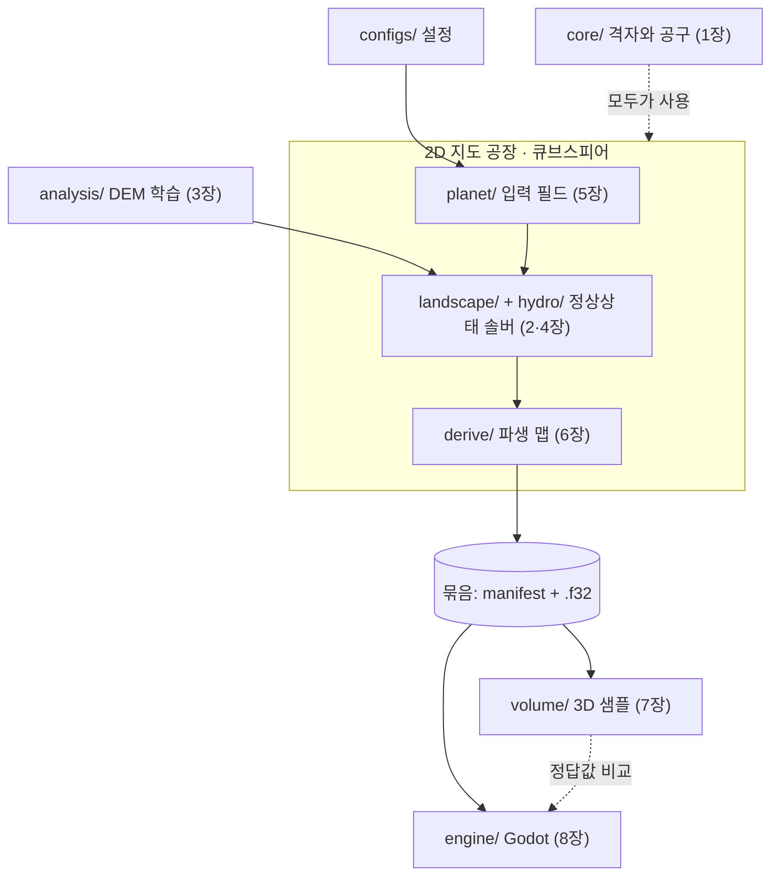
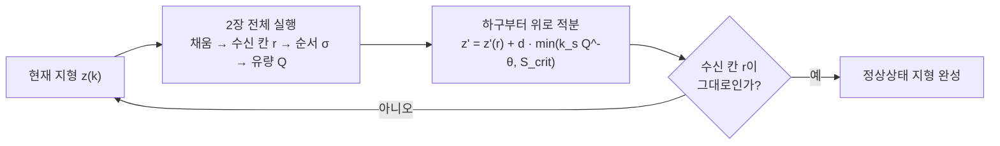

# 초기 설계 가이드: 구형 복셀 행성 생성기를 단계별로 만들기

> 공 모양 행성을 처음부터 끝까지 만드는 방법을 여덟 단계로 나눠 설명하는 첫 설계 안내서입니다. 행성 표면을 칸으로 나누고, 빗물이 흐를 길을 찾고, 강이 깎아 다 자란 산의 모양을 구한 뒤, 그 결과를 걸어 다닐 3D 세계로 바꿉니다. 지금 코드의 여러 계산이 여기서 나왔으므로, 각 계산이 왜 그런 모양인지 알고 싶을 때 읽습니다. 여러 결정이 뒤에 바뀌었으므로, 지금 코드와 다른 곳은 바로 아래 '지금과 다른 곳' 표를 먼저 봅니다.

**이 문서의 자리.**

- 2026-10-02에 옵시디언 볼트(`VAULT/프로젝트/(캡스톤) B-PCG`)에서 옮긴 사본입니다. 그림 링크만 저장소 기준 상대 경로(`figures/`)로 고쳤습니다.
- 설계도 [docs/design/blueprint.md](../design/blueprint.md)와 다르면 설계도가 맞습니다. 구현 기준은 [docs/pipeline.md](../pipeline.md)이고, 그 문서는 이 가이드와 바뀐 곳을 '가이드와 다름'으로 표시합니다.
- 지금 생성기는 C#(`src/Bpcg/`)입니다. 이 문서의 파이썬 코드와 파일 이름(`src/bpcg/…/*.py`)은 처음 설계 때의 스케치이고, 지금 코드와 이름이 다릅니다.
- 처음 보는 말은 [용어집](../glossary.md)에 있습니다. 그림과 코드 속 '셀(cell)'은 이 문서의 '칸'과 같은 말입니다.

## 지금과 다른 곳

이 가이드를 쓴 뒤 설계도에서 뒤집힌 결정과, 장마다 지금 코드가 있는 곳입니다. 근거는 설계도 부록 A-1(뒤집힌 결정), [pipeline.md](../pipeline.md) 6·7.1절, [configs/learned/README.md](../../configs/learned/README.md), [brief.md](../brief.md) 6장입니다.

| 장 | 이 가이드의 설계 | 지금 | 지금 코드 |
|---|---|---|---|
| 1 격자 | 큐브스피어 격자 | 같음 | `src/Bpcg/Core/Cubesphere.cs`, 칸 그래프 `Core/Graph.cs`(`CellGraph`) |
| 2 물길 | 적응형 MFD로 격자의 결을 없앰 | MFD는 만들지 않음. D8 + 노드 흔들기(4장 끝) | `src/Bpcg/Hydro/` |
| 3 규칙 배우기 | 진짜 높이 지도에서 θ·k_s·S_crit를 맞춰 `configs/learned/stream_power.toml`에 씀 | 아직 하지 않음. 모든 값이 논문 값(`configs/planets/earth.toml`) | 맞춘 값이 생기면 `configs/learned/` |
| 4 솔버 | 경사 = min(k_s Q^−θ, S_crit). 수신 칸이 안 바뀌면 멈춤 | 강 경사와 산비탈 경사를 섞고, 강이 흙을 내려놓는 효과와 지층마다 다른 경사를 더함. 물길 방향이 안 바뀌고 높이 변화가 0.1 m 미만이면 멈춤 | `src/Bpcg/Landscape/Solver.cs` |
| 5 행성 재료 | k_s를 학습한 두 값 사이에서 융기(땅이 솟는 속도)로 보간 | 이론식 k_s = (E/K)^(1/n) (기호는 3장) | `src/Bpcg/Planet/` |
| 6 파생 지도 | 호수·강 수면, 지하수면, 퇴적물을 솔버 뒤에 만듦 | 같은 생각을 4단계 '땅속 값'(물, 흙, 지하수면, 동굴 층)에서 씀 | `src/Bpcg/Subsurface/` |
| 6·7 지층 | 산꼭대기를 이은 면(퇴적 기준면)에서 잰 깊이로 지층을 칠함 | 하나의 3D 지질 모델 + 산이 자라는 동안 깎인 두께 | `src/Bpcg/Geology/` |
| 7 3D | 행성 전체를 복셀로 | 히어로 유역 안의 회랑만 3D로 굽기 | `src/Bpcg/Volume/Sample.cs`(`HeroVolume`) |
| 8 엔진 | GDScript로 7장의 3D 함수를 엔진에 옮겨, 실행 중에 행성 복셀을 만듦 | C#(Godot 4.7.2 .NET), 미리 구운 회랑 + 단면 칼 | `engine/Scripts/` |

표에 나온 말 가운데 장 밖의 말은 이렇습니다.

- **히어로 유역**은 행성에서 고른 강 유역 하나를 25 m 칸으로 다시 푼 땅입니다. 한 변이 32 km로 서울만 한 네모입니다.
- **회랑**은 히어로 유역 안의 폭 1 km, 길이 6 km 띠입니다. 넓이는 여의도의 약 2배이고, Godot에서 걸어 다니는 곳입니다.
- **단면 칼**은 눈앞에 세로 면을 세워, 그 앞의 땅을 지우고 땅속 지층을 보여 주는 도구입니다.
- **복셀**은 3D 공간을 작은 정육면체 상자로 나눈 칸입니다.
- 큐브스피어(1장), D8·MFD·수신 칸(2장), θ·k_s·S_crit(3장), 노드 흔들기(4장), 퇴적 기준면(6장)은 그 장에서 처음부터 풉니다.

## 이 문서 읽는 법

장마다 같은 순서로 되어 있습니다.

1. **한 줄 요약**: 이 단계가 무엇을 하는지, 왜 필요한지
2. **비유**: 식 없이 감으로 이해하기
3. **그림**: 눈으로 확인하기
4. **수식 풀어 읽기**: 식과, 그 식을 말로 옮긴 설명, 기호의 뜻과 단위, 작은 숫자로 넣어 본 예
5. **구현 메모**: 어느 파일에 무엇을 만드는지(처음 설계의 파이썬 이름과 지금 C# 위치)
6. **확인하기**: 제대로 만들었는지 검사하는 방법

그림은 모두 `analysis/legacy/make_figures.py`가 이 문서의 식을 그대로 계산해서 그렸습니다(처음에는 `docs/figures/make_figures.py`에 있었습니다). 특히 4장의 섬 지형은 다 자란 지형을 바로 푸는 계산(정상상태 솔버, 4장)을 실제로 돌린 결과입니다. 그림 22장을 다시 만들려면 다음을 실행합니다. 스크립트는 그림을 `docs/guide/figures/`에 씁니다.

```bash
uv run python analysis/legacy/make_figures.py
```

---

## 0. 전체 그림

### 한 줄 요약

생성기는 두 부분으로 나뉩니다. 앞부분은 행성 표면을 칸으로 나누고, 칸마다 높이·물·지하수 같은 값을 정해 2D 지도 여러 장을 만듭니다(2D 지도 공장). 뒷부분은 그 지도 묶음만 받아, 3D 공간을 작은 정육면체 상자로 나눈 세계(복셀 세계)를 만듭니다.

왜 둘로 나누나요? 3D 쪽이 지도 묶음만 읽으면, 파이썬으로 짠 3D 함수와 게임 엔진이 같은 지도를 읽습니다. 그래서 둘이 같은 점에서 같은 답을 내는지 점마다 견줄 수 있습니다(그림의 '정답값 비교', 7·8장).



그림 읽는 법:

- `configs/`의 설정과 `analysis/`의 DEM 학습(3장)이 재료의 숫자를 정합니다. DEM은 진짜 지구의 높이를 칸마다 담은 지도입니다.
- `core/`의 격자(1장)는 모든 단계가 씁니다.
- 지도 공장은 행성 재료(5장) → 산과 강의 모양 풀기(2·4장) → 파생 지도(6장) 순서로 돕니다. 각 단계는 칸마다 값이 하나씩 있는 지도(필드)를 만듭니다.
- 결과는 폴더 하나(묶음)로 넘깁니다. 목차 `manifest.json`과, 지도마다 32비트 실수 배열 파일(`.f32`) 하나입니다. 지금 코드의 묶음은 지도마다 `.npy` 파일을 씁니다.

### 구현 순서

| 순서 | 장 | 만드는 것 | 실행 환경 |
|---|---|---|---|
| 1 | 1장 | 큐브스피어 격자 (번호, 위치, 면적, 이웃) | 맥 |
| 2 | 2장 | 수계 (채움, 흐름 방향, 유량) | 맥 |
| 3 | 3장 | DEM 파라미터 학습 (1~2와 병행 가능) | 맥 |
| 4 | 4장 | 정상상태 솔버 (평면 격자에서 먼저 검증) | 맥 |
| 5 | 5장 | 행성 입력 필드 (판, 융기, 강수, 바다) | 맥에서 조정, 실습실에서 고해상도 |
| 6 | 6장 | 파생 맵 (수면, 하천, 지하수면, 기준면, 퇴적물) | 맥에서 조정, 실습실에서 고해상도 |
| 7 | 7장 | 3D 샘플 함수 (파이썬 참조 구현) | 맥 |
| 8 | 8장 | 엔진 통합 (Godot) | 맥 |

4장은 5장의 출력을 입력으로 쓰지만 먼저 구현합니다. 솔버를 행성 재료와 떼어 먼저 검증하려는 것입니다. 평면 격자와 변하지 않는 입력(상수)으로 솔버를 검증해 두고, 5장이 끝나면 행성 입력을 연결합니다.

### 공통 표기

식에 자주 나오는 기호입니다. 장마다 처음 쓸 때 다시 풉니다.

| 기호 | 뜻 | 단위 |
|---|---|---|
| $R$ | 행성 반지름 | m |
| $\mathbf p$ | 구면 위의 단위 방향 벡터 ($\lVert\mathbf p\rVert=1$) | 없음 |
| $c$ | 칸 번호, $V=\{0,\dots,N-1\}$ | 없음 |
| $f:V\to\mathbb R$ | 필드. 실제로는 길이 $N$인 배열 | 필드마다 다름 |
| $\mathcal N(c)$ | 칸 $c$의 이웃 집합 (최대 8개) | 없음 |
| $A_c$ | 칸 넓이 | m² |
| $d_{cc'}$ | 두 칸 중심 사이의 거리 | m |
| $O$ | 바다 칸의 집합 (물이 빠져나가는 곳) | 없음 |
| $z$ | 해수면 기준 고도 | m |
| $P$ | 연강수량 | m/yr |
| $Q$ | 유량 (상류에서 모인 물의 양) | m³/yr |
| $\xi(\mathbf p)$ | 크기를 맞춘(정규화한) 노이즈, 대략 $[-1,1]$ | 없음 |

---

## 1. 큐브스피어 격자: 행성 표면에 번호표 붙이기

### 한 줄 요약

공 표면을 $N=6n^2$개의 칸으로 나누고, 칸마다 번호, 위치, 넓이, 이웃을 정합니다. 이후의 모든 단계가 이 위에서 돌아갑니다.

왜 필요한가요? 물길, 솔버, 노이즈는 모두 "칸 $c$의 값은?"과 "칸 $c$의 이웃은?"만 묻습니다. 그래서 칸을 어떻게 나누느냐가 모든 계산의 바탕입니다.

위도·경도로 나누면 안 되나요? 경도선은 극에서 한 점으로 모이므로, 극 근처 칸이 가늘게 몰립니다. 그래서 정육면체 여섯 면을 바둑판으로 나눈 뒤 공처럼 부풀린 격자를 씁니다(큐브스피어). '면'은 정육면체 여섯 면 가운데 하나이고, $n$은 면 한 변의 칸 수입니다.

예를 들어 노트북 기본 설정(laptop 프로필)에서 행성 전체를 덮는 기본 지도(L0)는 $n=512$입니다. 칸은 $6\times512^2=1{,}572{,}864$개, 약 157만 개입니다. 면 가운데 줄을 따라 재면 칸 한 변은 $(2\pi\times6{,}371\text{ km}/4)/512\approx19.5$ km로, 서울 남북 길이(30 km)의 3분의 2쯤입니다.

### 비유

주사위에 모눈종이를 붙이고 바람을 불어넣어 공처럼 부풀린다고 생각해 보세요. 모눈 칸이 그대로 공 표면의 칸이 됩니다.

문제는 그냥 부풀리면 면 가운데 칸은 크게 늘어나고, 모서리 근처 칸은 작게 쪼그라든다는 것입니다. 그래서 부풀리기 전에 모눈 간격을 미리 조정해 둡니다. 이것을 **등각 매핑**이라고 부릅니다. '등각'은 각도를 같은 간격으로 나눈다는 뜻입니다.

비유가 맞지 않는 곳: 실제로는 종이를 늘리지 않습니다. 정육면체 면 위의 점을 공 중심에서 바라본 방향으로 옮길 뿐이고, 칸이 얼마나 늘고 줄지는 아래 식으로 정확히 정해집니다.

### 그림


왼쪽은 면 위의 점을 길이 1로 줄여 공 위에 바로 놓은 경우(단순 정규화)입니다. 면 모서리 쪽 칸이 눈에 띄게 작습니다. 오른쪽 등각 매핑은 칸 크기가 훨씬 고릅니다.


면 하나를 64×64칸으로 나눴을 때, 칸 넓이를 평균으로 나눈 값입니다.

- 단순 정규화는 가장 큰 칸과 가장 작은 칸이 약 5배 차이 납니다. 해상도를 무한히 높이면 약 5.2배입니다.
- 등각 매핑은 1.40배입니다. 극한값은 $\sqrt2\approx1.414$입니다.

물길 계산은 칸 넓이와 칸 사이 거리를 씁니다. 그래서 이 차이가 곧 계산 품질의 차이입니다.

### 수식 풀어 읽기

**면과 기저 벡터.** 면 위의 좌표를 3D 방향으로 바꾸려면, 면마다 '바라보는 쪽', '가로', '세로'가 어느 방향인지 정해야 합니다. 그래서 여섯 면마다 길이 1인 방향 벡터 세 개를 둡니다.

- $\mathbf n_f$: 면 $f$가 바라보는 방향
- $\mathbf u_f$, $\mathbf v_f$: 면 위의 가로와 세로 방향

오른손 좌표계가 되도록 $\mathbf u_f\times\mathbf v_f=\mathbf n_f$를 지킵니다. 이 프로젝트에서 쓰는 값은 다음과 같습니다.

| 면 $f$ | 이름 | $\mathbf u_f$ | $\mathbf v_f$ | $\mathbf n_f$ |
|---|---|---|---|---|
| 0 | +X | (0, 1, 0) | (0, 0, 1) | (1, 0, 0) |
| 1 | −X | (0, −1, 0) | (0, 0, 1) | (−1, 0, 0) |
| 2 | +Y | (0, 0, 1) | (1, 0, 0) | (0, 1, 0) |
| 3 | −Y | (0, 0, −1) | (1, 0, 0) | (0, −1, 0) |
| 4 | +Z | (1, 0, 0) | (0, 1, 0) | (0, 0, 1) |
| 5 | −Z | (−1, 0, 0) | (0, 1, 0) | (0, 0, −1) |

예: 0번 면(+X)은 $\mathbf u=(0,1,0)$, $\mathbf v=(0,0,1)$입니다. 외적은 $(1\cdot1-0\cdot0,\ 0\cdot0-0\cdot1,\ 0\cdot0-1\cdot0)=(1,0,0)$으로 $\mathbf n$과 같습니다.

생성기는 이 표를 묶음의 `manifest.json`에 `face_basis`로 그대로 적고, 엔진도 이 값을 읽어서 씁니다. 지금 코드에서는 `Bpcg.Core.Cubesphere`의 `FaceU`·`FaceV`·`FaceN`이 이 표입니다.

**등각 사상 (면 좌표 → 구면).** 면 위의 한 점을 공 위의 점으로 옮기는 식입니다. 면 좌표 $(a,b)$는 각각 $-1$에서 $1$ 사이입니다.

$$
\mathbf x_f(a,b)=\frac{\mathbf n_f+X\,\mathbf u_f+Y\,\mathbf v_f}{\sqrt{1+X^2+Y^2}},\qquad X=\tan\frac{\pi a}{4},\quad Y=\tan\frac{\pi b}{4}
$$

- $X$, $Y$: 정육면체 면 위의 평면 좌표(−1~1, 단위 없음)
- $\mathbf x_f(a,b)$: 공 위의 점(길이 1인 방향 벡터)

읽는 법: $a$를 $-1\sim1$로 고르게 나누면 $\frac{\pi a}{4}$는 $-45°\sim45°$의 **각도**를 고르게 나눈 것이 됩니다. $\tan$은 그 각도를 큐브 면 위의 평면 좌표로 바꿉니다.

분자는 큐브 면 위의 점이고, 분모로 나누면 길이가 1인 구면 위의 점이 됩니다. 각도를 고르게 나눴기 때문에 구면 위의 칸 크기가 고르게 나옵니다.

예: $a=0.5$이면 $\frac{\pi a}{4}=22.5°$이고 $X=\tan22.5°\approx0.414$입니다. 단순 정규화라면 $X=0.5$였을 자리입니다. $a$가 0에서 0.5로 갈 때 $X$는 0.414만큼, 0.5에서 1로 갈 때는 0.586만큼 움직입니다. 모서리 쪽 칸을 면 위에서 더 넓게 잡아, 공으로 옮길 때 줄어드는 만큼을 메우는 것입니다.

**역사상 (구면 → 면 좌표).** 공 위의 점이 어느 면의 어느 자리에 있는지 거꾸로 구하는 식입니다.

$$
f^*(\mathbf p)=\arg\max_f\ \mathbf p\cdot\mathbf n_f,\qquad
a=\frac{4}{\pi}\arctan\frac{\mathbf p\cdot\mathbf u_{f^*}}{\mathbf p\cdot\mathbf n_{f^*}},\qquad
b=\frac{4}{\pi}\arctan\frac{\mathbf p\cdot\mathbf v_{f^*}}{\mathbf p\cdot\mathbf n_{f^*}}
$$

읽는 법: 점 $\mathbf p$를 가장 정면으로 마주 보는 면(내적이 가장 큰 면) $f^*$를 고르고, 등각 사상을 거꾸로 풉니다.

예: $\mathbf p=(1,0,0)$은 $\mathbf n_0$과의 내적이 1로 가장 크므로 0번 면(+X)을 고릅니다. $a=\frac4\pi\arctan\frac01=0$, $b=0$이므로 0번 면의 한가운데입니다.

**칸 번호.** 면 번호, 세로 줄, 가로 칸을 한 줄 번호로 펼치는 규칙입니다. 해상도가 $n$이면 칸 $(f,i,j)$의 중심 좌표는 $a_i=-1+\frac{2i+1}{n}$이고, $b_j$도 같습니다. $f$는 면 번호(0~5), $i$는 가로 칸 번호, $j$는 세로 칸 번호(둘 다 0~$n-1$)입니다.

$$
c=f\,n^2+j\,n+i,\qquad \mathbf p_c=\mathbf x_f(a_i,b_j)
$$

$$
\operatorname{cell}(\mathbf p)=f^*n^2+jn+i,\qquad i=\min\!\Big(\Big\lfloor\frac{n(a+1)}{2}\Big\rfloor,\ n-1\Big)
$$

읽는 법: 면 번호, 행, 열을 한 줄의 번호로 펼칩니다. 모든 필드는 이 번호로 찾는 1차원 배열입니다. $\mathbf p_c$는 칸 $c$의 중심이고, $\operatorname{cell}(\mathbf p)$는 점 $\mathbf p$가 들어 있는 칸 번호입니다.

예:

- $n=4$이면 칸 중심은 $a_0=-0.75$, $a_1=-0.25$, $a_2=0.25$, $a_3=0.75$입니다. 면 가장자리(±1)가 아니라 칸 가운데에 점을 찍습니다.
- $n=16$에서 2번 면, $j=3$, $i=5$인 칸은 $c=2\cdot256+3\cdot16+5=565$번입니다.
- $\operatorname{cell}$의 $\min$은 면 끝($a=1$)을 위한 것입니다. $n=4$, $a=1$이면 $\lfloor4\cdot2/2\rfloor=4$라 범위를 벗어납니다. 그래서 마지막 칸 3으로 자릅니다.

**칸 넓이.** 칸 하나의 넓이를 근사 없이 구하는 식입니다. 등각 좌표에서 $a$가 일정한 선은 구 위의 대원(적도처럼 공 중심을 지나는 큰 원)입니다. 그래서 칸은 대원 네 개로 둘러싸인 사각형이 되고, 정확한 넓이를 닫힌 식으로 구할 수 있습니다.

$$
\Omega(X,Y)=\arctan\frac{XY}{\sqrt{1+X^2+Y^2}}
$$

$$
A_c=R^2\big[\Omega(X_+,Y_+)-\Omega(X_-,Y_+)-\Omega(X_+,Y_-)+\Omega(X_-,Y_-)\big]
$$

여기서 $X_\pm=\tan(\pi a_\pm/4)$이고 $a_\pm$는 칸의 양쪽 경계($-1+2i/n$과 $-1+2(i+1)/n$)입니다. $A_c$는 칸 넓이(m²), $R$은 행성 반지름(m)입니다.

읽는 법: $\Omega(X,Y)$는 원점에서 큐브 면 위의 사각형 $[0,X]\times[0,Y]$를 바라볼 때의 입체각입니다. 입체각은 반지름 1인 공 위에 비친 넓이이고, 단위는 sr(스테라디안)입니다.

네 모서리 값을 $+,-,-,+$로 조합하면(포함-배제) 칸 하나의 입체각이 됩니다. 면 하나 전체를 넣으면 $4\cdot\frac{\pi}{6}=\frac{2\pi}{3}$이고, 여섯 면을 합치면 $4\pi$로 구 전체의 입체각이 됩니다. 실제로 계산하면 12.566370614359174가 나와 $4\pi$와 소수점 아래 15자리까지 맞습니다.

예: 지구 반지름 $R=6{,}371$ km를 넣으면 공 전체는 $4\pi R^2\approx5$억 1,006만 km²입니다. $n=512$의 157만 칸으로 나누면 칸 하나의 평균 넓이는 약 324 km²로, 서울 면적(605 km²)의 절반쯤입니다.

**이웃 거리.** 두 칸 중심 사이를 공 표면을 따라 잰 거리(대원 거리)입니다.

$$
d_{cc'}=R\ \operatorname{atan2}\!\big(\lVert\mathbf p_c\times\mathbf p_{c'}\rVert,\ \mathbf p_c\cdot\mathbf p_{c'}\big)
$$

읽는 법: 두 방향 사이의 각도에 반지름을 곱한 거리입니다. $\arccos(\mathbf p_c\cdot\mathbf p_{c'})$와 같은 값이지만, 이웃처럼 아주 가까운 두 점에서는 $\arccos$가 부정확하므로 $\operatorname{atan2}$를 씁니다.

그럼 얼마나 가까워야 문제인가요? 19.5 km 떨어진 이웃이면 두 방향 사이 각도는 $19.5/6{,}371\approx0.0031$ 라디안입니다. 이때 내적은 $1-0.0000047$ 정도로 1과 거의 같습니다. $\arccos$는 1 근처에서 반올림 오차를 크게 키우므로, 각도의 사인 쪽 정보(외적의 길이)를 함께 쓰는 $\operatorname{atan2}$가 정확합니다.

**이웃 규칙.** 칸마다 이웃 여덟 칸의 번호를 정하는 규칙입니다. 면 안쪽은 쉽지만, 면 가장자리 칸의 이웃은 옆 면에 있습니다.

8방향 슬롯 $\delta=(\delta_j,\delta_i)$를 다음 순서로 고정합니다: $(-1,-1),(-1,0),(-1,1),(0,-1),(0,1),(1,-1),(1,0),(1,1)$. 이웃 후보 $(i',j')=(i+\delta_i,\,j+\delta_j)$에는 세 경우가 있습니다.

- **둘 다 범위 안**: 같은 면의 $(f,i',j')$
- **둘 다 범위 밖**: 큐브 꼭짓점의 대각선 방향이므로 이웃 없음 ($-1$)
- **하나만 범위 밖**: 면 경계를 넘어 인접 면으로 갑니다.


전개도에서는 21번과 10번이 떨어져 보이지만, 주사위처럼 접으면 바로 붙어 있는 칸입니다. 이런 "접었을 때의 이웃"은 이렇게 계산합니다. 그림의 칸 배치는 설명용이고, 실제 번호 방향은 위 기저 표가 정합니다.

1. 넘어간 방향 $\mathbf e$를 정합니다. $i'=n$이면 $\mathbf e=\mathbf u_f$, $i'=-1$이면 $\mathbf e=-\mathbf u_f$이고, $j$ 쪽이면 $\pm\mathbf v_f$입니다.
2. 인접 면 $f'$은 $\mathbf n_{f'}=\mathbf e$인 면입니다.
3. 범위 안에 남은 번호를 $k$, 그 축 방향을 $\mathbf t$라 합니다.
4. $f'$의 두 축 $\{\mathbf a_1,\mathbf a_2\}=\{\mathbf u_{f'},\mathbf v_{f'}\}$로 두 벡터를 나타냅니다: $\mathbf n_f=\sigma_1\mathbf a_1$, $\mathbf t=\sigma_2\mathbf a_2$, $\sigma_1,\sigma_2\in\{\pm1\}$.
5. 이웃 칸의 번호는 $\mathbf a_1$ 축으로 ($\sigma_1=+1$이면 $n-1$, 아니면 $0$), $\mathbf a_2$ 축으로 ($\sigma_2=+1$이면 $k$, 아니면 $n-1-k$)입니다.

왜 이게 정확할까요? 두 면이 공유하는 경계선 위에서는 양쪽 면의 경계 방향 좌표가 정확히 같습니다. 그래서 칸의 줄이 어긋나지 않고, 번호를 바꾸고 뒤집는 것만으로 맞은편 칸을 찾습니다. 이웃 관계가 양방향으로 정확히 대칭이 되는 이유입니다.

### 면 경계에서는 무슨 일이 생기나

**경계에 걸친 지형도 어색하지 않습니다.** 이 프로젝트에서 지형을 만드는 규칙은 모두 면이 아니라 구 위에서 정의됩니다.

- 노이즈는 3D 좌표에서 바로 읽으므로 면이라는 개념이 없습니다(5장).
- 판은 구면 위의 내적으로 나누므로 면과 상관없습니다(5장).
- 물의 흐름은 이웃 표를 따라가는 하나의 그래프라서, 강이 면 경계를 건너는 것은 평범한 한 칸 이동과 같습니다(2장).
- 3D 복셀은 가로·세로·높이가 직각으로 만나는 격자라서 면이 아예 없고, 2D 지도는 경계에서 끊기지 않게 보간해서 읽습니다(7장).

그래서 산맥이 경계에 걸쳐 있어도 다른 곳과 똑같은 방식으로 계산됩니다. 면이 흔적을 남길 수 있는 곳은 **격자의 모양**뿐이고, 아래에서 하나씩 짚습니다.

**1.40은 경계에서 생기는 오차가 아닙니다.** 앞의 1.40은 격자 전체에서 가장 큰 칸(면 중심)과 가장 작은 칸(면 모서리 중점)의 넓이 비입니다. 경계를 사이에 둔 두 칸은 경계를 기준으로 거울 대칭이라 넓이가 정확히 같습니다.


왼쪽 그래프처럼 적도를 따라가며 칸 넓이를 그려 보면, 경계에서 끊기지 않고 V자 바닥을 이룹니다. 붙어 있는 두 칸의 넓이 비는 면당 256칸에서 최대 1.006, 1024칸에서 1.0016입니다.

크기가 다른 것 자체는 오차가 아니라 "곳곳의 해상도가 조금씩 다르다"는 뜻입니다. 한 변 길이로는 최대 약 1.19배입니다. 모든 계산이 칸마다의 실제 넓이 $A_c$와 실제 거리 $d_{cc'}$를 쓰므로, 유량과 경사 같은 물리량은 정확합니다.

**격자선은 경계에서 꺾입니다.** 경계를 넘으면 격자선의 방향이 바뀝니다. 위 오른쪽 그래프처럼 면 중앙선($b=0$)에서는 꺾이지 않고, $b=0.5$에서 약 31°, $b=0.9$에서 약 55°, 꼭짓점 근처에서는 약 60°까지 꺾입니다.

격자의 "8방향"이 경계 양쪽에서 다르게 놓인다는 뜻입니다.

칸 크기와 필드 값에는 아무 문제가 없습니다. 그런데 물을 이웃 8칸 가운데 가장 가파른 한 칸으로만 보내는 규칙(D8, 2장)은 지형에 격자 방향의 결을 남깁니다. 그 결의 방향이 경계에서 바뀌면 이음새처럼 보일 수 있습니다. 이 가이드는 이 문제를 2장의 다중 흐름 방향(MFD)으로 풉니다.

**꼭짓점 8곳에서는 세 면이 만납니다.** 세 칸이 120°씩 만나고 이웃이 7개입니다. 이웃 표의 빈 슬롯($-1$)이 이 경우를 이미 담고 있고, 흐름 계산에도 문제가 없습니다.

**경계를 넘는 보간은 7장에서 따로 처리합니다.** 칸 사이 값을 둘레 네 칸에서 섞어 읽는 쌍선형 보간에는, 면 바깥에 덧붙인 가상의 칸(고스트 칸)이 필요합니다. 이 칸에 인접 면의 값을 그대로 복사하면 안 됩니다. 7장의 "면 경계를 넘는 보간"을 보세요.

| 면 경계 문제 | 영향 | 해결 |
|---|---|---|
| 칸 크기 차이 (최대 1.41배) | 없음 (실제 넓이와 거리를 씀) | 이미 해결됨 |
| 격자선 꺾임 (최대 약 60°) | 강 방향에 격자의 결 | 적응형 MFD (2·4장) |
| 꼭짓점 (이웃 7개) | 없음 | 이웃 표의 빈 슬롯 |
| 경계를 넘는 보간 | 표면에 미세한 주름 | 고스트 칸 재보간 (7장) |

지금 코드는 격자선 꺾임을 MFD 대신 노드 흔들기(4장 끝)로 다룹니다. 강이 격자 방향을 얼마나 따르는지 재는 값(격자 정렬 지수, 1이면 치우침 없음, 2장)은, 결과를 재는 항목 표(점수표, laptop 프로필)에서 면 경계 0.91, 면 안쪽 0.90으로 같았습니다([brief.md](../brief.md) 9장).

### 구현 메모

`src/bpcg/core/cubesphere.py`에 다음 함수를 만듭니다.

| 함수 | 입력 → 출력 |
|---|---|
| `to_sphere(f, a, b)` | 면 좌표 → 단위 벡터 (등각 사상) |
| `to_face(p)` | 단위 벡터 → $(f,a,b)$ (역사상) |
| `cell_of(p, n)` | 단위 벡터 → 칸 번호 |
| `face_cell_areas(n, R)` | 면 하나분의 칸 넓이 $(n,n)$ |
| `face_neighbor_dists(n, R)` | 면 하나분의 이웃 거리 $(n,n,8)$ |
| `neighbor_table(n)` | 전체 이웃 표 $(6n^2, 8)$, int32, 없으면 $-1$ |
| `cubesphere_grid(n, R)` | 위 결과를 묶은 `Grid` |

여섯 면은 모양이 똑같으므로 넓이와 거리는 면 하나분만 저장하고, `c % n**2`로 찾습니다.

지금 코드: `src/Bpcg/Core/Cubesphere.cs`(격자), `src/Bpcg/Core/Graph.cs`(`CellGraph`). `CellGraph`는 칸마다 위치, 이웃 8개, 이웃까지 거리, 넓이를 담은 표이고, 공 모양 행성과 평면 유역을 같은 코드로 다루게 해 줍니다.

### 확인하기

| 검사 | 수식 | 의미 |
|---|---|---|
| 넓이 합 | $\big\lvert\sum_c A_c-4\pi R^2\big\rvert/4\pi R^2<10^{-6}$ | 넓이 공식이 맞다 |
| 이웃 대칭 | $c'\in\mathcal N(c)\iff c\in\mathcal N(c')$ | 면 경계 규칙이 맞다 |
| 왕복 변환 | 모든 $c$에서 $\operatorname{cell}(\mathbf p_c)=c$ | 사상과 역사상이 서로 맞다 |
| 이웃 개수 | 이웃 7개인 칸이 정확히 24개, 나머지는 8개 | 꼭짓점 처리(8개 꼭짓점 × 3면)가 맞다 |
| 넓이 비 | $n$이 커질수록 $\max A/\min A\to\sqrt2$ | 등각 매핑이 제대로 들어갔다 |
| 경계 양쪽 넓이 | 면 경계를 사이에 둔 두 칸의 넓이 상대 차이 $<10^{-10}$ | 면 경계에서 칸 크기가 끊기지 않는다 |
| 회전 테스트 | 입력을 아무 방향으로 돌려 다시 생성해도 격자 정렬 지수, θ 추정값, 고도 분포의 통계가 같음 | 면 경계의 위치가 결과에 흔적을 남기지 않는다 |

<details><summary>격자 시험 코드 (파이썬 설계 스케치)</summary>

```python
# tests/test_cubesphere.py
def test_area_sum():
    g = cubesphere_grid(n=64, R=1.0)
    total = 6 * g.area.sum()                      # 면 하나분 × 6
    assert abs(total - 4 * np.pi) / (4 * np.pi) < 1e-6

def test_neighbor_symmetry():
    g = cubesphere_grid(n=16, R=1.0)
    for c in range(g.n):
        for c2 in g.nbr[c]:
            if c2 >= 0:
                assert c in g.nbr[c2]

def test_roundtrip():
    g = cubesphere_grid(n=16, R=1.0)
    assert np.all(cell_of(g.pos, 16) == np.arange(g.n))

def test_corner_cells():
    g = cubesphere_grid(n=16, R=1.0)
    k = (g.nbr >= 0).sum(axis=1)
    assert (k == 7).sum() == 24 and np.all(k[k != 7] == 8)

def test_edge_area_continuity():
    g = cubesphere_grid(n=256, R=1.0)
    A = g.area_full()                         # 길이 N
    for c, c2 in g.cross_face_pairs():        # 면 경계를 사이에 둔 가로·세로 이웃 쌍
        assert abs(A[c] / A[c2] - 1) < 1e-10
```

</details>

**회전 테스트.** 격자 자체는 위 검사로 확인됩니다. 그런데 "면 경계가 결과 지형에 흔적을 남기는가"는 생성 과정 전체를 돌려 봐야 알 수 있습니다.

모든 입력 필드를 샘플하는 위치를 회전 행렬 $\mathbf M$(공을 통째로 돌리는 3×3 행렬)으로 $\mathbf p\to\mathbf M\mathbf p$처럼 바꿔서 생성하면, 같은 행성이 격자에 대해 다르게 놓입니다. 면 경계가 산맥 한가운데를 지나던 행성이, 이번에는 바다 위를 지나게 되는 식입니다. 격자가 결과에 영향을 주지 않는다면 두 행성의 통계가 같아야 합니다.

특히 면 경계 근처 띠($|a|>0.9$ 또는 $|b|>0.9$)와 면 중심 띠에서 따로 격자 정렬 지수(2장)를 구합니다. 두 값이 모두 1에 가깝고 서로 비슷한지 봅니다. 격자 정렬 지수의 방향은 각 면의 자기 격자 좌표 $(i,j)$로 재고, 따라가는 도중 면 경계를 넘는 경로는 뺍니다.

<details><summary>회전 테스트 코드 (파이썬 설계 스케치)</summary>

```python
# tests/test_pipeline_rotation.py
def test_rotation_invariance():
    base = generate_planet(seed=1, rotation=np.eye(3), profile="laptop")
    rot = generate_planet(seed=1, rotation=random_rotation(7), profile="laptop")
    for P in (base, rot):
        assert grid_alignment(P, band="edge") < 1.3     # 면 경계 근처
        assert grid_alignment(P, band="center") < 1.3   # 면 중심
    assert abs(theta_fit(base) - theta_fit(rot)) < 0.03
    assert hypsometry_distance(base, rot) < 0.02        # 고도 분포 곡선의 차이
```

</details>

---

## 2. 수계: 물의 길 찾기

### 한 줄 요약

고도 지도를 받아, 물이 어디로 흘러서 어디에 얼마나 모이는지 계산합니다. 1장의 번호와 이웃 표만 쓰므로 평면이든 구면이든 같은 코드가 돌아갑니다.

왜 필요한가요? 강은 물이 많이 모인 곳에 생기고, 4장의 솔버는 물이 많이 모일수록 경사를 완만하게 만듭니다. 그래서 산의 모양을 구하기 전에 "칸마다 물이 얼마나 모이는가"부터 알아야 합니다.

평면과 공을 정말 같은 코드로 다루나요? 네. 이 장의 계산은 칸 번호, 이웃 표, 이웃까지 거리, 칸 넓이만 묻습니다. 공이든 평면이든 이 넷만 같은 모양으로 주면 됩니다.

### 비유

지도 위에 빗방울을 떨어뜨리면 가장 가파른 내리막으로 굴러갑니다. 웅덩이에 빠지면 넘칠 때까지 물이 찬 뒤, 가장 낮은 고개를 넘어 계속 흘러갑니다. 이 장은 그 과정을 네 개의 부품으로 나눠 계산합니다.

비유가 맞지 않는 곳: 진짜 빗방울과 달리 이 계산에는 물의 속도나 걸리는 시간이 없습니다. 칸마다 "1년에 이 칸을 지나는 물의 양"만 셉니다.


### ① 채움: 웅덩이를 넘침 높이까지

물이 우묵한 곳에 갇히면 바다에 닿지 못하고, 강이 거기서 끊깁니다. 그래서 우묵한 곳을 물이 넘칠 높이까지 메웁니다(웅덩이 채우기). 메운 곳이 호수입니다.

아래 식은 "칸 $c$의 물이 바다로 빠져나가려면 수면이 얼마나 높아야 하는가"를 구합니다.

$$
\hat z_c=\min_{\gamma:\,c\to O}\ \max_{c''\in\gamma}\ z_{c''}
$$

- $\gamma$: 칸 $c$에서 바다($O$)까지 이웃을 따라가는 길 하나
- $\hat z_c$: 채운 높이(m)

읽는 법: 칸 $c$에서 바다까지 가는 길 $\gamma$는 여러 개입니다. 길마다 "넘어야 하는 가장 높은 고개"가 있고, 그중 **가장 낮은 고개의 높이**가 $\hat z_c$입니다. 물은 그 높이까지 차올라야 바다로 빠져나갈 수 있기 때문입니다.

웅덩이가 아닌 곳은 $\hat z_c=z_c$이고, 웅덩이 안은 $\hat z_c>z_c$입니다. 그래서 호수는 $L=\{c:\hat z_c>z_c\}$이고, 호수 수면은 $\hat z_c$입니다.

예: 바닥이 100 m인 웅덩이에서 바다로 가는 길이 둘이고, 한 길의 고개는 130 m, 다른 길의 고개는 120 m라고 합시다. 물은 낮은 쪽 고개로 넘치므로 $\hat z=120$ m이고, 호수 깊이는 20 m입니다.


**계산 방법 (priority-flood).** 바다에서부터 물이 차오르는 홍수를 흉내 냅니다. 바다 칸을 모두 최소 힙(가장 작은 값을 늘 먼저 꺼내 주는 자료 구조)에 넣습니다. 가장 낮은 칸을 꺼낼 때마다, 아직 방문하지 않은 이웃을 방문해 높이를 정합니다.

```text
힙 ← 모든 바다 셀 (키 = 고도)
while 힙이 비지 않음:
    c ← 힙에서 가장 낮은 셀
    for c' in 방문하지 않은 이웃(c):
        ẑ[c'] = max(z[c'], ẑ[c])        # 낮으면 c 높이까지 물이 찬다
        방문 표시, 힙에 넣기
```

**라우팅용 ε 채움.** 위 방식으로 채운 호수는 수면이 완전히 평평해서, 물이 어느 쪽으로 흘러야 할지 정해지지 않습니다. 그래서 물길을 정할 때(라우팅)는 $\tilde z_{c'}=\max(z_{c'},\ \tilde z_c+\epsilon)$로 아주 작은 기울기($\epsilon\approx10^{-3}$ m)를 준 $\tilde z$를 따로 만듭니다. 그러면 바다가 아닌 모든 칸에 자기보다 확실히 낮은 이웃이 생깁니다.

예: 호수를 가로질러 100칸을 건너면 기울기는 모두 $100\times0.001=0.1$ m입니다. 눈에는 보이지 않지만 물길 방향은 정해집니다.

그럼 호수 수면이 기울어지나요? 아닙니다. 호수 수면에는 $\hat z$를, 흐름 방향에는 $\tilde z$를 따로 씁니다.

### ② 수신 칸: 각 칸은 물을 어디로 보내나

물길을 그리려면 칸마다 물이 흘러갈 이웃 하나를 정해야 합니다. 아래 식은 이웃 가운데 가장 가파르게 내려가는 칸을 고릅니다.

$$
r(c)=\arg\max_{c'\in\mathcal N(c)}\frac{\tilde z_c-\tilde z_{c'}}{d_{cc'}}\quad(c\notin O),\qquad r(c)=c\quad(c\in O)
$$

$$
S_c=\frac{\tilde z_c-\tilde z_{r(c)}}{d_{c\,r(c)}}
$$

- $r(c)$: 칸 $c$가 물을 보내는 이웃(수신 칸)
- $S_c$: 그 이웃까지의 경사(m/m, 높이 차 ÷ 거리)

읽는 법: 이웃 8개 가운데 "높이 차 ÷ 거리"가 가장 큰, 즉 가장 가파르게 내려가는 이웃이 수신 칸입니다(D8 방식). 그때의 경사가 $S_c$입니다. 바다 칸은 자기 자신을 가리킵니다. 반대로 나에게 물을 보내는 칸들은 기여 칸 $D(c)=\{c'\ne c:\ r(c')=c\}$입니다.

예: 칸 간격이 400 m라고 합시다. 오른쪽 이웃은 20 m 낮고 거리 400 m라 경사가 0.05입니다. 대각선 이웃은 25 m 낮지만 거리가 $400\sqrt2\approx566$ m라 경사가 0.044입니다. 더 많이 낮은 쪽이 아니라, 더 가파른 오른쪽 이웃이 수신 칸입니다.


왼쪽은 오른쪽 지도의 빨간 사각형을 확대한 것으로, 각 칸의 화살표가 수신 칸을 가리킵니다. 평평한 영역은 채움으로 메워진 웅덩이인데, ε 덕분에 화살표가 넘침 지점 쪽으로 끊기지 않고 이어집니다. 오른쪽은 이렇게 이어진 흐름을 따라 모은 유량으로, 진하게 모이는 선이 강이 됩니다.

$r$을 따라가면 $\tilde z$가 늘 줄어들기 때문에 같은 칸으로 되돌아올 수 없습니다. 그래서 수신 칸의 연결은 바다 칸을 뿌리로 하는 **나무(트리)의 모음**이 됩니다. 강의 지류가 합쳐지는 모습 그대로입니다.

### ③ 순서: 하류가 먼저 오도록

④에서 물을 한 번에 모으려면, 칸을 처리할 때 그 칸의 상류가 모두 끝나 있어야 합니다. 그래서 칸을 하류가 먼저 오도록 줄 세웁니다. 순열 $\sigma$는 모든 $c\notin O$에 대해 다음을 만족합니다.

$$
\operatorname{rank}_\sigma\big(r(c)\big)<\operatorname{rank}_\sigma(c)
$$

읽는 법: 어떤 칸이 목록에 나올 때, 그 칸의 하류는 늘 앞에 이미 나와 있습니다. 바다 칸(뿌리)에서 출발해 기여 칸을 따라 깊이 우선 탐색을 하면 이 순서가 저절로 만들어집니다. 이 순서를 **거꾸로** 돌면 상류부터, **그대로** 돌면 하류부터 처리하게 됩니다.

예: 바다 칸 0 ← 칸 1 ← 칸 2로 이어진 강이면 순서는 [0, 1, 2]입니다. 거꾸로 [2, 1, 0]을 돌면 맨 위 칸 2부터 처리합니다.

### ④ 유량: 물 모으기

칸마다 1년에 지나가는 물의 부피(유량)를 셉니다. 아래 식은 "내 칸에 내린 비 + 위에서 흘러든 물"입니다.

$$
Q_c=A_cP_c+\sum_{c'\in D(c)}Q_{c'}
$$

- $Q_c$: 유량(m³/yr)
- $A_c$: 칸 넓이(m²), $P_c$: 연강수량(m/yr)

읽는 법: 순서 $\sigma$를 거꾸로(상류부터) 돌면, 각 칸을 처리할 때 기여 칸들의 값이 이미 다 계산되어 있습니다. 그래서 한 번만 훑으면 끝납니다. 강수를 $P\equiv1$로 두면 $Q$가 이 칸까지 빗물이 모여 오는 땅의 넓이(상류 면적) $A^\uparrow_c$가 됩니다.

예: 400 m × 400 m 칸(160,000 m²)에 1년에 1 m 비가 오면, 그 칸에 내린 물은 160,000 m³/yr입니다. 위쪽에서 같은 칸 두 개가 물을 보내 오면, 이 칸의 유량은 $160{,}000\times3=480{,}000$ m³/yr입니다.

### ⑤ 다중 흐름 방향(MFD): 격자의 결 없애기

지금 코드에는 MFD가 없습니다. 설계도에서 D8 + 노드 흔들기(4장 끝)로 바꿨습니다. 결을 재는 방법(격자 정렬 지수)과 결이 생기는 원인은 지금도 그대로입니다.

**왜 필요한가.** D8은 물을 8방향 중 하나로만 보냅니다. 그래서 강이 가로, 세로, 대각선으로 곧게 뻗는 "결"이 지형에 새겨집니다. 같은 원형 섬에 같은 매개변수로 4장 솔버를 돌려 보면 차이가 분명합니다.


**격자 정렬 지수.** 결을 숫자로 재는 방법입니다.

1. 강 칸마다 하류로 6칸 따라간 방향을 구합니다.
2. 그 방향이 격자 8방향 중 하나와 ±5° 안에 드는 비율을 셉니다.
3. 그 비율을, 방향이 아무 쪽으로나 고르게 나올 때의 비율($10°/45°\approx22\%$)로 나눕니다.

1이면 결이 없고, 클수록 격자에 맞춰 흐르는 것입니다. 위 섬에서 D8은 2.92이고, MFD는 1.18입니다.

2.92는 강 칸의 약 65%($2.92\times22.2\%$)가 격자 방향을 따른다는 뜻으로, 아무렇게나 흐를 때보다 약 3배 많습니다. MFD의 1.18은 약 26%입니다.

평면에서는 이 결이 사람이 그은 줄처럼 조금 어색해 보이는 정도로 끝납니다. 그런데 큐브스피어에서는 1장에서 본 것처럼 격자 방향이 면 경계에서 최대 60°까지 꺾입니다. 결의 방향이 경계에서 갑자기 바뀌면, 칸 크기나 값이 이어져 있어도 지형이 경계에서 어색해 보입니다. 결 자체를 없애면 경계도 보이지 않게 됩니다.

**수신 칸 집합.** 가장 가파른 이웃 하나가 아니라, 나보다 낮은 이웃 전부가 물을 받습니다.

$$
\mathcal R(c)=\{c'\in\mathcal N(c):\ \tilde z_{c'}<\tilde z_c\}
$$

**분배 비율.** 낮은 이웃마다 물을 몇 %씩 보낼지 정하는 식입니다.

$$
w_{cc'}=\frac{\ell_{cc'}\,S_{cc'}^{\,p_c}}{\sum_{k\in\mathcal R(c)}\ell_{ck}\,S_{ck}^{\,p_c}},\qquad S_{cc'}=\frac{\tilde z_c-\tilde z_{c'}}{d_{cc'}}
$$

- $w_{cc'}$: 칸 $c$의 물 가운데 이웃 $c'$으로 가는 몫(0~1)
- $\ell_{cc'}$: 그 방향으로 물이 지나가는 등고선 길이의 가중치(단위 없음)
- $p_c$: 가파른 쪽으로 얼마나 몰아 줄지 정하는 지수

읽는 법: 더 가파른 쪽으로 더 많이 보냅니다. 가로·세로 이웃은 $\ell=0.5$, 대각선 이웃은 $\ell=0.354$를 씁니다(Quinn 등이 제안한 값). 지수 $p$가 클수록 가장 가파른 쪽으로 몰리고, $p\to\infty$이면 D8과 같아집니다. 비율의 합이 1이므로 물이 새거나 늘지 않습니다. 큰 $p$에서 거듭제곱이 0으로 사라지지 않도록, 계산할 때는 경사를 그 칸의 최대 경사로 나눈 뒤 거듭제곱합니다.

예: 가로 이웃 둘의 경사가 0.12와 0.10이면 경사 비는 1.2입니다.

- $p=1.1$이면 $1.2^{1.1}\approx1.22$라 물이 55% 대 45%로 나뉩니다.
- $p=8$이면 $1.2^8\approx4.30$이라 81% 대 19%로, 가파른 쪽에 거의 몰립니다.

**적응형 지수.** 물이 적은 산비탈과 물이 많은 강에 같은 $p$를 쓰면 어느 한쪽이 망가집니다. 그래서 유량에 따라 $p$를 바꿉니다. $\bar A=4\pi R^2/N$은 평균 칸 넓이, $\bar P$는 기준 강수입니다.

$$
p_c=p_{\min}+(p_{\max}-p_{\min})\ \operatorname{sst}\!\left(\frac{\log_{10}\!\big(Q_c/\bar A\bar P\big)-\log_{10}q_1}{\log_{10}q_2-\log_{10}q_1}\right)
$$

기본값은 $p_{\min}=1.1$, $p_{\max}=8$, $q_1=10$, $q_2=300$(칸 개수 단위)입니다. $Q_c/\bar A\bar P$는 "평균 칸 몇 개 분량의 비가 여기까지 모였나"입니다. $\operatorname{sst}$는 0과 1 사이에서 부드럽게 0에서 1로 올라가고, 바깥은 0이나 1로 자르는 함수(smoothstep)입니다.

읽는 법: 물이 적은 산비탈에서는 $p\approx1.1$로 넓게 퍼뜨려 결을 없앱니다. 물이 많이 모인 강에서는 $p\approx8$로 한쪽에 모아, 강이 여러 갈래로 흩어지지 않게 합니다. $p$를 1.1로 고정하면 큰 강까지 퍼져 버리고, 크게 고정하면 D8과 비슷해져 결이 돌아옵니다.

예: 칸 10개 분량 이하의 물이면 $p=1.1$, 300개 분량 이상이면 $p=8$입니다. 그 사이 로그 눈금의 한가운데인 약 55개 분량($\sqrt{10\times300}$)에서는 $\operatorname{sst}=0.5$라 $p=1.1+6.9\times0.5=4.55$입니다.

**순서와 유량.** MFD의 연결은 트리가 아니라, 물줄기가 나뉘었다 합쳐지는 그래프(DAG, 되돌아오는 길이 없는 방향 그래프)입니다. 순서는 $\tilde z$를 높은 것부터 정렬해 정합니다. 물은 늘 낮은 곳으로만 가므로, 높은 칸부터 처리하면 모든 상류가 먼저 처리됩니다.

칸을 처리하는 시점에 그 칸의 $Q_c$가 이미 확정되어 있으므로, $p_c$도 그 자리에서 계산할 수 있습니다.

$$
Q_c=A_cP_c+\sum_{k:\ c\in\mathcal R(k)}w_{kc}\,Q_k
$$

읽는 법: ④의 식과 같고, 위 칸의 물을 통째로가 아니라 비율 $w$만큼 받는 것만 다릅니다.

**주 수신 칸.** 분배 비율이 가장 큰 이웃 $r^*(c)=\arg\max_{c'}w_{cc'}$입니다. 강을 꺾은선으로 뽑기, 강 수면이 하류로 갈수록 낮아지게 맞추기, 하류 따라가기에는 이것을 씁니다(6장).

**유량만 바꾸면 부족합니다.** D8로 쌓은 지형 위에서 유량 계산 방식만 바꿔 보면 아래와 같습니다(4장 섬의 일부 확대). 산비탈의 흐름은 MFD 쪽이 훨씬 자연스럽지만, 강 자체는 여전히 곧게 뻗어 있습니다. 지형의 결은 **높이를 쌓을 때** 새겨지기 때문입니다. 그래서 4장의 솔버도 MFD 버전으로 바꿔야 결이 사라집니다.


**메모리.** 분배 비율을 저장하면 칸당 8개라, 면당 4096²에서 약 3.2 GB가 필요합니다. 칸은 $6\times4096^2\approx1$억 66만 개이고, 비율 8개를 4바이트씩 담으면 $1\text{억 66만}\times8\times4\approx3.2$ GB입니다.

그래서 저장하지 않고, 필요할 때 $\tilde z$에서 다시 계산합니다. 같은 입력이면 늘 같은 값이 나오므로 몇 번을 계산해도 같습니다.

### 구현 메모

`src/bpcg/hydro/`에 `depressions.py`(채움), `routing.py`(수신 칸, 순서), `accumulate.py`(유량)를 둡니다.

- 채움은 힙을 쓰므로 칸 수 $N$에 대해 $O(N\log N)$, 나머지는 $O(N)$ 시간이 듭니다.
- 모두 순서대로 한 칸씩 처리하는 알고리즘이라, 파이썬 코드를 기계어로 바꿔 빠르게 돌리는 Numba로 CPU에서 돌립니다.
- 이웃은 늘 `neighbor(c, k)` 도우미 함수로만 읽습니다.
- MFD는 `mfd.py`에 두고, D8과 MFD를 설정으로 바꿀 수 있게 합니다(`routing = "d8" | "mfd"`). D8은 fastscapelib(지형 진화 계산 라이브러리) 비교 같은 기준 검증에, MFD는 실제 행성 생성에 씁니다.

지금 코드: `src/Bpcg/Hydro/`의 `Depressions.cs`(채움), `Routing.cs`(D8 수신 칸, 순서), `Accumulate.cs`(유량), `Network.cs`(유역, 강 구간)입니다. MFD는 없습니다.

### 확인하기

| 검사 | 수식 | 의미 |
|---|---|---|
| 싱크 없음 | 모든 $c\notin O$에서 $\tilde z_{r(c)}<\tilde z_c$ | 모든 물이 결국 바다로 간다 |
| 질량 보존 | $\sum_{c\in O}Q_c=\sum_{c\in V}A_cP_c$ | 내린 비가 새거나 늘지 않는다 |
| 채움의 성질 | $\hat z\ge z$, 연결된 호수마다 $\hat z$가 일정 | 호수 수면이 평평하다 |
| 기준 비교 | 실제 DEM에서 $A^\uparrow$가 topotoolbox(지형 분석 표준 도구)와 거의 같음 | 구현이 표준 도구와 같다 |
| MFD 분배 비율 | 모든 칸에서 $w\ge0$, $\sum_{c'}w_{cc'}=1$ | MFD에서도 물이 새거나 늘지 않는다 |
| 격자 정렬 지수 | 원형 섬 테스트에서 MFD < 1.3 (D8은 약 2.9) | 격자의 결이 사라졌다 |

싱크는 물이 빠져나가지 못하는 칸입니다.

<details><summary>질량 보존 시험 코드 (파이썬 설계 스케치)</summary>

```python
# tests/test_hydro.py
def test_mass_conservation():
    g = flat_grid(64, 64, dx=100.0)
    z, ocean = random_terrain(g, seed=0)
    zt = fill_eps(g, z, ocean, eps=1e-3)
    r = receivers(g, zt, ocean)
    order = topo_order(r)
    Q = accumulate(g, r, order, P=np.ones(g.n))
    roots = np.nonzero(r == np.arange(g.n))[0]
    assert np.isclose(Q[roots].sum(), g.cell_area_full().sum())
```

</details>

---

## 3. DEM 파라미터 학습: 실제 강에게 규칙 배우기

### 한 줄 요약

실제 지구의 높이 지도(DEM)에서 "유역이 커질수록 강의 경사가 얼마나 완만해지는가"라는 규칙을 숫자로 뽑아냅니다. 이 숫자가 4장 솔버의 기준이 됩니다.

왜 필요한가요? 4장의 솔버는 "물이 이만큼 모이면 경사는 이만큼"이라는 규칙으로 산을 쌓습니다. 이 규칙의 숫자를 진짜 강에서 가져오면, 만든 산의 경사도 진짜 산과 닮습니다.

'학습'이라니 딥러닝인가요? 아닙니다. 진짜 지형 자료에 직선을 맞춰 규칙 속 숫자를 정하는 일입니다.

지금 상태: 이 장은 아직 하지 않았습니다. 지금 생성기의 값은 모두 논문 값입니다([configs/learned/README.md](../../configs/learned/README.md)). 레이더로 잰 높이 지도는 숲 지붕까지 재므로 조심해야 합니다. 가봉 AfriSAR 자료로 θ를 재려다 0.07~0.13이라는 엉뚱한 값이 나와 실패한 경위는 설계도 부록 A-2에 있습니다.

### 비유

강의 상류는 물이 적어 힘이 약합니다. 그래서 바위를 깎으려면 가파른 경사가 필요합니다. 하류로 갈수록 물이 모여 힘이 세지므로, 완만한 경사로도 충분히 깎습니다.

그래서 강을 따라 자른 높이 그림(종단면)은 위가 급하고 아래가 완만한 **오목한 곡선**이 됩니다. 그 오목한 정도를 **오목도(θ)**라고 부릅니다.

비유가 맞지 않는 곳: 실제 강의 경사는 물의 양만이 아니라 암석과 땅이 솟는 속도에 따라서도 바뀝니다. 그래서 아래에서는 조건이 비슷한 지역끼리 나눠 잽니다.


### 배경 이론: stream power law

강이 바닥을 깎는 속도는 물이 많을수록, 경사가 가파를수록 빨라집니다. 이것을 식으로 쓴 경험 법칙이 stream power law(흐르는 물의 힘으로 깎는 속도 법칙)입니다.

$$
E=K\,Q^{m}S^{n}
$$

- $E$: 강바닥이 깎이는 속도(m/yr)
- $K$: 암석이 얼마나 잘 깎이는지(무른 암석일수록 큼)
- $Q$: 유량(m³/yr), $S$: 경사(m/m)
- $m$, $n$: 유량과 경사가 깎는 속도에 얼마나 크게 작용하는지 정하는 지수

땅이 솟아오르는 속도(융기 $U$, m/yr)와 깎이는 속도가 같아지면, 지형이 더 이상 변하지 않습니다. 이것을 **정상상태**라고 부릅니다. $U=E$를 $S$에 대해 풀면 이렇습니다.

$$
S=k_s\,Q^{-\theta},\qquad k_s=\Big(\frac{U}{K}\Big)^{1/n},\qquad \theta=\frac{m}{n}
$$

읽는 법: 정상상태의 강에서 경사는 유량의 거듭제곱에 반비례합니다. $k_s$(강 가파름)는 "같은 유량에서 강이 얼마나 가파른가"를, $\theta$는 "유량이 늘 때 얼마나 빨리 완만해지는가"를 나타냅니다.

양변에 로그를 취하면 $\log S=\log k_s-\theta\log Q$로 **직선**이 됩니다. 이 직선의 기울기를 재면 θ를 알 수 있습니다.

예:

- θ = 0.45이면, 유량이 10배 늘 때 경사는 $10^{-0.45}\approx0.35$배, 약 3분의 1이 됩니다.
- 지금 설정은 $n=2$입니다(`configs/planets/earth.toml`의 `slope_exponent_n`). 그러면 θ = 0.45가 되려면 $m=0.9$입니다.
- $n=2$이면 융기가 4배 빠른 곳은 $k_s$가 $4^{1/2}=2$배입니다.

### 수식 풀어 읽기

**강 칸 고르기.** 산비탈의 경사는 강의 규칙을 따르지 않으므로, 먼저 강인 칸만 고릅니다. 위경도 격자를 미터 단위 격자로 다시 그린(재투영한) DEM에 2장을 $P\equiv1$로 적용해, 상류 면적 $A^\uparrow$와 경사 $S$를 구합니다. 유역이 일정 크기 이상인 곳만 강으로 봅니다.

$$
C=\{c:\ A^\uparrow_c\ge A_{crit},\ S_c>0\}
$$

$A_{crit}\approx10^5\sim10^6$ m²는 0.1~1 km²입니다. 1 km²는 여의도(2.9 km²)의 약 3분의 1입니다.

**구간 중앙값 회귀.** 칸 하나하나의 경사는 잡음이 큽니다. 그래서 $\log A$를 일정한 폭의 구간으로 나누고, 구간마다 경사의 중앙값 $\tilde S_j$를 구한 뒤 직선을 맞춥니다. 중앙값은 튀는 값 몇 개에 끌려가지 않습니다.

$$
\log_{10}\tilde S_j=\log_{10}k_s-\theta\,\log_{10}\bar A_j
$$

- $\bar A_j$: 구간 $j$의 대표 상류 면적(m²)
- $\tilde S_j$: 구간 $j$의 경사 중앙값(m/m)

예: 상류 면적 $10^6$ m²에서 경사 중앙값이 0.05, $10^8$ m²에서 0.0063이라고 합시다. 면적은 로그로 2만큼, 경사는 로그로 0.9만큼 줄었으므로 직선의 기울기는 $0.9/2=0.45$이고, 이것이 θ입니다.


이 그래프의 점들은 4장 솔버로 만든 섬 지형에서 뽑은 것입니다. 오른쪽 아래로 뻗은 부분이 강 구간입니다. 왼쪽 위에 평평하게 쌓인 부분은 산비탈 구간으로, 경사가 $S_{crit}$에 막혀 있습니다.

눈여겨볼 점이 있습니다. 솔버에 넣은 θ는 0.45인데 추정값은 0.49가 나왔습니다.

이 섬은 내륙일수록 융기가 커서 $k_s$가 크고, 내륙은 곧 상류(유역이 작은 곳)입니다. $k_s$가 유역 면적과 함께 변하면 직선의 기울기가 그만큼 치우칩니다. 실제 DEM을 분석할 때도 같은 일이 생기므로, **융기와 암석 조건이 비슷한 지역끼리 나눠서** 맞춰야 합니다.

**지역 간 비교: 정규화 경사 지수.** 지역마다 θ가 조금씩 다르면 $k_s$의 단위까지 달라져 서로 견줄 수 없습니다. 그래서 지역마다 구한 $\hat\theta$의 중앙값을 기준 오목도 $\theta_{ref}$로 고정하고, 모든 칸의 경사를 같은 기준으로 바꿉니다.

$$
k_{sn,c}=S_c\,\big(A^\uparrow_c\big)^{\theta_{ref}},\qquad k_{sn}^{\text{지역}}=\operatorname{median}_{c\in C}\,k_{sn,c}
$$

읽는 법: θ를 고정해 두면 $k_{sn}$ 하나로 "이 지역 강이 얼마나 가파른가"를 견줄 수 있습니다.

예: $\theta_{ref}=0.45$, 상류 면적 $10^6$ m², 경사 0.01인 칸은 $k_{sn}=0.01\times(10^6)^{0.45}=0.01\times10^{2.7}\approx5.0$입니다(단위 $\text{m}^{0.9}$).

**유량 기준으로 바꾸기.** DEM 분석은 넓이 $A$ 기준이지만, 솔버는 강수가 들어간 유량 $Q$ 기준입니다. 유역 평균 강수 $\bar P$로 $Q=\bar PA$라 두면 $S=k_s^Q(\bar PA)^{-\theta_{ref}}$이고, 이것을 $k_{sn}$의 정의와 맞추면 다음이 나옵니다.

$$
k_s^{Q}=k_{sn}\,\bar P^{\,\theta_{ref}}
$$

예: 비가 1년에 2 m 오는 유역이면 $k_s^Q$는 $k_{sn}$의 $2^{0.45}\approx1.37$배입니다.

$k_s^Q$의 단위는 $Q$의 단위에 따라 달라집니다. 그래서 학습과 생성에서 반드시 같은 단위(m³/yr)를 씁니다.

세계 기후 자료 WorldClim의 강수는 mm/월이므로, 12개월을 합하고 1000으로 나눠 m/yr로 바꿉니다. 예를 들어 다달이 100 mm면 1,200 mm, 곧 1.2 m/yr입니다.

**임계 경사.** 산비탈은 어느 경사를 넘으면 무너집니다. 그래서 산비탈이 버티는 가장 가파른 경사(임계 경사 $S_{crit}$)를 잽니다. 산비탈 칸 $H=\{c:A^\uparrow_c<A_{crit}\}$의 경사를 작은 것부터 줄 세웠을 때 95% 자리의 값(상위 5% 값)을 씁니다. 그래프 왼쪽 위의 평평한 천장이 이 값입니다.

$$
S_{crit}=\operatorname{quantile}_{0.95}\{S_c:\ c\in H\}
$$

예: $S_{crit}=0.6$은 10 m 갈 때 6 m 오르는 비탈로, 약 31°입니다.

### 구현 메모

`analysis/fit_stream_power.py`가 다음 형식의 파일을 만듭니다.

```toml
# configs/learned/stream_power.toml
theta_ref = 0.45
ks_lo = 60.0      # 지역별 k_s^Q 분포의 10번째 백분위수
ks_hi = 250.0     # 90번째 백분위수
s_crit = 0.6
q_unit = "m3/yr"
```

`ks_lo`와 `ks_hi`는 지역마다 잰 $k_s^Q$를 줄 세웠을 때 아래에서 10%, 90% 자리 값입니다. 5장에서 융기 세기 $\tilde U$가 0인 곳과 1인 곳의 $k_s$로 씁니다.

지금 상태: `analysis/fit_stream_power.py`와 `configs/learned/stream_power.toml`은 아직 없습니다. 맞춘 값이 생기면 `configs/learned/`에 넣고, 그 값이 `configs/planets/`의 같은 키를 덮어씁니다.

### 확인하기

| 검사 | 기준 | 의미 |
|---|---|---|
| θ 범위 | $\hat\theta\in[0.3,\,0.7]$ | 전 세계에서 관측되는 범위 안이다 |
| 적합도 | 구간 회귀의 $R^2\ge0.8$ | 직선 관계가 실제로 맞다 |
| 임계 경사 | $S_{crit}\in[0.5,\,1.0]$ (약 27°~45°) | 실제 산비탈이 버티는 각도와 맞다 |

$R^2$는 점들이 흩어진 정도 가운데 직선이 설명하는 몫입니다. 1이면 모든 점이 직선 위에 있고, 0.8이면 흩어짐의 80%를 직선이 설명합니다.

---

## 4. 정상상태 솔버: 바다에서부터 계단 쌓기

### 한 줄 요약

수천만 년의 침식을 시간 순서로 흉내 내지 않고, "이미 평형에 도달한 지형"을 바로 계산합니다.

왜 필요한가요? 실제 산은 수백만 년에서 수천만 년에 걸쳐 자랍니다. 이것을 1년씩 계산하면 행성 하나에 몇 시간이 걸립니다.

그럼 처음부터 '다 자란 모양'만 바로 구할 수는 없을까요? 있습니다. 오래 자란 산은 땅이 솟는 만큼 강이 깎아 내서, 어느 때부터 모양이 거의 바뀌지 않습니다. 이렇게 더 바뀌지 않는 상태가 3장의 정상상태입니다.

예를 들어 땅이 1년에 1 mm 솟는 곳이면, 그 칸의 강은 1년에 정확히 1 mm를 깎는 경사가 됩니다. 이 경사를 칸마다 구해 쌓으면 다 자란 지형이 나옵니다.

### 비유

바다에서 출발해 강을 거슬러 올라가며 계단을 쌓는다고 생각해 보세요. 한 칸 올라갈 때마다, 그 칸의 유량이 정해 주는 경사만큼 높이를 올립니다. 유량이 큰 하류는 조금씩, 유량이 작은 상류는 많이씩 올라갑니다.

다만 흐름 방향은 지형이 정해지고 나서야 알 수 있습니다. 그래서 "흐름 계산 → 계단 쌓기"를 흐름이 더 이상 바뀌지 않을 때까지 되풀이합니다.

비유가 맞지 않는 곳: 실제 지형은 누가 아래에서 쌓은 것이 아니라 솟고 깎인 결과입니다. 다 자란 지형에서는 두 결과가 같아서, 이렇게 쌓아도 같은 모양이 나옵니다.



$z^{(k)}$는 $k$번째 반복의 지형입니다. 물길 방향을 정하고 높이를 쌓는 일을 물길이 더 바뀌지 않을 때까지 되풀이하는 이 계산 전체를 솔버라고 부릅니다.

### 그림


96×96 평면 격자(칸 400 m), $\theta=0.45$, $k_s=60\sim250$, $S_{crit}=0.6$으로 실제로 돌린 결과입니다. 격자 한 변은 $96\times400\text{ m}=38.4$ km로, 서울 동서 길이(약 37 km)와 비슷합니다.

왼쪽의 뭉개진 노이즈 언덕이, 오른쪽처럼 골짜기와 능선과 가지 친 물길을 가진 지형으로 바뀝니다. 오른쪽 그래프는 반복마다 수신 칸이 몇 개 바뀌었는지를 보여 줍니다. 31번째 반복에서 0이 되어 수렴(멈춤)했습니다. 순수 파이썬 루프로도 몇 초면 끝나는 계산입니다.

### 수식 풀어 읽기

**한 번의 반복 $\Phi$.**

1. 현재 $z$로 2장을 실행합니다: $\tilde z=\operatorname{Fill}_\epsilon(z)$, $r=\operatorname{D8}(\tilde z)$, 순서 $\sigma$, 유량 $Q=\operatorname{Acc}(r,P)$.
2. $\sigma$ 순서(하류부터)로 새 고도를 쌓습니다. 아래 식은 "내 높이 = 하류 칸 높이 + 거리 × 경사"입니다.

$$
z'_c=0\quad(c\in O),\qquad
z'_c=z'_{r(c)}+d_{c\,r(c)}\cdot\min\!\big(k_{s,c}\,Q_c^{-\theta},\ S_{crit}\big)\quad(c\notin O)
$$

- $z'_c$: 새 높이(m). 바다 칸은 0
- $d_{c\,r(c)}$: 하류 칸까지 거리(m)
- $k_{s,c}$: 칸 $c$의 강 가파름($Q$를 m³/yr로 쓸 때의 값)
- $S_{crit}$: 임계 경사(m/m)

읽는 법: 경사는 정상상태 법칙 $k_sQ^{-\theta}$로 정하되, 산비탈이 무너지지 않는 한계 $S_{crit}$를 넘지 않게 자릅니다. $\sigma$ 순서로 돌기 때문에 내 하류 칸의 높이는 늘 먼저 계산되어 있습니다.

예: $k_s=60$, $\theta=0.45$, 칸 간격 400 m라고 합시다.

- 칸 하나 분량의 물($Q=160{,}000$ m³/yr, 400 m 칸에 1년에 1 m 비)이면 경사는 $60\times160{,}000^{-0.45}\approx0.27$입니다. 한 칸 올라갈 때 약 109 m 높아집니다.
- 물이 100배($Q=1.6\times10^7$ m³/yr)면 경사는 $100^{-0.45}\approx0.13$배인 약 0.034이고, 한 칸에 약 14 m 높아집니다.
- 두 경사 모두 $S_{crit}=0.6$보다 작으므로 자르지 않습니다.

**수렴 조건.** $\Phi$의 결과는 $z$가 아니라 수신 칸 $r$로만 정해집니다. $Q$도 $r$로만 정해지기 때문입니다. 그래서 $r^{(k+1)}=r^{(k)}$가 되는 순간, $z^{(k+1)}$은 다시 넣어도 그대로 나오는 지형(고정점), 즉 완성된 정상상태 지형입니다.

**수신 칸 히스테리시스.** 실제로 돌려 보면, 경사가 거의 같은 이웃 두 개 사이에서 수신 칸이 번갈아 바뀌며 끝나지 않는 칸이 수십 개 남습니다. 위 섬에서는 전체의 약 0.4%로, $96\times96=9{,}216$칸 가운데 약 37칸입니다. 이를 막으려면 새 후보가 기존 수신 칸보다 확실히 가파를 때만 바꿉니다(히스테리시스).

$$
r^{(k+1)}(c)=
\begin{cases}
r_{\text{new}}(c) & S_{\text{new}}>(1+\eta)\,S_{\text{old}}\\
r^{(k)}(c) & \text{그 외}
\end{cases}
\qquad \eta\approx0.02
$$

- $S_{\text{old}}$: 지금 수신 칸까지의 경사, $S_{\text{new}}$: 새 후보까지의 경사
- $\eta$: 바꾸는 문턱(0.02 = 2%)

예: 지금 수신 칸까지 경사가 0.100이면, 새 후보는 0.102를 넘어야 바뀝니다.

이 한 줄로 위 그림처럼 깔끔하게 0까지 수렴합니다. 최대 반복 횟수는 50 정도로 둡니다. 지금 설정은 행성 지도가 `max_flow_iterations = 200`, 히어로 유역이 laptop 프로필에서 800입니다(`configs/`).

**파생 개념: 강이 시작되는 곳.** 산비탈과 강의 경계는 두 경사가 같아지는 곳입니다.

$$
k_sQ^{-\theta}>S_{crit}\iff Q<Q^*=\Big(\frac{k_s}{S_{crit}}\Big)^{1/\theta}
$$

읽는 법: 유량이 $Q^*$보다 작은 곳은 임계 경사로 잘린 산비탈이고, 그보다 크면 강입니다. 3장 그래프에서 평평한 천장이 끝나고 직선이 시작되는 지점이 바로 이곳입니다.

예: $S_{crit}=0.6$일 때 $k_s=60$이면 $Q^*=100^{1/0.45}\approx2.8\times10^4$ m³/yr이고, $k_s=250$이면 약 $6.6\times10^5$ m³/yr입니다. 가파른 땅일수록 물이 더 많이 모여야 강이 시작됩니다.

**호수가 생기지 않는 이유.** 이 방식은 바다에서부터 위로만 쌓아 올리기 때문에 결과 지형에 웅덩이가 없습니다. 모든 물이 바다로 빠져나가는 지형이 나옵니다. 호수는 6장에서 따로 만듭니다.

### MFD 버전 솔버

지금 코드에는 없습니다(설계도: D8 + 노드 흔들기). 2장 ⑤의 결이 높이를 쌓을 때 생기므로, 이 가이드는 쌓는 식도 MFD로 바꿉니다.

MFD를 쓰면 한 칸의 물이 여러 하류로 나뉩니다. 그래서 높이도 여러 하류를 함께 반영해야 합니다.

$$
z'_c=\sum_{k\in\mathcal R(c)}w_{ck}\,\big(z'_k+d_{ck}\,S_c\big),\qquad S_c=\min\!\big(k_{s,c}\,Q_c^{-\theta},\ S_{crit}\big)
$$

읽는 법: "하류 이웃 $k$를 거쳐 올라왔다면 내 높이는 얼마인가"를 이웃마다 계산하고, 물을 나눠 보내는 비율로 평균합니다. 칸은 $\tilde z$가 낮은 것부터 처리합니다.

예: 하류 이웃 둘(둘 다 가로, 거리 400 m)의 높이가 100 m와 104 m이고, 비율이 0.6과 0.4, 경사가 0.05라고 합시다. 두 길로 올라온 높이는 120 m와 124 m이고, 평균은 $0.6\times120+0.4\times124=121.6$ m입니다.

**그대로 반복하면 수렴하지 않습니다.** D8에서는 수신 칸이 여덟 개 가운데 하나를 고르는 값이라, 히스테리시스로 묶어 둘 수 있었습니다. MFD의 분배 비율은 높이가 조금 바뀌면 조금씩 따라 바뀝니다.

게다가 적응형 지수가 "물이 모이면 더 모으는" 되먹임을 만들어, 강이 이웃 칸 사이를 오가며 흔들립니다.

실제로 원형 섬에서 감쇠 없이 60회, 감쇠를 넣어 150회 반복해도, 최대 변화량이 약 100 m에서 더 줄지 않았습니다. 전체 기복(가장 높은 곳과 낮은 곳의 차) 약 2000 m의 5%로, 한라산(1,947 m)만 한 섬에서 100 m씩 흔들린 셈입니다.

**2단계 방식.**

1. **조직 단계:** 감쇠를 넣어 $K_1\approx30$회 반복합니다. 물길의 큰 뼈대가 자리를 잡습니다.

$$
z\leftarrow z+\lambda\big(\Phi_{\text{MFD}}(z)-z\big),\qquad \lambda\approx0.3
$$

$\lambda$는 한 번에 움직이는 몫입니다. 예를 들어 $\Phi$가 어떤 칸을 100 m 올리라고 하면, 이번 반복에서는 30 m만 올립니다.

2. **확정 단계:** 마지막 $z$에서 분배 비율을 계산해 고정하고, 위의 높이 식으로 한 번 적분해 최종 지형을 만듭니다.

확정 단계의 결과는 고정한 비율에 대해서는 정상상태 법칙을 정확히 만족합니다. 남는 질문은 "최종 지형에서 비율을 다시 계산하면 얼마나 달라지는가"입니다.

원형 섬에서 강 칸 유량의 상대 변화는 중앙값 0.8%였습니다. 게임 지형으로는 지형과 물 흐름이 충분히 서로 맞는 수준입니다. 2장 그림의 오른쪽 섬이 이 방식으로 만든 결과입니다.

| 검사 (MFD) | 기준 | 의미 |
|---|---|---|
| 다시 계산한 유량 차이 | 최종 지형에서 비율을 다시 계산했을 때 강 칸의 $\lvert\Delta Q/Q\rvert$ 중앙값 < 2% | 지형과 물 흐름이 서로 맞는다 |
| 격자 정렬 지수 | < 1.3 | 결이 없다 |
| 기준 비교 | fastscapelib 비교는 D8 모드로 함 | 솔버의 뼈대가 맞다 |

**피해야 할 지름길.** "고도는 D8 트리로 쌓고 유량만 MFD로 계산하되, 유량이 문턱값을 넘는 강 칸은 D8으로 딱 잘라 바꾸는" 섞음 방식을 떠올리기 쉽습니다. 실제로 돌려 보면 수렴하지 않습니다.

문턱값 근처의 칸이 반복마다 방식을 바꾸면서 하류 유량이 계단처럼 뛰기 때문입니다. 60번을 돌려도 매번 수십~수백 개의 수신 칸이 바뀌었습니다. **지수를 부드럽게 바꾸는 것**과 **높이도 같은 비율로 쌓는 것**이 함께 있어야 흐름과 지형이 서로 맞아떨어집니다.


**더 가벼운 대안: 노드 흔들기.** D8 솔버를 그대로 두고 결만 줄이는 방법도 있습니다. 지금 코드가 쓰는 방법입니다.

- 각 칸의 대표 점을 칸 안에서 조금씩 무작위로 옮기고(시드 고정), 경사와 거리를 옮긴 점 사이에서 잽니다.
- 이웃은 여전히 8개지만 방향이 칸마다 제각각이라, 강이 격자 방향에 몰리지 않습니다.
- 흐름이 여전히 트리이므로 D8처럼 정확히 수렴합니다(아래 예에서 25회).
- 옮긴 위치는 칸 번호의 해시로 그때그때 계산하면 저장 공간이 들지 않습니다.
- 다만 "여섯 면이 같은 모양"이라는 대칭이 깨집니다. 그래서 이웃 거리는 면 하나분만 저장하는 대신 매번 계산해야 합니다.


지금 설정은 흔들기 세기 `jitter = 1.0`(칸 중심을 최대 반 칸씩 옮김)입니다. 이때 격자 정렬 지수는 1.12~1.2이고, 세기 0.4에서는 1.70이었습니다(`configs/planets/earth.toml`).

이 가이드는 적응형 MFD를 채택하고, 계산 비용이 문제가 되면 노드 흔들기를 대안으로 쓰기로 했습니다. 설계도는 이것을 뒤집어 노드 흔들기를 기본으로 정했습니다. 히어로 유역을 촘촘한 칸으로 다시 푸는 일(정밀화)에 쓸 시간을 마련하려는 것이었습니다. 어느 쪽이든 결과는 1장의 회전 테스트로 확인합니다.

### 구현 메모

`src/bpcg/landscape/steady_state.py`에 둡니다. 평면 격자와 상수 입력으로 먼저 검증하고, 5장이 끝나면 행성 입력으로 바꿉니다. `receivers()`는 이전 수신 칸과 $\eta$를 인자로 받도록 만듭니다.

지금 코드: `src/Bpcg/Landscape/Solver.cs`(`Solver.SolveSteadyState`), 히어로 유역을 거친 격자에서 먼저 푸는 `Warmstart.cs`, D8 수신 칸은 `src/Bpcg/Hydro/Routing.cs`(`Routing.D8Receivers`)입니다. 경사 규칙과 멈춤 조건이 바뀐 내용은 [pipeline.md](../pipeline.md) 7.1절에 있습니다.

### 확인하기

| 검사 | 기준 | 의미 |
|---|---|---|
| 수렴 | 50회 안에 바뀐 수신 칸 수가 0 | 고정점에 도달했다 |
| 법칙과 맞음 | $S<S_{crit}$인 칸에서 $\lvert S-k_sQ^{-\theta}\rvert/k_sQ^{-\theta}<10^{-3}$ | 결과가 정상상태 법칙을 만족한다 |
| 기준 비교 | 고른 $U,K$, $n=1$, $m=\theta$로 fastscapelib과 견줘 평균 고도와 고도 분포의 차이 5% 미만 | 검증된 구현과 같은 답을 낸다 |

---

## 5. 행성 입력 필드: 판 구조와 기후로 재료 만들기

### 한 줄 요약

행성 규모에서 솔버에 넣을 재료를 만듭니다. 어디가 솟는지(융기), 어디에 비가 오는지(강수), 물이 결국 빠져나가는 바다가 어디인지(기준면)를 정합니다.

왜 필요한가요? 4장의 솔버는 칸마다 "얼마나 빨리 솟는가($k_s$에 들어감)"와 "물이 얼마나 오는가($Q$에 들어감)", "어디서 높이 0으로 시작하는가(바다)"를 받아야 산을 쌓을 수 있습니다. 이 값을 아무렇게나 뿌리면 산맥이 엉뚱한 곳에 생깁니다. 그래서 진짜 지구처럼 판이 부딪히는 곳에 산맥을 둡니다.

### 비유

행성 표면은 몇 개의 큰 조각(판)으로 나뉘어 천천히 움직입니다. 판끼리 부딪히는 곳은 구겨져 산맥이 되고, 벌어지는 곳은 갈라집니다. 비는 대기 순환 때문에 위도에 따라 많이 오는 띠와 적게 오는 띠가 번갈아 나타납니다.

비유가 맞지 않는 곳: 실제 판은 수천만 년에 걸쳐 움직이며 모양이 바뀝니다. 여기서는 판 배치와 속도를 한 순간으로 고정하고, 그 순간의 경계에서 융기를 구합니다.


왼쪽은 판(색)과 경계 유형(빨강 수렴, 파랑 발산, 회색 변환), 판의 이동 속도(화살표)입니다. 판이 마주 오면 수렴, 멀어지면 발산, 엇갈려 미끄러지면 변환 경계입니다. 오른쪽은 그로부터 계산한 융기 $\tilde U$와 해안선입니다.

수렴 경계를 따라 길게 솟은 띠가 산맥이 됩니다. 그림은 보기 쉽게 위경도 지도로 그렸지만, 실제 구현은 큐브스피어 격자 위에서 같은 식을 계산합니다.

### 수식 풀어 읽기

**판 배치.** 판 개수를 $M$이라 합니다(지금 설정은 12개). 3차원 정규분포에서 뽑은 벡터를 길이 1로 줄인 씨앗 $\mathbf s_k=\mathbf g_k/\lVert\mathbf g_k\rVert$는 구면 위에 고르게 퍼집니다. 각 칸은 가장 가까운 씨앗의 판에 속합니다.

$$
\pi(c)=\arg\max_k\ \operatorname{normalize}\!\big(\mathbf p_c+\eta\,\boldsymbol\xi(\mathbf p_c)\big)\cdot\mathbf s_k
$$

- $\pi(c)$: 칸 $c$가 속한 판 번호
- $\boldsymbol\xi$: 방향을 흔드는 3D 벡터 노이즈, $\eta$: 그 세기(4장의 $\eta$와 다른 값)

읽는 법: 구면 위에서 "가장 가깝다"는 "내적이 가장 크다"와 같습니다. 이렇게 가장 가까운 씨앗끼리 땅을 나누는 것을 구면 보로노이 분할이라고 부릅니다. 점을 벡터 노이즈 $\boldsymbol\xi$로 살짝 흔든 뒤 견주면, 판 경계가 직선이 아니라 구불구불해집니다.

예: 두 씨앗과의 내적이 0.9와 0.5면, 두 씨앗까지의 각도는 약 26°와 60°입니다. 내적이 큰 쪽이 가까운 쪽입니다.

**판 운동.** 구면 위의 판은 어떤 축(오일러 극) 둘레로 통째로 도는 움직임만 할 수 있습니다. 각속도 벡터를 $\boldsymbol\omega_k$라 하면, 판 위 한 점의 속도는 다음과 같습니다.

$$
\mathbf v_k(\mathbf p)=\boldsymbol\omega_k\times R\,\mathbf p
$$

- $\boldsymbol\omega_k$: 판 $k$의 각속도(방향은 회전축, 길이는 rad/yr)
- $\mathbf v_k$: 그 점의 이동 속도(m/yr)

읽는 법: 같은 판 안에서도 오일러 극에서 90° 떨어진 곳이 가장 빠르고, 극 바로 위는 움직이지 않습니다. 지금 설정의 판 속도 범위는 1년에 2~8 cm입니다(`configs/planets/earth.toml`).

**경계 판정.** 서로 다른 판에 속한 이웃 쌍 $(c,c')$마다, 두 판이 마주 오는지, 멀어지는지, 엇갈리는지 가립니다. $c$에서 $c'$ 쪽을 가리키는 접선 방향 $\hat{\mathbf b}$와 상대 속도 $\Delta\mathbf v$를 구합니다.

$$
\hat{\mathbf b}=\operatorname{normalize}\!\big(\mathbf p_{c'}-(\mathbf p_{c'}\cdot\mathbf p_c)\,\mathbf p_c\big),\qquad
\Delta\mathbf v=\mathbf v_{\pi(c')}(\mathbf p_c)-\mathbf v_{\pi(c)}(\mathbf p_c)
$$

$$
\gamma_c=-\Delta\mathbf v\cdot\hat{\mathbf b},\qquad
\tau_c=\big\lvert\Delta\mathbf v\cdot(\mathbf p_c\times\hat{\mathbf b})\big\rvert
$$

- $\gamma_c$: 두 판이 마주 오는 속도(m/yr, 양수면 수렴)
- $\tau_c$: 경계를 따라 미끄러지는 속도(m/yr, 전단)

읽는 법: $\hat{\mathbf b}$는 $\mathbf p_{c'}$에서 $\mathbf p_c$ 방향 성분을 빼서 만든, 구면에 접하는 방향입니다. 상대 판이 나에게 다가오면 $\Delta\mathbf v$가 $\hat{\mathbf b}$와 반대 방향이므로 $\gamma>0$(수렴)입니다. $\gamma>\kappa\tau$면 수렴, $\gamma<-\kappa\tau$면 발산, 그 사이면 변환 경계로 판정합니다($\kappa\approx0.3$).

예: $\gamma=3$ cm/yr, $\tau=5$ cm/yr이면 $\kappa\tau=1.5$ cm/yr입니다. $3>1.5$이므로 수렴 경계입니다. 같은 $\tau$에서 $\gamma=1$ cm/yr이면 $-1.5$와 $1.5$ 사이라 변환 경계입니다.

**융기.** 산맥은 수렴 경계를 따라 생기고, 경계에서 멀어질수록 낮아집니다. 그래서 각 칸에서 가장 가까운 수렴 경계까지의 거리부터 잽니다.

수렴 경계 칸 모두에서 동시에 출발해 이웃을 따라 퍼지며 거리를 재는 방법(다중 출발점 다익스트라)으로, 공 표면을 따라 잰 거리 $\delta_c$를 구합니다. 그 경계의 수렴 속도 $\gamma^*_c$도 함께 넘겨받습니다.

$$
\tilde U_c=\operatorname{clamp}_{[0,1]}\!\Big(u_{\pi(c)}+\beta\,\frac{\gamma^*_c}{\gamma_{\max}}\,e^{-\delta_c^2/2w^2}+\eta_U\,\xi_U(\mathbf p_c)\Big)
$$

- $\tilde U_c$: 0~1로 맞춘 융기 세기(단위 없음)
- $u_k$: 판마다의 기본 융기, $\beta$: 경계 효과의 세기
- $\gamma^*_c/\gamma_{\max}$: 가장 가까운 수렴 경계의 속도를 가장 빠른 수렴 속도로 나눈 값
- $w$: 산맥의 폭(m), $\eta_U\,\xi_U$: 작은 노이즈
- $\operatorname{clamp}_{[0,1]}$: 0보다 작으면 0, 1보다 크면 1로 자르기

읽는 법: 판마다 기본 융기 $u_k$(대륙판 약 0.2~0.35, 해양판 0)가 있습니다. 수렴 경계에 가까울수록, 그리고 빨리 부딪힐수록 더 많이 솟습니다. 가우스 함수라서 경계에서 멀어지면 부드럽게 줄어듭니다.

예: 경계에서 $w$만큼 떨어지면 경계 효과는 $e^{-1/2}\approx0.61$배, $2w$만큼 떨어지면 $e^{-2}\approx0.14$배입니다.

**$k_s$ 필드: 학습값과의 연결.** 이론식 $k_s=(U/K)^{1/n}$에서 $U$와 $K$를 따로 알 수는 없습니다. 대신 3장에서 실제 지형으로 관측한 $k_s$ 범위에 바로 맞춥니다.

$$
k_{s,c}=\exp\!\big((1-\tilde U_c)\ln k_{lo}+\tilde U_c\ln k_{hi}\big)\cdot\lambda_{\ell(c)}
$$

- $k_{lo}$, $k_{hi}$: 3장의 `ks_lo`(60), `ks_hi`(250)
- $\lambda_{\ell(c)}$: 칸의 암석 종류 $\ell(c)$에 따른 배율

읽는 법: 융기가 0이면 $k_{lo}$, 1이면 $k_{hi}$이고, 그 사이는 로그 눈금으로 보간합니다. $\lambda_\ell$은 암석 종류별 배율로, 단단한 암석일수록 1보다 커서 더 가파른 지형을 만듭니다.

예: $\tilde U=0.5$이면 $k_s=\sqrt{60\times250}\approx122$입니다(암석 배율 1). 산술 평균(155)이 아니라 기하 평균입니다.

지금 코드는 이 보간 대신 이론식 $k_s=(E/K)^{1/n}$을 씁니다([pipeline.md](../pipeline.md) 7.1절).

**초기 고도와 바다.** 솔버가 출발할 첫 지형과, 어디가 바다인지를 정합니다.

$$
z^{(0)}_c=Z_0\,\tilde U_c+\eta_0\,\xi_0(\mathbf p_c)
$$

$Z_0$는 융기를 높이로 바꾸는 배율(m), $\eta_0\,\xi_0$은 노이즈입니다. 많이 솟는 곳이 처음부터 높게 시작합니다.

목표 해양 비율 $\phi$(예: 0.6)를 만족하는 문턱값 $h$를 **넓이로 센** 분위수로 구합니다.

$$
\frac{\sum_c A_c\,[\,z^{(0)}_c<h\,]}{4\pi R^2}=\phi,\qquad O=\{c:\ z^{(0)}_c<h\},\qquad z^{(0)}\leftarrow z^{(0)}-h
$$

읽는 법: 높이가 $h$보다 낮은 칸들의 넓이를 더해 전체의 $\phi$가 되는 $h$를 찾습니다. 그 아래가 바다이고, 모든 높이에서 $h$를 빼 해수면을 0으로 맞춥니다. 대괄호 $[\,\cdot\,]$는 조건이 참이면 1, 거짓이면 0입니다.

왜 칸 개수가 아니라 넓이로 세나요? 등각 매핑에서도 칸 넓이가 최대 1.4배 차이 납니다. 바다 칸이 작은 칸(면 모서리)에 몰려 있으면, 개수로 60%여도 넓이로는 60%보다 작습니다.

해저 지형은 해안에서의 거리 $\delta^{coast}$로 정합니다. $B$는 최대 수심(m), $w_{shelf}$는 대륙붕(해안에서 이어지는 얕은 바다) 폭(m)입니다.

$$
z_c=-B\cdot\operatorname{smoothstep}\big(\delta^{coast}_c/w_{shelf}\big)\qquad(c\in O)
$$

읽는 법: 해안에서는 깊이 0이고, 대륙붕 폭만큼 멀어지면 최대 수심 $B$에 닿습니다. 그 사이는 부드럽게 이어집니다.

**강수.** 위도에 따라 비가 많은 띠와 적은 띠를 만듭니다.


자전축을 $\hat{\mathbf a}$라 하면 위도는 $\varphi_c=\arcsin(\mathbf p_c\cdot\hat{\mathbf a})$입니다.

$$
P_c=P_0\Big[p_0+p_1e^{-(\varphi_c/\sigma_1)^2}+p_2e^{-((\lvert\varphi_c\rvert-\varphi_m)/\sigma_2)^2}\Big]\,e^{\eta_P\,\xi_P(\mathbf p_c)}
$$

- $P_0$: 강수 배율(m/yr), $p_0$: 어디에나 오는 바탕 비
- $p_1$, $\sigma_1$: 적도 봉우리의 높이와 폭
- $p_2$, $\varphi_m$, $\sigma_2$: 중위도 봉우리의 높이, 위치, 폭
- $\eta_P\,\xi_P$: 노이즈

읽는 법: 적도 봉우리($p_1$ 항)와 중위도 봉우리($\varphi_m\approx50°$, $p_2$ 항) 두 개만 넣으면, 그 사이인 위도 30° 부근과 극지방은 저절로 건조해집니다. 마지막에 지수 꼴의 노이즈를 곱하므로 강수는 늘 양수입니다.

예: `configs/planets/earth.toml`의 값($p_0=0.25$, $p_1=1.8$, $p_2=0.9$, $\sigma_1=\sigma_2=12°$, $\varphi_m=50°$)으로 노이즈를 빼고 대괄호만 계산하면 이렇습니다.

| 위도 | 0° | 30° | 50° | 90° |
|---|---|---|---|---|
| 대괄호 값 | 2.05 | 0.31 | 1.15 | 0.25 |

위도 30°는 적도의 약 15%로 건조합니다.

**구면 노이즈.** 모든 노이즈는 3D 좌표에서 바로 샘플합니다. 크기가 다른 무작위 물결을 여러 겹(옥타브) 겹쳐 만듭니다.

$$
\xi(\mathbf p)=\frac{\sum_{o=0}^{L_o-1}g^{\,o}\ \nu\!\big(2^{o}\lambda\,\mathbf p+\mathbf o_o\big)}{\sum_{o}g^{\,o}}
$$

- $\nu$: 정수 해시로 만든 3D 그래디언트 노이즈(부드러운 무작위 물결 한 겹)
- $L_o$: 옥타브 수, $g$: 옥타브마다 세기가 줄어드는 비율
- $\lambda$: 기본 주파수, $\mathbf o_o$: 옥타브마다 다른 위치 이동

예: $L_o=5$, $g=0.5$면 옥타브의 세기는 1, 0.5, 0.25, 0.125, 0.0625이고 합은 1.9375입니다. 이 합으로 나누므로 결과가 대략 −1~1에 머뭅니다. 옥타브마다 주파수는 2배씩 커져 점점 잔물결이 됩니다.

읽는 법: 큐브 면의 2D 좌표에서 노이즈를 뽑으면 면 경계에서 값이 끊깁니다. 3D 공간의 노이즈를 구면 위의 점에서 읽으면 경계라는 개념 자체가 없으므로 이음새가 생기지 않습니다. 정수 해시를 쓰는 이유는 맥과 실습실에서 같은 시드로 같은 값이 나오게 하려는 것입니다.

### 구현 메모

`src/bpcg/planet/`의 `plates.py`(판, 경계, 융기), `climate.py`(강수), `lithology.py`(암석, $\lambda_\ell$), `ocean.py`(바다, 해저)입니다. 칸마다 따로 하는 계산(노이즈, 판 배정)은 Warp(GPU 계산 도구)로, 다익스트라 거리 계산은 Numba로 합니다.

지금 코드: `src/Bpcg/Planet/`의 `Plates.cs`, `Crust.cs`, `Ocean.cs`, `Uplift.cs`, `Climate.cs`, `Materials.cs`이고, 노이즈는 `src/Bpcg/Core/Noise.cs`입니다. Warp는 맥에서 CPU로만 돌아 뺐습니다(설계도 부록 A-4).

### 확인하기

| 검사 | 기준 | 의미 |
|---|---|---|
| 해양 비율 | 목표와의 차이 0.5% 미만 | 넓이로 센 분위수가 맞다 |
| 값의 범위 | $\tilde U\in[0,1]$, $P>0$ | 입력이 솔버가 받을 수 있는 범위다 |
| 산맥 위치 | 수렴 경계를 따라 $\tilde U$가 높은 띠 | 판 판정과 거리 계산이 맞다 (눈으로 확인) |

---

## 6. 파생 맵: 물, 지하수, 지층 기준면, 퇴적물

### 한 줄 요약

4장에서 만든 지형을 바탕으로, 3D 세계에 필요한 나머지 지도(파생 지도)를 만듭니다.

왜 필요한가요? 4장의 지형에는 높이만 있습니다. 3D 세계에서 강물을 채우고, 땅속 물의 높이를 정하고, 지층과 흙을 칠하려면 지도가 더 필요합니다.

지금 코드에서는 같은 생각을 4단계 '땅속 값'(물, 흙, 지하수면, 동굴 층, `src/Bpcg/Subsurface/`)에서 씁니다. 지층은 퇴적 기준면 대신 3D 지질 모델로 칠합니다('지금과 다른 곳' 표).


한 단면에 이 장에서 만드는 것이 모두 들어 있습니다. 바다, 호수, 강의 수면, 능선 아래에서 깊어지는 지하수면(파란 점선), 능선을 잇는 퇴적 기준면(검은 점선), 강가와 해안의 퇴적물입니다.

### 수식 풀어 읽기

**최종 고도와 호수.** 4장 결과에는 웅덩이가 없어 호수도 없습니다. 그래서 격자 해상도 크기의 작은 기복 $\Delta_{2D}$(빙하가 긁은 자국이나 단층 함몰 같은 효과)를 더해 웅덩이를 만듭니다. 다만 강 근처에서는 줄여, 강이 끊기지 않게 합니다.

$$
z'=z+m\,\Delta_{2D},\qquad m=\operatorname{smoothstep}\big(\delta^{riv}/w_m\big)
$$

- $\delta^{riv}$: 강까지의 거리(m), $w_m$: 줄이는 폭(m)
- $m$: 강 위에서 0, 강에서 $w_m$ 이상 떨어지면 1

$z'$에 대해 2장을 한 번 더 실행하면, 새로 생긴 웅덩이가 채워지면서 호수 $L=\{c:\hat z_c>z'_c\}$가 나옵니다. 4장 결과에는 웅덩이가 없으므로, 호수는 모두 이 작은 기복에서 생깁니다. 이후의 모든 계산은 이 최종 결과($\hat z,\tilde z,r,\sigma,Q,S$)를 씁니다.

**강과 수리 기하.** 유량이 문턱 $Q_{riv}$(m³/yr) 이상인 칸이 강입니다: $C_{riv}=\{c\notin O:\ Q_c\ge Q_{riv}\}$. 강마다 유량에 따라 폭과 깊이를 정합니다(수리 기하). 아래 식은 유량을 초당 단위로 바꾼 뒤 폭과 깊이를 셉니다.

$$
\bar Q_c=\rho_{ro}\,\frac{Q_c}{3.156\times10^{7}}\ \ [\text{m}^3/\text{s}],\qquad
W_c=k_W\,\bar Q_c^{\,0.5},\qquad D_c=k_D\,\bar Q_c^{\,0.4}
$$

- $\rho_{ro}$: 내린 비 가운데 강으로 흘러가는 몫(0~1)
- $\bar Q_c$: 초당 유량(m³/s)
- $W_c$: 강 폭(m), $D_c$: 강 깊이(m), $k_W$, $k_D$: 배율


읽는 법: $3.156\times10^7$은 1년의 초 수입니다($365.25\times86{,}400=31{,}557{,}600$). 폭과 깊이의 지수(0.5, 0.4)는 실제 강에서 관측된 경험식(Leopold–Maddock의 하류 수리 기하)입니다. 유량이 100배가 되면 폭은 10배, 깊이는 약 6배($100^{0.4}\approx6.3$)가 됩니다. 큰 강일수록 깊이보다 폭이 훨씬 빨리 커집니다.

예: $\rho_{ro}=1$이고 $Q=3.16\times10^8$ m³/yr이면 $\bar Q\approx10$ m³/s입니다.

**수면 고도.** 칸마다 물의 높이를 정합니다.

$$
h_w(c)=\begin{cases}
0 & c\in O\ (\text{바다})\\
\hat z_c & c\in L\ (\text{호수})\\
z'_c-0.2\,D_c & c\in C_{riv}\setminus L\ (\text{강})\\
-\infty & \text{그 외 (물 없음)}
\end{cases}
$$

예: 깊이 $D=2$ m인 강이면 수면은 둑(그 칸의 지표)보다 0.4 m 낮습니다.

강 수면은 하류로 갈수록 낮아져야 합니다. $\sigma$를 거꾸로(상류부터) 돌며 강 칸 $c$마다 다음을 적용하면, 하류 칸의 수면이 상류 칸보다 높아지는 일이 없어집니다.

$$
h_w\big(r(c)\big)\leftarrow\min\!\big(h_w(r(c)),\ h_w(c)\big)
$$

예: 상류 칸 수면이 50.3 m인데 하류 칸이 50.5 m로 나왔다면, 하류 칸을 50.3 m로 내립니다.

**강 꺾은선(폴리라인).** 3D 세계에서 강바닥을 매끈하게 깎으려면 강을 칸 단위가 아니라 선으로 알아야 합니다.

- 강 칸과 그 수신 칸을 이은 그래프를, 합류점(강 기여 칸이 2개 이상인 칸)에서 끊어 구간으로 나눕니다.
- 각 구간은 칸 중심을 모두 지나는 부드러운 곡선(centripetal Catmull-Rom 스플라인)으로 만든 뒤, 구면으로 다시 투영합니다.
- 꼭짓점마다 $W,D,h_w$를 저장해 두면, 7장에서 강바닥을 깎을 때 씁니다.

MFD를 쓸 때는 이 장의 $r(c)$를 모두 주 수신 칸 $r^*(c)$로 읽습니다. 강 그래프, 합류점 판정, 강 수면을 하류로 갈수록 낮추는 맞춤이 모두 $r^*$ 기준입니다. 주 수신 칸만 따라가면 다시 트리가 되므로, 꺾은선을 깔끔하게 끊을 수 있습니다.

**지하수면.** 땅속에서 물이 차 있는 높이(지하수면)는 물가에서는 수면과 같고, 물가에서 멀수록 지표보다 깊어집니다. 물이 있는 칸 $\mathcal W=O\cup L\cup C_{riv}$까지 공 표면을 따라 잰 거리를 $\delta^w_c$라 하면 다음과 같습니다.

$$
z_{gw,c}=z'_c-\min\!\Big(\Delta_{\max},\ \kappa\,\delta^{w}_c\,\frac{P_{ref}}{P_c}\Big)
$$

- $z_{gw,c}$: 지하수면 높이(m)
- $\Delta_{\max}$: 지표 아래 최대 깊이(m)
- $\kappa$: 거리당 깊어지는 비율(5장의 $\kappa$와 다른 값)
- $P_{ref}$: 기준 강수(m/yr)

읽는 법: 물가에서 멀수록, 그리고 비가 적게 올수록 지하수면이 지표에서 깊어집니다. 최대 깊이는 $\Delta_{\max}$로 제한합니다.

그다음 칸 값을 이웃 평균 쪽으로 조금씩 당기는 평활화(라플라시안 평활화)를 여러 번 합니다. 매번 $z_{gw}\le z'$(지표 위로 올라가지 않음)와 $\mathcal W$에서 $z_{gw}=h_w$(물가에서는 수면과 같음)를 다시 맞춥니다. 그 결과 물가에서는 지하수면이 지표와 만나 샘이 되고, 능선 아래에서는 깊어집니다.

예: 물가에서 같은 거리라도 비가 절반인 곳은 지하수면이 두 배 깊습니다($\Delta_{\max}$에 닿기 전까지).

이 식은 지하수 연구(Fan 2013, Haitjema 2005)를 아주 단순하게 줄인 어림식입니다. 그래서 '물리 모델'이라고 부르지 않습니다(설계도 부록 A-5).

**퇴적 기준면.** 지층이 쌓였던 "침식 전의 지표"를 어림합니다. 반경 $\rho$ 안의 최댓값을 취해 능선 높이를 퍼뜨린 뒤, 가우시안 블러 $G_\sigma$로 부드럽게 만듭니다.

$$
(\mathcal M_\rho z')_c=\max_{c':\ \delta(c,c')\le\rho}z'_{c'},\qquad
z_{datum}=\max\!\big(z',\ G_\sigma*\mathcal M_\rho z'\big)
$$

- $\rho$: 최댓값을 찾는 반경(m)
- $G_\sigma$: 폭 $\sigma$의 가우시안 블러(둘레 값을 거리에 따라 덜어 섞는 평균)
- $z_{datum}$: 퇴적 기준면 높이(m)

읽는 법: 능선 꼭대기들을 천으로 덮은 모양입니다. 바깥의 $\max$는 기준면이 지표보다 낮아지지 않게 합니다. $z_{datum}-z'$는 그 자리에서 깎여 나간 두께로 읽을 수 있고, 골짜기에서 가장 큽니다(그림의 화살표).

설계도는 이 면으로 지층을 칠하는 방식을 버렸습니다. 정상상태에서는 산꼭대기도 깎여서, 이 면이 '깎이기 전 땅'이 아니기 때문입니다. 이 면은 원래 침식량을 재는 도구입니다(Small & Anderson 1998, 설계도 부록 A-1).

**퇴적물 두께.** 강이 실어 온 모래와 자갈은 물이 많이 모이고 경사가 완만한 곳에 쌓입니다. $\operatorname{sst}$는 $[0,1]$로 자른 smoothstep입니다.

$$
H_{sed,c}=H_{\max}\ \operatorname{sst}\!\Big(\frac{\ln Q_c-\ln Q_1}{\ln Q_2-\ln Q_1}\Big)\Big(1-\operatorname{sst}\big(S_c/S_{dep}\big)\Big)
$$

- $H_{sed,c}$: 퇴적물 두께(m), $H_{\max}$: 최대 두께(m)
- $Q_1$, $Q_2$: 쌓이기 시작하는 유량과 가장 많이 쌓이는 유량(m³/yr)
- $S_{dep}$: 이보다 가파르면 쌓이지 않는 경사

읽는 법: 앞의 괄호는 "물이 충분히 모이는가", 뒤의 괄호는 "충분히 평평한가"입니다. 둘 다 만족하는 곳, 곧 강이 넘칠 때 물이 덮는 평지(범람원)와 강 어귀에 쌓인 땅(삼각주)에 퇴적물이 쌓입니다.

예: 지금 코드는 같은 모양으로 $Q_1=10^6$, $Q_2=10^9$ m³/yr, $S_{dep}=0.01$을 씁니다([pipeline.md](../pipeline.md) 8.2절). 그러면 $Q=10^{7.5}\approx3.2\times10^7$ m³/yr인 평지에서 두께는 $H_{\max}$의 절반입니다.

### 구현 메모

`src/bpcg/derive/`의 `water.py`(호수, 수면, 지하수면), `rivers.py`(강 칸, 수리 기하, 꺾은선), `datum.py`(기준면, 퇴적물)입니다.

지금 코드: `src/Bpcg/Subsurface/`의 `Water.cs`(호수, 강, 수면), `Groundwater.cs`(지하수면), `Soil.cs`(흙, 충적층), `Caves.cs`(동굴 층)이고, 강 구간은 `src/Bpcg/Hydro/Network.cs`입니다.

### 확인하기

| 검사 | 기준 | 의미 |
|---|---|---|
| 강 수면 | 모든 강 칸에서 $h_w(c)\ge h_w(r(c))$ | 강물이 거꾸로 흐르지 않는다 |
| 호수 수면 | 연결된 호수마다 $h_w$가 일정 | 호수가 평평하다 |
| 지하수면 | 모든 칸에서 $z_{gw}\le z'$, 물가에서 $z_{gw}=h_w$ | 지하수가 땅 위로 솟지 않는다 |
| 기준면 | 모든 칸에서 $z_{datum}\ge z'$ | 침식 두께가 음수가 되지 않는다 |

---

## 7. 3D 샘플 함수: 공간의 한 점에 답하기

### 한 줄 요약

3D 공간의 점 하나를 받아 "여기는 땅인가, 무슨 돌인가, 물인가"를 답하는 함수입니다. 복셀 하나하나가 이 함수를 한 번씩 부릅니다.

왜 필요한가요? 2D 지도에는 지표 높이만 있어서, 절벽 밑이 파인 곳이나 땅속 동굴을 담을 수 없습니다. 3D의 모든 점에 답하는 함수 하나를 두면, 지표·지층·동굴·물을 한 규칙으로 만듭니다. 파이썬 참조 구현과 엔진이 같은 함수를 쓰면 결과를 점마다 견줄 수도 있습니다.

지금 코드: `src/Bpcg/Volume/Sample.cs`의 `HeroVolume`이 이 함수입니다. 행성 전체가 아니라 히어로 유역 안의 회랑만 3D로 굽습니다.

### 비유

층층이 쌓인 케이크를 떠올려 보세요. 케이크의 층(지층)은 처음 구울 때 수평으로 쌓였고, 그 뒤에 누군가 칼로 윗면을 깎아 냈습니다(침식). 깎아 낸 골짜기 벽을 보면 속의 층이 순서대로 드러납니다.

이 함수는 "케이크를 구울 때의 층"과 "칼로 깎은 모양"을 따로 들고 있다가, 점 하나를 물어보면 둘을 합쳐서 답합니다.

비유가 맞지 않는 곳: 진짜 지층은 수평이 아닙니다. 아래 '지층'에서 습곡과 단층으로 휘고 어긋나게 합니다.


이 단면은 아래 식을 화소마다 계산해서 그린 것입니다.

- 지층은 위의 점선(퇴적 기준면)에서부터 잰 깊이로 정해지므로, 골짜기 벽에 사암, 석회암, 셰일, 화강암이 차례로 드러납니다.
- 오른쪽에는 단층으로 지층이 55 m 어긋나 있습니다.
- 동굴은 석회암 안에서 지하수면(파란 점선) 근처에만 생기고, 지하수면 아래 부분은 물에 잠겨 있습니다.

### 수식 풀어 읽기

**부호 거리 함수(SDF)라는 약속.** 3D 모양을 "땅 속이냐 밖이냐"만으로 담으면 표면을 매끈하게 뽑기 어렵습니다. 그래서 표면까지의 거리를 함께 돌려줍니다.

이 함수가 돌려주는 핵심 값 $d(\mathbf x)$는 "표면까지의 대략적인 거리"에 부호를 붙인 것입니다(m). $d<0$이면 땅 속, $d>0$이면 빈 공간, $d=0$이 표면입니다. 컨투어링은 $d=0$인 곳을 찾아 삼각형 면(메시)을 만드는 일입니다.

예: $d=-3$이면 표면에서 땅 속으로 약 3 m, $d=2$면 표면에서 공기 쪽으로 약 2 m입니다.

**맵 읽기.** 점 $\mathbf x$(행성 중심 기준, 64비트 실수 double)에 대해 $r=\lVert\mathbf x\rVert$, $\mathbf p=\mathbf x/r$로 둡니다. $r$은 중심에서의 거리(m), $\mathbf p$는 방향입니다.

2D 필드 $F(\mathbf p)$는 1장의 역사상으로 $(f^*,a,b)$를 구한 뒤 쌍선형 보간합니다. 쌍선형 보간은 둘레 네 칸의 값을 거리 비율로 섞는 것입니다. 면 경계 근처에서는 면 바깥의 값이 필요하므로, 각 면 가장자리에 인접 면에서 가져온 값을 한 줄씩 덧붙여 둡니다(고스트 칸). 이때 값을 그대로 복사하면 안 되는데, 이유와 방법은 바로 다음에 씁니다.

**면 경계를 넘는 보간 (고스트 칸).** 면 $f$의 가장자리 바깥으로 한 칸 늘린 위치 $\mathbf q=\mathbf x_f(1+\tfrac1n,\ b_j)$를 인접 면 좌표로 바꿔 보면, 두 가지 사실이 나옵니다.

- 경계에서 멀어지는 방향으로는 인접 면의 첫 줄 **중심선 위에 정확히** 놓입니다.
- 경계를 따라가는 방향으로는 가운데 쪽으로 쏠려서, 인접 면의 칸 중심과 최대 칸 크기의 약 47% 어긋납니다. 해상도를 올려도 이 비율은 줄지 않습니다.


그래서 인접 면의 칸 값을 그대로 복사하면, 꼭짓점 근처에서 거의 반 칸 어긋난 값으로 보간하게 됩니다. 오른쪽 그래프처럼 경계 근처의 보간 오차가 면 내부보다 14~115배 큽니다. 해상도를 두 배로 올려도 오차는 절반으로만 줄어듭니다(1차 수렴). 표면에 미세한 주름이 생기는 원인입니다.

해결 방법은 고스트 값을 **인접 면의 첫 줄을 따라 정확한 위치에서 1D 보간**해 채우는 것입니다. 예를 들어 +Z 면에서 +X 면 쪽으로 넘어갈 때, $m$번째 고스트 줄($m=1,2,\dots$)의 칸 $j$가 가리키는 경계 방향 좌표는 다음과 같습니다.

$$
a'_{j,m}=\frac{4}{\pi}\arctan\!\left(\frac{\tan\!\big(\frac{\pi b_j}{4}\big)}{\tan\!\Big(\frac{\pi}{4}\big(1+\frac{2m-1}{n}\big)\Big)}\right)
$$

- $b_j$: 원래 면에서 칸 $j$의 경계 방향 좌표
- $a'_{j,m}$: 인접 면에서 그 고스트 칸이 실제로 놓이는 좌표

예: $n=4$, $b_j=0.75$(가장자리 칸), $m=1$이면 $a'\approx0.535$입니다. 칸 하나의 폭은 $2/n=0.5$이므로, 그대로 복사했다면 칸 폭의 약 43%만큼 어긋난 값을 쓰는 셈입니다. $b_j=0$(면 가운데 줄)이면 $a'=0$이라 어긋나지 않습니다.

$m$번째 고스트 줄은 인접 면의 $m$번째 줄 중심선 위에 정확히 놓입니다. 그래서 그 줄의 값들을 $a'_{j,m}$ 위치에서 1D 보간하면 됩니다. 다른 면 조합은 1장의 번호 바꾸기·뒤집기 규칙을 똑같이 적용합니다.

이렇게 하면 경계 근처의 오차가 면 내부와 같아집니다. 해상도를 두 배로 올리면 오차가 약 4분의 1로 줄어듭니다(2차 수렴). 표면의 기울기(법선)까지 매끄럽게 하려고 쌍삼차(bicubic) 보간을 쓴다면, 고스트 줄을 두 줄($m=1,2$) 만들되 둘 다 이 방식으로 채웁니다.

고스트 줄은 맵을 불러올 때 한 번만 만들어 두면 됩니다. 파이썬 참조 구현과 엔진이 같은 규칙으로 만들어야 하므로, 파이썬에서 고스트 줄까지 채운 맵을 묶음에 넣어 주는 방법도 좋습니다.

**지표.** 지표가 행성 중심에서 얼마나 떨어져 있는지 정하고, 점이 그보다 안쪽인지 바깥쪽인지로 첫 거리 $d_0$를 냅니다.

$$
\rho(\mathbf x)=R+z'(\mathbf p)+m(\mathbf p)\,A_d\,\xi_d(\mathbf x),\qquad d_0(\mathbf x)=r-\rho(\mathbf x)
$$

- $\rho(\mathbf x)$: 지표의 중심 거리(m). 6장의 반경 $\rho$와 다른 기호입니다.
- $A_d$: 3D 노이즈의 진폭(m), $\xi_d$: 3D 노이즈
- $m(\mathbf p)$: 6장의 강 근처 줄임 계수

읽는 법: 2D 고도 $z'$에 작은 3D 노이즈를 더합니다. 이 노이즈는 방향 $\mathbf p$가 아니라 3D 위치 $\mathbf x$의 함수라서, 같은 방향이라도 높이마다 값이 다릅니다. 그래서 표면이 접히며 절벽 밑이 파인 지형(오버행)이 생길 수 있습니다.

$m$은 물가와 강바닥 근처에서 0이 되어, 노이즈가 강과 호수를 망가뜨리지 않게 합니다.

**부드럽게 합치고 깎기.** 두 모양을 합치거나 깎을 때 이음매가 각지지 않게 하는 연산입니다.


$$
\operatorname{smin}_k(a,b)=\min(a,b)-\frac{h^2k}{4},\quad h=\frac{\max(k-\lvert a-b\rvert,\ 0)}{k},\qquad
\operatorname{smax}_k(a,b)=-\operatorname{smin}_k(-a,-b)
$$

- $a$, $b$: 두 모양의 거리 값(m)
- $k$: 부드럽게 하는 폭(m)

읽는 법: SDF에서 $\min(a,b)$는 두 모양을 합치고, $\max(a,-b)$는 $a$에서 $b$를 깎아 냅니다. 그대로 쓰면 이음매가 각지므로(그림의 점선), 두 값이 $k$ 이내로 가까운 곳에서만 살짝 보정해 부드럽게 이어 줍니다(실선).

예: $k=1$, $a=0.2$, $b=0.4$이면 $h=(1-0.2)/1=0.8$이고, $\operatorname{smin}=0.2-0.8^2\times1/4=0.04$입니다. 그냥 $\min$이면 0.2였을 곳이 조금 더 안쪽으로 둥글게 메워집니다. 두 값이 $k$ 넘게 차이 나면 $h=0$이라 그냥 $\min$과 같습니다.

**강바닥 깎기.** 6장의 강 곡선에서 가장 가까운 점 $\mathbf q$의 폭 $W$, 깊이 $D$, 둑 높이 $z'_q$를 씁니다. 곡선까지의 수평 거리를 $\ell$, 둑 높이 기준의 수직 거리를 $v=r-(R+z'_q)$라 하면, 단면이 반타원인 강바닥의 어림 거리는 다음과 같습니다.

$$
d_{riv}(\mathbf x)=\min\!\Big(\frac{W}{2},D\Big)\left(\sqrt{\Big(\frac{\ell}{W/2}\Big)^2+\Big(\frac{v}{D}\Big)^2}-1\right)
$$

$$
d_1=\operatorname{smax}_k\big(d_0,\,-d_{riv}\big),\qquad u(\mathbf x)=[\,d_1(\mathbf x)<0\,]
$$

읽는 법: 반타원 안쪽($d_{riv}<0$)을 지형에서 깎아 냅니다. $u$는 "동굴을 파기 전 기준으로 땅 속인가"로, 나중에 물이 지하수인지 지표수인지 가르는 데 씁니다.

예: $W=20$ m, $D=2$ m인 강에서 강 한가운데($\ell=0$) 둑 높이($v=0$)의 점은 $d_{riv}=2\times(0-1)=-2$ m로, 강바닥 안쪽 2 m입니다. 둑에서 2 m 아래($v=-2$)는 $d_{riv}=2\times(1-1)=0$으로, 강바닥 표면입니다.

**지층.** 점마다 "퇴적 기준면에서 얼마나 깊은가"를 재고, 그 깊이로 암석 층을 고릅니다.

$$
s(\mathbf x)=R+z_{datum}(\mathbf p)-r+\mathcal D(\mathbf x),\qquad
\mathcal D=A_f\,\tilde U(\mathbf p)\,\xi_f(\mathbf x)+\sum_q\Delta_q\,\mathcal H(\mathbf n_q\cdot\mathbf x-o_q)
$$

- $s$: 기준면에서 아래로 잰 깊이(m)
- $\mathcal D$: 지각 변동으로 층이 옮겨진 양(m)
- $A_f$: 습곡 세기(m), $\xi_f$: 습곡 모양을 만드는 3D 노이즈
- $\Delta_q$: 단층 $q$가 어긋난 양(m), $\mathbf n_q$, $o_q$: 단층면의 방향과 위치

읽는 법: $s$는 퇴적 기준면에서부터 아래로 잰 깊이입니다. 현재 지표가 아니라 기준면에서 재기 때문에, 케이크의 층이 깎인 모양과 상관없이 제자리에 있습니다.

$\mathcal D$의 첫 항은 습곡(지층이 휜 것)으로, 융기가 큰 곳일수록 지층이 크게 휩니다. 둘째 항은 단층(지층이 끊겨 어긋난 것)입니다. $\mathcal H$는 음수면 0, 양수면 1인 계단 함수이므로, 단층면의 한쪽만 $\Delta_q$만큼 어긋납니다.

지역 $\ell(\mathbf p)$의 지층 두께 표를 $(t_1,\dots,t_L)$, 누적 두께를 $T_i=\sum_{j\le i}t_j$라 하면 재질은 다음과 같습니다. 여기서 $\lambda$는 재질 번호이고, 5장의 암석 배율 $\lambda_\ell$과 다른 기호입니다.

$$
\lambda(\mathbf x)=\begin{cases}
\text{퇴적층} & \rho(\mathbf x)-r<H_{sed}(\mathbf p)\\
\min\{i:\ s(\mathbf x)<T_i\} & \text{그 외}
\end{cases}
$$

읽는 법: 지표 바로 아래 $H_{sed}$ 두께는 퇴적층이고, 그 아래는 깊이 $s$가 처음으로 누적 두께보다 작아지는 층입니다.

예: 층 두께가 위에서부터 100 m, 50 m, 200 m면 누적 두께는 100, 150, 350 m입니다. 깊이 $s=120$ m인 점은 $120<150$이 처음 맞는 두 번째 층입니다.

**동굴.** 동굴은 녹는 암석(석회암) 안에서, 지하수면 높이를 따라 수평으로 뻗습니다. 그래서 노이즈로 굴을 뚫되, 수평으로 눕히고 석회암과 지하수면 근처에만 남깁니다.

$$
\mathbf y=\big(R+\alpha\,s(\mathbf x)\big)\,\mathbf p,\qquad
d_{cave}(\mathbf x)=\max\big(\lvert\nu_1(\mathbf y)\rvert,\,\lvert\nu_2(\mathbf y)\rvert\big)-\tau
$$

- $\mathbf y$: 노이즈를 읽는 변형된 위치
- $\alpha$: 높이 방향으로 늘리는 배율($\alpha>1$)
- $\nu_1$, $\nu_2$: 서로 다른 3D 노이즈 두 개
- $\tau$: 터널의 굵기

읽는 법: 노이즈를 원래 위치 $\mathbf x$가 아니라 변형한 위치 $\mathbf y$에서 읽습니다. $\mathbf y$는 높이 방향을 지층 좌표 $s$로 바꾸고 $\alpha$배로 늘린 것입니다. 그래서 노이즈가 수직으로 눌려, 동굴이 층의 경계면을 따라 수평으로 퍼집니다.

노이즈 두 개가 **동시에** 0 근처인 곳(두 곡면이 만나는 선 둘레)이 터널이 됩니다. 위 단면 그림은 2D라서 노이즈 하나로 줄였습니다.

예: $\alpha=2$면 높이 1 m가 노이즈 속에서 2 m로 늘어나, 같은 노이즈 무늬가 높이 방향으로 절반 두께가 됩니다. 동굴이 납작해집니다.

$$
M(\mathbf x)=[\,\lambda=\text{석회암}\,]\cdot\exp\!\Big(-\frac{\big(r-R-z_{gw}(\mathbf p)\big)^2}{2\sigma_{gw}^2}\Big),\qquad
\tilde d_{cave}=d_{cave}+\beta\,(1-M)
$$

$$
d(\mathbf x)=\max\big(d_1,\ -\tilde d_{cave}\big)
$$

- $M$: 동굴이 생겨도 되는 정도(0~1)
- $\sigma_{gw}$: 지하수면 위아래로 동굴이 퍼지는 폭(m)
- $\beta$: 동굴을 지우는 큰 상수

읽는 법: 마스크 $M$은 석회암 안에서, 지하수면 근처일수록 1에 가깝습니다. 마스크가 0인 곳은 큰 상수 $\beta$를 더해 동굴을 확실히 지웁니다. 마지막 줄은 지형에서 동굴을 깎아 내는 것입니다.

예: 석회암 안에서 지하수면과의 높이 차가 $\sigma_{gw}$면 $M\approx0.61$, $2\sigma_{gw}$면 $M\approx0.14$입니다.

**물.** 빈 공간 가운데 어디에 물이 차는지 정합니다.

$$
w(\mathbf x)=[\,d>0\,]\ \wedge\ \Big[\,r<R+\begin{cases}z_{gw}(\mathbf p) & u(\mathbf x)\ (\text{원래 땅 속, 즉 동굴})\\ h_w(\mathbf p) & \neg u(\mathbf x)\ (\text{지상})\end{cases}\Big]
$$

읽는 법: 빈 공간이면서, 동굴이면 지하수면 아래, 지상이면 수면 아래일 때 물입니다. 이 규칙 하나로 바다, 호수, 강, 잠긴 동굴을 모두 처리합니다.

**복셀에 저장하기.** 거리 값을 8비트 정수(int8, −127~127)에 담아 용량을 줄입니다. 복셀 간격 $\Delta x$(m), 자르는 폭 $k_q$(복셀 수)로 다음과 같이 바꿉니다.

$$
q=\operatorname{clamp}\!\Big(\operatorname{round}\Big(127\,\frac{d}{k_q\,\Delta x}\Big),\ -127,\ 127\Big)
$$

읽는 법: 표면 근처 $\pm k_q$ 복셀 범위만 정밀하게 저장하고, 그보다 멀면 "완전히 땅" 또는 "완전히 공기"로 잘라 냅니다. 컨투어링에는 표면 근처 값만 중요하기 때문입니다.

예: $\Delta x=1$ m, $k_q=4$면 표면에서 ±4 m까지를 담습니다. $d=1$ m는 $\operatorname{round}(31.75)=32$이고, 한 눈금은 $4/127\approx0.03$ m, 약 3 cm입니다.

### 구현 메모

`src/bpcg/volume/sample.py`에 `sample(x) -> (d, material, water)`를 만들고, `slices.py`로 위와 같은 단면 이미지를 그려 확인합니다. `golden.py`는 테스트 점 1만 개와 그 정답값을 JSON으로 내보내, 8장의 엔진 검증에 씁니다. 고스트 줄 채우기는 `src/bpcg/core/bundle.py`에서 맵을 저장하거나 불러올 때 합니다.

지금 코드: `src/Bpcg/Volume/Sample.cs`(`HeroVolume`), `src/Bpcg/Volume/Slices.cs`(단면)이고, 고스트 줄은 `src/Bpcg/Core/Resample.cs`(`Resample.AddGhostLayers`)입니다. 지금의 golden 대조 시험(`tests/golden`)은 이 정답값 비교가 아니라, Python 판 생성기의 결과와 C# 결과가 비트까지 같은지 보는 시험입니다.

### 확인하기

| 검사 | 기준 | 의미 |
|---|---|---|
| 면 경계에서 끊김 없음 | 면 경계를 사이에 둔 1 cm 간격 두 점의 $\lvert\Delta d\rvert$가 다른 곳의 같은 간격과 같은 수준 | 면 경계에 틈이 없다 |
| 고스트 보간 | 매끄러운 시험 함수에서 경계 근처 보간 오차 / 내부 오차 < 2, $n$을 두 배로 하면 둘 다 약 1/4 | 경계 보간이 내부와 같은 정확도다 |
| 동굴 위치 | 모든 동굴 점에서 $\lambda=$ 석회암 | 마스크가 제대로 걸렸다 |
| 지층 노출 | 골짜기 벽을 따라 내려가면 $\lambda$가 지층 표 순서대로 바뀜 | 기준면 방식이 제대로 동작한다 |
| 단면 확인 | 단면 이미지가 위 그림과 같은 구조 | 전체 조합이 맞다 (눈으로 확인) |

<details><summary>고스트 보간 시험 코드 (파이썬 설계 스케치)</summary>

```python
# tests/test_ghost.py
F = lambda p: np.sin(3 * (p @ np.array([0.3, -0.8, 0.5])))   # 매끄러운 시험 함수

@pytest.mark.parametrize("n", [32, 64, 128])
def test_ghost_interpolation(n):
    maps = sample_on_grid(F, n)                  # 셀 중심에서 샘플
    padded = add_ghost_layers(maps, layers=1)    # 인접 면 첫 줄을 따라 1D 재샘플
    e_edge = max_interp_error(padded, F, band="edge")        # 경계에서 한 칸 이내
    e_int = max_interp_error(padded, F, band="interior")
    assert e_edge / e_int < 2.0

def test_ghost_convergence():
    e1 = max_interp_error(add_ghost_layers(sample_on_grid(F, 64)), F, band="edge")
    e2 = max_interp_error(add_ghost_layers(sample_on_grid(F, 128)), F, band="edge")
    assert 3.0 < e1 / e2 < 5.0                   # 2차 수렴이면 약 4
```

</details>

---

## 8. 엔진: 행성 위를 걷기

### 한 줄 요약

Godot 게임 엔진에서 큰 좌표를 떨림 없이 그리고, 행성 어디서든 자연스럽게 서서 걷게 합니다.

왜 필요한가요? 지구 크기 행성은 좌표가 수천 km까지 커집니다. 게임 엔진의 보통 좌표로 이런 큰 수를 다루면 물체가 떨리고, 극을 지날 때 방향이 뒤집힙니다.

지금 엔진은 행성 위를 걷지 않고, 미리 구운 회랑(6 km × 1 km 띠)을 걷습니다. 행성 전체는 지구본 장면에서 돌려 봅니다. 아래 정밀도와 방향 문제는 행성 위를 걷는 처음 설계를 위한 것입니다.

### 정밀도: 왜 카메라를 원점으로 두는가


그래픽 카드는 보통 32비트 실수(float32, 유효 숫자 약 7자리)로 좌표를 다룹니다. float32가 나타낼 수 있는 가장 작은 간격(ulp)은 숫자가 클수록 커집니다.

$$
\operatorname{ulp}(x)=2^{\lfloor\log_2\lvert x\rvert\rfloor-23}
$$

읽는 법: float32는 유효 숫자가 24비트이므로, 값의 크기(2의 몇 제곱인지)에서 23을 뺀 만큼이 최소 간격입니다. 원점에서 6400 km 떨어진 곳은 0.5 m 간격으로만 나타낼 수 있어 물체가 덜덜 떨립니다.

예: $6{,}400{,}000$ m는 $2^{22}$과 $2^{23}$ 사이($\log_2\approx22.6$)이므로 ulp는 $2^{22-23}=0.5$ m입니다. 6400 km는 지구 반지름(6,371 km)과 비슷한 거리입니다.

그래서 모든 위치는 64비트 실수(double, 소수 약 16자리) $\mathbf X$로 관리하고, 그리기 직전에만 카메라 기준으로 바꿉니다.

$$
\mathbf x_{render}=\operatorname{f32}\big(\mathbf X-\mathbf X_{cam}\big),\qquad
\lVert\mathbf X-\mathbf X_{cam}\rVert_\infty<2^{13}\ \text{m}\ \Rightarrow\ \operatorname{ulp}\le2^{-10}\ \text{m}\approx1\ \text{mm}
$$

- $\mathbf X$: 물체의 실제 위치(double, m), $\mathbf X_{cam}$: 카메라 위치
- $\mathbf x_{render}$: 그래픽 카드로 보내는 위치(float32)
- $\lVert\cdot\rVert_\infty$: x, y, z 가운데 가장 큰 절댓값

읽는 법: 화면에 그리는 물체가 카메라에서 약 8 km($2^{13}=8{,}192$ m) 안에 있으면 좌표 오차가 1 mm 이하입니다. 멀리 있는 지형은 멀수록 거칠게 그리는 방식(LOD)으로 그리므로 이 정도면 충분합니다.

### 국소 프레임: 극점에서도 뒤집히지 않게


행성 위에서 "위"는 늘 행성 중심의 반대 방향입니다: $\hat{\mathbf u}=\mathbf X/\lVert\mathbf X\rVert$. 문제는 "앞"입니다.

위경도로 북쪽을 구해 기준으로 삼으면, 왼쪽 그림처럼 북극을 지나는 순간 기준이 180° 뒤집힙니다. 대신 매 프레임 **이전 프레임의 앞 방향**을 새 지면(접평면)에 내려 넘겨받으면(평행 이동), 오른쪽 그림처럼 어디서든 끊김 없이 이어집니다.

$$
\mathbf f\leftarrow\operatorname{normalize}\big(\mathbf f-(\mathbf f\cdot\hat{\mathbf u})\,\hat{\mathbf u}\big),\qquad \mathbf r=\mathbf f\times\hat{\mathbf u}
$$

- $\mathbf f$: 앞 방향, $\hat{\mathbf u}$: 위 방향, $\mathbf r$: 오른쪽 방향(모두 길이 1)

읽는 법: 앞 방향 $\mathbf f$에서 위 방향 성분을 빼면 지면과 평행해지고, 길이를 1로 맞추면 새 앞 방향이 됩니다. 오른쪽 방향 $\mathbf r$은 앞과 위의 외적입니다(Godot처럼 −Z가 앞인 오른손 좌표계 기준).

예: $\mathbf f=(1,0,0)$이고 새 위 방향이 $\hat{\mathbf u}=(0.6,0,0.8)$이면, $\mathbf f\cdot\hat{\mathbf u}=0.6$입니다. 빼면 $(1-0.36,\ 0,\ -0.48)=(0.64,0,-0.48)$이고 길이가 0.8이라, 새 앞 방향은 $(0.8,0,-0.6)$입니다. 위 방향과의 내적이 $0.48-0.48=0$이므로 지면과 평행합니다.

### 중력

$$
\mathbf g(\mathbf X)=-\frac{g_0R^2}{\lVert\mathbf X\rVert^2}\,\hat{\mathbf u}
$$

- $g_0$: 표면 중력(m/s²), $\mathbf g$: 그 위치의 중력 가속도(m/s², 아래 방향)

읽는 법: 표면에서 원하는 중력 $g_0$(예: 9.8 m/s²)를 먼저 정하고 $GM=g_0R^2$로 거꾸로 구합니다. 행성 크기와 상관없이 표면에서 같은 조작감을 얻을 수 있습니다. 높이 올라갈수록 거리의 제곱에 반비례해 약해집니다.

예: 중심에서 $2R$(표면에서 반지름만큼 위)이면 중력은 $9.8/4=2.45$ m/s²입니다.

지금 설정은 반대로, 반지름과 밀도에서 중력을 계산합니다($g=\frac43\pi G\rho R\approx9.82$ m/s², `configs/planets/earth.toml`).

### 맵 읽기

엔진도 1장과 같은 역사상, 같은 쌍선형 보간을 씁니다. 면 기저 벡터는 코드에 직접 적지 않고 `manifest.json`의 `face_basis`에서 읽습니다. 파이썬과 엔진이 면 방향을 다르게 읽으면 면 경계에 이음새가 생깁니다. 같은 값을 읽으면 그런 일이 아예 생기지 않습니다.

### 구현 메모

`engine/planet/bundle_loader.gd`(묶음 읽기), `planet_generator.gd`(7장 샘플 함수 옮기기), `engine/player/local_frame.gd`(국소 프레임, 중력), `engine/tests/golden_check.gd`(정답값 비교)입니다.

지금 코드: 엔진은 Godot 4.7.2 .NET이고, C# 코드(`engine/Scripts/*.cs`)가 생성기(`src/Bpcg`)를 그대로 씁니다. 실행 중에 땅을 바꾸는 복셀 대신, 미리 구운 회랑과 단면 칼을 씁니다([brief.md](../brief.md) 6장).

### 확인하기

| 검사 | 기준 | 의미 |
|---|---|---|
| 골든 테스트 | 테스트 점 1만 개에서 $\lvert d_{py}-d_{eng}\rvert<10^{-4}$ m, $\lambda$와 $w$ 완전 일치 | 파이썬과 엔진이 같은 세계를 만든다 |
| 프레임 끊김 없음 | 대원을 따라 한 바퀴 돌 때 인접 프레임의 $\mathbf f_k\cdot\mathbf f_{k+1}>\cos\epsilon$ | 극점에서도 방향이 튀지 않는다 |
| 좌표 크기 | 그리는 모든 좌표가 $\lVert\mathbf x_{render}\rVert_\infty<2^{13}$ m | 떨림이 1 mm 이하다 |

골든 테스트는 참조 구현이 만든 정답값과 견주는 검사입니다. $\epsilon$은 한 프레임에 허용하는 방향 변화 각도입니다.

---

## 부록: 용어 사전

이 가이드에 나오는 말입니다. 프로젝트 전체의 말은 [용어집](../glossary.md)에 있고, 이름이 겹치면 용어집을 따릅니다.

| 용어 | 뜻 |
|---|---|
| 큐브스피어 | 정육면체의 여섯 면을 구에 투영한 격자 |
| 등각 매핑 | 면 좌표를 각도로 고르게 나눠 칸 크기를 고르게 만드는 투영 |
| 웅덩이 채우기 (priority-flood) | 웅덩이를 넘침 높이까지 메우는 알고리즘 |
| 수신 칸 | 한 칸이 물을 보내는 이웃 칸 |
| D8 | 8방향 이웃 중 가장 가파른 쪽으로 물을 보내는 방식 |
| 유량 | 한 칸을 지나가는 물의 양 (상류의 비를 모두 합친 것) |
| stream power law | 강의 침식 속도가 유량과 경사의 거듭제곱에 비례한다는 법칙 |
| 정상상태 | 융기 속도와 침식 속도가 같아 지형이 변하지 않는 상태 |
| θ (오목도) | 유량이 늘 때 강의 경사가 줄어드는 정도 |
| $k_s$ (강 가파름) | 강이 전반적으로 얼마나 가파른지 |
| $S_{crit}$ (임계 경사) | 산비탈이 무너지지 않고 버틸 수 있는 최대 경사 |
| 히스테리시스 | 확실히 더 나을 때만 바꾸게 해서 왔다 갔다 하는 흔들림을 막는 규칙 |
| 오일러 극 | 판이 구면 위에서 회전하는 축 |
| 퇴적 기준면 | 지층이 쌓였던 침식 전의 지표 (능선을 덮은 면으로 어림) |
| 지하수면 | 땅 속에서 물로 가득 찬 층의 윗면 |
| SDF (부호 거리 함수) | 표면까지의 거리에 안(−)과 밖(+)의 부호를 붙인 값 |
| smin / smax | 두 모양을 부드럽게 합치고 깎는 연산 |
| ulp | 부동소수점 수가 나타낼 수 있는 최소 간격 |
| 평행 이동 | 곡면 위를 움직일 때 방향을 비틀지 않고 넘겨주는 방법 |
| 골든 테스트 | 참조 구현이 만든 정답값과 견주는 검사 |
| MFD (다중 흐름 방향) | 물을 가장 가파른 이웃 하나가 아니라 낮은 이웃 여러 개에 경사 비율로 나눠 보내는 방식 |
| 적응형 지수 | 유량이 적으면 넓게 퍼뜨리고 많으면 한쪽에 모으도록 MFD의 지수 $p$를 바꾸는 규칙 |
| 주 수신 칸 | MFD에서 물을 가장 많이 받는 이웃. 강 따라가기에 쓴다 |
| 격자 정렬 지수 | 강이 격자 8방향과 나란히 흐르는 정도. 1이면 결이 없다 |
| 고스트 칸 | 면 경계 너머의 값을 담기 위해 면 가장자리에 덧붙인 가상의 칸 |
| 회전 테스트 | 입력을 회전시켜 다시 생성해 격자의 흔적이 결과에 남는지 보는 검사 |
| 등고선 길이 가중치 | 대각선 이웃처럼 맞닿은 폭이 좁은 이웃에 물을 덜 보내는 MFD 가중치 |
| 감쇠 반복 | 한 번에 전부 바꾸지 않고 일부($\lambda$)만 움직여 흔들림을 막는 반복 |
| 노드 흔들기 | 칸의 대표 점을 칸 안에서 무작위로 옮겨 격자 방향 치우침을 없애는 방법 |
