> 2026-10-02 에 옵시디언 볼트(VAULT/프로젝트/(캡스톤) B-PCG)에서 옮긴 사본입니다. 그림 링크만 저장소 기준 상대 경로(figures/)로 고쳤고, docs/design/blueprint.md 와 다르면 blueprint.md 가 맞습니다.

# b-pcg 구형 복셀 행성 생성기: 단계별 구현 가이드

이 문서는 b-pcg 프로젝트의 여덟 개 구현 단계를 하나씩 풀어 설명합니다. 각 장은 같은 순서로 되어 있습니다.

1. **한 줄 요약**: 이 단계가 무엇을 하는지
2. **비유**: 수식 없이 감으로 이해하기
3. **그림**: 눈으로 확인하기
4. **수식 풀어 읽기**: 수식과, 그 수식을 말로 옮긴 설명
5. **구현 메모**: 어느 파일에 무엇을 만드는지
6. **확인하기**: 제대로 만들었는지 검사하는 방법

문서의 그림은 모두 `docs/figures/make_figures.py`가 이 문서의 수식을 그대로 계산해서 그린 것입니다. 특히 4장의 섬 지형은 실제로 정상상태 솔버를 돌린 결과입니다. 그림을 다시 만들려면 다음을 실행합니다.

```bash
uv run python docs/figures/make_figures.py
```

---

## 0. 전체 그림

### 한 줄 요약

2D 지도 공장이 행성 표면의 지도를 만들고, 3D 쪽은 그 지도 꾸러미만 받아서 복셀 세계를 만듭니다.

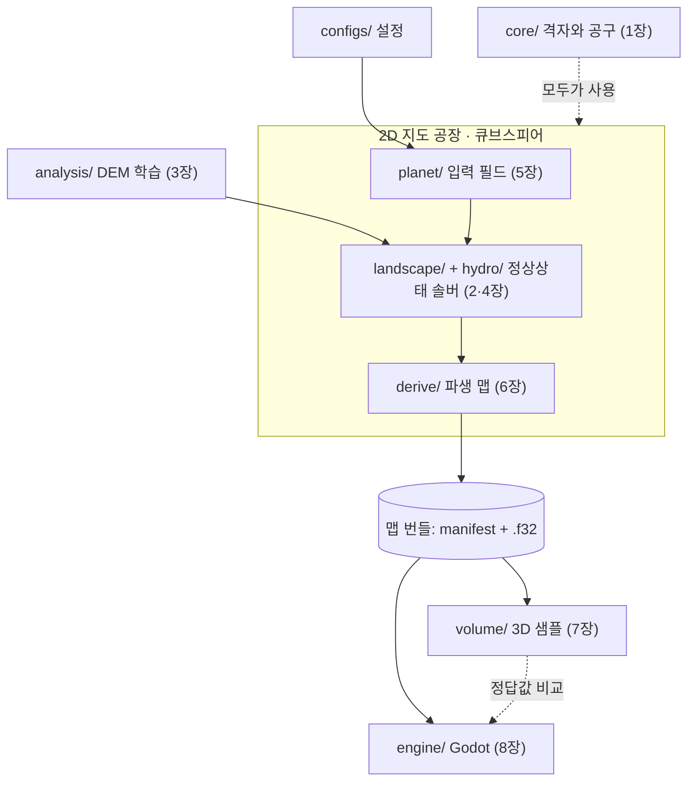
```mermaid
flowchart TD
    A["configs/ 설정"] --> P1
    B["analysis/ DEM 학습 (3장)"] --> P2
    subgraph PIPE["2D 지도 공장 · 큐브스피어"]
        P1["planet/ 입력 필드 (5장)"] --> P2["landscape/ + hydro/ 정상상태 솔버 (2·4장)"]
        P2 --> P3["derive/ 파생 맵 (6장)"]
    end
    G["core/ 격자와 공구 (1장)"] -. 모두가 사용 .-> PIPE
    P3 --> BUN[("맵 번들: manifest + .f32")]
    BUN --> V["volume/ 3D 샘플 (7장)"]
    BUN --> E["engine/ Godot (8장)"]
    V -. 정답값 비교 .-> E
```

### 구현 순서

| 순서 | 장 | 만드는 것 | 실행 환경 |
|---|---|---|---|
| 1 | 1장 | 큐브스피어 격자 (번호, 위치, 면적, 이웃) | 맥 |
| 2 | 2장 | 수계 (채움, 흐름 방향, 유량) | 맥 |
| 3 | 3장 | DEM 파라미터 학습 (1~2와 병행 가능) | 맥 |
| 4 | 4장 | 정상상태 솔버 (평면 격자에서 먼저 검증) | 맥 |
| 5 | 5장 | 행성 입력 필드 (판, 융기, 강수, 바다) | 맥에서 조정, 실습실에서 고해상도 |
| 6 | 6장 | 파생 맵 (수면, 하천, 지하수면, 기준면, 퇴적물) | 맥에서 조정, 실습실에서 고해상도 |
| 7 | 7장 | 3D 샘플 함수 (파이썬 참조 구현) | 맥 |
| 8 | 8장 | 엔진 통합 (Godot) | 맥 |

4장은 5장의 출력을 입력으로 쓰지만 먼저 구현합니다. 평면 격자와 상수 입력으로 솔버를 검증해 두고, 5장이 끝나면 행성 입력을 연결합니다.

### 공통 표기

| 기호 | 뜻 | 단위 |
|---|---|---|
| $R$ | 행성 반지름 | m |
| $\mathbf p$ | 구면 위의 단위 방향 벡터 ($\lVert\mathbf p\rVert=1$) | 없음 |
| $c$ | 셀 번호, $V=\{0,\dots,N-1\}$ | 없음 |
| $f:V\to\mathbb R$ | 필드. 실제로는 길이 $N$인 배열 | 필드마다 다름 |
| $\mathcal N(c)$ | 셀 $c$의 이웃 집합 (최대 8개) | 없음 |
| $A_c$ | 셀 면적 | m² |
| $d_{cc'}$ | 두 셀 중심 사이의 거리 | m |
| $O$ | 바다 셀의 집합 (물이 빠져나가는 곳) | 없음 |
| $z$ | 해수면 기준 고도 | m |
| $P$ | 연강수량 | m/yr |
| $Q$ | 유량 (상류에서 모인 물의 양) | m³/yr |
| $\xi(\mathbf p)$ | 정규화된 노이즈, 대략 $[-1,1]$ | 없음 |

---

## 1. 큐브스피어 격자: 행성 표면에 번호표 붙이기

### 한 줄 요약

구의 표면을 $N=6n^2$개의 칸으로 나누고, 칸마다 번호, 위치, 면적, 이웃을 정합니다. 이후의 모든 단계가 이 위에서 돌아갑니다.

### 비유

주사위에 모눈종이를 붙이고 바람을 불어넣어 공처럼 부풀린다고 생각해 보세요. 모눈 칸이 그대로 구 표면의 칸이 됩니다. 문제는 그냥 부풀리면 면 가운데 칸은 크게 늘어나고 모서리 근처 칸은 작게 쪼그라든다는 것입니다. 그래서 부풀리기 전에 모눈 간격을 미리 조정해 두는데, 이것이 **등각 매핑**입니다.

### 그림

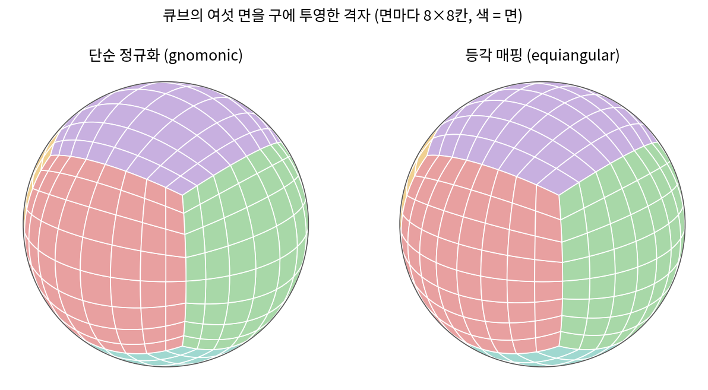

왼쪽은 단순히 정규화한 경우로, 면 모서리 쪽 칸이 눈에 띄게 작습니다. 오른쪽 등각 매핑은 칸 크기가 훨씬 고릅니다.

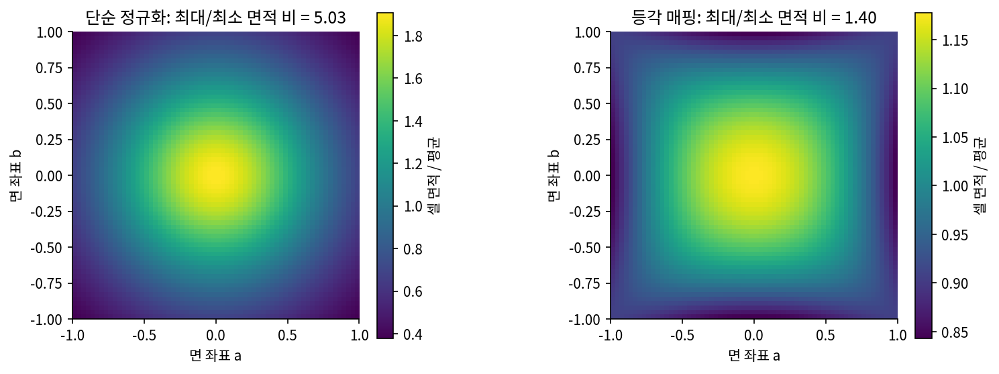

면 하나를 64×64칸으로 나눴을 때 셀 면적을 평균으로 나눈 값입니다. 단순 정규화는 가장 큰 칸과 가장 작은 칸이 약 5배 차이 나고(해상도를 무한히 높이면 약 5.2배), 등각 매핑은 1.40배입니다(극한값 $\sqrt2\approx1.414$). 수계 계산은 셀 면적과 거리를 쓰기 때문에 이 차이가 곧 계산의 품질 차이입니다.

### 수식 풀어 읽기

**면과 기저 벡터.** 여섯 면마다 방향 벡터 세 개를 정합니다. $\mathbf n_f$는 면이 바라보는 방향이고, $\mathbf u_f$와 $\mathbf v_f$는 면 위의 가로와 세로 방향입니다. 오른손 좌표계가 되도록 $\mathbf u_f\times\mathbf v_f=\mathbf n_f$를 지킵니다. 이 프로젝트에서 쓰는 값은 다음과 같습니다.

| 면 $f$ | 이름 | $\mathbf u_f$ | $\mathbf v_f$ | $\mathbf n_f$ |
|---|---|---|---|---|
| 0 | +X | (0, 1, 0) | (0, 0, 1) | (1, 0, 0) |
| 1 | −X | (0, −1, 0) | (0, 0, 1) | (−1, 0, 0) |
| 2 | +Y | (0, 0, 1) | (1, 0, 0) | (0, 1, 0) |
| 3 | −Y | (0, 0, −1) | (1, 0, 0) | (0, −1, 0) |
| 4 | +Z | (1, 0, 0) | (0, 1, 0) | (0, 0, 1) |
| 5 | −Z | (−1, 0, 0) | (0, 1, 0) | (0, 0, −1) |

이 표는 맵 번들의 `manifest.json`에 `face_basis`로 그대로 기록되고, 엔진도 이 값을 읽어서 씁니다.

**등각 사상 (면 좌표 → 구면).** 면 좌표 $(a,b)$는 각각 $-1$에서 $1$ 사이입니다.

$$
\mathbf x_f(a,b)=\frac{\mathbf n_f+X\,\mathbf u_f+Y\,\mathbf v_f}{\sqrt{1+X^2+Y^2}},\qquad X=\tan\frac{\pi a}{4},\quad Y=\tan\frac{\pi b}{4}
$$

읽는 법: $a$를 $-1\sim1$로 고르게 나누면 $\frac{\pi a}{4}$는 $-45°\sim45°$의 **각도**를 고르게 나눈 것이 됩니다. $\tan$은 그 각도를 큐브 면 위의 평면 좌표로 바꿉니다. 분자는 큐브 면 위의 점이고, 분모로 나누면 길이가 1인 구면 위의 점이 됩니다. 각도를 고르게 나눴기 때문에 구면 위의 칸 크기가 고르게 나옵니다.

**역사상 (구면 → 면 좌표).**

$$
f^*(\mathbf p)=\arg\max_f\ \mathbf p\cdot\mathbf n_f,\qquad
a=\frac{4}{\pi}\arctan\frac{\mathbf p\cdot\mathbf u_{f^*}}{\mathbf p\cdot\mathbf n_{f^*}},\qquad
b=\frac{4}{\pi}\arctan\frac{\mathbf p\cdot\mathbf v_{f^*}}{\mathbf p\cdot\mathbf n_{f^*}}
$$

읽는 법: 점 $\mathbf p$를 가장 정면으로 마주보는 면(내적이 가장 큰 면)을 고르고, 등각 사상을 거꾸로 풉니다.

**셀 번호.** 해상도가 $n$이면 셀 $(f,i,j)$의 중심 좌표는 $a_i=-1+\frac{2i+1}{n}$이고, $b_j$도 같습니다.

$$
c=f\,n^2+j\,n+i,\qquad \mathbf p_c=\mathbf x_f(a_i,b_j)
$$

$$
\operatorname{cell}(\mathbf p)=f^*n^2+jn+i,\qquad i=\min\!\Big(\Big\lfloor\frac{n(a+1)}{2}\Big\rfloor,\ n-1\Big)
$$

읽는 법: 면 번호, 행, 열을 한 줄의 번호로 펼칩니다. 모든 필드는 이 번호로 인덱싱되는 1차원 배열입니다.

**셀 면적.** 등각 좌표에서 $a$가 일정한 선은 구 위의 대원(적도 같은 큰 원)입니다. 그래서 셀은 대원 네 개로 둘러싸인 사각형이 되고, 정확한 면적을 닫힌 식으로 구할 수 있습니다.

$$
\Omega(X,Y)=\arctan\frac{XY}{\sqrt{1+X^2+Y^2}}
$$

$$
A_c=R^2\big[\Omega(X_+,Y_+)-\Omega(X_-,Y_+)-\Omega(X_+,Y_-)+\Omega(X_-,Y_-)\big]
$$

여기서 $X_\pm=\tan(\pi a_\pm/4)$이고 $a_\pm$는 셀의 양쪽 경계($-1+2i/n$과 $-1+2(i+1)/n$)입니다.

읽는 법: $\Omega(X,Y)$는 원점에서 큐브 면 위의 사각형 $[0,X]\times[0,Y]$를 바라볼 때의 입체각입니다. 네 모서리 값을 $+,-,-,+$로 조합하면(포함-배제) 셀 하나의 입체각이 됩니다. 면 하나 전체를 넣으면 $4\cdot\frac{\pi}{6}=\frac{2\pi}{3}$이고, 여섯 면을 합치면 $4\pi$로 구 전체의 입체각이 됩니다. 실제로 계산하면 12.566370614359174가 나와 $4\pi$와 소수점 아래 15자리까지 일치합니다.

**이웃 거리.**

$$
d_{cc'}=R\ \operatorname{atan2}\!\big(\lVert\mathbf p_c\times\mathbf p_{c'}\rVert,\ \mathbf p_c\cdot\mathbf p_{c'}\big)
$$

읽는 법: 두 방향 사이의 각도에 반지름을 곱한 대원 거리입니다. $\arccos(\mathbf p_c\cdot\mathbf p_{c'})$와 같은 값이지만, 이웃처럼 아주 가까운 두 점에서는 $\arccos$가 부정확하므로 $\operatorname{atan2}$를 씁니다.

**이웃 규칙.** 8방향 슬롯 $\delta=(\delta_j,\delta_i)$를 다음 순서로 고정합니다: $(-1,-1),(-1,0),(-1,1),(0,-1),(0,1),(1,-1),(1,0),(1,1)$. 이웃 후보 $(i',j')=(i+\delta_i,\,j+\delta_j)$에 대해 세 경우가 있습니다.

- **둘 다 범위 안**: 같은 면의 $(f,i',j')$
- **둘 다 범위 밖**: 큐브 꼭짓점의 대각선 방향이므로 이웃 없음 ($-1$)
- **하나만 범위 밖**: 면 경계를 넘어 인접 면으로 갑니다.

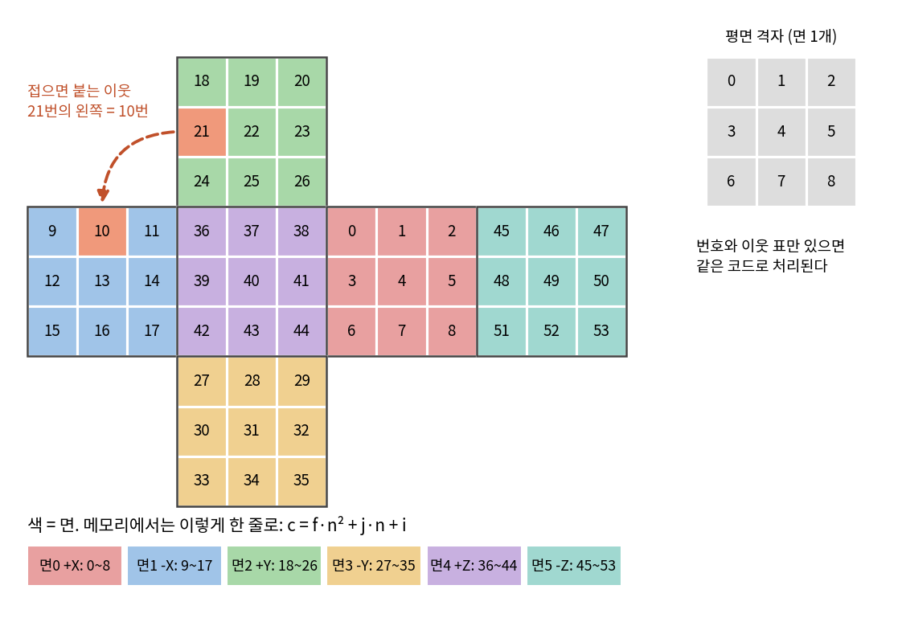

전개도에서는 21번과 10번이 떨어져 보이지만, 주사위처럼 접으면 바로 붙어 있는 칸입니다. 이런 "접었을 때의 이웃"을 계산하는 방법은 이렇습니다. (그림의 칸 배치는 설명용이며, 실제 인덱스 방향은 위 기저 표가 정합니다.)

1. 넘어간 방향 $\mathbf e$를 정합니다. $i'=n$이면 $\mathbf e=\mathbf u_f$, $i'=-1$이면 $\mathbf e=-\mathbf u_f$이고, $j$ 쪽이면 $\pm\mathbf v_f$입니다.
2. 인접 면 $f'$은 $\mathbf n_{f'}=\mathbf e$인 면입니다.
3. 범위 안에 남은 인덱스를 $k$, 그 축 방향을 $\mathbf t$라 합니다.
4. $f'$의 두 축 $\{\mathbf a_1,\mathbf a_2\}=\{\mathbf u_{f'},\mathbf v_{f'}\}$로 두 벡터를 표현합니다: $\mathbf n_f=\sigma_1\mathbf a_1$, $\mathbf t=\sigma_2\mathbf a_2$, $\sigma_1,\sigma_2\in\{\pm1\}$.
5. 이웃 셀의 인덱스는 $\mathbf a_1$ 축으로 ($\sigma_1=+1$이면 $n-1$, 아니면 $0$), $\mathbf a_2$ 축으로 ($\sigma_2=+1$이면 $k$, 아니면 $n-1-k$)입니다.

왜 이게 정확할까요? 두 면이 공유하는 경계선 위에서는 양쪽 면의 경계 방향 좌표가 정확히 같습니다. 그래서 칸의 줄이 어긋나지 않고, 인덱스를 바꾸고 뒤집는 것만으로 대응됩니다. 이웃 관계가 양방향으로 정확히 대칭이 되는 이유입니다.

### 면 경계에서는 무슨 일이 생기나

**경계에 걸친 지형도 어색하지 않습니다.** 이 프로젝트에서 지형을 만드는 규칙은 모두 면이 아니라 구 위에서 정의됩니다. 노이즈는 3D 좌표에서 직접 읽으므로 면이라는 개념이 없고(5장), 판은 구면 위의 내적으로 나누므로 면과 무관합니다(5장). 물의 흐름은 이웃 표를 따라가는 하나의 그래프라서, 강이 면 경계를 건너는 것은 평범한 한 칸 이동과 같습니다(2장). 3D 복셀은 직교 격자라서 면이 아예 없고, 2D 지도는 경계에서 끊기지 않게 보간해서 읽습니다(7장). 그래서 산맥이 경계에 걸쳐 있어도 다른 곳과 똑같은 방식으로 계산됩니다. 면이 흔적을 남길 수 있는 곳은 **격자의 모양**뿐이고, 아래에서 하나씩 짚습니다.

**1.40은 경계에서 생기는 오차가 아닙니다.** 앞의 1.40은 격자 전체에서 가장 큰 칸(면 중심)과 가장 작은 칸(면 모서리 중점)의 면적 비입니다. 경계를 사이에 둔 두 칸은 경계를 기준으로 거울 대칭이라 면적이 정확히 같습니다.

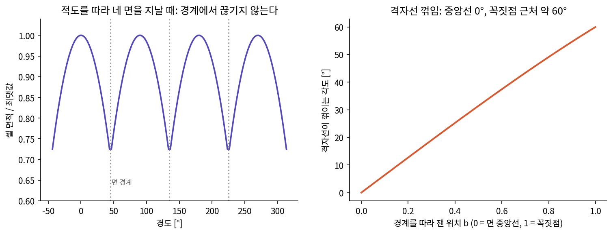

왼쪽 그래프처럼 적도를 따라가며 셀 면적을 그려 보면 경계에서 끊기지 않고 V자 바닥을 이룹니다. 붙어 있는 두 칸의 면적 비는 면당 256칸에서 최대 1.006, 1024칸에서 1.0016입니다. 크기가 다른 것 자체는 오차가 아니라 "곳곳의 해상도가 조금씩 다르다"는 뜻입니다(한 변 길이로는 최대 약 1.19배). 모든 계산이 셀마다의 실제 면적 $A_c$와 실제 거리 $d_{cc'}$를 쓰므로 유량과 경사 같은 물리량은 정확합니다.

**격자선은 경계에서 꺾입니다.** 경계를 넘으면 격자선의 방향이 바뀝니다. 위 오른쪽 그래프처럼 면 중앙선($b=0$)에서는 꺾이지 않고, $b=0.5$에서 약 31°, $b=0.9$에서 약 55°, 꼭짓점 근처에서는 약 60°까지 꺾입니다. 격자의 "8방향"이 경계 양쪽에서 다르게 놓인다는 뜻입니다. 셀 크기와 필드 값에는 아무 문제가 없지만, 물을 8방향 중 하나로만 보내는 D8은 지형에 격자 방향의 결을 남기고, 그 결의 방향이 경계에서 바뀌면 이음새처럼 보일 수 있습니다. 이 문제는 2장의 다중 흐름 방향(MFD)으로 해결합니다.

**꼭짓점 8곳에서는 세 면이 만납니다.** 세 칸이 120°씩 만나고 이웃이 7개입니다. 이웃 표의 빈 슬롯($-1$)으로 이미 처리되며 흐름 계산에도 문제가 없습니다.

**경계를 넘는 보간은 7장에서 따로 처리합니다.** 쌍선형 보간에 필요한 고스트 셀은 인접 면의 값을 그대로 복사하면 안 됩니다. 7장의 "면 경계를 넘는 보간"을 보세요.

| 면 경계 문제 | 영향 | 해결 |
|---|---|---|
| 셀 크기 차이 (최대 1.41배) | 없음 (실제 면적과 거리를 씀) | 이미 해결됨 |
| 격자선 꺾임 (최대 약 60°) | 강 방향에 격자의 결 | 적응형 MFD (2·4장) |
| 꼭짓점 (이웃 7개) | 없음 | 이웃 표의 빈 슬롯 |
| 경계를 넘는 보간 | 표면에 미세한 주름 | 고스트 셀 재보간 (7장) |

### 구현 메모

`src/bpcg/core/cubesphere.py`에 다음 함수를 만듭니다.

| 함수 | 입력 → 출력 |
|---|---|
| `to_sphere(f, a, b)` | 면 좌표 → 단위 벡터 (등각 사상) |
| `to_face(p)` | 단위 벡터 → $(f,a,b)$ (역사상) |
| `cell_of(p, n)` | 단위 벡터 → 셀 번호 |
| `face_cell_areas(n, R)` | 면 하나분의 셀 면적 $(n,n)$ |
| `face_neighbor_dists(n, R)` | 면 하나분의 이웃 거리 $(n,n,8)$ |
| `neighbor_table(n)` | 전체 이웃 표 $(6n^2, 8)$, int32, 없으면 $-1$ |
| `cubesphere_grid(n, R)` | 위 결과를 묶은 `Grid` |

여섯 면은 기하학적으로 똑같으므로 면적과 거리는 면 하나분만 저장하고, `c % n**2`로 조회합니다.

### 확인하기

| 검사 | 수식 | 의미 |
|---|---|---|
| 면적 합 | $\big\lvert\sum_c A_c-4\pi R^2\big\rvert/4\pi R^2<10^{-6}$ | 면적 공식이 맞다 |
| 이웃 대칭 | $c'\in\mathcal N(c)\iff c\in\mathcal N(c')$ | 면 경계 규칙이 맞다 |
| 왕복 변환 | 모든 $c$에서 $\operatorname{cell}(\mathbf p_c)=c$ | 사상과 역사상이 서로 맞다 |
| 이웃 개수 | 이웃 7개인 셀이 정확히 24개, 나머지는 8개 | 꼭짓점 처리(8개 꼭짓점 × 3면)가 맞다 |
| 면적 비 | $n$이 커질수록 $\max A/\min A\to\sqrt2$ | 등각 매핑이 제대로 적용됐다 |
| 경계 양쪽 면적 | 면 경계를 사이에 둔 두 셀의 면적 상대 차이 $<10^{-10}$ | 면 경계에서 셀 크기가 끊기지 않는다 |
| 회전 테스트 | 입력을 임의로 회전해 다시 생성해도 격자 정렬 지수, θ 추정값, 고도 분포가 통계적으로 같음 | 면 경계의 위치가 결과에 흔적을 남기지 않는다 |

```python
# tests/test_cubesphere.py
def test_area_sum():
    g = cubesphere_grid(n=64, R=1.0)
    total = 6 * g.area.sum()                      # 면 하나분 × 6
    assert abs(total - 4 * np.pi) / (4 * np.pi) < 1e-6

def test_neighbor_symmetry():
    g = cubesphere_grid(n=16, R=1.0)
    for c in range(g.n):
        for c2 in g.nbr[c]:
            if c2 >= 0:
                assert c in g.nbr[c2]

def test_roundtrip():
    g = cubesphere_grid(n=16, R=1.0)
    assert np.all(cell_of(g.pos, 16) == np.arange(g.n))

def test_corner_cells():
    g = cubesphere_grid(n=16, R=1.0)
    k = (g.nbr >= 0).sum(axis=1)
    assert (k == 7).sum() == 24 and np.all(k[k != 7] == 8)

def test_edge_area_continuity():
    g = cubesphere_grid(n=256, R=1.0)
    A = g.area_full()                         # 길이 N
    for c, c2 in g.cross_face_pairs():        # 면 경계를 사이에 둔 가로·세로 이웃 쌍
        assert abs(A[c] / A[c2] - 1) < 1e-10
```

**회전 테스트.** 격자 자체는 위 검사로 확인되지만, "면 경계가 결과 지형에 흔적을 남기는가"는 파이프라인 전체를 돌려 봐야 알 수 있습니다. 모든 입력 필드를 샘플하는 위치를 회전 행렬 $\mathbf M$으로 $\mathbf p\to\mathbf M\mathbf p$처럼 바꿔서 생성하면, 같은 행성이 격자에 대해 다르게 놓입니다. 면 경계가 산맥 한가운데를 지나던 행성이 이번에는 바다 위를 지나게 되는 식입니다. 격자가 결과에 영향을 주지 않는다면 두 행성의 통계가 같아야 합니다. 특히 면 경계 근처 띠($|a|>0.9$ 또는 $|b|>0.9$)와 면 중심 띠에서 따로 격자 정렬 지수(2장)를 구해, 두 값이 모두 1에 가깝고 서로 비슷한지 봅니다. 격자 정렬 지수의 방향은 각 면의 로컬 격자 좌표 $(i,j)$로 재고, 추적 중 면 경계를 넘는 경로는 제외합니다.

```python
# tests/test_pipeline_rotation.py
def test_rotation_invariance():
    base = generate_planet(seed=1, rotation=np.eye(3), profile="laptop")
    rot = generate_planet(seed=1, rotation=random_rotation(7), profile="laptop")
    for P in (base, rot):
        assert grid_alignment(P, band="edge") < 1.3     # 면 경계 근처
        assert grid_alignment(P, band="center") < 1.3   # 면 중심
    assert abs(theta_fit(base) - theta_fit(rot)) < 0.03
    assert hypsometry_distance(base, rot) < 0.02        # 고도 분포 곡선의 차이
```

---

## 2. 수계: 물의 길 찾기

### 한 줄 요약

고도 지도를 받아 물이 어디로 흘러서 어디에 얼마나 모이는지 계산합니다. 1장의 번호와 이웃 표만 쓰므로 평면이든 구면이든 같은 코드가 돌아갑니다.

### 비유

지도 위에 빗방울을 떨어뜨리면 가장 가파른 내리막으로 굴러갑니다. 웅덩이에 빠지면 넘칠 때까지 물이 찬 뒤 가장 낮은 고개를 넘어 계속 흘러갑니다. 이 장은 그 과정을 네 개의 부품으로 나눠 계산합니다.


```mermaid
flowchart LR
    Z["고도 z"] --> F["① 채움<br/>웅덩이를 넘침 높이까지"]
    F --> R["② 수신 셀<br/>각 칸이 물을 보내는 이웃"]
    R --> S["③ 순서<br/>하류가 먼저 오도록 정렬"]
    S --> Q["④ 유량<br/>상류부터 물을 모음"]
```

### ① 채움: 웅덩이를 넘침 높이까지

$$
\hat z_c=\min_{\gamma:\,c\to O}\ \max_{c''\in\gamma}\ z_{c''}
$$

읽는 법: 셀 $c$에서 바다까지 가는 길 $\gamma$는 여러 개입니다. 길마다 "넘어야 하는 가장 높은 고개"가 있고, 그중 **가장 낮은 고개의 높이**가 $\hat z_c$입니다. 물은 그 높이까지 차올라야 바다로 빠져나갈 수 있기 때문입니다. 웅덩이가 아닌 곳은 $\hat z_c=z_c$이고, 웅덩이 안은 $\hat z_c>z_c$입니다. 그래서 호수는 $L=\{c:\hat z_c>z_c\}$이고, 호수 수면은 $\hat z_c$입니다.

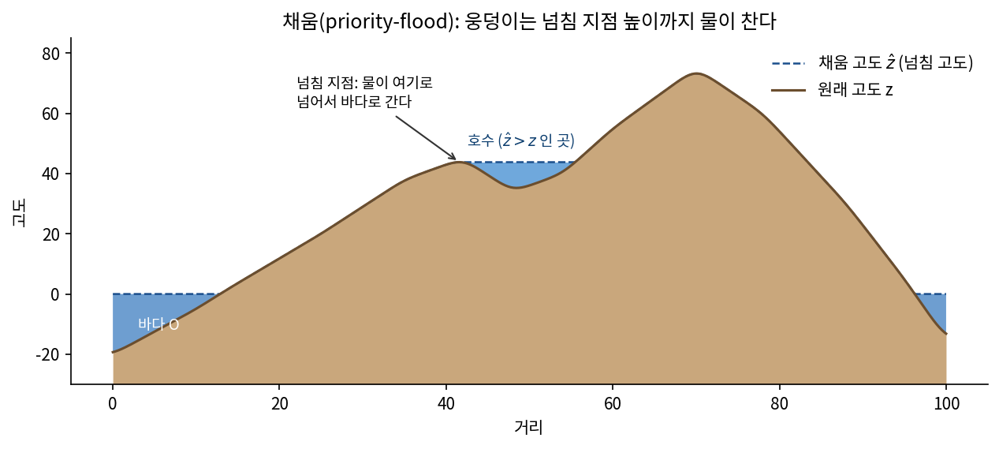

**계산 방법 (priority-flood).** 바다에서부터 물이 차오르는 홍수를 흉내 냅니다. 바다 셀을 모두 최소 힙에 넣고, 가장 낮은 셀을 꺼낼 때마다 아직 방문하지 않은 이웃을 방문해 높이를 정합니다.

```text
힙 ← 모든 바다 셀 (키 = 고도)
while 힙이 비지 않음:
    c ← 힙에서 가장 낮은 셀
    for c' in 방문하지 않은 이웃(c):
        ẑ[c'] = max(z[c'], ẑ[c])        # 낮으면 c 높이까지 물이 찬다
        방문 표시, 힙에 넣기
```

**라우팅용 ε 채움.** 위 방식으로 채운 호수는 수면이 완전히 평평해서 물이 어느 쪽으로 흘러야 할지 정해지지 않습니다. 그래서 라우팅용으로는 $\tilde z_{c'}=\max(z_{c'},\ \tilde z_c+\epsilon)$로 아주 작은 기울기($\epsilon\approx10^{-3}$ m)를 줘서 $\tilde z$를 따로 만듭니다. 그러면 바다가 아닌 모든 셀에 자기보다 확실히 낮은 이웃이 생깁니다. 호수 수면에는 $\hat z$를, 흐름 방향에는 $\tilde z$를 씁니다.

### ② 수신 셀: 각 칸은 물을 어디로 보내나

$$
r(c)=\arg\max_{c'\in\mathcal N(c)}\frac{\tilde z_c-\tilde z_{c'}}{d_{cc'}}\quad(c\notin O),\qquad r(c)=c\quad(c\in O)
$$

$$
S_c=\frac{\tilde z_c-\tilde z_{r(c)}}{d_{c\,r(c)}}
$$

읽는 법: 이웃 8개 중에서 "높이 차 ÷ 거리"가 가장 큰, 즉 가장 가파르게 내려가는 이웃이 수신 셀입니다(D8 방식). 그때의 경사가 $S_c$입니다. 바다 셀은 자기 자신을 가리킵니다. 반대로 나에게 물을 보내는 셀들은 기여 셀 $D(c)=\{c'\ne c:\ r(c')=c\}$입니다.

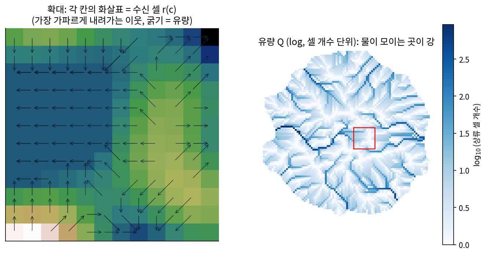

왼쪽은 오른쪽 지도의 빨간 사각형을 확대한 것으로, 각 칸의 화살표가 수신 셀을 가리킵니다. 평평한 영역은 채움으로 메워진 웅덩이인데, ε 덕분에 화살표가 넘침 지점 쪽으로 끊기지 않고 이어집니다. 오른쪽은 이렇게 연결된 흐름을 따라 모은 유량으로, 진하게 모이는 선이 강이 됩니다.

$r$을 따라가면 $\tilde z$가 항상 줄어들기 때문에 같은 칸으로 되돌아올 수 없습니다. 그래서 수신 셀의 연결은 바다 셀을 뿌리로 하는 **나무(트리)의 모음**이 됩니다. 강의 지류가 합쳐지는 모습 그대로입니다.

### ③ 순서: 하류가 먼저 오도록

순열 $\sigma$는 모든 $c\notin O$에 대해 다음을 만족합니다.

$$
\operatorname{rank}_\sigma\big(r(c)\big)<\operatorname{rank}_\sigma(c)
$$

읽는 법: 어떤 셀이 목록에 나올 때, 그 셀의 하류는 항상 앞에 이미 나와 있습니다. 바다 셀(뿌리)에서 출발해 기여 셀을 따라 깊이 우선 탐색하면 이 순서가 자연스럽게 만들어집니다. 이 순서를 **거꾸로** 돌면 상류부터, **그대로** 돌면 하류부터 처리하게 됩니다.

### ④ 유량: 물 모으기

$$
Q_c=A_cP_c+\sum_{c'\in D(c)}Q_{c'}
$$

읽는 법: 내 칸의 유량은 "내 칸에 내린 비"에 "나에게 흘러드는 이웃들의 유량"을 더한 것입니다. 순서 $\sigma$를 거꾸로(상류부터) 돌면 각 셀을 처리할 때 기여 셀들의 값이 이미 다 계산되어 있으므로 한 번만 훑으면 끝납니다. 강수를 $P\equiv1$로 두면 $Q$가 상류 유역 면적 $A^\uparrow_c$가 됩니다.

### ⑤ 다중 흐름 방향(MFD): 격자의 결 없애기

**왜 필요한가.** D8은 물을 8방향 중 하나로만 보냅니다. 그래서 강이 가로, 세로, 대각선으로 곧게 뻗는 "결"이 지형에 새겨집니다. 같은 원형 섬에 같은 파라미터로 4장 솔버를 돌려 보면 차이가 분명합니다.

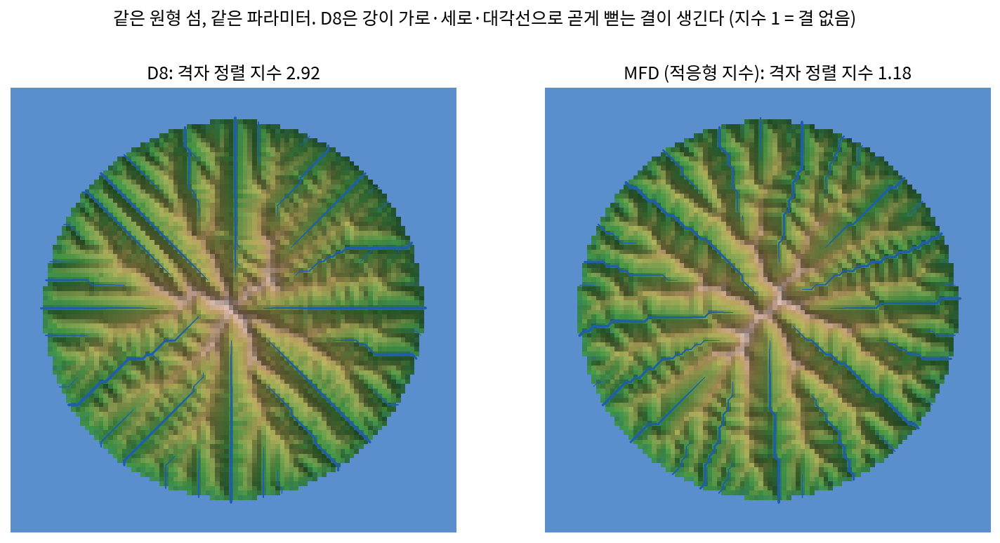

**격자 정렬 지수.** 결을 숫자로 재는 방법입니다. 하천 셀마다 하류로 6칸 따라간 방향이 격자 8방향 중 하나와 ±5° 안에 들어가는 비율을 구하고, 방향이 무작위일 때의 비율($10°/45°$)로 나눕니다. 1이면 결이 없고, 클수록 격자에 정렬된 것입니다. 위 섬에서 D8은 2.92(무작위보다 약 3배 자주 격자 방향으로 흐름), MFD는 1.18입니다.

평면에서는 이 결이 약간 인공적으로 보이는 정도로 끝납니다. 그런데 큐브스피어에서는 1장에서 본 것처럼 격자 방향이 면 경계에서 최대 60°까지 꺾입니다. 결의 방향이 경계에서 갑자기 바뀌면, 셀 크기나 값이 연속이어도 지형이 경계에서 어색해 보입니다. 결 자체를 없애면 경계도 보이지 않게 됩니다.

**수신 셀 집합.** 가장 가파른 이웃 하나가 아니라, 나보다 낮은 이웃 전부가 물을 받습니다.

$$
\mathcal R(c)=\{c'\in\mathcal N(c):\ \tilde z_{c'}<\tilde z_c\}
$$

**분배 비율.**

$$
w_{cc'}=\frac{\ell_{cc'}\,S_{cc'}^{\,p_c}}{\sum_{k\in\mathcal R(c)}\ell_{ck}\,S_{ck}^{\,p_c}},\qquad S_{cc'}=\frac{\tilde z_c-\tilde z_{c'}}{d_{cc'}}
$$

읽는 법: 더 가파른 쪽으로 더 많이 보냅니다. $\ell$은 이웃 방향으로 물이 지나가는 등고선 길이의 가중치로, 가로·세로 이웃은 0.5, 대각선 이웃은 0.354를 씁니다(Quinn 등이 제안한 값). 지수 $p$가 클수록 가장 가파른 쪽으로 몰리고, $p\to\infty$이면 D8과 같아집니다. 비율의 합이 1이므로 질량 보존은 그대로 유지됩니다. 큰 $p$에서 거듭제곱이 0으로 사라지지 않도록, 계산할 때는 경사를 그 셀의 최대 경사로 나눠 정규화한 뒤 거듭제곱합니다.

**적응형 지수.** $\bar A=4\pi R^2/N$은 평균 셀 면적, $\bar P$는 기준 강수입니다.

$$
p_c=p_{\min}+(p_{\max}-p_{\min})\ \operatorname{sst}\!\left(\frac{\log_{10}\!\big(Q_c/\bar A\bar P\big)-\log_{10}q_1}{\log_{10}q_2-\log_{10}q_1}\right)
$$

기본값은 $p_{\min}=1.1$, $p_{\max}=8$, $q_1=10$, $q_2=300$(셀 개수 단위)입니다.

읽는 법: 물이 적은 사면에서는 $p\approx1.1$로 넓게 퍼뜨려 결을 없애고, 물이 많이 모인 하천에서는 $p\approx8$로 한쪽에 모아 강이 여러 갈래로 흩어지지 않게 합니다. $p$를 1.1로 고정하면 큰 강까지 퍼져 버리고, 크게 고정하면 D8과 비슷해져 결이 돌아옵니다.

**순서와 유량.** MFD의 연결은 트리가 아니라, 물줄기가 나뉘었다 합쳐지는 그래프(DAG)입니다. 순서는 $\tilde z$의 내림차순 정렬로 정합니다. 물은 항상 낮은 곳으로만 가므로 높은 셀부터 처리하면 모든 상류가 먼저 처리됩니다. 셀을 처리하는 시점에 그 셀의 $Q_c$가 이미 확정되어 있으므로, $p_c$도 그 자리에서 계산할 수 있습니다.

$$
Q_c=A_cP_c+\sum_{k:\ c\in\mathcal R(k)}w_{kc}\,Q_k
$$

**주 수신 셀.** 분배 비율이 가장 큰 이웃 $r^*(c)=\arg\max_{c'}w_{cc'}$입니다. 하천 폴리라인 추출, 강 수면 단조성 강제, 하류 추적에는 이것을 씁니다(6장).

**유량만 바꾸면 부족합니다.** D8로 쌓은 지형 위에서 유량 계산 방식만 바꿔 보면 아래와 같습니다(4장 섬의 일부 확대). 사면의 흐름은 MFD 쪽이 훨씬 자연스럽지만, 강 자체는 여전히 곧게 뻗어 있습니다. 지형의 결은 **높이를 쌓을 때** 새겨지기 때문입니다. 그래서 4장의 솔버도 MFD 버전으로 바꿔야 결이 사라집니다.

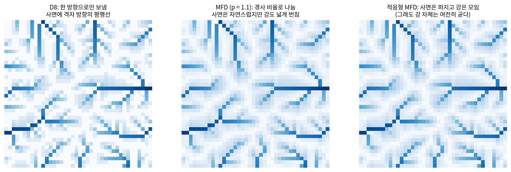

**메모리.** 분배 비율을 저장하면 셀당 8개라 면당 4096²에서 약 3.2 GB가 필요합니다. 저장하지 말고 필요할 때 $\tilde z$에서 다시 계산합니다. 계산이 결정적이므로 몇 번을 해도 같은 값이 나옵니다.

### 구현 메모

`src/bpcg/hydro/`에 `depressions.py`(채움), `routing.py`(수신 셀, 순서), `accumulate.py`(유량)를 둡니다. 채움은 힙을 쓰므로 $O(N\log N)$, 나머지는 $O(N)$입니다. 모두 순차적인 알고리즘이라 Numba로 CPU에서 돌립니다. 이웃은 항상 `neighbor(c, k)` 헬퍼로만 접근합니다. MFD는 `mfd.py`에 두고, D8과 MFD를 설정으로 바꿀 수 있게 합니다(`routing = "d8" | "mfd"`). D8은 fastscapelib 비교처럼 기준 검증에, MFD는 실제 행성 생성에 씁니다.

### 확인하기

| 검사 | 수식 | 의미 |
|---|---|---|
| 싱크 없음 | 모든 $c\notin O$에서 $\tilde z_{r(c)}<\tilde z_c$ | 모든 물이 결국 바다로 간다 |
| 질량 보존 | $\sum_{c\in O}Q_c=\sum_{c\in V}A_cP_c$ | 내린 비가 새거나 늘지 않는다 |
| 채움의 성질 | $\hat z\ge z$, 연결된 호수마다 $\hat z$가 일정 | 호수 수면이 평평하다 |
| 기준 비교 | 실제 DEM에서 $A^\uparrow$가 topotoolbox와 거의 일치 | 구현이 표준 도구와 같다 |
| MFD 분배 비율 | 모든 셀에서 $w\ge0$, $\sum_{c'}w_{cc'}=1$ | MFD에서도 물이 새거나 늘지 않는다 |
| 격자 정렬 지수 | 원형 섬 테스트에서 MFD < 1.3 (D8은 약 2.9) | 격자의 결이 사라졌다 |

```python
# tests/test_hydro.py
def test_mass_conservation():
    g = flat_grid(64, 64, dx=100.0)
    z, ocean = random_terrain(g, seed=0)
    zt = fill_eps(g, z, ocean, eps=1e-3)
    r = receivers(g, zt, ocean)
    order = topo_order(r)
    Q = accumulate(g, r, order, P=np.ones(g.n))
    roots = np.nonzero(r == np.arange(g.n))[0]
    assert np.isclose(Q[roots].sum(), g.cell_area_full().sum())
```

---

## 3. DEM 파라미터 학습: 실제 강에게 규칙 배우기

### 한 줄 요약

실제 지구의 지형 데이터(DEM)에서 "유역이 커질수록 강의 경사가 얼마나 완만해지는가"라는 규칙을 숫자로 뽑아냅니다. 이 숫자가 4장 솔버의 기준이 됩니다.

### 비유

강의 상류는 물이 적어 힘이 약하므로, 바위를 깎으려면 가파른 경사가 필요합니다. 하류로 갈수록 물이 모여 힘이 세지므로 완만한 경사로도 충분히 깎습니다. 그래서 강의 종단면은 위가 급하고 아래가 완만한 **오목한 곡선**이 됩니다. 그 오목한 정도가 **θ(오목도 지수)** 입니다.

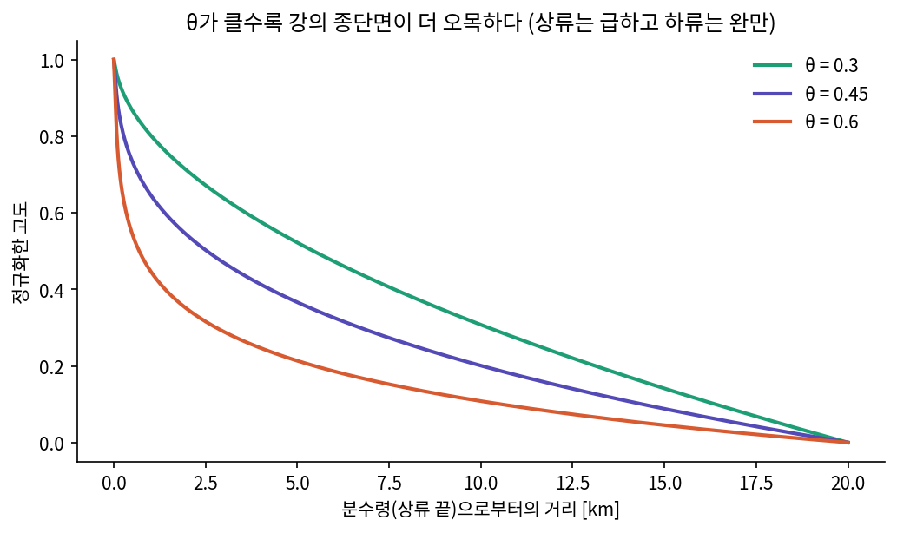

### 배경 이론: stream power law

하천이 바닥을 깎는 속도 $E$는 유량 $Q$와 경사 $S$에 따라 커진다는 경험 법칙입니다. $K$는 암석이 얼마나 잘 깎이는지를 나타냅니다.

$$
E=K\,Q^{m}S^{n}
$$

땅이 솟아오르는 속도(융기 $U$)와 깎이는 속도가 같아지면 지형이 더 이상 변하지 않는 **정상상태**가 됩니다. $U=E$를 $S$에 대해 풀면:

$$
S=k_s\,Q^{-\theta},\qquad k_s=\Big(\frac{U}{K}\Big)^{1/n},\qquad \theta=\frac{m}{n}
$$

읽는 법: 정상상태의 강에서 경사는 유량의 거듭제곱에 반비례합니다. $k_s$(경사 지수)는 "얼마나 가파른가"를, $\theta$는 "유량이 늘 때 얼마나 빨리 완만해지는가"를 나타냅니다. 양변에 로그를 취하면 $\log S=\log k_s-\theta\log Q$로 **직선**이 됩니다. 이 직선의 기울기를 재면 θ를 알 수 있습니다.

### 수식 풀어 읽기

**하천 셀 고르기.** 미터 좌표로 재투영한 DEM에 2장을 $P\equiv1$로 적용해 상류 유역 면적 $A^\uparrow$와 경사 $S$를 구합니다. 유역이 일정 크기 이상인 곳만 하천으로 봅니다($A_{crit}\approx10^5\sim10^6$ m²).

$$
C=\{c:\ A^\uparrow_c\ge A_{crit},\ S_c>0\}
$$

**구간 중앙값 회귀.** 셀 하나하나는 잡음이 크므로, $\log A$를 일정한 폭의 구간으로 나누고 구간마다 경사의 중앙값 $\tilde S_j$를 구한 뒤 직선을 맞춥니다.

$$
\log_{10}\tilde S_j=\log_{10}k_s-\theta\,\log_{10}\bar A_j
$$

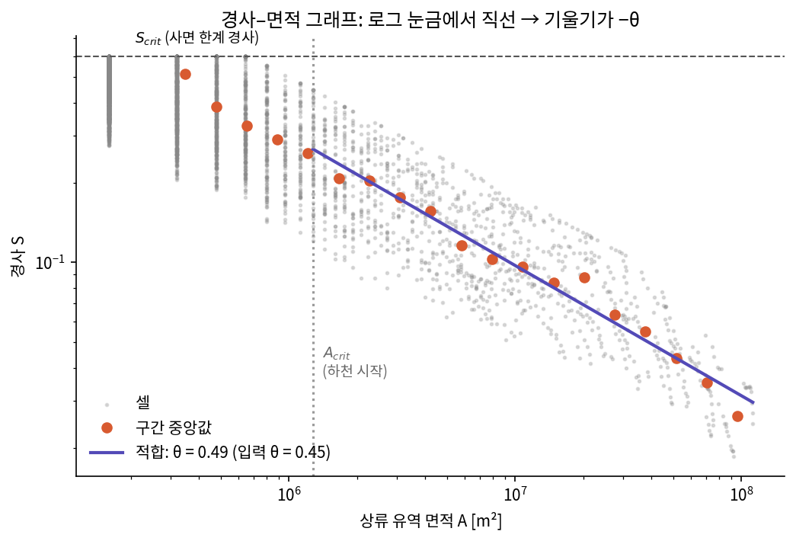

이 그래프의 점들은 4장 솔버로 만든 섬 지형에서 뽑은 것입니다. 오른쪽 아래로 뻗은 부분이 하천 구간이고, 왼쪽 위에 평평하게 쌓인 부분이 사면 구간(경사가 $S_{crit}$에 막힘)입니다.

눈여겨볼 점이 있습니다. 솔버에 넣은 θ는 0.45인데 추정값은 0.49가 나왔습니다. 이 섬은 내륙일수록 융기가 커서 $k_s$가 크고, 내륙은 곧 상류(유역이 작은 곳)입니다. $k_s$가 유역 면적과 함께 변하면 직선의 기울기가 그만큼 치우칩니다. 실제 DEM을 분석할 때도 같은 일이 생기므로, **융기와 암석 조건이 비슷한 지역끼리 나눠서** 맞춰야 합니다.

**지역 간 비교: 정규화 경사 지수.** 지역마다 구한 $\hat\theta$의 중앙값을 기준 오목도 $\theta_{ref}$로 고정하고, 모든 셀의 경사를 같은 기준으로 환산합니다.

$$
k_{sn,c}=S_c\,\big(A^\uparrow_c\big)^{\theta_{ref}},\qquad k_{sn}^{\text{지역}}=\operatorname{median}_{c\in C}\,k_{sn,c}
$$

읽는 법: θ를 고정해 두면 $k_{sn}$ 하나로 "이 지역 강이 얼마나 가파른가"를 비교할 수 있습니다.

**유량 기준으로 변환.** DEM 분석은 면적 $A$ 기준이지만 솔버는 강수가 반영된 유량 $Q$ 기준입니다. 유역 평균 강수 $\bar P$로 $Q=\bar PA$라 두면:

$$
k_s^{Q}=k_{sn}\,\bar P^{\,\theta_{ref}}
$$

$k_s^Q$의 단위는 $Q$의 단위에 따라 달라지므로, 학습과 생성에서 반드시 같은 단위(m³/yr)를 씁니다. WorldClim 강수는 mm/월이므로 12개월을 합하고 1000으로 나눠 m/yr로 바꿉니다.

**한계 경사.** 사면 셀 $H=\{c:A^\uparrow_c<A_{crit}\}$의 경사 분포에서 상위 5% 값을 씁니다. 그래프 왼쪽 위의 평평한 천장이 이 값입니다.

$$
S_{crit}=\operatorname{quantile}_{0.95}\{S_c:\ c\in H\}
$$

### 구현 메모

`analysis/fit_stream_power.py`가 다음 형식의 파일을 만듭니다.

```toml
# configs/learned/stream_power.toml
theta_ref = 0.45
ks_lo = 60.0      # 지역별 k_s^Q 분포의 10번째 백분위수
ks_hi = 250.0     # 90번째 백분위수
s_crit = 0.6
q_unit = "m3/yr"
```

### 확인하기

| 검사 | 기준 | 의미 |
|---|---|---|
| θ 범위 | $\hat\theta\in[0.3,\,0.7]$ | 전 세계적으로 관측되는 범위 안이다 |
| 적합도 | 구간 회귀의 $R^2\ge0.8$ | 직선 관계가 실제로 성립한다 |
| 한계 경사 | $S_{crit}\in[0.5,\,1.0]$ (약 27°~45°) | 실제 산사면의 안정 각도와 맞다 |

---

## 4. 정상상태 솔버: 바다에서부터 계단 쌓기

### 한 줄 요약

수천만 년의 침식을 시뮬레이션하지 않고, "이미 평형에 도달한 지형"을 바로 계산합니다.

### 비유

바다에서 출발해 강을 거슬러 올라가며 계단을 쌓는다고 생각해 보세요. 한 칸 올라갈 때마다 그 칸의 유량이 정해 주는 경사만큼 높이를 올립니다. 유량이 큰 하류는 조금씩, 유량이 작은 상류는 많이씩 올라갑니다. 다만 흐름 방향은 지형이 정해지고 나서야 알 수 있으므로, "흐름 계산 → 계단 쌓기"를 흐름이 더 이상 바뀌지 않을 때까지 반복합니다.

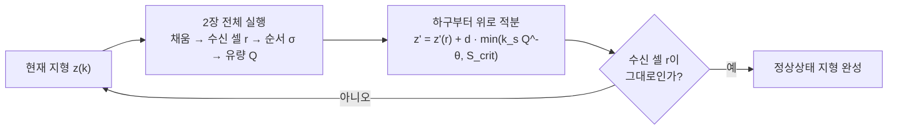
```mermaid
flowchart LR
    Z["현재 지형 z(k)"] --> F["2장 전체 실행<br/>채움 → 수신 셀 r → 순서 σ → 유량 Q"]
    F --> I["하구부터 위로 적분<br/>z' = z'(r) + d · min(k_s Q^-θ, S_crit)"]
    I --> C{"수신 셀 r이<br/>그대로인가?"}
    C -- "아니오" --> Z
    C -- "예" --> D["정상상태 지형 완성"]
```

### 그림

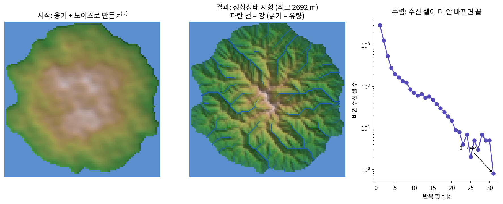

96×96 평면 격자(셀 400 m), $\theta=0.45$, $k_s=60\sim250$, $S_{crit}=0.6$으로 실제로 돌린 결과입니다. 왼쪽의 뭉개진 노이즈 언덕이 오른쪽처럼 골짜기와 능선, 가지 친 수계를 가진 지형으로 바뀝니다. 오른쪽 그래프는 반복마다 수신 셀이 몇 개 바뀌었는지를 보여 줍니다. 31번째 반복에서 0이 되어 수렴했습니다. 순수 파이썬 루프로도 몇 초면 끝나는 계산입니다.

### 수식 풀어 읽기

**한 번의 반복 $\Phi$.**

1. 현재 $z$로 2장을 실행합니다: $\tilde z=\operatorname{Fill}_\epsilon(z)$, $r=\operatorname{D8}(\tilde z)$, 순서 $\sigma$, 유량 $Q=\operatorname{Acc}(r,P)$.
2. $\sigma$ 순서(하류부터)로 새 고도를 쌓습니다.

$$
z'_c=0\quad(c\in O),\qquad
z'_c=z'_{r(c)}+d_{c\,r(c)}\cdot\min\!\big(k_{s,c}\,Q_c^{-\theta},\ S_{crit}\big)\quad(c\notin O)
$$

읽는 법: 내 높이는 "내가 물을 보내는 하류 칸의 높이"에 "그 칸까지의 거리 × 경사"를 더한 것입니다. 경사는 정상상태 법칙 $k_sQ^{-\theta}$로 정하되, 산사면이 무너지지 않는 한계 $S_{crit}$를 넘지 않게 자릅니다. $\sigma$ 순서로 돌기 때문에 내 하류 칸의 높이는 항상 먼저 계산되어 있습니다.

**수렴 조건.** $\Phi$는 $z$에 수신 셀 $r$을 통해서만 의존합니다($Q$도 $r$로만 정해지기 때문). 그래서 $r^{(k+1)}=r^{(k)}$가 되는 순간 $z^{(k+1)}$은 정확한 고정점, 즉 완성된 정상상태 지형입니다.

**수신 셀 히스테리시스.** 실제로 돌려 보면, 경사가 거의 같은 이웃 두 개 사이에서 수신 셀이 번갈아 바뀌며 끝나지 않는 셀이 수십 개 남습니다(위 섬에서는 전체의 약 0.4%). 이를 막으려면 새 후보가 기존 수신 셀보다 확실히 가파를 때만 바꿉니다.

$$
r^{(k+1)}(c)=
\begin{cases}
r_{\text{new}}(c) & S_{\text{new}}>(1+\eta)\,S_{\text{old}}\\
r^{(k)}(c) & \text{그 외}
\end{cases}
\qquad \eta\approx0.02
$$

이 한 줄로 위 그림처럼 깔끔하게 0까지 수렴합니다. 최대 반복 횟수는 50 정도로 둡니다.

**파생 개념: 강이 시작되는 곳.** 사면과 하천의 경계는 두 경사가 같아지는 곳입니다.

$$
k_sQ^{-\theta}>S_{crit}\iff Q<Q^*=\Big(\frac{k_s}{S_{crit}}\Big)^{1/\theta}
$$

읽는 법: 유량이 $Q^*$보다 작은 곳은 한계 경사로 잘린 사면이고, 그보다 크면 하천입니다. 3장 그래프에서 평평한 천장이 끝나고 직선이 시작되는 지점이 바로 이곳입니다.

**호수가 생기지 않는 이유.** 이 방식은 바다에서부터 위로만 쌓아 올리기 때문에 결과 지형에 웅덩이가 없습니다. 모든 물이 바다로 빠져나가는 지형이 나옵니다. 호수는 6장에서 따로 만듭니다.

### MFD 버전 솔버

MFD를 쓰면 한 셀의 물이 여러 하류로 나뉘므로, 높이도 여러 하류를 함께 반영해야 합니다.

$$
z'_c=\sum_{k\in\mathcal R(c)}w_{ck}\,\big(z'_k+d_{ck}\,S_c\big),\qquad S_c=\min\!\big(k_{s,c}\,Q_c^{-\theta},\ S_{crit}\big)
$$

읽는 법: "하류 이웃 $k$를 거쳐 올라왔다면 내 높이는 얼마인가"를 이웃마다 계산하고, 물을 나눠 보내는 비율로 평균합니다. 셀은 $\tilde z$ 오름차순(낮은 곳부터)으로 처리합니다.

**그대로 반복하면 수렴하지 않습니다.** D8에서는 수신 셀이 이산적이라 히스테리시스로 고정할 수 있었습니다. MFD의 분배 비율은 $z$에 연속적으로 의존하고, 적응형 지수가 "물이 모이면 더 모으는" 되먹임을 만들어 하천이 이웃 칸 사이를 오가며 진동합니다. 실제로 원형 섬에서 감쇠 없이 60회, 감쇠를 넣어 150회 반복해도 최대 변화량이 약 100 m(전체 기복 약 2000 m)에서 더 줄지 않았습니다.

**2단계 방식.**

1. **조직 단계:** 감쇠를 넣어 $K_1\approx30$회 반복합니다. 수계의 큰 골격이 자리를 잡습니다.

$$
z\leftarrow z+\lambda\big(\Phi_{\text{MFD}}(z)-z\big),\qquad \lambda\approx0.3
$$

2. **확정 단계:** 마지막 $z$에서 분배 비율을 계산해 고정하고, 위의 높이 식으로 한 번 적분해 최종 지형을 만듭니다.

확정 단계의 결과는 고정한 비율에 대해서는 정상상태 법칙을 정확히 만족합니다. 남는 질문은 "최종 지형에서 비율을 다시 계산하면 얼마나 달라지는가"(자기 일관성)입니다. 원형 섬에서 하천 셀 유량의 상대 변화는 중앙값 0.8%였습니다. 게임 지형으로는 충분히 일관된 수준입니다. 2장 그림의 오른쪽 섬이 이 방식으로 만든 결과입니다.

| 검사 (MFD) | 기준 | 의미 |
|---|---|---|
| 자기 일관성 | 최종 지형에서 비율을 다시 계산했을 때 하천 셀의 $\lvert\Delta Q/Q\rvert$ 중앙값 < 2% | 지형과 물 흐름이 서로 맞는다 |
| 격자 정렬 지수 | < 1.3 | 결이 없다 |
| 기준 비교 | fastscapelib 비교는 D8 모드로 수행 | 솔버의 뼈대가 맞다 |

**피해야 할 지름길.** "고도는 D8 트리로 쌓고 유량만 MFD로 계산하되, 유량이 문턱값을 넘는 하천 셀은 D8으로 딱 잘라 바꾸는" 하이브리드를 떠올리기 쉽습니다. 실제로 돌려 보면 수렴하지 않습니다. 문턱값 근처의 셀이 반복마다 방식을 바꾸면서 하류 유량이 계단식으로 뛰기 때문으로, 60번을 돌려도 매번 수십~수백 개의 수신 셀이 바뀌었습니다. **지수를 부드럽게 바꾸는 것**과 **높이도 같은 비율로 쌓는 것**이 함께 있어야 흐름과 지형이 서로 맞아떨어집니다.

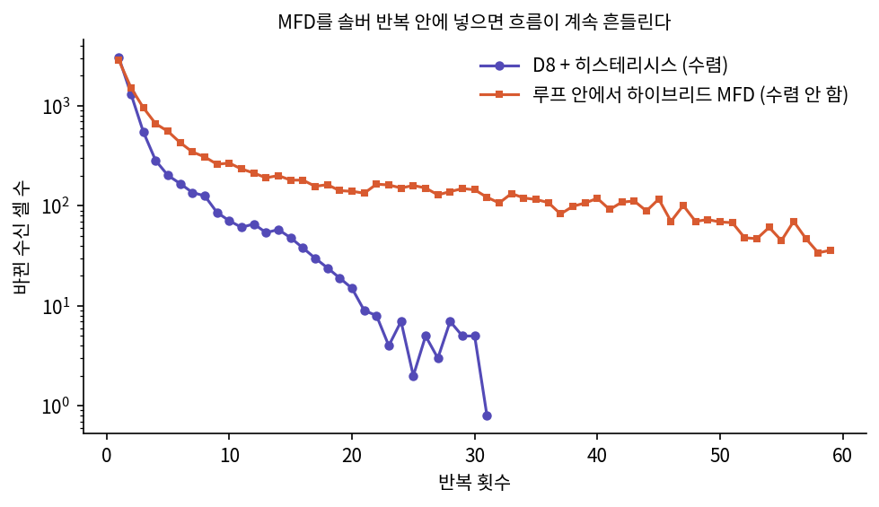

**더 가벼운 대안: 노드 흔들기.** D8 솔버를 그대로 두고 결만 줄이는 방법도 있습니다. 각 셀의 대표 점을 셀 안에서 조금씩 무작위로 옮기고(시드 고정), 경사와 거리를 옮긴 점 사이에서 잽니다. 이웃은 여전히 8개지만 방향이 셀마다 제각각이라 강이 격자 방향에 몰리지 않습니다. 흐름이 여전히 트리이므로 D8처럼 정확히 수렴합니다(아래 예에서 25회). 옮긴 위치는 셀 번호의 해시로 즉석에서 계산하면 저장 공간이 들지 않습니다. 다만 "여섯 면이 같은 모양"이라는 대칭이 깨지므로, 이웃 거리는 면 하나분만 저장하는 대신 매번 계산해야 합니다.

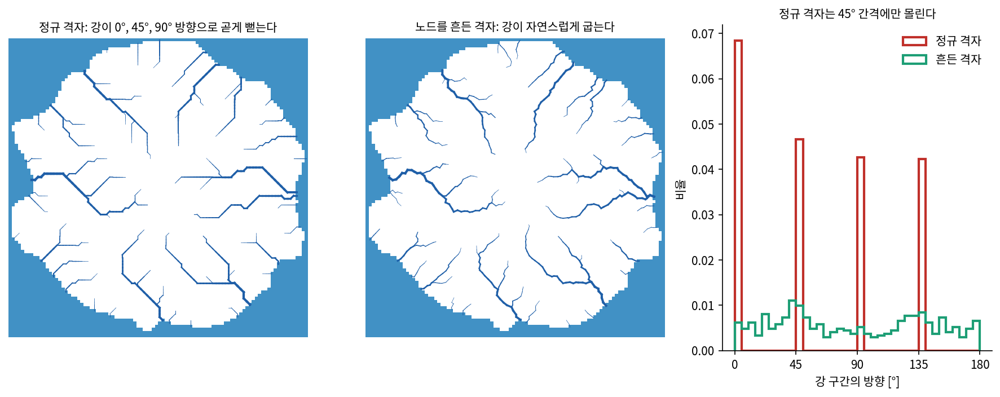

이 프로젝트는 적응형 MFD를 채택하고, 계산 비용이 문제가 되면 노드 흔들기를 대안으로 씁니다. 어느 쪽이든 결과는 1장의 회전 테스트로 확인합니다.

### 구현 메모

`src/bpcg/landscape/steady_state.py`에 둡니다. 평면 격자와 상수 입력으로 먼저 검증하고, 5장이 끝나면 행성 입력으로 바꿉니다. `receivers()`는 이전 수신 셀과 $\eta$를 인자로 받도록 만듭니다.

### 확인하기

| 검사 | 기준 | 의미 |
|---|---|---|
| 수렴 | 50회 안에 바뀐 수신 셀 수가 0 | 고정점에 도달했다 |
| 자기 일관성 | $S<S_{crit}$인 셀에서 $\lvert S-k_sQ^{-\theta}\rvert/k_sQ^{-\theta}<10^{-3}$ | 결과가 정상상태 법칙을 만족한다 |
| 기준 비교 | 균일한 $U,K$, $n=1$, $m=\theta$로 fastscapelib과 비교해 평균 고도와 고도 분포의 차이 5% 미만 | 검증된 구현과 같은 답을 낸다 |

---

## 5. 행성 입력 필드: 판 구조와 기후로 재료 만들기

### 한 줄 요약

행성 규모에서 솔버에 넣을 재료를 만듭니다. 어디가 솟는지(융기), 어디에 비가 오는지(강수), 어디가 바다인지(기준면)를 정합니다.

### 비유

행성 표면은 몇 개의 큰 조각(판)으로 나뉘어 천천히 움직입니다. 판끼리 부딪히는 곳은 구겨져 산맥이 되고, 벌어지는 곳은 갈라집니다. 비는 대기 순환 때문에 위도에 따라 많이 오는 띠와 적게 오는 띠가 번갈아 나타납니다.

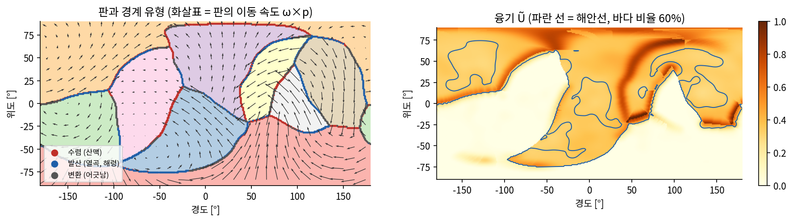

왼쪽은 판(색)과 경계 유형(빨강 수렴, 파랑 발산, 회색 변환), 판의 이동 속도(화살표)입니다. 오른쪽은 그로부터 계산한 융기 $\tilde U$와 해안선입니다. 수렴 경계를 따라 길게 솟은 띠가 산맥이 됩니다. 그림은 보기 쉽게 위경도 지도로 그렸지만, 실제 구현은 큐브스피어 격자 위에서 같은 식을 계산합니다.

### 수식 풀어 읽기

**판 배치.** 판 개수를 $M$이라 하면, 3차원 정규분포에서 뽑은 벡터를 정규화한 씨앗 $\mathbf s_k=\mathbf g_k/\lVert\mathbf g_k\rVert$는 구면 위에 고르게 퍼집니다. 각 셀은 가장 가까운 씨앗의 판에 속합니다.

$$
\pi(c)=\arg\max_k\ \operatorname{normalize}\!\big(\mathbf p_c+\eta\,\boldsymbol\xi(\mathbf p_c)\big)\cdot\mathbf s_k
$$

읽는 법: 구면 위에서 "가장 가깝다"는 "내적이 가장 크다"와 같습니다(구면 보로노이). 점을 벡터 노이즈 $\boldsymbol\xi$로 살짝 흔든 뒤 비교하면 판 경계가 직선이 아니라 구불구불해집니다.

**판 운동.** 구면 위의 판은 어떤 축(오일러 극) 둘레로 도는 강체 회전만 할 수 있습니다. 각속도 벡터를 $\boldsymbol\omega_k$라 하면, 판 위 한 점의 속도는 다음과 같습니다.

$$
\mathbf v_k(\mathbf p)=\boldsymbol\omega_k\times R\,\mathbf p
$$

**경계 판정.** 서로 다른 판에 속한 이웃 쌍 $(c,c')$마다, $c$에서 $c'$ 쪽을 가리키는 접선 방향 $\hat{\mathbf b}$와 상대 속도 $\Delta\mathbf v$를 구합니다.

$$
\hat{\mathbf b}=\operatorname{normalize}\!\big(\mathbf p_{c'}-(\mathbf p_{c'}\cdot\mathbf p_c)\,\mathbf p_c\big),\qquad
\Delta\mathbf v=\mathbf v_{\pi(c')}(\mathbf p_c)-\mathbf v_{\pi(c)}(\mathbf p_c)
$$

$$
\gamma_c=-\Delta\mathbf v\cdot\hat{\mathbf b},\qquad
\tau_c=\big\lvert\Delta\mathbf v\cdot(\mathbf p_c\times\hat{\mathbf b})\big\rvert
$$

읽는 법: $\hat{\mathbf b}$는 $\mathbf p_{c'}$에서 $\mathbf p_c$ 방향 성분을 빼서 만든, 구면에 접하는 방향입니다. 상대 판이 나에게 다가오면 $\Delta\mathbf v$가 $\hat{\mathbf b}$와 반대 방향이므로 $\gamma>0$(수렴)입니다. $\tau$는 경계를 따라 미끄러지는 성분(전단)입니다. $\gamma>\kappa\tau$면 수렴, $\gamma<-\kappa\tau$면 발산, 그 사이면 변환 경계로 판정합니다($\kappa\approx0.3$).

**융기.** 수렴 경계 셀들에서 출발하는 다중 출발점 다익스트라로 각 셀에서 가장 가까운 수렴 경계까지의 측지 거리 $\delta_c$를 구하고, 그 경계의 수렴 속도 $\gamma^*_c$도 함께 넘겨받습니다.

$$
\tilde U_c=\operatorname{clamp}_{[0,1]}\!\Big(u_{\pi(c)}+\beta\,\frac{\gamma^*_c}{\gamma_{\max}}\,e^{-\delta_c^2/2w^2}+\eta_U\,\xi_U(\mathbf p_c)\Big)
$$

읽는 법: 판마다 기본 융기 $u_k$(대륙판 약 0.2~0.35, 해양판 0)가 있고, 수렴 경계에 가까울수록, 그리고 빨리 부딪힐수록 더 많이 솟습니다. $w$는 산맥의 폭입니다. 가우스 함수라서 경계에서 멀어지면 부드럽게 줄어듭니다.

**$k_s$ 필드: 학습값과의 연결.** 이론식 $k_s=(U/K)^{1/n}$에서 $U$와 $K$를 따로 알 수는 없습니다. 대신 3장에서 실제 지형으로 관측한 $k_s$ 범위에 직접 대응시킵니다.

$$
k_{s,c}=\exp\!\big((1-\tilde U_c)\ln k_{lo}+\tilde U_c\ln k_{hi}\big)\cdot\lambda_{\ell(c)}
$$

읽는 법: 융기가 0이면 $k_{lo}$, 1이면 $k_{hi}$이고, 그 사이는 로그 눈금으로 보간합니다. $\lambda_\ell$은 암석 종류별 배율로, 단단한 암석일수록 1보다 커서 더 가파른 지형을 만듭니다.

**초기 고도와 바다.**

$$
z^{(0)}_c=Z_0\,\tilde U_c+\eta_0\,\xi_0(\mathbf p_c)
$$

목표 해양 비율 $\phi$(예: 0.6)를 만족하는 문턱값 $h$를 **면적 가중** 분위수로 구합니다.

$$
\frac{\sum_c A_c\,[\,z^{(0)}_c<h\,]}{4\pi R^2}=\phi,\qquad O=\{c:\ z^{(0)}_c<h\},\qquad z^{(0)}\leftarrow z^{(0)}-h
$$

읽는 법: 셀 개수가 아니라 면적으로 세야 합니다. 등각 매핑에서도 셀 면적이 최대 1.4배 차이 나므로, 개수로 세면 바다 비율이 틀어집니다. 대괄호 $[\,\cdot\,]$는 조건이 참이면 1, 거짓이면 0입니다.

해저 지형은 해안에서의 거리 $\delta^{coast}$로 정합니다. $B$는 최대 수심, $w_{shelf}$는 대륙붕 폭입니다.

$$
z_c=-B\cdot\operatorname{smoothstep}\big(\delta^{coast}_c/w_{shelf}\big)\qquad(c\in O)
$$

**강수.**

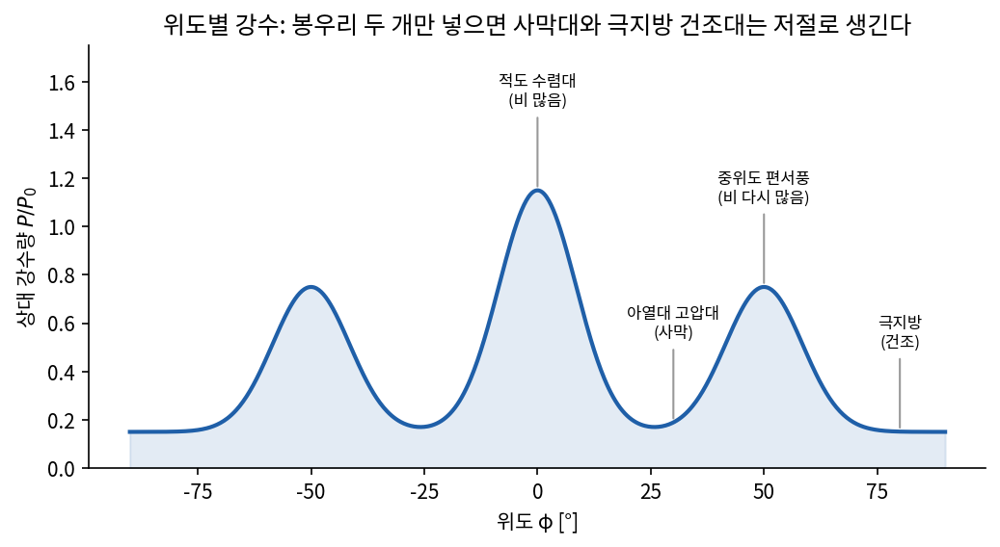

자전축을 $\hat{\mathbf a}$라 하면 위도는 $\varphi_c=\arcsin(\mathbf p_c\cdot\hat{\mathbf a})$입니다.

$$
P_c=P_0\Big[p_0+p_1e^{-(\varphi_c/\sigma_1)^2}+p_2e^{-((\lvert\varphi_c\rvert-\varphi_m)/\sigma_2)^2}\Big]\,e^{\eta_P\,\xi_P(\mathbf p_c)}
$$

읽는 법: 적도 봉우리($p_1$ 항)와 중위도 봉우리($\varphi_m\approx50°$, $p_2$ 항) 두 개만 넣으면, 그 사이인 위도 30° 부근과 극지방은 저절로 건조해집니다. 마지막에 지수 형태의 노이즈를 곱하므로 강수는 항상 양수입니다.

**구면 노이즈.** 모든 노이즈는 3D 좌표에서 직접 샘플합니다. $\nu$는 정수 해시 기반 3D 그래디언트 노이즈, $L_o$는 옥타브 수, $g$는 옥타브마다 줄어드는 비율, $\lambda$는 기본 주파수입니다.

$$
\xi(\mathbf p)=\frac{\sum_{o=0}^{L_o-1}g^{\,o}\ \nu\!\big(2^{o}\lambda\,\mathbf p+\mathbf o_o\big)}{\sum_{o}g^{\,o}}
$$

읽는 법: 큐브 면의 2D 좌표에서 노이즈를 뽑으면 면 경계에서 값이 끊깁니다. 3D 공간의 노이즈를 구면 위의 점에서 읽으면 경계라는 개념 자체가 없으므로 이음새가 생기지 않습니다. 정수 해시를 쓰는 이유는 맥과 실습실에서 같은 시드로 같은 값이 나오게 하기 위해서입니다.

### 구현 메모

`src/bpcg/planet/`의 `plates.py`(판, 경계, 융기), `climate.py`(강수), `lithology.py`(암석, $\lambda_\ell$), `ocean.py`(바다, 해저)입니다. 셀마다 독립적인 계산(노이즈, 판 배정)은 Warp로, 다익스트라 거리 계산은 Numba로 합니다.

### 확인하기

| 검사 | 기준 | 의미 |
|---|---|---|
| 해양 비율 | 목표와의 차이 0.5% 미만 | 면적 가중 분위수가 맞다 |
| 값의 범위 | $\tilde U\in[0,1]$, $P>0$ | 입력이 솔버가 받을 수 있는 범위다 |
| 산맥 위치 | 수렴 경계를 따라 $\tilde U$가 높은 띠 | 판 판정과 거리 계산이 맞다 (눈으로 확인) |

---

## 6. 파생 맵: 물, 지하수, 지층 기준면, 퇴적물

### 한 줄 요약

4장에서 만든 지형을 바탕으로, 3D 세계에 필요한 나머지 지도를 만듭니다.

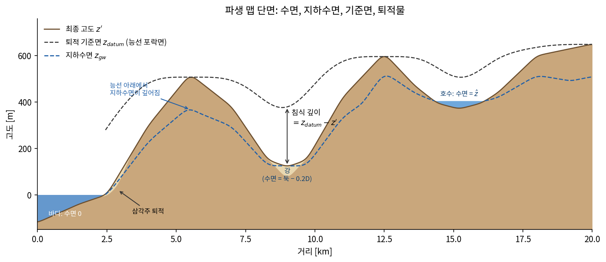

한 단면에 이 장에서 만드는 것이 모두 들어 있습니다. 바다, 호수, 강의 수면, 능선 아래에서 깊어지는 지하수면(파란 점선), 능선을 잇는 퇴적 기준면(검은 점선), 강가와 해안의 퇴적물입니다.

### 수식 풀어 읽기

**최종 고도와 호수.** 격자 해상도의 작은 기복 $\Delta_{2D}$(빙하가 긁은 자국이나 단층 함몰 같은 효과)를 더하되, 강 근처에서는 줄입니다. $\delta^{riv}$는 하천까지의 거리, $w_m$은 감쇠 폭입니다.

$$
z'=z+m\,\Delta_{2D},\qquad m=\operatorname{smoothstep}\big(\delta^{riv}/w_m\big)
$$

$z'$에 대해 2장을 한 번 더 실행하면, 새로 생긴 웅덩이가 채워지면서 호수 $L=\{c:\hat z_c>z'_c\}$가 나옵니다. 4장 결과에는 웅덩이가 없으므로, 호수는 모두 이 작은 기복에서 생깁니다. 이후의 모든 계산은 이 최종 결과($\hat z,\tilde z,r,\sigma,Q,S$)를 씁니다.

**하천과 수리 기하.** 유량이 $Q_{riv}$ 이상인 셀이 하천입니다: $C_{riv}=\{c\notin O:\ Q_c\ge Q_{riv}\}$. 유량을 초당 단위로 바꾸고($\rho_{ro}$는 비 중 하천으로 흘러가는 비율), 하천의 폭과 깊이를 정합니다.

$$
\bar Q_c=\rho_{ro}\,\frac{Q_c}{3.156\times10^{7}}\ \ [\text{m}^3/\text{s}],\qquad
W_c=k_W\,\bar Q_c^{\,0.5},\qquad D_c=k_D\,\bar Q_c^{\,0.4}
$$

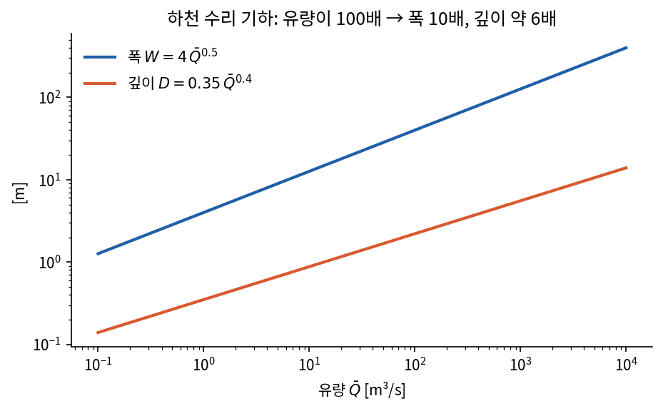

읽는 법: $3.156\times10^7$은 1년의 초 수입니다. 폭과 깊이의 지수(0.5, 0.4)는 실제 강에서 관측된 경험식(Leopold–Maddock의 하류 수리 기하)입니다. 유량이 100배가 되면 폭은 10배, 깊이는 약 6배가 됩니다. 큰 강일수록 깊이보다 폭이 훨씬 빨리 커집니다.

**수면 고도.**

$$
h_w(c)=\begin{cases}
0 & c\in O\ (\text{바다})\\
\hat z_c & c\in L\ (\text{호수})\\
z'_c-0.2\,D_c & c\in C_{riv}\setminus L\ (\text{강})\\
-\infty & \text{그 외 (물 없음)}
\end{cases}
$$

강 수면은 하류로 갈수록 낮아져야 합니다. $\sigma$를 거꾸로(상류부터) 돌며 하천 셀 $c$마다 다음을 적용하면, 하류 칸의 수면이 상류 칸보다 높아지는 일이 없어집니다.

$$
h_w\big(r(c)\big)\leftarrow\min\!\big(h_w(r(c)),\ h_w(c)\big)
$$

**하천 폴리라인.** 하천 셀과 그 수신 셀을 이은 그래프를 합류점(하천 기여 셀이 2개 이상인 셀)에서 끊어 구간으로 나눕니다. 각 구간은 셀 중심을 지나는 centripetal Catmull-Rom 스플라인으로 부드럽게 만든 뒤 구면으로 다시 투영합니다. 정점마다 $W,D,h_w$를 저장해 두면 7장에서 강바닥을 깎을 때 씁니다.

MFD를 쓸 때는 이 장의 $r(c)$를 모두 주 수신 셀 $r^*(c)$로 읽습니다. 하천 그래프, 합류점 판정, 강 수면의 단조성 강제가 모두 $r^*$ 기준입니다. 주 수신 셀만 따라가면 다시 트리가 되므로 폴리라인을 깔끔하게 끊을 수 있습니다.

**지하수면.** 물이 있는 셀 $\mathcal W=O\cup L\cup C_{riv}$까지의 측지 거리를 $\delta^w_c$라 하면:

$$
z_{gw,c}=z'_c-\min\!\Big(\Delta_{\max},\ \kappa\,\delta^{w}_c\,\frac{P_{ref}}{P_c}\Big)
$$

읽는 법: 물가에서 멀수록, 그리고 비가 적게 올수록 지하수면이 지표에서 깊어집니다. 최대 깊이는 $\Delta_{\max}$로 제한합니다. 그다음 라플라시안 평활화를 여러 번 적용하되, 매번 $z_{gw}\le z'$(지표 위로 올라가지 않음)과 $\mathcal W$에서 $z_{gw}=h_w$(물가에서는 수면과 같음)를 다시 맞춥니다. 그 결과 물가에서는 지하수면이 지표와 만나 샘이 되고, 능선 아래에서는 깊어집니다.

**퇴적 기준면.** 지층이 쌓였던 "침식 전의 지표"를 근사합니다. 반경 $\rho$ 안의 최댓값을 취한 뒤(능선 높이를 퍼뜨림) 가우시안 블러 $G_\sigma$로 부드럽게 만듭니다.

$$
(\mathcal M_\rho z')_c=\max_{c':\ \delta(c,c')\le\rho}z'_{c'},\qquad
z_{datum}=\max\!\big(z',\ G_\sigma*\mathcal M_\rho z'\big)
$$

읽는 법: 능선 꼭대기들을 천으로 덮은 모양입니다. 바깥의 $\max$는 기준면이 지표보다 낮아지지 않게 합니다. $z_{datum}-z'$는 그 자리에서 깎여 나간 두께로 해석할 수 있고, 골짜기에서 가장 큽니다(그림의 화살표).

**퇴적물 두께.** 유량이 크고 경사가 완만한 곳에 쌓입니다. $\operatorname{sst}$는 $[0,1]$로 자른 smoothstep입니다.

$$
H_{sed,c}=H_{\max}\ \operatorname{sst}\!\Big(\frac{\ln Q_c-\ln Q_1}{\ln Q_2-\ln Q_1}\Big)\Big(1-\operatorname{sst}\big(S_c/S_{dep}\big)\Big)
$$

읽는 법: 앞의 괄호는 "물이 충분히 모이는가", 뒤의 괄호는 "충분히 평평한가"입니다. 둘 다 만족하는 범람원과 삼각주에 퇴적물이 쌓입니다.

### 구현 메모

`src/bpcg/derive/`의 `water.py`(호수, 수면, 지하수면), `rivers.py`(하천 셀, 수리 기하, 폴리라인), `datum.py`(기준면, 퇴적물)입니다.

### 확인하기

| 검사 | 기준 | 의미 |
|---|---|---|
| 강 수면 | 모든 하천 셀에서 $h_w(c)\ge h_w(r(c))$ | 강물이 거꾸로 흐르지 않는다 |
| 호수 수면 | 연결된 호수마다 $h_w$가 일정 | 호수가 평평하다 |
| 지하수면 | 모든 셀에서 $z_{gw}\le z'$, 물가에서 $z_{gw}=h_w$ | 지하수가 땅 위로 솟지 않는다 |
| 기준면 | 모든 셀에서 $z_{datum}\ge z'$ | 침식 두께가 음수가 되지 않는다 |

---

## 7. 3D 샘플 함수: 공간의 한 점에 답하기

### 한 줄 요약

3D 공간의 점 하나를 받아 "여기는 땅인가, 무슨 돌인가, 물인가"를 답하는 함수입니다. 복셀 하나하나가 이 함수를 한 번씩 부릅니다.

### 비유

층층이 쌓인 케이크를 떠올려 보세요. 케이크의 층(지층)은 처음 구울 때 수평으로 쌓였고, 그 뒤에 누군가 칼로 윗면을 깎아 냈습니다(침식). 깎아 낸 골짜기 벽을 보면 속의 층이 순서대로 드러납니다. 이 함수는 "케이크를 구울 때의 층"과 "칼로 깎은 모양"을 따로 들고 있다가, 점 하나를 물어보면 둘을 합쳐서 답합니다.

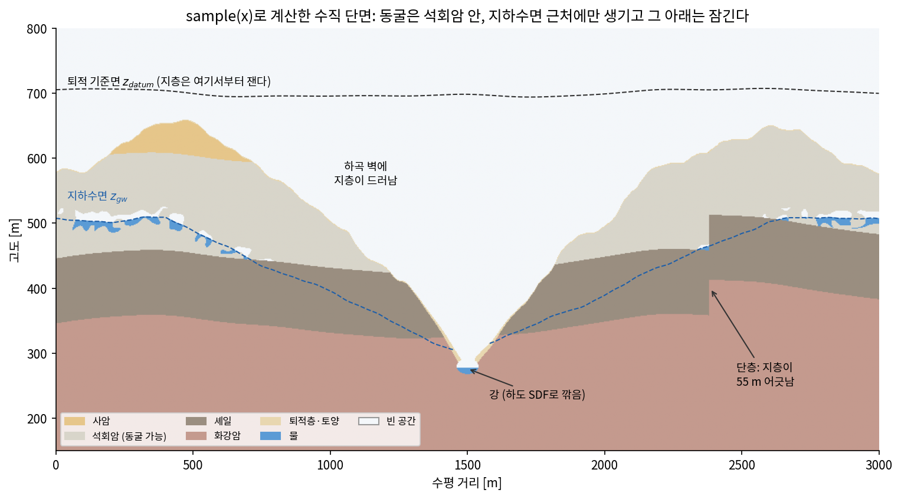

이 단면은 아래 수식을 픽셀마다 계산해서 그린 것입니다. 지층은 위의 점선(퇴적 기준면)에서부터 잰 깊이로 정해지므로, 하곡 벽에 사암, 석회암, 셰일, 화강암이 차례로 드러납니다. 오른쪽에는 단층으로 지층이 55 m 어긋나 있습니다. 동굴은 석회암 안에서 지하수면(파란 점선) 근처에만 생기고, 지하수면 아래 부분은 물에 잠겨 있습니다.

### 수식 풀어 읽기

**부호 거리 함수(SDF)라는 약속.** 이 함수가 돌려주는 핵심 값 $d(\mathbf x)$는 "표면까지의 대략적인 거리"에 부호를 붙인 것입니다. $d<0$이면 땅 속, $d>0$이면 빈 공간, $d=0$이 표면입니다. 컨투어링은 $d=0$인 곳을 찾아 메시를 만듭니다.

**맵 읽기.** 점 $\mathbf x$(행성 중심 기준, double)에 대해 $r=\lVert\mathbf x\rVert$, $\mathbf p=\mathbf x/r$로 둡니다. 2D 필드 $F(\mathbf p)$는 1장의 역사상으로 $(f^*,a,b)$를 구한 뒤 쌍선형 보간합니다. 면 경계 근처에서는 면 바깥의 값이 필요하므로, 각 면 가장자리에 인접 면에서 가져온 값을 한 줄씩 덧붙여 둡니다(고스트 셀). 이때 값을 그대로 복사하면 안 되는데, 이유와 방법은 바로 다음에 설명합니다.

**면 경계를 넘는 보간 (고스트 셀).** 면 $f$의 가장자리 바깥으로 한 칸 외삽한 위치 $\mathbf q=\mathbf x_f(1+\tfrac1n,\ b_j)$를 인접 면 좌표로 바꿔 보면, 두 가지 사실이 나옵니다.

- 경계에서 멀어지는 방향으로는 인접 면의 첫 줄 **중심선 위에 정확히** 놓입니다.
- 경계를 따라가는 방향으로는 가운데 쪽으로 쏠려서, 인접 면의 셀 중심과 최대 셀 크기의 약 47% 어긋납니다. 해상도를 올려도 이 비율은 줄지 않습니다.

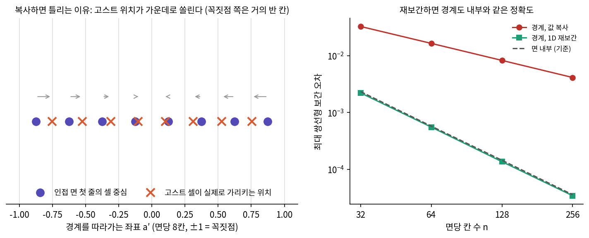

그래서 인접 면의 셀 값을 그대로 복사하면, 꼭짓점 근처에서 거의 반 칸 어긋난 값으로 보간하게 됩니다. 오른쪽 그래프처럼 경계 근처의 보간 오차가 면 내부보다 14~115배 크고, 해상도를 두 배로 올려도 절반으로만 줄어듭니다(1차 수렴). 표면에 미세한 주름이 생기는 원인입니다.

해결 방법은 고스트 값을 **인접 면의 첫 줄을 따라 정확한 위치에서 1D 보간**해 채우는 것입니다. 예를 들어 +Z 면에서 +X 면 쪽으로 넘어갈 때, $m$번째 고스트 줄($m=1,2,\dots$)의 셀 $j$가 가리키는 경계 방향 좌표는:

$$
a'_{j,m}=\frac{4}{\pi}\arctan\!\left(\frac{\tan\!\big(\frac{\pi b_j}{4}\big)}{\tan\!\Big(\frac{\pi}{4}\big(1+\frac{2m-1}{n}\big)\Big)}\right)
$$

$m$번째 고스트 줄은 인접 면의 $m$번째 줄 중심선 위에 정확히 놓이므로, 그 줄의 값들을 $a'_{j,m}$ 위치에서 1D 보간하면 됩니다. 다른 면 조합은 1장의 인덱스 교환·반전 규칙을 똑같이 적용합니다. 이렇게 하면 경계 근처의 오차가 면 내부와 같아지고, 해상도를 두 배로 올리면 약 4분의 1로 줄어듭니다(2차 수렴). 법선까지 매끄럽게 하려고 쌍삼차(bicubic) 보간을 쓴다면 고스트 줄을 두 줄($m=1,2$) 만들되 둘 다 이 방식으로 채웁니다.

고스트 줄은 맵을 불러올 때 한 번만 만들어 두면 됩니다. 파이썬 참조 구현과 엔진이 같은 규칙으로 만들어야 하므로, 파이썬에서 고스트 줄까지 채운 맵을 번들에 넣어 주는 방법도 좋습니다.

**지표.**

$$
\rho(\mathbf x)=R+z'(\mathbf p)+m(\mathbf p)\,A_d\,\xi_d(\mathbf x),\qquad d_0(\mathbf x)=r-\rho(\mathbf x)
$$

읽는 법: $\rho$는 지표가 행성 중심에서 얼마나 떨어져 있는지입니다. 2D 고도 $z'$에 작은 3D 노이즈(진폭 $A_d$)를 더합니다. 이 노이즈는 방향 $\mathbf p$가 아니라 3D 위치 $\mathbf x$의 함수라서, 같은 방향이라도 높이마다 값이 달라집니다. 그래서 표면이 접히며 절벽 밑이 파인 오버행이 생길 수 있습니다. $m$은 물가와 하도 근처에서 0이 되어, 노이즈가 강과 호수를 망가뜨리지 않게 합니다.

**부드럽게 합치고 깎기.**

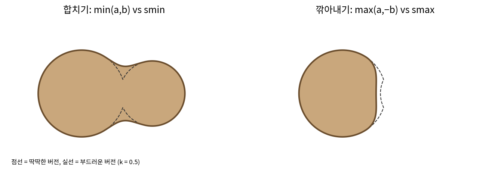

$$
\operatorname{smin}_k(a,b)=\min(a,b)-\frac{h^2k}{4},\quad h=\frac{\max(k-\lvert a-b\rvert,\ 0)}{k},\qquad
\operatorname{smax}_k(a,b)=-\operatorname{smin}_k(-a,-b)
$$

읽는 법: SDF에서 $\min(a,b)$는 두 모양을 합치고, $\max(a,-b)$는 $a$에서 $b$를 깎아 냅니다. 그대로 쓰면 이음매가 각지므로(그림의 점선), 두 값이 $k$ 이내로 가까운 곳에서만 살짝 보정해 부드럽게 이어 줍니다(실선).

**강바닥 깎기.** 가장 가까운 하천 스플라인 점 $\mathbf q$의 폭 $W$, 깊이 $D$, 둑 높이 $z'_q$를 씁니다. 스플라인까지의 수평 거리를 $\ell$, 둑 높이 기준의 수직 거리를 $v=r-(R+z'_q)$라 하면, 단면이 반타원인 하도의 근사 거리는:

$$
d_{riv}(\mathbf x)=\min\!\Big(\frac{W}{2},D\Big)\left(\sqrt{\Big(\frac{\ell}{W/2}\Big)^2+\Big(\frac{v}{D}\Big)^2}-1\right)
$$

$$
d_1=\operatorname{smax}_k\big(d_0,\,-d_{riv}\big),\qquad u(\mathbf x)=[\,d_1(\mathbf x)<0\,]
$$

읽는 법: 반타원 안쪽($d_{riv}<0$)을 지형에서 깎아 냅니다. $u$는 "동굴을 파기 전 기준으로 땅 속인가"로, 나중에 물이 지하수인지 지표수인지 가르는 데 씁니다.

**지층.**

$$
s(\mathbf x)=R+z_{datum}(\mathbf p)-r+\mathcal D(\mathbf x),\qquad
\mathcal D=A_f\,\tilde U(\mathbf p)\,\xi_f(\mathbf x)+\sum_q\Delta_q\,\mathcal H(\mathbf n_q\cdot\mathbf x-o_q)
$$

읽는 법: $s$는 퇴적 기준면에서부터 아래로 잰 깊이입니다. 현재 지표가 아니라 기준면에서 재기 때문에 케이크의 층이 깎인 모양과 상관없이 제자리에 있습니다. $\mathcal D$는 지각 변동입니다. 첫 항은 습곡으로, 융기가 큰 곳일수록 지층이 크게 휩니다. 둘째 항은 단층으로, $\mathcal H$는 음수면 0, 양수면 1인 계단 함수이므로 단층면($\mathbf n_q$, $o_q$)의 한쪽만 $\Delta_q$만큼 어긋납니다.

지역 $\ell(\mathbf p)$의 지층 두께 표를 $(t_1,\dots,t_L)$, 누적 두께를 $T_i=\sum_{j\le i}t_j$라 하면 재질은:

$$
\lambda(\mathbf x)=\begin{cases}
\text{퇴적층} & \rho(\mathbf x)-r<H_{sed}(\mathbf p)\\
\min\{i:\ s(\mathbf x)<T_i\} & \text{그 외}
\end{cases}
$$

읽는 법: 지표 바로 아래 $H_{sed}$ 두께는 퇴적층이고, 그 아래는 깊이 $s$가 처음으로 누적 두께를 넘지 않는 층입니다.

**동굴.**

$$
\mathbf y=\big(R+\alpha\,s(\mathbf x)\big)\,\mathbf p,\qquad
d_{cave}(\mathbf x)=\max\big(\lvert\nu_1(\mathbf y)\rvert,\,\lvert\nu_2(\mathbf y)\rvert\big)-\tau
$$

읽는 법: 노이즈를 원래 위치 $\mathbf x$가 아니라 변형한 위치 $\mathbf y$에서 읽습니다. $\mathbf y$는 높이 방향을 지층 좌표 $s$로 바꾸고 $\alpha>1$배로 늘린 것이라, 노이즈가 수직으로 압축되어 동굴이 층리면을 따라 수평으로 퍼집니다. 노이즈 두 개가 **동시에** 0 근처인 곳(두 곡면의 교선 주변)이 터널이 됩니다. $\tau$는 터널의 굵기입니다. (위 단면 그림은 2D라서 노이즈 하나로 단순화했습니다.)

$$
M(\mathbf x)=[\,\lambda=\text{석회암}\,]\cdot\exp\!\Big(-\frac{\big(r-R-z_{gw}(\mathbf p)\big)^2}{2\sigma_{gw}^2}\Big),\qquad
\tilde d_{cave}=d_{cave}+\beta\,(1-M)
$$

$$
d(\mathbf x)=\max\big(d_1,\ -\tilde d_{cave}\big)
$$

읽는 법: 마스크 $M$은 석회암 안에서, 지하수면 근처일수록 1에 가깝습니다. 마스크가 0인 곳은 큰 상수 $\beta$를 더해 동굴을 확실히 지웁니다. 마지막 줄은 지형에서 동굴을 깎아 내는 것입니다.

**물.**

$$
w(\mathbf x)=[\,d>0\,]\ \wedge\ \Big[\,r<R+\begin{cases}z_{gw}(\mathbf p) & u(\mathbf x)\ (\text{원래 땅 속, 즉 동굴})\\ h_w(\mathbf p) & \neg u(\mathbf x)\ (\text{지상})\end{cases}\Big]
$$

읽는 법: 빈 공간이면서, 동굴이면 지하수면 아래, 지상이면 수면 아래일 때 물입니다. 이 규칙 하나로 바다, 호수, 강, 잠긴 동굴이 모두 처리됩니다.

**복셀에 저장하기.** 복셀 간격 $\Delta x$, 절단 폭 $k_q$ 복셀로 int8에 담습니다.

$$
q=\operatorname{clamp}\!\Big(\operatorname{round}\Big(127\,\frac{d}{k_q\,\Delta x}\Big),\ -127,\ 127\Big)
$$

읽는 법: 표면 근처 $\pm k_q$ 복셀 범위만 정밀하게 저장하고, 그보다 멀면 "완전히 땅" 또는 "완전히 공기"로 잘라 냅니다. 컨투어링에는 표면 근처 값만 중요하기 때문입니다.

### 구현 메모

`src/bpcg/volume/sample.py`에 `sample(x) -> (d, material, water)`를 만들고, `slices.py`로 위와 같은 단면 이미지를 그려 확인합니다. `golden.py`는 테스트 점 1만 개와 그 정답값을 JSON으로 내보내 8장의 엔진 검증에 씁니다. 고스트 줄 채우기는 `src/bpcg/core/bundle.py`에서 맵을 저장하거나 불러올 때 수행합니다.

### 확인하기

| 검사 | 기준 | 의미 |
|---|---|---|
| 연속성 | 면 경계를 사이에 둔 1 cm 간격 두 점의 $\lvert\Delta d\rvert$가 다른 곳의 같은 간격과 같은 수준 | 면 경계에 틈이 없다 |
| 고스트 보간 | 매끄러운 시험 함수에서 경계 근처 보간 오차 / 내부 오차 < 2, $n$을 두 배로 하면 둘 다 약 1/4 | 경계 보간이 내부와 같은 정확도다 |
| 동굴 위치 | 모든 동굴 점에서 $\lambda=$ 석회암 | 마스크가 제대로 걸렸다 |
| 지층 노출 | 하곡 벽을 따라 내려가면 $\lambda$가 지층 표 순서대로 바뀜 | 기준면 방식이 제대로 동작한다 |
| 단면 확인 | 단면 이미지가 위 그림과 같은 구조 | 전체 조합이 맞다 (눈으로 확인) |

```python
# tests/test_ghost.py
F = lambda p: np.sin(3 * (p @ np.array([0.3, -0.8, 0.5])))   # 매끄러운 시험 함수

@pytest.mark.parametrize("n", [32, 64, 128])
def test_ghost_interpolation(n):
    maps = sample_on_grid(F, n)                  # 셀 중심에서 샘플
    padded = add_ghost_layers(maps, layers=1)    # 인접 면 첫 줄을 따라 1D 재샘플
    e_edge = max_interp_error(padded, F, band="edge")        # 경계에서 한 칸 이내
    e_int = max_interp_error(padded, F, band="interior")
    assert e_edge / e_int < 2.0

def test_ghost_convergence():
    e1 = max_interp_error(add_ghost_layers(sample_on_grid(F, 64)), F, band="edge")
    e2 = max_interp_error(add_ghost_layers(sample_on_grid(F, 128)), F, band="edge")
    assert 3.0 < e1 / e2 < 5.0                   # 2차 수렴이면 약 4
```

---

## 8. 엔진: 행성 위를 걷기

### 한 줄 요약

Godot에서 큰 좌표를 떨림 없이 그리고, 행성 어디서든 자연스럽게 서서 걷게 합니다.

### 정밀도: 왜 카메라를 원점으로 두는가

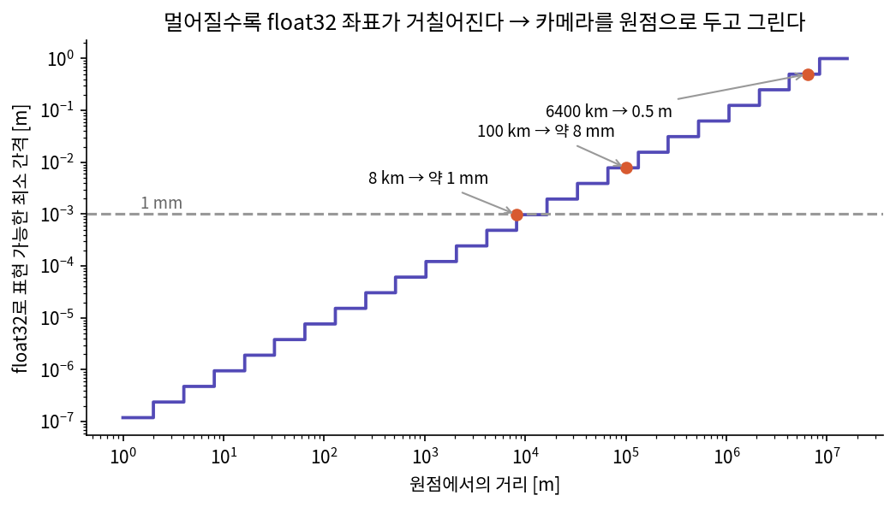

그래픽 카드는 보통 float32로 좌표를 다룹니다. float32가 표현할 수 있는 간격은 숫자가 클수록 커집니다.

$$
\operatorname{ulp}(x)=2^{\lfloor\log_2\lvert x\rvert\rfloor-23}
$$

읽는 법: float32는 유효 숫자가 24비트이므로, 값의 크기(2의 몇 제곱인지)에서 23을 뺀 만큼이 최소 간격입니다. 원점에서 6400 km 떨어진 곳은 0.5 m 간격으로만 표현되어 물체가 덜덜 떨립니다. 그래서 모든 위치는 double $\mathbf X$로 관리하고, 그리기 직전에만 카메라 기준으로 바꿉니다.

$$
\mathbf x_{render}=\operatorname{f32}\big(\mathbf X-\mathbf X_{cam}\big),\qquad
\lVert\mathbf X-\mathbf X_{cam}\rVert_\infty<2^{13}\ \text{m}\ \Rightarrow\ \operatorname{ulp}\le2^{-10}\ \text{m}\approx1\ \text{mm}
$$

읽는 법: 화면에 그리는 물체가 카메라에서 약 8 km 안에 있으면 좌표 오차가 1 mm 이하입니다. 멀리 있는 지형은 LOD로 더 거칠게 그리므로 이 정도면 충분합니다.

### 국소 프레임: 극점에서도 뒤집히지 않게

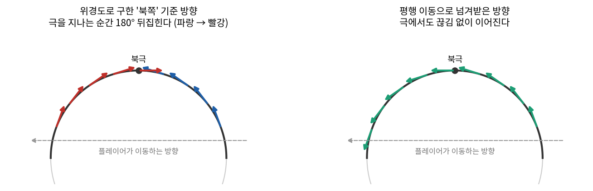

행성 위에서 "위"는 항상 행성 중심의 반대 방향입니다: $\hat{\mathbf u}=\mathbf X/\lVert\mathbf X\rVert$. 문제는 "앞"입니다. 위경도로 북쪽을 구해 기준으로 삼으면, 왼쪽 그림처럼 북극을 지나는 순간 기준이 180° 뒤집힙니다. 대신 매 프레임 **이전 프레임의 앞 방향**을 새 접평면에 사영해서 넘겨받으면(평행 이동), 오른쪽 그림처럼 어디서든 끊김 없이 이어집니다.

$$
\mathbf f\leftarrow\operatorname{normalize}\big(\mathbf f-(\mathbf f\cdot\hat{\mathbf u})\,\hat{\mathbf u}\big),\qquad \mathbf r=\mathbf f\times\hat{\mathbf u}
$$

읽는 법: 앞 방향 $\mathbf f$에서 위 방향 성분을 빼면 지면과 평행해지고, 길이를 1로 맞추면 새 앞 방향이 됩니다. 오른쪽 방향 $\mathbf r$은 앞과 위의 외적입니다(Godot처럼 −Z가 앞인 오른손 좌표계 기준).

### 중력

$$
\mathbf g(\mathbf X)=-\frac{g_0R^2}{\lVert\mathbf X\rVert^2}\,\hat{\mathbf u}
$$

읽는 법: 표면에서 원하는 중력 $g_0$(예: 9.8 m/s²)를 먼저 정하고 $GM=g_0R^2$로 역산합니다. 행성 크기와 상관없이 표면에서 같은 조작감을 얻을 수 있고, 높이 올라갈수록 거리의 제곱에 반비례해 약해집니다.

### 맵 읽기

엔진도 1장과 같은 역사상, 같은 쌍선형 보간을 씁니다. 면 기저 벡터는 코드에 직접 적지 않고 `manifest.json`의 `face_basis`에서 읽습니다. 파이썬과 엔진이 면 방향을 다르게 해석하면 면 경계에 이음새가 생기는데, 같은 값을 읽으면 그런 일이 원천적으로 사라집니다.

### 구현 메모

`engine/planet/bundle_loader.gd`(번들 읽기), `planet_generator.gd`(7장 샘플 함수 이식), `engine/player/local_frame.gd`(국소 프레임, 중력), `engine/tests/golden_check.gd`(정답값 비교)입니다.

### 확인하기

| 검사 | 기준 | 의미 |
|---|---|---|
| 골든 테스트 | 테스트 점 1만 개에서 $\lvert d_{py}-d_{eng}\rvert<10^{-4}$ m, $\lambda$와 $w$ 완전 일치 | 파이썬과 엔진이 같은 세계를 만든다 |
| 프레임 연속성 | 대원을 따라 한 바퀴 돌 때 인접 프레임의 $\mathbf f_k\cdot\mathbf f_{k+1}>\cos\epsilon$ | 극점에서도 방향이 튀지 않는다 |
| 좌표 크기 | 그리는 모든 좌표가 $\lVert\mathbf x_{render}\rVert_\infty<2^{13}$ m | 떨림이 1 mm 이하다 |

---

## 부록: 용어 사전

| 용어 | 뜻 |
|---|---|
| 큐브스피어 | 정육면체의 여섯 면을 구에 투영한 격자 |
| 등각 매핑 | 면 좌표를 각도로 고르게 나눠 칸 크기를 고르게 만드는 투영 |
| 채움 (priority-flood) | 웅덩이를 넘침 높이까지 메우는 알고리즘 |
| 수신 셀 | 한 칸이 물을 보내는 이웃 칸 |
| D8 | 8방향 이웃 중 가장 가파른 쪽으로 물을 보내는 방식 |
| 유량 | 한 칸을 지나가는 물의 양 (상류의 비를 모두 합친 것) |
| stream power law | 하천의 침식 속도가 유량과 경사의 거듭제곱에 비례한다는 법칙 |
| 정상상태 | 융기 속도와 침식 속도가 같아 지형이 변하지 않는 상태 |
| θ (오목도 지수) | 유량이 늘 때 강의 경사가 줄어드는 정도 |
| $k_s$ (경사 지수) | 강이 전반적으로 얼마나 가파른지 |
| $S_{crit}$ (한계 경사) | 산사면이 무너지지 않고 버틸 수 있는 최대 경사 |
| 히스테리시스 | 확실히 더 나을 때만 바꾸게 해서 왔다 갔다 하는 진동을 막는 규칙 |
| 오일러 극 | 판이 구면 위에서 회전하는 축 |
| 퇴적 기준면 | 지층이 쌓였던 침식 전의 지표 (능선 포락면으로 근사) |
| 지하수면 | 땅 속에서 물로 포화된 층의 윗면 |
| SDF (부호 거리 함수) | 표면까지의 거리에 안(−)과 밖(+)의 부호를 붙인 값 |
| smin / smax | 두 모양을 부드럽게 합치고 깎는 연산 |
| ulp | 부동소수점 수가 표현할 수 있는 최소 간격 |
| 평행 이동 | 곡면 위를 움직일 때 방향을 비틀지 않고 넘겨주는 방법 |
| 골든 테스트 | 참조 구현이 만든 정답값과 비교하는 검사 |
| MFD (다중 흐름 방향) | 물을 가장 가파른 이웃 하나가 아니라 낮은 이웃 여러 개에 경사 비율로 나눠 보내는 방식 |
| 적응형 지수 | 유량이 적으면 넓게 퍼뜨리고 많으면 한쪽에 모으도록 MFD의 지수 $p$를 바꾸는 규칙 |
| 주 수신 셀 | MFD에서 물을 가장 많이 받는 이웃. 하천 추적에 쓴다 |
| 격자 정렬 지수 | 강이 격자 8방향과 나란히 흐르는 정도. 1이면 결이 없다 |
| 고스트 셀 | 면 경계 너머의 값을 담기 위해 면 가장자리에 덧붙인 가상 셀 |
| 회전 테스트 | 입력을 회전시켜 다시 생성해 격자의 흔적이 결과에 남는지 보는 검사 |
| 등고선 길이 가중치 | 대각선 이웃처럼 맞닿은 폭이 좁은 이웃에 물을 덜 보내는 MFD 가중치 |
| 감쇠 반복 | 한 번에 전부 바꾸지 않고 일부($\lambda$)만 움직여 요동을 막는 반복 |
| 노드 흔들기 | 셀의 대표 점을 셀 안에서 무작위로 옮겨 격자 방향성을 없애는 방법 |
