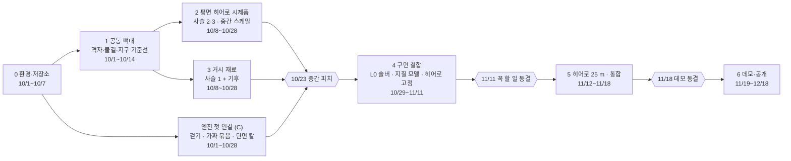

# 개발 단계

12/4 최종 데모까지 일곱 단계(0~6)로 만듭니다. 각 단계에는 끝났다고 말할 수 있는 시험이 있고, 큰 날짜(점검일)마다 안 되면 쓸 대체안이 정해져 있습니다. 날짜·역할·대체안은 설계도 8장([docs/design/blueprint.md](design/blueprint.md))과 같고, 다르면 설계도가 맞습니다.

역할은 A = 행성 핵심(격자, 판, 지질, 기후, 지구 기준선, 점수표), B = 물·지형·땅속(물길, 솔버, 히어로 유역, 흙, 지하수, 동굴), C = 엔진·데모입니다. 솔버와 지질 모델은 두 사람이 함께 맡습니다.

## 한눈에 보기

| 단계 | 기간 | 스케일 | 사슬 | 끝났다는 증거 |
|---|---|---|---|---|
| 0 환경·저장소 | 10/1~10/7 | 없음 | 없음 | 세 사람 컴퓨터에서 설치 스크립트와 `pytest`가 통과하고, CI가 초록 |
| 1 공통 뼈대 | 10/1~10/14 | 거시·중간 공통 | 없음(뼈대) | 격자 시험 전부 통과, 물길이 실제 지형 조각에서 비교 도구와 99% 일치 |
| 2 평면 히어로 시제품 | 10/8~10/28 | 중간(평면) | 2, 3 | 평면 유역에서 암석·흙·지하수·동굴이 같은 규칙으로 맞물리고 엔진에서 걸어짐 |
| 3 거시 재료 | 10/8~10/28 | 거시 | 1 + 기후 | 해수면이 물 부피 보존으로 나오고, 고도 분포에 봉우리 2개 |
| 4 구면 결합 | 10/29~11/11 | 거시 L0 → 중간 | 1, 2, 3 | 구 전체에서 강 100%가 바다나 호수에 닿고, 파이프라인을 처음부터 끝까지 한 번 돌림 |
| 5 히어로 25 m·통합 | 11/12~11/18 | 중간 L2 → 미시 L3 | 2, 3 | 히어로 유역이 실제 30 m 지형과 같은 분포(KS < 0.15), 데모 빌드 동결 |
| 6 데모·공개 | 11/19~12/18 | 모두 | 모두 | 리허설 3회, 대체 영상, README 한 줄로 재현 |

## 0단계: 개발 환경과 저장소 (10/1~10/7, 전원)

목표는 세 사람이 같은 명령으로 같은 환경을 얻는 것입니다.

| 할 일 | 상태 | 확인 방법 |
|---|---|---|
| 루트 폴더 하나(`b-pcg`)로 통일, 패키지 `bpcg` | 끝 | `uv run pytest` |
| 파이썬 3.13 + uv + `uv.lock`, 의존성 묶음 6개 | 끝 | `uv sync --locked` |
| 설치 스크립트(맥·리눅스 `setup.sh`, 윈도우 `setup.ps1`)와 점검 도구(`tools/doctor.py`) | 끝(맥에서 시험, 윈도우·리눅스는 팀원 컴퓨터에서 첫 시험 필요) | `./scripts/setup.sh --check` |
| 개발 규칙(`docs/conventions.md`), 협업 순서(`CONTRIBUTING.md`), PR 양식, CI 설정 | 끝 | GitHub에 올린 뒤 CI 초록 |
| 파일럿 자료 4.5 GB와 `data/manifest.json`(크기·해시) | 끝 | `uv run python tools/download_pilot.py --verify-only` |
| 임시 폴더에 있던 분석 스크립트·그림·시험 자료를 `analysis/`, `docs/`, `tests/fixtures/`로 이전 | 끝 | `analysis/README.md` |
| Godot 프로젝트 뼈대(`engine/`)와 headless 연기 시험 | 끝 | `uv run pytest -m godot` |
| 첫 커밋, GitHub 저장소 만들기, main 보호 규칙 | 남음(관리자) | CONTRIBUTING.md 끝 절 |
| 코드 라이선스 정하기(데이터와 분리) | 남음(전원) | `LICENSE` 파일 |
| 팀원 두 명의 컴퓨터에서 설치 스크립트 실행 | 남음(팀원) | `tools/doctor.py` 결과를 PR에 붙임 |
| 묶음 형식 초안(manifest + 필드 파일), 기호·단위 표 합의 | 남음(전원) | `docs/bundle_format.md`, conventions 2·3절 |
| 기억에 기대는 수치의 원문 확인 나눠 맡기 | 남음(전원) | 설계도 10장 할 일 |

## 1단계: 공통 뼈대 (10/1~10/14)

어느 사슬에도 속하지 않지만 모두가 쓰는 부품입니다. 이 단계가 늦으면 다른 모든 단계가 늦습니다.

| 할 일 | 담당 | 코드 위치 | 끝났다는 증거 | 안 되면 |
|---|---|---|---|---|
| 큐브스피어 완성: 이웃 표, 면 경계 넘기, 역사상(`cell_of`), 고스트 셀, 회전 시험, 면적 대칭 맞추기 | A | `core/cubesphere.py`, `core/neighbors.py` | 면적 합 상대 오차 < 1e-12, 7개 이웃 셀이 정확히 24개, 왕복 변환 일치, 고스트 셀 2차 수렴(3 < 오차비 < 5), 면 경계 쌍 면적 차 < 1e-10 | 없음(필수) |
| 행성 상수 모듈: 반지름·밀도에서 중력 계산 | A | `core/constants.py` | 지구 값에서 g ≈ 9.82 m/s², 가이드 8장 식과 맞춤 | 없음 |
| ETOPO 읽기, 격자 위 지구, 노이즈 대조군 | A | `earth/etopo.py`, `metrics/hypsometry.py` | 격자 위 지구의 고도 분포가 ETOPO 원본과 같은 모양 | 없음 |
| 물길: 웅덩이 채우기 + D8 + 노드 흔들기 + 유량 누적(점과 이웃 목록만 받는 일반 그래프) | B | `hydro/` | 로페 512×512 조각에서 미리 계산한 비교 결과와 흐름 방향 99% 이상, 하천 겹침 0.95 이상, 유역 면적 ±1%. 모든 셀이 바다로 흐름 | 없음 |
| 비교 결과 미리 만들기(TopoToolbox, pyflwdir) | B | `analysis/compare_routing.py` → `tests/fixtures/` | 저장된 결과로 테스트가 GPL import 없이 돎 | pyflwdir만으로 비교 |
| 엔진: 평면 지형 걷기 | C | `engine/` | 샘플 높이맵 위를 걷고 충돌이 맞음 | 없음 |

## 2단계: 평면 히어로 시제품 (10/8~10/28, 중간 스케일)

설계도의 원칙 '히어로 유역을 평면에서 먼저'를 따릅니다. 평면 격자에 가짜 경계조건(출구 높이, 들어오는 물, 섭입 단면에서 나온 융기)을 주고 사슬 2·3을 먼저 꽂습니다. 나중에 전역 행성은 경계조건만 바꿉니다.

| 할 일 | 담당 | 코드 위치 | 끝났다는 증거 | 안 되면 |
|---|---|---|---|---|
| 정상상태 솔버를 numba로 옮기기: 강 경사와 산비탈 경사의 조화 평균, 암석별 S_crit 상한, 물길 방향 맞추기 반복, 멈춤 조건 '방향 변화 0 그리고 고도 변화 0.1 m 미만' | B(+1명) | `landscape/steady_state.py` | S < S_crit인 곳에서 법칙 자기일관성 상대 오차 < 1e-3, 반복 횟수와 시간 기록, fastscapelib과 평균 고도·고도 분포 차이 5% 미만(미리 계산한 결과와 비교) | 없음(필수) |
| G-법칙 퇴적, 2층 암석 | B | `landscape/deposition.py`, `geology/` | 퇴적물·물 수지 오차 1e-6, 2층 해석해 오차 1e-3 | 없음 |
| 흙 두께(상한 있음) | B | `subsurface/soil.py` | 융기 0에서도 무한대가 나오지 않음 | 없음 |
| 지하수면(Gleeson 투수성 + Fan 2013 닫힌 식) | B | `subsurface/groundwater.py` | 규칙 'z_gw ≤ max(지표, 수면)', 물 규칙 위반 0, 물 수지 오차 ≤ 1e-3 | 회랑 안에서만 '가까운 강·호수 수면' 근사 |
| 2층 동굴과 입구 | B | `subsurface/caves.py` | 동굴 ⊂ 녹는 암석 100%, 잠긴 동굴 수면 = 지하수면, 입구 연결 비율을 잼 | 노이즈 동굴 1층 |
| 가짜 묶음을 엔진에 넘기기, 단면 칼 셰이더 | B → C | `bake/`, `engine/` | 엔진에서 지층·동굴·지하수면이 한 화면에 보임 | 없음 |
| 15초 걷기 영상, 회랑 굽기 v1 | C | `bake/corridor.py`, `engine/` | 피치용 영상 | 미리 구운 경로 영상 |

## 3단계: 거시 재료, 사슬 1과 기후 (10/8~10/28, 거시 스케일)

| 할 일 | 담당 | 코드 위치 | 끝났다는 증거 | 안 되면 |
|---|---|---|---|---|
| 판, 지각 종류·두께, 해양저 나이 → 깊이(Parsons & Sclater), 대륙-해양 경계에서만 Airy 아이소스타시, 물 부피 보존으로 해수면 | A | `planet/plates.py`, `planet/ocean.py` | 바다 물 부피 보존 시험, 바다 비율이 결과로 나옴, 고도 분포 봉우리 2개(일정을 막는 검사, '반쯤 입력' 표시) | 없음 |
| 섭입 방향·비대칭 단면, 물리 단위 융기(m/yr), 누적 융기 상한 25~35 km | A | `planet/uplift.py` | 변위(m)와 속도(m/yr)를 더하지 않음, 해령 −2.5 km는 회귀 시험으로만 | 없음 |
| 가벼운 기후: 위도 띠 강수, Budyko 유출(바닥값 있음), 기온 | A | `planet/climate.py` | 사막 유출 바닥값 적용, 관측과 비슷한 띠 모양 | 없음 |
| θ 파일럿(RiverATLAS, OCTOPUS, CHELSA, 건조도, GLO-90 40개 유역) | A | `analysis/theta_pilot/` → `configs/learned/` | θ 분포 그림(0.3~0.7 안), k_s 회귀 R²와 지역 차이 보고 | 문헌값 θ = 0.45, S_crit ≈ 0.6 |

**10/14 재계획.** 실제 속도로 예산을 다시 잽니다(보정 1.5~1.8배, 가용량의 70%만). 사슬 안에서 대체안으로 돌릴 것과 B의 업무 재분배, θ 파일럿 범위를 정합니다. 지금 예산은 12.5~14인주로, 쓸 수 있는 6~8인주를 넘습니다.

**10/21 점검.** 피치 그림을 동결하고 런타임 복셀·파기를 시험합니다(godot_voxel v1.7x GDExtension). 안 되면 미리 구운 회랑 메시와 단면 칼로 갑니다.

**10/23 중간 피치.** `v0.1-pitch` 태그를 붙입니다.

## 4단계: 구면 결합 (10/29~11/11)

평면에서 맞춘 사슬 2·3을 구 위의 L0(면당 512칸, 19.5 km)에 올리고, 사슬 1의 결과를 입력으로 받습니다.

| 할 일 | 담당 | 코드 위치 | 끝났다는 증거 | 안 되면 |
|---|---|---|---|---|
| 솔버를 구면 L0으로(5주차) | B | `landscape/` | 하천 100%가 바다나 호수에 닿고 역류 0, 면 경계 띠와 안쪽의 격자 정렬 지수가 같음(목표 1.3 미만), 회전 시험 통계 일치 | 없음(필수) |
| 3D 지질 모델: 템플릿 3개 + 변성 정도 표 | A(+1명) | `geology/` | 보이는 암석 = 솔버가 쓴 암석 100%, 골짜기 벽 단면 1,000개 이상에서 지층 순서 100% | 색으로만 칠하기 |
| 층 경계별 솔버 적분 | B | `landscape/` | 11/4 점검 통과 | 지층을 색으로만(경사에 반영 안 함) |
| L0 = 골짜기 바닥 높이 + 기복 보정, SRTM 검증 | A | `landscape/relief.py` | 실제 지형과 같은 기복 분포 | 없음 |
| 히어로 후보 찾기 도구, 6주차까지 시드·히어로 유역 고정 | B | `analysis/hero_finder.py` | 고른 절차를 문서로 공개 | 없음 |
| 엔진: 묶음 불러오기, 지역 좌표, 중력, 원경 | C | `engine/` | 실제 묶음으로 걷기 | 미리 구운 경로 |

**11/4 점검.** 히어로 v1, 층 경계 적분.

**11/11 점검.** 파이프라인을 처음부터 끝까지 한 번 돌립니다(히어로 25 m 제외). 데모 기기에서 실행을 확인하고, 꼭 할 일 기능을 동결합니다(`v0.2-freeze`). 통과했을 때만 여유 작업(화산 원뿔, 호수 물수지)을 시작합니다.

## 5단계: 히어로 25 m와 통합 (11/12~11/18)

| 할 일 | 담당 | 끝났다는 증거 | 안 되면(11/18) |
|---|---|---|---|
| 히어로 유역 25 m를 L0 경계조건으로 다시 풀기, 이음매 | B | 같은 k_sn 등급의 실제 30 m 지형과 경사·고도 분포 KS < 0.15, 30 m → 15 m에서 하천 시작 면적 중앙값 변화 < 20%, 출구 유량 차이 < 2% | 기복 보정으로 맞춘 노이즈 |
| 점수표 조정(입력으로 정해진 지표와 결과로 나온 지표를 나눠 표시) | A | 요소 끄기 전후 비교 | 없음 |
| 엔진 통합, 재질·하늘 | C | 데모 경로 전체가 한 빌드에서 돎 | 미리 구운 경로 + 녹화 영상 |

**11/18 데모 동결**(`v0.3-demo-freeze`). 이후에는 버그와 화면만 고칩니다.

## 6단계: 데모와 공개 (11/19~12/18)

- 요소별 전후 비교 그림, 데모 경로 다듬기, 버그 수정, 리허설 3회, 대체 영상을 준비합니다.
- (여유) 블라인드 투표 웹 페이지를 만듭니다.
- 공개용으로 README·LICENSE·자료 받기 스크립트를 갖추고, 재현 명령 한 줄을 정리합니다.
- 12/4·12/11에 최종 데모를 하고 `v1.0` 태그를 붙입니다. 12/18까지 보고서·매뉴얼을 내고 GitHub를 공개합니다.

## 단계별 계산 환경

| 단계 | 어디서 | 크기 |
|---|---|---|
| 0~5 | 개발 맥(M3, 16 GB) | L0 면당 512칸(157만 칸), 히어로 25 m(150~250만 칸) |
| 보고용 실행 | 연구실 PC | L0 면당 1,024칸(629만 칸), 큰 DEM(GLO-30 부분 읽기) |
| 데모 | 데모 기기 | 11/11에 실행 확인 |
