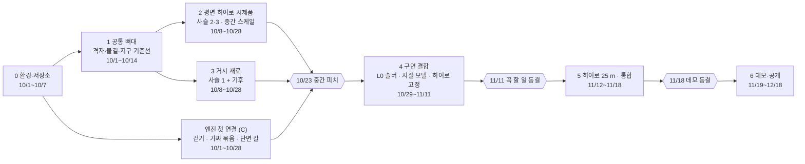

# 개발 단계

> 12/4 최종 데모까지 무엇을 어떤 순서로 만드는지 적은 계획표입니다. 단계마다 '끝났다'고 말할 수 있는 시험이 있습니다. 큰 날짜마다 점검하고, 그때까지 안 된 일은 미리 정해 둔 더 쉬운 방법으로 바꿉니다. 날짜와 바꿀 방법이 설계도와 다르면 설계도를 따릅니다.

단계는 0~6의 일곱 개입니다. 날짜·역할·대체안은 설계도 8장([docs/design/blueprint.md](design/blueprint.md))에서 왔습니다. 2026-10-08부터 설계도의 원본은 이 저장소의 `blueprint.md`입니다. 지금 어디까지 됐는지는 [brief.md](brief.md) 9절에 있습니다.

**성적.** 10/23 중간 피치가 성적의 30%, 12/4·12/11 최종 데모가 60%입니다(설계도 8장).

**역할.** A = 행성 핵심(격자, 판, 지질, 기후, 지구 기준선, 점수표), B = 물·지형·땅속(물길, 솔버, 히어로 유역, 흙, 지하수, 동굴), C = 엔진·데모입니다. 솔버와 지질 모델은 두 사람이 함께 맡습니다.

**코드 위치 읽는 법.** 1~5단계의 코드 위치(`core/cubesphere.py` 등)와 'numba로 옮기기'는 생성기를 C#으로 옮기기(2026-10-03) 전에 세운 계획의 Python 이름입니다. 지금 생성기 코드는 `src/Bpcg/` 아래의 C# 폴더에 있습니다(예: `core/cubesphere.py` → `src/Bpcg/Core/Cubesphere.cs`).

## 한눈에 보기

표와 그림에 나오는 말입니다. 더 많은 말은 [용어집](glossary.md)에 있습니다.

- **스케일.** 같은 땅을 보는 세 배율입니다.
    - 거시: 행성 전체 지도(L0). 칸 한 변 약 19.5 km.
    - 중간: 행성에서 고른 강 유역 하나를 25 m 칸으로 다시 푼 땅(히어로 유역, L2). 한 변 32 km.
    - 미시: 히어로 유역 안에서 걸어 다닐 6 km × 1 km 띠(회랑, L3).
- **사슬.** 기능을 묶는 원인-결과 줄 셋입니다. 앞 사슬의 결과가 다음 사슬의 원인입니다.
    - 1 뼈대: 판 → 지각 → 해양저·융기. 땅이 어디서 얼마나 솟는지 정합니다.
    - 2 조각: 암석 + 비 → 절벽·골짜기. 솟은 땅을 강과 비탈이 깎습니다.
    - 3 내부: 수위 → 지하수 → 동굴. 강·호수 수면이 땅속 물과 동굴의 높이를 정합니다.
- **솔버.** 산과 강이 다 자란 모양(정상상태)을 바로 푸는 계산입니다. 정상상태는 땅이 솟는 속도와 강이 깎는 속도가 같아져 더 바뀌지 않는 지형입니다.
- **묶음.** 단계 사이에 넘기는 결과 폴더입니다. 목차(`manifest.json`)와 지도마다 파일 하나로 되어 있습니다.
- **단면 칼.** 눈앞에 세로 면을 세워 그 앞의 땅을 지우고 땅속 지층을 보여 주는 엔진 도구입니다. 땅을 파는 기능 대신 씁니다.
- **점검일과 대체안.** 점검일은 10/14, 10/21, 11/4, 11/11, 11/18입니다. 그날까지 안 된 일은 미리 정한 더 쉬운 방법(대체안)으로 바꿉니다. 아래 표의 '안 되면'이 대체안입니다.
- **동결.** 그날부터 새 기능을 넣지 않는 것입니다. 11/11은 꼭 할 일 기능을 동결하고(히어로 25 m만 11/18까지 예외), 11/18은 데모 전체를 동결합니다(설계도 8장).
- **인주.** 한 사람이 한 주에 하는 일의 양입니다. 이 프로젝트에서는 20시간입니다(설계도 2장).

| 단계 | 기간 | 스케일 | 사슬 | 끝났다는 증거 |
|---|---|---|---|---|
| 0 환경·저장소 | 10/1~10/7 | 없음 | 없음 | 세 사람 컴퓨터에서 설치 스크립트와 `pytest`가 통과하고, CI가 초록 |
| 1 공통 뼈대 | 10/1~10/14 | 거시·중간 공통 | 없음(뼈대) | 격자 시험 전부 통과, 물길이 실제 지형 조각에서 비교 도구와 99% 일치 |
| 2 평면 히어로 시제품 | 10/8~10/28 | 중간(평면) | 2, 3 | 평면 유역에서 암석·흙·지하수·동굴이 같은 규칙으로 맞물리고 엔진에서 걸어짐 |
| 3 거시 재료 | 10/8~10/28 | 거시 | 1 + 기후 | 해수면이 물 부피 보존으로 나오고, 고도 분포에 봉우리 2개 |
| 4 구면 결합 | 10/29~11/11 | 거시 L0 → 중간 | 1, 2, 3 | 구 전체에서 강 100%가 바다나 호수에 닿고, 파이프라인을 처음부터 끝까지 한 번 돌림 |
| 5 히어로 25 m·통합 | 11/12~11/18 | 중간 L2 → 미시 L3 | 2, 3 | 히어로 유역이 실제 30 m 지형과 같은 분포(KS < 0.15), 데모 빌드 동결 |
| 6 데모·공개 | 11/19~12/18 | 모두 | 모두 | 리허설 3회, 대체 영상, README 한 줄로 재현 |

CI 초록은 GitHub이 PR마다 자동으로 돌리는 검사(CI)가 모두 통과했다는 뜻입니다. 나머지 증거는 아래 단계별 절에서 풉니다.

## 0단계: 개발 환경과 저장소 (10/1~10/7, 전원)

목표는 세 사람이 같은 명령으로 같은 환경을 얻는 것입니다. 환경이 다르면 같은 코드에서도 결과와 오류가 사람마다 달라집니다.

| 할 일 | 왜 | 상태 | 확인 방법 |
|---|---|---|---|
| 루트 폴더 하나(`b-pcg`)로 통일, 패키지 `bpcg` | 세 사람이 같은 이름과 경로로 명령을 돌림 | 끝 | `uv run pytest` |
| 파이썬 3.13 + uv + `uv.lock`, 의존성 묶음 6개 | 모두 같은 판의 패키지를 설치함([conventions.md](conventions.md) 11절) | 끝 | `uv sync --locked` |
| 설치 스크립트(맥·리눅스 `setup.sh`, 윈도우 `setup.ps1`)와 점검 도구(`tools/doctor.py`) | 명령 하나로 설치하고, 빠진 것을 점검함 | 끝(맥에서 시험, 윈도우·리눅스는 팀원 컴퓨터에서 첫 시험 필요) | `./scripts/setup.sh --check` |
| 개발 규칙(`docs/conventions.md`), 협업 순서(`CONTRIBUTING.md`), PR 양식, CI 설정 | 규칙을 글로 정하고, 깨진 코드가 `main`에 들어가지 않게 함 | 끝 | GitHub에 올린 뒤 CI 초록 |
| 파일럿 자료 4.5 GB와 `data/manifest.json`(크기·해시) | 3단계의 θ 파일럿(진짜 지구 자료로 강 규칙의 숫자를 처음 재 보는 일)에 씀. 크기·해시로 받은 파일이 온전한지 확인함 | 끝 | `uv run python tools/download_pilot.py --verify-only` |
| 임시 폴더에 있던 분석 스크립트·그림·시험 자료를 `analysis/`, `docs/`, `tests/fixtures/`로 이전 | 가봉 분석 스크립트와 그림이 임시 폴더에만 있었음(설계도 10장) | 끝 | `analysis/README.md` |
| Godot 프로젝트 뼈대(`engine/`)와 headless 연기 시험 | 엔진 담당(C)이 1주차부터 엔진 일을 시작함. 연기 시험은 화면 없이(headless) 엔진을 띄워 열리는지만 보는 짧은 시험 | 끝 | `uv run pytest -m godot` |
| 첫 커밋, GitHub 저장소 만들기, main 보호 규칙 | `main`에 직접 올리는 것을 막음(conventions 10절) | 저장소와 첫 커밋은 끝남(2026-10-02, [CAU-8/B-PCG](https://github.com/CAU-8/B-PCG)). 보호 규칙은 관리자 확인 필요 | CONTRIBUTING.md 끝 절 |
| 코드 라이선스 정하기(데이터와 분리) | 결과물을 GitHub에 오픈소스로 공개해야 함(설계도 8장) | 남음(전원) | `LICENSE` 파일 |
| 팀원 두 명의 컴퓨터에서 설치 스크립트 실행 | 설치 스크립트를 아직 맥에서만 시험함 | 남음(팀원) | `tools/doctor.py` 결과를 PR에 붙임 |
| 묶음 형식 초안(manifest + 필드 파일), 기호·단위 표 합의 | 묶음의 모양을 정함. 같은 기호(P0, κ, G, R, chi)가 저마다 두 뜻이었음(설계도 5장) | 남음(전원) | `docs/bundle_format.md`, conventions 2·3절 |
| 기억에 기대는 수치의 원문 확인 나눠 맡기 | 원문을 확인하지 않은 수치(예: 내륙 배수 18~20%, 해양 비율 0.708)가 설계도에 있음 | 남음(전원) | 설계도 10장 할 일 |

## 1단계: 공통 뼈대 (10/1~10/14)

어느 사슬에도 속하지 않지만 모두가 쓰는 부품입니다. 이 단계가 늦으면 다른 모든 단계가 늦습니다.

### 큐브스피어 완성

담당 A · 코드 `core/cubesphere.py`, `core/neighbors.py` · 안 되면: 없음(필수)

- **무엇.** 행성 겉을 칸으로 나누는 격자를 마무리합니다. 정육면체 여섯 면을 바둑판으로 나눈 뒤 공처럼 부풀린 격자입니다(큐브스피어). 넣을 것은 여섯 가지입니다.
    - 칸마다 이웃 여덟 칸의 번호(이웃 표)
    - 면 경계를 넘어 옆 면의 이웃 찾기
    - 공 위의 점이 어느 칸에 있는지 찾는 함수(역사상, `cell_of`)
    - 면 가장자리 바깥에 옆 면의 값을 한 줄 덧붙인 칸(고스트 셀). 면 경계 근처에서 값을 섞어 읽을 때 씁니다.
    - 입력을 공 위에서 돌려 다시 만들어도 결과가 같은지 보는 시험(회전 시험)
    - 면 경계 양쪽 칸의 넓이 맞추기(면적 대칭)
- **왜.** 물길, 솔버, 지하수가 모두 이 칸 위에서 돕니다. 큐브스피어 생성기는 면 모서리에서 산과 강이 늘어나는 흔적이 남기 쉽습니다(설계도 7장).
- **끝났다는 증거.**
    - 칸 넓이를 모두 더하면 공의 겉넓이와 같습니다. 상대 오차 < 1e-12(1조분의 1).
    - 이웃이 7개인 칸이 정확히 24개입니다. 정육면체 꼭짓점 8개마다 면 3개가 만나, 그 자리의 칸은 이웃이 하나 모자랍니다(8 × 3 = 24).
    - 왕복 변환이 맞습니다. 칸 중심의 점으로 칸을 다시 찾으면 같은 칸이 나옵니다.
    - 고스트 셀이 2차 수렴합니다. 칸을 두 배로 촘촘히 하면 오차가 약 4분의 1로 줄어, 두 오차의 비가 3과 5 사이입니다(3 < 오차비 < 5).
    - 면 경계를 사이에 둔 두 칸의 넓이 차가 1e-10 미만입니다.

### 행성 상수 모듈

담당 A · 코드 `core/constants.py` · 안 되면: 없음

- **무엇.** 행성의 반지름과 밀도에서 표면 중력을 계산합니다.
- **왜.** 중력은 따로 정하지 않고 반지름과 밀도에서 계산하기로 했습니다(설계도 1장). 가이드 8장은 9.8 m/s²를 먼저 정하고 거꾸로 구해, 이 방식과 맞지 않았습니다(설계도 10장).
- **끝났다는 증거.** 지구 값에서 g ≈ 9.82 m/s²가 나오고, 가이드 8장 식과 맞춥니다.
    - 표면 중력은 행성이 촘촘하고(밀도) 클수록(반지름) 셉니다. 식으로는 g = 4/3·π·G·ρ·R 입니다.
    - G는 만유인력 상수(6.674e-11 m³/(kg·s²)), ρ는 평균 밀도(kg/m³), R은 반지름(m)입니다.
    - 지구 값 ρ = 5,514 kg/m³, R = 6,371,000 m(`configs/planets/earth.toml`)를 넣으면 9.82 m/s²입니다.

### ETOPO 읽기, 격자 위 지구, 노이즈 대조군

담당 A · 코드 `earth/etopo.py`, `metrics/hypsometry.py` · 안 되면: 없음

- **무엇.** 진짜 지구의 육지·해저 높이 지도(ETOPO 2022)를 읽어 우리 격자 칸에 담습니다(격자 위 지구). 무작위 물결을 겹쳐 만든 행성(노이즈 대조군)도 만듭니다.
- **왜.** 만든 행성을 견줄 잣대입니다. 진짜 지구를 같은 칸·같은 코드로 재야 '얼마나 지구다운지' 말할 수 있습니다(기준선). 노이즈 행성과 견줘야 무엇이 효과를 냈는지 가를 수 있습니다(대조군).
- **끝났다는 증거.** 격자 위 지구의 고도 분포(높이별 넓이 비율)가 ETOPO 원본과 같은 모양입니다.

### 물길

담당 B · 코드 `hydro/` · 안 되면: 없음

- **무엇.** 빗물이 어디로 흐르는지 정하는 계산 넷입니다. 모두 점과 이웃 목록만 받는 일반 그래프 위에 짭니다.
    - 물이 갇히는 우묵한 곳을 메웁니다(웅덩이 채우기).
    - 칸마다 둘레 여덟 칸 가운데 가장 가파르게 내려가는 칸으로 물을 보냅니다(D8).
    - 칸 중심을 조금씩 흔들어, 강이 가로·세로·45° 줄로만 곧게 뻗지 않게 합니다(노드 흔들기).
    - 위에서부터 물의 양을 더합니다(유량 누적).
- **왜.** 솔버가 이 물길 위에서 돕니다. 점과 이웃 목록만 받게 짜면 공 모양 행성과 평면 유역을 같은 코드로 다룹니다(설계도 5장).
- **끝났다는 증거.** 가봉 로페 숲의 30 m 지형에서 잘라 낸 512 × 512칸 조각(약 15.4 km × 15.4 km, `tests/fixtures/lope_tile512_30m.npz`)에서, 미리 계산한 비교 결과와 견줍니다.
    - 흐름 방향 99% 이상 일치(100칸 가운데 99칸 이상)
    - 하천 겹침 0.95 이상
    - 유역 면적 ±1%
    - 모든 칸이 바다로 흐름

### 비교 결과 미리 만들기

담당 B · 코드 `analysis/compare_routing.py` → `tests/fixtures/` · 안 되면: pyflwdir만으로 비교

- **무엇.** 널리 쓰는 물길 도구 TopoToolbox와 pyflwdir로 같은 조각의 물길을 미리 계산해 저장합니다.
- **왜.** TopoToolbox는 GPL이라 시험에서 import할 수 없습니다([conventions.md](conventions.md) 9절). 그래서 `analysis/`에서 한 번 돌려 결과만 남깁니다. pyflwdir는 MIT 라이선스입니다.
- **끝났다는 증거.** 저장된 결과로 테스트가 GPL import 없이 돕니다.

### 엔진: 평면 지형 걷기

담당 C · 코드 `engine/` · 안 되면: 없음

- **무엇.** Godot에서 평평한 지형 위를 걷는 첫 장면입니다.
- **왜.** 엔진 담당은 1주차부터 엔진 일만 합니다(설계도 8장). 생성기 결과를 기다리지 않고 걷기부터 맞춥니다.
- **끝났다는 증거.** 샘플 높이맵 위를 걷고 충돌이 맞습니다.

## 2단계: 평면 히어로 시제품 (10/8~10/28, 중간 스케일)

설계도의 원칙 '히어로 유역을 평면에서 먼저'를 따릅니다. 평면 격자에 가짜 경계조건을 주고 사슬 2·3을 먼저 꽂습니다. 경계조건은 유역 가장자리에서 정해 줘야 하는 값입니다. 여기서는 출구 높이, 들어오는 물, 섭입 단면에서 나온 융기입니다. 섭입은 무거운 바다 판이 다른 판 아래로 파고드는 것입니다.

나중에 전역 행성은 경계조건만 바꿉니다. 그래서 행성 전체(4단계)가 되기 전에도 사슬 2·3과 엔진을 시험할 수 있습니다.

### 정상상태 솔버를 numba로 옮기기

담당 B(+1명) · 코드 `landscape/steady_state.py` · 안 되면: 없음(필수)

- **무엇.** 다 자란 산과 강의 모양을 바로 푸는 솔버를 빠른 코드로 옮깁니다. 넣을 것은 넷입니다.
    - 강 경사와 산비탈 경사를 조화 평균으로 섞기(두 값 가운데 작은 쪽에 가깝게 나오는 평균)
    - 암석마다 정한 가장 가파른 경사 S_crit를 넘지 않게 자르기
    - 물길 방향 맞추기 반복. 높이를 쌓으면 물길이 바뀌고, 물길이 바뀌면 높이를 다시 쌓아야 해서 되풀이합니다.
    - 멈춤 조건 '방향 변화 0 그리고 고도 변화 0.1 m 미만'
- **왜.** 시제품(`make_figures.py`)은 순수 파이썬 반복문이라 면당 256칸 이상에서는 너무 느렸습니다(설계도 10장). 지금 생성기는 C#입니다.
- **끝났다는 증거.**
    - S < S_crit인 곳(경사가 한계에 닿지 않은 곳)에서 법칙 자기일관성 상대 오차 < 1e-3(천분의 일). 솔버가 쌓은 높이에서 경사를 다시 재면 법칙이 준 경사와 같아야 한다는 뜻입니다.
    - 반복 횟수와 시간을 기록합니다.
    - fastscapelib(시간을 한 걸음씩 돌려 침식을 계산하는 공개 도구)과 평균 고도·고도 분포 차이 5% 미만. fastscapelib 결과는 미리 계산해 둔 것과 비교합니다.

### G-법칙 퇴적, 2층 암석

담당 B · 코드 `landscape/deposition.py`, `geology/` · 안 되면: 없음

- **무엇.** 산에서 나온 강이 평지에서 실어 오던 흙의 일부를 내려놓는 규칙(퇴적, G-법칙, Yuan 2019)입니다. 그리고 단단함이 다른 암석 두 층을 넣습니다.
- **왜.** 퇴적이 있어야 강을 따라 경사가 완만한 띠(산 앞 평야, 범람원)가 생깁니다(설계도 2장). 암석이 두 층이면 손으로 푼 정확한 답(해석해)이 있어 코드와 견줄 수 있습니다.
- **끝났다는 증거.** 퇴적물·물 수지 오차 1e-6(들어온 양과 나간 양의 차가 백만분의 일), 2층 해석해와의 오차 1e-3.

### 흙 두께(상한 있음)

담당 B · 코드 `subsurface/soil.py` · 안 되면: 없음

- **무엇.** 암석 위를 덮은 흙의 두께입니다.
- **왜.** 흙 두께 식은 흙이 생기는 속도 P₀와 깎이는 속도 E로 두께를 정합니다(h* = h₀·ln(P₀/E), [pipeline.md](pipeline.md) 8.2). 정상상태에서는 깎이는 속도가 솟는 속도와 같아서, 융기가 0이면 E도 0에 가까워지고 두께가 끝없이 커집니다. 그래서 상한을 둡니다(설계도 5장).
- **끝났다는 증거.** 융기 0에서도 무한대가 나오지 않습니다.

### 지하수면

담당 B · 코드 `subsurface/groundwater.py` · 안 되면: 회랑 안에서만 '가까운 강·호수 수면' 근사

- **무엇.** 땅속에서 물이 차 있는 높이(지하수면)를 식 하나로 바로 계산합니다(닫힌 식). 암석마다 물이 스미는 정도(투수성)는 Gleeson 값을, 식은 Fan 2013을 씁니다.
- **왜.** 지하수면이 동굴 층의 높이를 정합니다(사슬 3).
- **끝났다는 증거.**
    - 규칙 'z_gw ≤ max(지표, 수면)'. 지하수면 높이 z_gw는 지표보다 높을 수 없고, 호수·강 안에서만 수면까지 올라갑니다. 시제품은 이 규칙을 호수·강 안에서 어겼습니다(설계도 10장).
    - 물 규칙 위반 0(예: 지하수면 아래의 빈 공기, 설계도 4장)
    - 물 수지 오차 ≤ 1e-3

### 2층 동굴과 입구

담당 B · 코드 `subsurface/caves.py` · 안 되면: 노이즈 동굴 1층

- **무엇.** 물에 녹는 암석(석회암·대리암) 안에 수평으로 난 동굴 통로 두 층과, 밖으로 열린 입구입니다. 아래층은 지금 지하수면 높이라 물에 잠기고, 위층은 옛 지하수면이라 마릅니다.
- **왜.** 사슬 3의 마지막 결과입니다. 최종 데모에서 마른 위층과 잠긴 아래층을 단면 칼로 보여 줍니다(설계도 9장).
- **끝났다는 증거.**
    - 동굴 ⊂ 녹는 암석 100%(동굴이 모두 녹는 암석 안에 있음)
    - 잠긴 동굴 수면 = 지하수면
    - 입구 연결 비율(입구와 이어진 동굴의 비율)을 잽니다.

### 가짜 묶음을 엔진에 넘기기, 단면 칼 셰이더

담당 B → C · 코드 `bake/`, `engine/` · 안 되면: 없음

- **무엇.** 평면 결과를 묶음 꼴로 엔진에 넘깁니다. 그리고 단면 칼을 그리는 화면 효과(셰이더)를 만듭니다.
- **왜.** 엔진 담당이 행성 전체를 기다리지 않고 일합니다(설계도 8장). 땅을 파는 대신 단면 칼로 지층·동굴·지하수면을 보여 주기로 했습니다.
- **끝났다는 증거.** 엔진에서 지층·동굴·지하수면이 한 화면에 보입니다.

### 15초 걷기 영상, 회랑 굽기 v1

담당 C · 코드 `bake/corridor.py`, `engine/` · 안 되면: 미리 구운 경로 영상

- **무엇.** 회랑의 3D 지형을 엔진 파일로 쓰는 첫 판(굽기 v1)과, 그 위를 걷는 15초 영상입니다.
- **왜.** 10/23 중간 피치의 핵심 그림 셋 가운데 하나가 Godot에서 걷는 15초 영상입니다(설계도 9장).
- **끝났다는 증거.** 피치용 영상.

## 3단계: 거시 재료, 사슬 1과 기후 (10/8~10/28, 거시 스케일)

땅이 어디서 얼마나 솟는지와 비가 어디에 얼마나 오는지를 행성 전체에서 정합니다. 4단계부터 이 결과가 사슬 2·3의 입력이 됩니다.

### 판, 지각, 해양저, 해수면

담당 A · 코드 `planet/plates.py`, `planet/ocean.py` · 안 되면: 없음

- **무엇.**
    - 지구 겉을 나눈 큰 조각(판)과 지각의 종류·두께를 정합니다.
    - 바다 밑 땅이 생긴 뒤 지난 시간(해양저 나이)에서 깊이를 정합니다(Parsons & Sclater). 오래된 바닥일수록 식어서 깊습니다.
    - 두꺼운 지각이 물에 뜬 두꺼운 얼음처럼 더 높이 뜨는 원리(Airy 지각평형)는 대륙-해양 경계에서만 씁니다.
    - 해수면은 정해 둔 물의 양을 낮은 곳부터 채워 정합니다(물 부피 보존).
- **왜.** 이 값들이 땅이 솟는 곳과 바다의 자리를 정합니다(사슬 1). 해수면을 물의 양으로 정하면 바다 비율이 입력이 아니라 결과로 나옵니다(설계도 5장).
- **끝났다는 증거.**
    - 바다 물 부피 보존 시험
    - 바다 비율이 결과로 나옴
    - 고도 분포에 봉우리 2개. 높이별 넓이를 그리면 대륙과 해양 두 곳에 봉우리가 섭니다. 점수표에서는 두 봉우리가 1 km 넘게 떨어지면 통과입니다([pipeline.md](pipeline.md) 12장).
    - 이 봉우리 검사는 일정을 막는 검사입니다. 다만 지각 비율·지각평형·해양저 나이-수심 식으로 거의 정해지므로 '반쯤 입력'이라고 표시하고, '지구답다'는 근거로 세지 않습니다(설계도 7장).

### 섭입 방향·비대칭 단면, 물리 단위 융기, 누적 융기 상한

담당 A · 코드 `planet/uplift.py` · 안 되면: 없음

- **무엇.**
    - 무거운 바다 판이 다른 판 아래로 파고드는 방향(섭입 방향)과, 그 둘레의 비대칭 단면(해구·화산호 위치)을 정합니다.
    - 땅이 솟는 속도(융기)를 실제 단위(m/yr)로 정합니다.
    - 산이 자라는 동안 깎여 사라진 두께(누적 융기)의 상한을 25~35 km로 둡니다.
- **왜.** 누적 융기를 자르지 않으면 5 mm/yr로 2,000만 년 솟는 곳은 100 km가 됩니다. 지각보다 두꺼워져 산 한가운데가 맨틀 암석이 됩니다(설계도 5장).
- **끝났다는 증거.**
    - 변위(m)와 속도(m/yr)를 더하지 않습니다. 단위가 다른 두 값을 더하는 실수를 막는 검사입니다.
    - 해령 −2.5 km는 회귀 시험으로만 씁니다. 대양 한가운데 해령 꼭대기 깊이 −2.5 km는 식에 넣은 상수가 그대로 나오는 값이라, 값이 바뀌지 않았는지만 봅니다(설계도 4장).

### 가벼운 기후

담당 A · 코드 `planet/climate.py` · 안 되면: 없음

- **무엇.** 위도 띠로 정한 강수, 기온, 그리고 비에서 증발한 물을 뺀 나머지(유출)입니다. 유출은 Budyko 식으로 구하고 바닥값을 둡니다.
- **왜.** 유출이 강의 물이 되어 땅을 깎습니다. 바닥값이 없으면 사막 유출이 강수의 0.3%라, 같은 융기에서 경사가 약 36배 가팔라지고 산이 수십 km로 솟습니다(설계도 5장).
- **끝났다는 증거.** 사막 유출에 바닥값이 들어가고, 관측과 비슷한 띠 모양이 나옵니다.

### θ 파일럿

담당 A · 코드 `analysis/theta_pilot/` → `configs/learned/` · 안 되면: 문헌값 θ = 0.45, S_crit ≈ 0.6

- **무엇.** 진짜 지구 자료로 강 규칙의 숫자를 처음 재 봅니다. θ(오목도)는 강이 상류에서 가파르고 바다 쪽으로 갈수록 완만해지는 정도입니다.
    - 쓰는 자료: RiverATLAS(하천 구간 목록), OCTOPUS(유역 침식률), CHELSA(강수), 건조도, GLO-90(90 m 높이 지도) 40개 유역.
- **왜.** 생성기의 숫자가 진짜 지형에서 왔다는 근거를 만듭니다. 중간 피치에 '실제 데이터 → 배운 규칙 → 행성' 슬라이드로 씁니다(설계도 9장).
- **끝났다는 증거.** θ 분포 그림(0.3~0.7 안), k_s(강 가파름) 회귀의 설명력 R²와 지역 차이를 보고합니다.

### 점검일

**10/14 재계획.** 실제 속도로 예산을 다시 잽니다. 추정에 보정 1.5~1.8배를 곱하고, 계획은 쓸 수 있는 시간의 70%만 채웁니다. 사슬 안에서 대체안으로 돌릴 것과 B의 업무 재분배, θ 파일럿 범위를 정합니다. 지금 예산은 12.5~14인주로, 쓸 수 있는 6~8인주를 넘습니다.

**10/21 점검.** 피치 그림을 동결하고, 실행 중에 땅을 파는 기능(런타임 복셀·파기)을 시험합니다. 복셀은 3D 공간을 나눈 작은 상자 칸이고, 쓰는 도구는 Godot 확장 godot_voxel(v1.7x GDExtension)입니다. 안 되면 미리 구운 회랑 메시와 단면 칼로 갑니다.

**10/23 중간 피치.** `v0.1-pitch` 태그를 붙입니다.

## 4단계: 구면 결합 (10/29~11/11)

평면에서 맞춘 사슬 2·3을 구 위의 L0(면당 512칸, 19.5 km)에 올리고, 사슬 1의 결과를 입력으로 받습니다.

### 솔버를 구면 L0으로(5주차)

담당 B · 코드 `landscape/` · 안 되면: 없음(필수)

- **무엇.** 평면에서 맞춘 솔버를 행성 전체 지도(L0)에서 돌립니다.
- **왜.** 공 모양 행성 전체에서 다 자란 지형을 바로 푸는 것은, B-PCG가 내세우는 차별점 표(설계도 7장)의 첫째 줄입니다.
- **끝났다는 증거.**
    - 하천 100%가 바다나 호수에 닿고, 거꾸로 흐르는 구간(역류)이 0입니다.
    - 면 경계 띠와 면 안쪽의 격자 정렬 지수가 같습니다(목표 1.3 미만). 격자 정렬 지수는 강이 바둑판 방향을 얼마나 따르는지입니다. 1이면 편들지 않고, 클수록 따릅니다. 노드 흔들기 없이 D8만 쓰면 약 2.9입니다(설계도 7장).
    - 회전 시험의 통계가 일치합니다.

### 3D 지질 모델

담당 A(+1명) · 코드 `geology/` · 안 되면: 색으로만 칠하기

- **무엇.** 지층이 쌓인 순서 세 가지(템플릿 3개: 탄산염 탁상지, 습곡충상대, 기반암 + 화산호)와, 깊이 묻혀 뜨거워진 암석이 바뀌는 정도의 표(변성 정도 표, 예: 셰일 → 점판암 → 편암 → 편마암)입니다.
- **왜.** 지질 모델 하나가 솔버의 깎이는 정도와 화면에 보이는 암석을 함께 정합니다(설계도 7장).
- **끝났다는 증거.** 보이는 암석 = 솔버가 쓴 암석 100%, 골짜기 벽 단면 1,000개 이상에서 지층 순서 100%.

### 층 경계별 솔버 적분

담당 B · 코드 `landscape/` · 안 되면: 지층을 색으로만(경사에 반영 안 함)

- **무엇.** 솔버가 아래에서 높이를 쌓다가 지층 경계를 넘으면, 그 층 암석의 경사로 바꿔 이어 쌓습니다.
- **왜.** 그래야 단단한 층에 절벽이 생깁니다.
- **끝났다는 증거.** 11/4 점검 통과.

### L0 = 골짜기 바닥 높이 + 기복 보정, SRTM 검증

담당 A · 코드 `landscape/relief.py` · 안 되면: 없음

- **무엇.** L0 칸의 높이를 골짜기 바닥으로 읽고, 칸 안에 숨은 능선과 골짜기의 높이 차(기복)를 공식으로 어림해 더합니다. 위성 레이더로 잰 높이 지도(SRTM)로 검증합니다.
- **왜.** 칸 한 변이 약 20 km라 칸 하나에 능선과 골짜기가 함께 들어갑니다. 솔버가 푸는 높이는 골짜기 바닥이라, 칸의 평균 높이를 내려면 능선 몫을 더해야 합니다.
- **끝났다는 증거.** 실제 지형과 같은 기복 분포.

### 히어로 후보 찾기 도구, 6주차까지 시드·히어로 유역 고정

담당 B · 코드 `analysis/hero_finder.py` · 안 되면: 없음

- **무엇.** L0 유역마다 점수(산지 앞쪽의 융기 기울기, 드러난 탄산염, 200 km 안의 닫힌 분지)를 매겨 걸어 다닐 유역을 고르는 도구입니다. 6주차까지 시드와 히어로 유역을 고정합니다.
- **왜.** 융기·석회암·지하수·건조 분지가 한 유역에 모인다는 보장이 없습니다(설계도 8장).
- **끝났다는 증거.** 고른 절차를 문서로 공개합니다.

### 엔진: 묶음 불러오기, 지역 좌표, 중력, 원경

담당 C · 코드 `engine/` · 안 되면: 미리 구운 경로

- **무엇.** 2단계의 가짜 묶음 대신 실제 생성 결과를 엔진에서 읽습니다. 회랑 기준점을 원점으로 한 좌표(지역 좌표), 중력, 멀리 보이는 풍경(원경)을 넣습니다.
- **왜.** 최종 데모는 실제 행성에서 고른 히어로 유역을 걷습니다(설계도 9장).
- **끝났다는 증거.** 실제 묶음으로 걷습니다.

### 점검일

**11/4 점검.** 히어로 v1, 층 경계 적분.

**11/11 점검.** 파이프라인을 처음부터 끝까지 한 번 돌립니다(히어로 25 m 제외). 데모 기기에서 실행을 확인하고, 꼭 할 일 기능을 동결합니다(`v0.2-freeze`). 통과했을 때만 여유 작업(화산 원뿔, 호수 물수지)을 시작합니다.

## 5단계: 히어로 25 m와 통합 (11/12~11/18)

### 히어로 유역 25 m를 L0 경계조건으로 다시 풀기, 이음매

담당 B · 안 되면(11/18): 기복 보정으로 맞춘 노이즈

- **무엇.** L0에서 고른 강 유역 하나를, L0의 강 높이·들어오는 물·융기를 가장자리 값(경계조건)으로 고정해 25 m 칸에서 같은 법칙으로 다시 풉니다. L0와 맞닿는 가장자리(이음매)도 맞춥니다.
- **왜.** 걸어 다닐 크기의 지형을 노이즈가 아니라 같은 법칙으로 만드는 것은, 차별점 표(설계도 7장)의 다섯째 줄입니다.
- **끝났다는 증거.**
    - 같은 k_sn 등급의 실제 30 m 지형과 경사·고도 분포 KS < 0.15. k_sn은 θ를 0.45로 고정해 잰 강 가파름입니다. KS는 두 분포를 누적해 그렸을 때 가장 크게 벌어진 간격입니다. 0.15 미만이면, 어느 값(경사나 높이)을 기준으로 잡아도 그보다 낮은 칸의 비율이 두 지형에서 15%p 넘게 다르지 않습니다.
    - 칸을 30 m에서 15 m로 줄여도, 하천이 시작되는 상류 면적의 중앙값 변화 < 20%
    - 출구 유량 차이 < 2%

### 점수표 조정

담당 A · 안 되면: 없음

- **무엇.** 결과가 얼마나 지구다운지 재는 항목 표(점수표)에서, 입력으로 정해진 지표(forced)와 결과로 나온 지표(emergent)를 나눠 표시합니다.
- **왜.** forced 지표는 맞아도 '지구답다'는 근거가 아니고, emergent 지표만 근거로 씁니다([CLAUDE.md](../CLAUDE.md) 2.6).
- **끝났다는 증거.** 요소 끄기 전후 비교. 예를 들어 판 요소를 끄면 바다 비율·대륙붕 넓이가 어떻게 바뀌는지 봅니다(설계도 9장).

### 엔진 통합, 재질·하늘

담당 C · 안 되면: 미리 구운 경로 + 녹화 영상

- **무엇.** 데모 경로 전체를 한 빌드로 묶고, 암석 재질과 하늘을 넣습니다.
- **왜.** 11/18에 데모를 동결하므로, 그 전에 데모 경로가 한 빌드로 묶여야 합니다.
- **끝났다는 증거.** 데모 경로 전체가 한 빌드에서 돕니다.

**11/18 데모 동결**(`v0.3-demo-freeze`). 이후에는 버그와 화면만 고칩니다.

## 6단계: 데모와 공개 (11/19~12/18)

- 요소별 전후 비교 그림, 데모 경로 다듬기, 버그 수정, 리허설 3회, 대체 영상을 준비합니다. 대체 영상은 데모가 안 될 때 같은 순서를 보여 줄 녹화입니다(설계도 8장).
- (여유) 블라인드 투표 웹 페이지를 만듭니다. 어느 쪽이 진짜 지구인지 알리지 않고 그림을 보여 주고 고르게 하는 투표입니다.
- 공개용으로 README·LICENSE·자료 받기 스크립트를 갖추고, 재현 명령 한 줄을 정리합니다.
- 12/4·12/11에 최종 데모를 하고 `v1.0` 태그를 붙입니다. 12/18까지 보고서·매뉴얼을 내고 GitHub를 공개합니다.

## 단계별 계산 환경

| 단계 | 어디서 | 크기 |
|---|---|---|
| 0~5 | 개발 맥(M3, 16 GB) | L0 면당 512칸(157만 칸), 히어로 25 m(150~250만 칸) |
| 보고용 실행 | 연구실 PC | L0 면당 1,024칸(629만 칸), 큰 DEM(GLO-30 부분 읽기) |
| 데모 | 데모 기기 | 11/11에 실행 확인 |

칸 수는 면 여섯 장의 합입니다. 면당 512칸이면 6 × 512² = 1,572,864칸, 면당 1,024칸이면 6 × 1,024² = 6,291,456칸입니다. DEM은 땅의 높이를 칸마다 담은 지도이고, GLO-30은 30 m 칸의 전 세계 육지 높이 지도(약 589 GB)라 필요한 유역만 창으로 잘라 읽습니다(설계도 6장).
